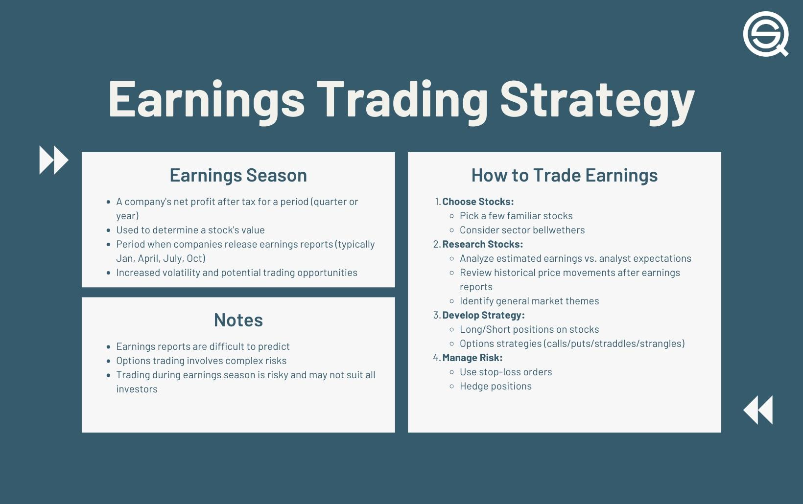

## Table of Contents

## What is an earnings report?

An earnings report is a document that a company releases to show how much money it made and spent during a certain period, usually every three months. It tells investors and the public about the company's financial health. The report includes important numbers like revenue, which is the money the company earned, and net income, which is what's left after all expenses are paid.

These reports are important because they help people decide if they want to buy, sell, or hold onto the company's stock. If a company does better than expected, its stock price might go up. If it does worse, the stock price might go down. Earnings reports also include a section where the company's leaders talk about what happened during the period and what they expect in the future. This helps everyone understand the company's plans and challenges.

## Why are earnings reports important for trading?

Earnings reports are important for trading because they give traders a clear picture of how a company is doing financially. When a company releases its earnings report, traders can see if the company made more money than expected or if it spent too much. This information helps traders decide if they should buy more of the company's stock, sell what they have, or wait and see what happens next. If a company does well, its stock price might go up because more people want to buy it. If the company doesn't do well, the stock price might go down because people might want to sell it.

Another reason earnings reports are important is that they help traders predict what might happen to the stock price in the future. The reports include not just numbers but also what the company's leaders think will happen next. This can give traders clues about whether the company will keep doing well or if it might run into trouble. By understanding these reports, traders can make smarter choices about when to trade and how much risk to take. This can help them make more money or avoid losing money.

## What is an earnings report trading strategy?

An earnings report trading strategy is when traders buy or sell stocks based on what they think will happen after a company releases its earnings report. Traders look at the report to see if the company did better or worse than people expected. If a company does better, traders might buy the stock because they think the price will go up. If the company does worse, traders might sell the stock because they think the price will go down. This strategy can be risky because it's hard to guess exactly what will happen, but it can also be a way to make money if traders guess right.

Some traders use a strategy called "earnings surprise." This means they try to find companies that might do much better or much worse than what people are expecting. If a company does much better than expected, it's a positive surprise, and the stock price might jump up a lot. If it does much worse, it's a negative surprise, and the stock price might drop a lot. Traders who can predict these surprises can make big profits, but it's not easy to do. They need to study the company a lot and understand what might affect its earnings.

Another part of an earnings report trading strategy is looking at what the company says about the future. If the company's leaders think things will get better, traders might buy the stock because they think it will go up in the future. If the leaders think things will get worse, traders might sell the stock because they think it will go down. This part of the strategy is about understanding not just what happened, but what might happen next. It can help traders make better decisions about when to buy or sell.

## How can beginners use earnings reports to make trading decisions?

Beginners can use earnings reports to make trading decisions by first understanding the basics of what the report tells them. An earnings report shows how much money a company made and spent over a certain time, usually three months. Beginners should look at the main numbers like revenue, which is the money the company earned, and net income, which is what's left after paying all the bills. If these numbers are higher than what people expected, it's a good sign, and the stock price might go up. If they're lower, it's a bad sign, and the stock price might go down. By comparing the actual numbers to what was expected, beginners can decide if they want to buy or sell the stock.

Another way beginners can use earnings reports is by paying attention to what the company's leaders say about the future. The report usually has a part where the leaders talk about what happened and what they think will happen next. If they sound positive and think the company will do well, it might be a good time to buy the stock. If they sound worried or think things might get worse, it might be a good time to sell. Beginners should also look at the news and see if other people think the report was good or bad. This can help them feel more confident about their trading decisions.

Using earnings reports to make trading decisions can be tricky, but it gets easier with practice. Beginners should start by looking at a few companies they're interested in and reading their earnings reports. They can compare what the reports say to what happens to the stock price afterward. Over time, they'll get better at understanding the reports and making smart choices about when to buy or sell. It's important to remember that trading based on earnings reports can be risky, so beginners should start small and learn as they go.

## What are the key components to look for in an earnings report?

When looking at an earnings report, the first thing to check is the company's revenue and net income. Revenue is the money the company made from selling its products or services. Net income is what's left after the company pays all its bills. These numbers are important because they show if the company is making more money than people thought it would. If the revenue and net income are higher than expected, it's a good sign, and the stock price might go up. If they're lower, it's a bad sign, and the stock price might go down. Beginners should compare these numbers to what was expected to see if the company did better or worse.

Another key part of an earnings report is what the company's leaders say about the future. This is usually in a section called "management discussion and analysis" or something similar. The leaders talk about what happened during the last few months and what they think will happen next. If they sound positive and think the company will keep doing well, it might be a good time to buy the stock. If they sound worried or think things might get worse, it might be a good time to sell. Beginners should also look at any news or what other people say about the report to help them understand it better.

Lastly, it's helpful to look at other important numbers like earnings per share (EPS), which tells you how much money the company made for each share of stock. If the EPS is higher than what was expected, the stock price might go up. Also, check the company's guidance, which is what the company thinks its future earnings will be. If the guidance is good, it might mean the stock price will go up in the future. By understanding these key components, beginners can make better decisions about when to buy or sell a stock.

## How do earnings surprises affect stock prices?

An earnings surprise happens when a company's earnings are different from what people expected. If the company does better than expected, it's a positive surprise, and the stock price might go up. This is because people think the company is doing well and want to buy its stock. If the company does worse than expected, it's a negative surprise, and the stock price might go down. This is because people might think the company is not doing well and want to sell its stock.

Earnings surprises can make the stock price move a lot. When a company reports a big positive surprise, many people might rush to buy the stock, pushing the price up quickly. On the other hand, a big negative surprise can make many people want to sell the stock, causing the price to drop quickly. Because of this, earnings surprises can be important for traders who want to make money from these quick changes in stock prices.

## What are some common strategies for trading around earnings reports?

One common strategy for trading around earnings reports is called "straddling." This means buying both a call option and a put option for the same stock at the same time. A call option lets you buy the stock at a certain price, and a put option lets you sell it at a certain price. Traders use this strategy because they think the stock price will move a lot after the earnings report, but they're not sure if it will go up or down. If the stock price moves a lot in either direction, one of the options will make money, and it can cover the cost of the other option. This way, traders can make money no matter if the earnings surprise is good or bad.

Another strategy is to wait until after the earnings report comes out and then trade based on the results. If the earnings are better than expected, traders might buy the stock because they think the price will go up. If the earnings are worse than expected, traders might sell the stock because they think the price will go down. This strategy is less risky than trying to guess what will happen before the report, but it still needs careful thinking. Traders need to look at the whole earnings report, not just the numbers, to see if the company's leaders are positive or worried about the future. This can help them decide if it's a good time to buy or sell.

Some traders also use a strategy called "momentum trading." They look at how the stock price moves right after the earnings report. If the stock price goes up a lot, they might buy more of the stock, thinking the price will keep going up. If the stock price goes down a lot, they might sell the stock, thinking the price will keep going down. Momentum traders need to be quick and ready to act because the stock price can change fast after an earnings report. They also need to be ready to sell or buy back the stock quickly if the price starts to move the other way.

## How can one manage risk when trading on earnings reports?

Managing risk when trading on earnings reports is important because the stock price can move a lot. One way to manage risk is to use stop-loss orders. A stop-loss order tells your broker to sell your stock if the price drops to a certain level. This can help you avoid losing too much money if the stock price goes down a lot after the earnings report. Another way to manage risk is to not put all your money into one stock. Instead, spread your money out over different stocks. This way, if one stock goes down, you won't lose all your money.

Another good way to manage risk is to do a lot of research before you trade. Look at what people expect from the earnings report and see if the company has been doing well lately. This can help you make a better guess about what might happen to the stock price. Also, don't use too much money on options or other risky trades. Options can make you a lot of money if you guess right, but they can also make you lose a lot if you guess wrong. By being careful and doing your homework, you can lower your risk when trading on earnings reports.

## What advanced metrics should experienced traders consider in earnings reports?

Experienced traders should look at more than just the basic numbers in an earnings report. One important metric to consider is the company's gross margin, which shows how much money the company makes after paying for the things it sells. A higher gross margin means the company is good at making money from its products or services. Another metric is the operating margin, which tells you how much money the company makes after paying for all its costs to run the business. If the operating margin is going up, it's a good sign that the company is getting better at managing its costs. Experienced traders also look at the company's return on equity (ROE), which shows how well the company is using the money that shareholders have put into it. A high ROE means the company is making good use of that money.

Another set of advanced metrics to consider are related to the company's cash flow. Free cash flow is important because it shows how much money the company has left after paying for everything it needs to keep running. A company with a lot of free cash flow can invest in new projects or pay dividends to shareholders. Experienced traders also look at the company's debt levels and how much it's paying in interest. If a company has a lot of debt and high interest payments, it might have trouble if things don't go well. By looking at these advanced metrics, experienced traders can get a better idea of the company's financial health and make smarter trading decisions.

## How can historical earnings data be used to predict future performance?

Historical earnings data can help traders guess what might happen to a company's stock price in the future. By looking at past earnings reports, traders can see if a company usually does better or worse than people expect. If a company often surprises people with good earnings, it might keep doing that in the future. Traders can use this information to decide if they want to buy the stock before the next earnings report comes out. They can also look at how much the stock price moved after past earnings reports to guess how much it might move next time.

Another way to use historical earnings data is to look at trends over time. If a company's earnings have been going up steadily, it might keep going up. This can be a good sign for traders who are thinking about buying the stock. But if the company's earnings have been going down, it might keep going down, and traders might want to sell the stock. By understanding these trends, traders can make better guesses about what might happen in the future. But it's important to remember that past performance doesn't always tell you what will happen next, so traders should be careful and use other information too.

## What role do analyst expectations play in earnings report trading?

Analyst expectations are very important when trading on earnings reports. Analysts are people who study companies and guess how much money they will make. When a company's earnings report comes out, traders look at these guesses to see if the company did better or worse than expected. If the company makes more money than the analysts thought it would, it's called a positive earnings surprise. This can make the stock price go up because people think the company is doing well. If the company makes less money than expected, it's a negative earnings surprise, and the stock price might go down because people might think the company is not doing well.

Traders use these analyst expectations to decide if they should buy or sell a stock before the earnings report comes out. If traders think the company will do better than what analysts expect, they might buy the stock, hoping to sell it at a higher price after the report. If they think the company will do worse, they might sell the stock or even bet that the price will go down. But it's important to remember that these guesses are not always right, so trading on them can be risky. Traders need to look at other things too, like what the company's leaders say and what's happening in the market, to make the best decisions.

## How can algorithmic trading be applied to earnings report strategies?

Algorithmic trading can be used to trade on earnings reports by using computer programs to make trades based on certain rules. These rules can be set up to buy or sell stocks automatically when certain things happen, like when a company's earnings are better or worse than expected. For example, if an algorithm is set to look for positive earnings surprises, it can quickly buy the stock as soon as the report comes out and the stock price starts to go up. This can help traders make money faster than if they had to do it themselves.

Another way algorithmic trading can be used is to look at a lot of data very quickly. Computers can look at past earnings reports, what analysts expect, and even news about the company to guess what might happen to the stock price after the next earnings report. This can help traders make better guesses about whether to buy or sell the stock before the report comes out. By using algorithms, traders can take advantage of the quick changes in stock prices that often happen around earnings reports.

## How can one develop an earnings report trading strategy?

Developing a trading strategy around earnings reports using algorithmic trading involves several key steps. First, traders need to leverage [backtesting](/wiki/backtesting), which is a critical procedure to determine the viability of any trading strategy. Backtesting is the process of applying a trading strategy to historical data to see how it would have performed in the past. The primary objective is to understand the strengths and weaknesses of a strategy before deploying it in live trading.

To effectively backtest earnings report strategies, traders must use accurate and comprehensive datasets that include historical earnings announcements, stock price data, and other relevant financial metrics. This data helps in assessing how certain indicators and market conditions can influence asset prices post-earnings announcements. It is crucial to ensure data integrity and deal with any biases or limitations inherent in historical data.

Regarding the development of such strategies, several common trading indicators and tools are employed. Mean reversion is a popular approach, predicated on the concept that asset prices tend to return to their average over time. If a stock price deviates significantly from its historical mean following an earnings announcement, traders can anticipate a reversion to the mean. The formula for calculating mean reversion typically involves simple moving averages (SMA) and is given by:

$$
\text{SMA} = \frac{1}{N} \sum_{i=1}^{N} P_i
$$

Where $P_i$ is the historical price at time $i$, and $N$ is the number of observations.

Volatility analysis is another critical aspect of earnings-based strategies. Earnings announcements are typically associated with increased volatility, providing opportunities for traders to capitalize on price swings. Commonly used volatility measures include the standard deviation and the VIX. Traders might implement strategies to exploit the post-announcement volatility spikes, such as trading options or setting volatility breakouts.

In addition to these techniques, algorithmic trading leverages advanced computational models capable of evaluating vast datasets in real-time. This computational power allows for speed and accuracy, significantly improving response times during high-volatility periods, like earnings seasons. 

Moreover, an essential component of developing an effective earnings report trading strategy is customization and adaptability. Markets and individual stocks often exhibit unique behaviors around earnings periods that necessitate bespoke solutions rather than one-size-fits-all strategies. Furthermore, traders should continually refine their strategies and algorithms based on the latest market conditions and technology advancements.

In conclusion, developing an earnings report trading strategy utilizing algorithmic trading involves comprehensive backtesting, the use of pertinent indicators like mean reversion and volatility analysis, and constant refinement to adapt to changing market dynamics. By combining these elements, traders can enhance their strategy's effectiveness and potentially improve their trading outcomes during earnings seasons.

## What are the results of backtesting earnings-based algorithmic strategies?

Backtesting is a fundamental process in the development of algorithmic trading strategies. It involves simulating a trading strategy on historical data to evaluate its potential performance. The goal is to understand how a strategy would have performed in the past, which can provide insights into its potential future behavior. By analyzing historical performance, traders can identify strengths and weaknesses in their strategy before deploying it in a live trading environment.

In the context of earnings-based algorithmic strategies, backtesting becomes particularly crucial. Earnings reports often lead to significant market volatility, presenting both opportunities and risks for traders. An algorithmic trader focusing on earnings reports would typically develop strategies that capitalize on this volatility. For example, a trader might create mean reversion strategies or volatility [breakout](/wiki/breakout-trading) strategies specifically tailored for the price movements common around earnings announcements.

A mean reversion strategy might involve identifying stocks that move significantly away from their average price levels after an earnings report and executing trades based on the expectation that prices will revert to the mean. This could be formalized as:

$$
\text{Trade Signal} = \text{If } (P_{\text{current}} > \mu + n\sigma) \text{ then Sell, else Buy}
$$

Where $P_{\text{current}}$ is the current price, $\mu$ is the mean price over a defined period, $\sigma$ is the standard deviation, and $n$ is a [factor](/wiki/factor-investing) determining the threshold.

### Specific Examples of Backtesting for Earnings Strategies:
1. **Event-Driven Strategies**: Here, an algorithm might be backtested to understand how well it can predict price movements right after an earnings report. For example, using historical earnings data, the strategy can be evaluated on how effectively it identifies and capitalizes on gap openings in stock prices post-announcement.

2. **Volatility-Based Strategies**: Backtesting can help in determining how well a strategy performs in capturing profits during anticipated surges in volatility. Simulations might involve applying the strategy to historical data where similar volatility conditions were observed.

### Challenges and Considerations:
Backtesting earnings-based strategies comes with its set of challenges. Firstly, accurate and comprehensive data is critical. Earnings announcements can cause rapid price changes, and any delay or inaccuracy in data might lead to misleading backtest results. Additionally, historical data should include both price data and earnings dates to properly simulate past market conditions.

Another consideration is the impact of market microstructure noise. Earnings reports can cause spikes in trading [volume](/wiki/volume-trading-strategy), leading to potential [liquidity](/wiki/liquidity-risk-premium) issues that might not be fully captured during backtesting. The assumption that trades can be executed as planned may not always hold true in live markets, especially during periods of extreme volatility.

Moreover, backtesting should account for transaction costs and slippage, which can have a significant impact on strategy performance. Therefore, realistic modeling of these factors is essential in obtaining a robust assessment of the strategy.

Algorithmic traders should remain aware of the risks of overfitting, where a strategy is too closely tailored to past data and fails to generalize well to future market scenarios. Cross-validation techniques can be employed to ensure that the backtested performance is robust and not merely a result of fitting to historical noise.

Backtesting remains an indispensable tool in the toolkit of algorithmic traders, enabling the optimization and refinement of strategies before they are implemented in the dynamic live market environment.

## References & Further Reading

[1]: Bergstra, J., Bardenet, R., Bengio, Y., & Kégl, B. (2011). ["Algorithms for Hyper-Parameter Optimization."](https://papers.nips.cc/paper/4443-algorithms-for-hyper-parameter-optimization) Advances in Neural Information Processing Systems 24.

[2]: ["Advances in Financial Machine Learning"](https://www.amazon.com/Advances-Financial-Machine-Learning-Marcos/dp/1119482089) by Marcos Lopez de Prado

[3]: ["Evidence-Based Technical Analysis: Applying the Scientific Method and Statistical Inference to Trading Signals"](https://www.amazon.com/Evidence-Based-Technical-Analysis-Scientific-Statistical/dp/0470008741) by David Aronson

[4]: ["Machine Learning for Algorithmic Trading"](https://github.com/PacktPublishing/Machine-Learning-for-Algorithmic-Trading-Second-Edition) by Stefan Jansen

[5]: ["Quantitative Trading: How to Build Your Own Algorithmic Trading Business"](https://books.google.com/books/about/Quantitative_Trading.html?id=j70yEAAAQBAJ) by Ernest P. Chan