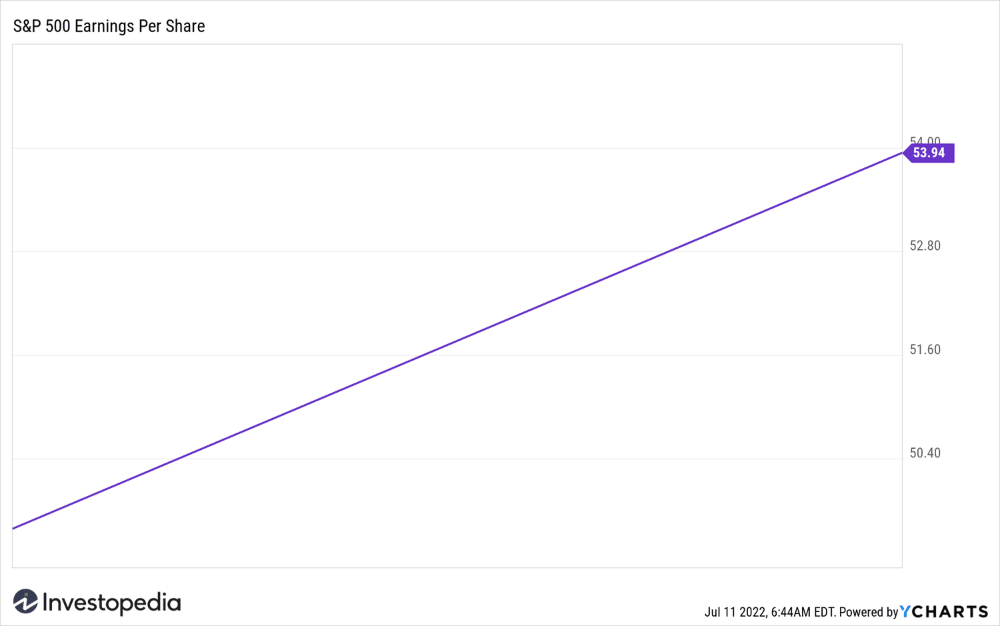

Earnings season marks a pivotal phase in the financial calendar when publicly traded companies announce their quarterly financial results. This period holds significant importance for investors, analysts, and traders as it provides a comprehensive assessment of a company’s financial wellbeing through detailed reports. The analysis of these results not only offers insights into the financial health of corporations but also reflects broader economic patterns, affecting overall market sentiment and stock valuations.

Algorithmic trading has emerged as a crucial tool during earnings season. This approach utilizes data-driven strategies and automated systems to execute trades with precision and speed, allowing traders to capitalize on the heightened market volatility typically observed during this period. Algorithms can process vast amounts of financial data almost instantaneously, enabling traders to react promptly to new information and maximize their investment returns.



This article explores the intricate dynamics between earnings reports, market reactions, and algorithmic trading. It aims to equip readers with strategies to navigate the complexities of earnings season effectively. By understanding how earnings data influences market behavior and harnessing the power of algorithmic trading, investors can better position themselves to exploit the opportunities that arise during this dynamic period.

## Table of Contents

## What is Earnings Season?

Earnings season represents a significant segment of the financial calendar when the majority of publicly traded companies release their quarterly financial results. This period occurs four times a year, corresponding with the end of each quarterly cycle, namely in January, April, July, and October. During earnings season, investors and analysts closely examine a company's financial metrics, such as earnings per share (EPS) and net income, to evaluate its performance.

Earnings per share (EPS) is a critical metric calculated by dividing a company's profit by the number of outstanding shares of its common stock:

$$
\text{EPS} = \frac{\text{Net Income} - \text{Preferred Dividends}}{\text{Average Outstanding Shares}}
$$

This measure provides insight into a company's profitability on a per-share basis and serves as a key indicator for investment decisions. Additionally, net income—a company's total profit after subtracting all expenses, taxes, and costs—offers a comprehensive view of its financial health.

Earnings season is characterized by heightened activity as analysts forecast earnings, assess whether companies meet or miss these expectations, and revise their estimates based on the new information. This rigorous analysis can lead to significant stock price movements as the market reacts to performance results, further underlining the importance of this period for investors and companies alike.

## Decoding Financial Reporting

Financial reporting serves as the backbone for evaluating a company's financial performance, offering detailed accounts via balance sheets, income statements, and cash flow statements. These documents delineate a company's financial activities and are critical for stakeholders.

The balance sheet provides a snapshot of a company’s financial position at a specific point in time, detailing assets, liabilities, and shareholders' equity. The equation underpinning a balance sheet is:

$$
\text{Assets} = \text{Liabilities} + \text{Shareholders' Equity}
$$

This equation illustrates the company's capacity to cover its obligations with available resources.

The income statement, often referred to as the profit and loss statement, reflects a company’s financial performance over a specific period. This statement outlines revenues and expenses, culminating in net income or loss. The formula used to derive net income is:

$$
\text{Net Income} = \text{Total Revenue} - \text{Total Expenses}
$$

This figure is crucial for assessing profitability over the reporting period.

Cash flow statements offer insight into the actual cash generated and used during the reporting period, categorized into operations, investing, and financing activities. They highlight the cash effects of transactions, which are not always evident in the income statement.

Investors and analysts utilize these financial reports to extract key metrics and ratios, such as return on equity (ROE) and price-to-earnings (P/E) ratio. These indicators facilitate comparisons across companies and industries. ROE is calculated as:

$$
\text{ROE} = \frac{\text{Net Income}}{\text{Average Shareholders' Equity}}
$$

A higher ROE indicates more efficient use of equity capital.

The P/E ratio, defined as:

$$
\text{P/E Ratio} = \frac{\text{Market Value per Share}}{\text{Earnings per Share (EPS)}}
$$

is a widely-used metric to assess whether a stock's market value aligns with its earnings.

Understanding financial statements is crucial not only for recognizing a company’s current profitability and sustainability but also for anticipating future performance and crafting informed investment decisions. Each element of financial reporting interlocks to provide a comprehensive picture essential for stakeholders invested in the company's financial health and strategic direction.

## Earnings Season and Stock Market Reactions

Volatility typically spikes during earnings season as companies disclose their quarterly financial results, often leading to substantial stock price adjustments. This period is characterized by a heightened market reaction to surprises in earnings reports, with potential rapid and significant changes in stock valuations. When companies report earnings that exceed or fall short of market expectations, investor sentiment can shift swiftly. The information gleaned from earnings calls and reports, including CEOs' and CFOs' verbal cues during conference calls, plays a crucial role in shaping these market sentiments.

Surprises in earnings reports, often preceding substantial stock price movements, are reflected in figures such as earnings per share (EPS) and revenue projections. An earnings "beat" occurs when a company’s reported earnings exceed the consensus estimates set by market analysts. Conversely, an earnings "miss" happens when reported earnings fall short. These outcomes directly influence the magnitude of stock price changes, as investors recalibrate their expectations based on the newest financial data.

The phenomenon known as Post-Earnings Announcement Drift (PEAD) illustrates an intriguing aspect of market psychology during this time. PEAD describes the tendency for stock prices to continue moving in the direction of an earnings surprise for several weeks following the announcement. It suggests that the market does not fully adjust to earnings information immediately, allowing traders and investors to capitalize on continued price movements even after the initial reaction. This aligns with theories of market inefficiency, where it is assumed that all available information is not entirely or perfectly reflected instantly in stock prices.

Here's a basic demonstration in Python of how one might explore PEAD using historical stock price data:

```python
import pandas as pd
import numpy as np
import matplotlib.pyplot as plt
from datetime import timedelta

# Sample data: stock price data and corresponding earnings surprise (simulated)
dates = pd.date_range(start="2023-01-01", periods=60, freq="D")
stock_prices = np.random.random(size=(60,))
earnings_surprise = np.random.choice([-0.2, 0.0, 0.2], size=(60,))

# Creating a DataFrame
data = pd.DataFrame({"Date": dates, "StockPrice": stock_prices, "EarningsSurprise": earnings_surprise})

# Assuming that Day 30 is the earnings announcement
announcement_day = 30

# Calculate cumulative returns from the earnings announcement day
data["CumulativeReturn"] = data["StockPrice"].pct_change().cumsum()

# Plotting the cumulative return post-earnings announcement
plt.figure(figsize=(10, 6))
plt.plot(data["Date"], data["CumulativeReturn"], label="Cumulative Return")
plt.axvline(data["Date"].iloc[announcement_day], color='r', linestyle='--', label="Earnings Announcement")
plt.title('Post-Earnings Announcement Drift (PEAD)')
plt.xlabel('Date')
plt.ylabel('Cumulative Return')
plt.legend()
plt.show()
```

This code snippet graphically represents how a stock's cumulative return can continue on a trend initiated by the earnings announcement, highlighting possible opportunities for investors to capitalize on PEAD. Effective use of such analysis enables traders to develop strategies that harness market behavior during earnings season, thereby achieving potentially profitable outcomes.

## The Role of Algorithmic Trading

Algorithmic trading is pivotal in modern financial markets, automating trade execution based on pre-established criteria. This is particularly advantageous during earnings season, a period marked by increased market activity and [volatility](/wiki/volatility-trading-strategies). Algorithms can process extensive volumes of financial data almost instantaneously, enabling traders to respond promptly to earnings announcements.

The utility of [algorithmic trading](/wiki/algorithmic-trading) lies in its ability to execute complex trading strategies with speed and precision. By quickly analyzing financial reports, news releases, and earnings calls, these algorithms facilitate informed decision-making and rapid trade executions. This quick reaction capability is crucial when every second counts in leveraging earnings information to capitalize on potential price movements.

The integration of [artificial intelligence](/wiki/ai-artificial-intelligence) (AI) and [machine learning](/wiki/machine-learning) (ML) within these algorithms further refines their capabilities. These technologies enable algorithms to learn from historical data, adapt to dynamic market conditions, and improve predictive accuracy over time. Machine learning models can analyze patterns and correlations in vast datasets, offering insights into likely market responses to earnings announcements. For instance, natural language processing (NLP) can be used to analyze sentiment in earnings calls, aiding in predicting stock price movements based on qualitative data.

A typical implementation of algorithmic trading in Python might involve data acquisition, signal generation, and trade execution. For instance, using libraries such as `pandas` for data manipulation and `scikit-learn` for machine learning, traders can develop algorithms to predict stock movements based on earnings results. Here is a simple hypothetical example of how such a system might be set up:

```python
import pandas as pd
from sklearn.ensemble import RandomForestClassifier

# Load historical earnings data and market responses
data = pd.read_csv('earnings_data.csv')

# Feature engineering: create input features based on historical data 
features = data.drop(['stock_movement'], axis=1)
target = data['stock_movement']

# Initialize the model
model = RandomForestClassifier(n_estimators=100, random_state=42)

# Train the model
model.fit(features, target)

# Predict movements for new earnings data
new_data = pd.read_csv('new_earnings_data.csv')
predictions = model.predict(new_data)

# Execute trades based on the predictions
for i, prediction in enumerate(predictions):
    if prediction == 1:
        print(f"Buy stock {new_data['stock'][i]}")
    elif prediction == -1:
        print(f"Sell stock {new_data['stock'][i]}")
```

This code snippet outlines the basic framework for a machine learning-based trading algorithm. In practice, more sophisticated models and features would be employed to refine predictive accuracy and trade execution strategies. Furthermore, rigorous [backtesting](/wiki/backtesting) and risk management are essential to ensure that the algorithm performs reliably in a live trading environment.

Algorithmic trading, enhanced by AI and machine learning, offers a competitive advantage during earnings season by providing rapid, data-driven responses to market conditions. This capability is essential for exploiting short-term market inefficiencies and maximizing trading opportunities.

## Strategies for Navigating Earnings Season with Algo Trading

Algorithmic traders employ various strategies during earnings season to maximize their returns, leveraging the inherent volatility from earnings announcements. Key strategies include [pair trading](/wiki/pair-trading) and [momentum](/wiki/momentum) trading, which are prominently used due to their data-driven nature and adaptability to market conditions.

### Pair Trading

Pair trading involves selecting two stocks whose prices have historically moved in tandem. During earnings season, an algorithm detects any divergence in this relationship, allowing a trader to simultaneously buy and sell the pair expecting them to revert to the mean. The strategy assumes that the stock prices will eventually return to their historical equilibrium relationship.

A typical approach might involve selecting pairs based on correlation metrics or cointegration tests, ensuring that the chosen stocks exhibit a steady price relationship over time. Algorithms can identify potential price divergences and execute trades rapidly, harnessing opportunities just as they arise.

### Momentum Trading

Momentum trading leverages the continuation of existing trends in stock prices following earnings announcements. Algorithms identify patterns and trends in historical earnings movements, quickly placing trades to capitalize on expected continuations. This strategy assumes that stocks exhibiting positive or negative momentum will continue their trajectory shortly after earnings reports.

For instance, consider using a simple moving average (SMA) crossover strategy, which involves short-term and long-term moving averages. When the short-term SMA crosses above the long-term SMA post-earnings, it generates a buy signal:

```python
import pandas as pd

# Assume `data` is a DataFrame with historical stock prices
short_window = 20
long_window = 100

signals = pd.DataFrame(index=data.index)
signals['price'] = data['price']
signals['short_mavg'] = data['price'].rolling(window=short_window, min_periods=1, center=False).mean()
signals['long_mavg'] = data['price'].rolling(window=long_window, min_periods=1, center=False).mean()

signals['signal'] = 0.0
signals['signal'][short_window:] = np.where(
    signals['short_mavg'][short_window:] > signals['long_mavg'][short_window:], 1.0, 0.0)

signals['positions'] = signals['signal'].diff()
```

### Historical Data and Sentiment Analysis

Algorithms enhance predictive accuracy by combining historical data with sentiment analysis. Utilizing natural language processing (NLP), traders analyze earnings call transcripts, press releases, and news articles to gauge market sentiment. Sentiment scores complement historical data analysis, creating more robust predictive models for stock behavior after earnings.

### Risk Management Techniques

Effective risk management is crucial during the volatile periods of earnings season. Stop-loss orders are pivotal, automatically selling a stock when its price reaches a predetermined level, thus limiting potential losses. Diversification also plays a critical role, spreading investments across various sectors or asset classes to minimize the impact of adverse movements in any single investment.

### Conclusion

Navigating earnings season with algorithmic trading involves a multifaceted approach that balances innovative strategies with robust risk management. By integrating advanced computational techniques and data analysis, traders can effectively capitalize on market opportunities while safeguarding against uncertainties.

## Conclusion

Earnings season, a crucial period in the financial calendar, offers both significant opportunities and inherent risks for traders. In this dynamic environment, adopting informed and strategic approaches is paramount. Algorithmic trading stands out as a powerful tool, providing traders with a competitive advantage through its speed, precision, and the ability to make data-driven decisions. These capabilities are essential for leveraging the often-volatile market conditions experienced during earnings season. The technological edge offered by algorithms allows traders to rapidly process large volumes of financial data and execute trades with minimal latency, maximizing potential profits while mitigating risks associated with human error and delayed decision-making.

However, the effectiveness of algorithmic trading is not solely reliant on its inherent capabilities. Success in trading, particularly during earnings season, demands continuous learning and the refinement of strategies. Financial markets are characterized by their ever-evolving nature, influenced by a multitude of factors ranging from economic indicators to geopolitical events. Traders must remain vigilant and adaptable, updating their trading algorithms to incorporate new data, improve predictive accuracy, and address any changes in market conditions. This involves not only the adjustment of trading models based on historical performance but also the integration of advanced techniques, such as machine learning, to enhance the predictive power of algorithms.

In conclusion, navigating earnings season effectively requires balancing the innovative edge of algorithmic trading with the judicious application of informed trading strategies. By doing so, traders can harness the full potential of technology to exploit market opportunities while safeguarding against potential pitfalls. The relentless pursuit of knowledge and adaptation remains critical for traders aiming to thrive in the dynamic and competitive landscape of financial markets.

## References & Further Reading

1. **Financial Reporting and Analysis:**
   - *Penman, S. H. (2013). Financial Statement Analysis and Security Valuation*. McGraw-Hill Education. This book provides a detailed framework for financial statement analysis which is crucial for understanding earnings reports during earnings season.
   - *White, G. I., Sondhi, A. C., & Fried, D. (2003). The Analysis and Use of Financial Statements*. Wiley. This text emphasizes the practical aspects of analyzing financial statements, highlighting key metrics such as EPS and net income.

2. **Algorithmic Trading Strategies:**
   - *Chan, E. P. (2017). Algorithmic Trading: Winning Strategies and Their Rationale*. Wiley. This book outlines various algorithmic trading strategies, including their implementation and rationale.
   - *Narang, R. K. (2009). Inside the Black Box: The Simple Truth About Quantitative Trading*. Wiley. This resource provides insights into the workings of algorithmic trading and discusses strategies like pair trading and momentum trading during earnings season.

3. **Market Analysis Methodologies:**
   - *Fabozzi, F. J., Focardi, S. M., & Kolm, P. N. (2006). Quantitative Equity Investing: Techniques and Strategies*. Wiley. This book covers quantitative analysis techniques for evaluating market trends and stock performance.
   - *Hull, J. C. (2012). Options, Futures, and Other Derivatives*. Pearson. This textbook is essential for understanding derivatives and their role in market reactions during earnings reports.

4. **Advances in Financial Machine Learning:**
   - *Lopez de Prado, M. (2018). Advances in Financial Machine Learning*. Wiley. A comprehensive guide on implementing machine learning techniques in financial markets, providing insights into predictive modeling and strategy optimization.

5. **Risk Management Techniques:**
   - *Jorion, P. (2006). Value at Risk: The New Benchmark for Managing Financial Risk*. McGraw-Hill. This book covers risk management tools and strategies, essential for navigating the volatility of earnings season.

6. **Trading Algorithms:**
   - *Kissell, R. (2013). The Science of Algorithmic Trading and Portfolio Management*. Academic Press. This resource includes a detailed explanation of algorithmic trading systems and their application during volatile periods such as earnings season. 

Further reading and research into these resources will provide a comprehensive understanding of the intersection between financial reporting, algorithmic trading, and market analysis. These texts offer foundational knowledge and advanced concepts that can enhance strategic trading decisions during earnings seasons.

