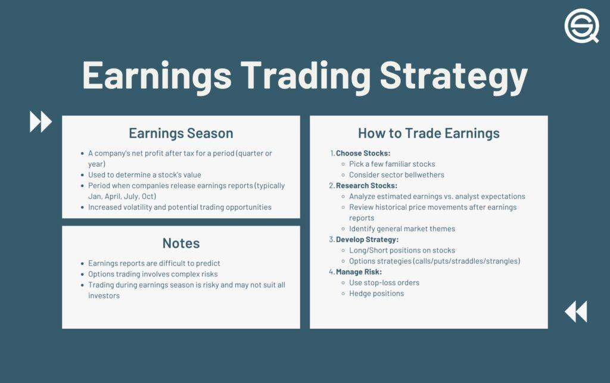

## Table of Contents

## What is an earnings trading strategy?

An earnings trading strategy is a way to make money by buying and selling stocks around the time a company reports its earnings. Earnings are the profits a company makes, and these reports can cause the stock price to go up or down a lot. Traders try to guess if the stock price will go up or down after the earnings report and then buy or sell the stock accordingly. This can be risky because it's hard to predict what will happen, but it can also be very rewarding if you guess right.

There are different ways to use an earnings trading strategy. One way is to buy the stock before the earnings report if you think the company will do well, hoping to sell it at a higher price after the report. Another way is to sell the stock or buy a "put option" if you think the company will do poorly, hoping to buy it back at a lower price after the report. Some traders also use "straddles," which means buying both a call option and a put option at the same time, betting that the stock will move a lot in either direction. Each method has its own risks and rewards, so it's important to understand them before you start trading.

## Why do traders focus on earnings reports?

Traders focus on earnings reports because these reports tell them how much money a company made or lost in a certain time. This information is important because it can change how people feel about the company and its stock. If a company makes more money than people thought, its stock price might go up because more people want to buy it. If the company does worse than expected, the stock price might go down because people might want to sell it.

Earnings reports can make stock prices move a lot, which is why traders pay close attention to them. Traders try to guess what the report will say and how the stock price will react. If they guess right, they can make a lot of money by buying or selling the stock at the right time. But it's risky because it's hard to predict what will happen, and they might lose money if they guess wrong.

## How can earnings announcements affect stock prices?

Earnings announcements can make a big difference in how much a stock is worth. When a company tells everyone how much money it made, people decide if they want to buy or sell the stock based on that news. If the company made more money than people thought it would, the stock price usually goes up. This happens because more people want to buy the stock, thinking the company is doing well and will keep doing well. It's like when a store has a big sale and everyone rushes to buy things because they think it's a good deal.

On the other hand, if the company made less money than expected, the stock price can go down. People might sell their stock because they think the company is not doing as well as they hoped. It's like when you find out a store is not doing well, so you decide not to buy anything there. The stock price can move a lot right after an earnings announcement because everyone is reacting to the news at the same time. This is why traders pay close attention to these reports and try to guess what will happen.

## What are the key components of an earnings trading strategy?

An earnings trading strategy involves making decisions about buying or selling stocks based on what a company's earnings report might say. Traders look at past earnings reports and try to guess if the next one will be good or bad. They use this guess to decide if they should buy the stock before the report comes out, hoping to sell it at a higher price if the news is good, or if they should sell it or buy a put option if they think the news will be bad, hoping to buy it back cheaper.

Another important part of an earnings trading strategy is understanding how much the stock price might move after the earnings report. Traders use tools like options to bet on big moves in either direction. For example, they might use a straddle, which means buying both a call option and a put option at the same time. This way, they can make money if the stock price goes up a lot or down a lot. It's all about trying to make the right guess and managing the risk that comes with it.

## What is the difference between trading before and after earnings announcements?

Trading before an earnings announcement means buying or selling a stock before the company tells everyone how much money it made. Traders try to guess if the earnings will be good or bad. If they think the earnings will be good, they might buy the stock, hoping to sell it at a higher price after the announcement. If they think the earnings will be bad, they might sell the stock or buy a put option, hoping to buy it back at a lower price after the announcement. This kind of trading can be risky because it's hard to predict what the earnings will be, but it can also be rewarding if you guess right.

Trading after an earnings announcement means buying or selling a stock after the company has already told everyone how much money it made. At this point, traders know if the earnings were good or bad, and they can see how the stock price reacts to the news. If the earnings were better than expected, the stock price might go up, and traders might buy the stock to take advantage of the rise. If the earnings were worse than expected, the stock price might go down, and traders might sell the stock or buy put options to profit from the fall. Trading after the announcement can still be risky because the stock price can move a lot and be unpredictable, but it's based on real information rather than guesses.

## How can one predict stock movement based on earnings?

Predicting how a stock will move based on earnings can be tricky, but traders often look at past earnings reports to get an idea. They check if the company usually does better or worse than what people expect. If a company often beats expectations, traders might think it will happen again and buy the stock before the earnings come out. They also look at what the company says about its future. If the company sounds hopeful, traders might think the stock will go up. But if the company seems worried, traders might think the stock will go down.

Another way to predict stock movement is by using tools like options. Options let traders bet on big moves in either direction. For example, if traders think the stock will move a lot after the earnings report but aren't sure which way, they might buy a straddle. This means buying both a call option, which is good if the stock goes up, and a put option, which is good if the stock goes down. By looking at past data and using options, traders try to guess what will happen and make money from their predictions.

## What are common mistakes to avoid when trading around earnings?

One common mistake when trading around earnings is not doing enough research. Traders sometimes buy or sell a stock based on a hunch without looking at the company's past earnings or what people expect for the next report. It's important to check if the company usually does better or worse than expected and what the company says about its future. Without this information, it's hard to make a good guess about what will happen to the stock price after the earnings come out.

Another mistake is not managing risk well. Trading around earnings can be very risky because the stock price can move a lot in either direction. Some traders bet too much money on one stock, hoping to make a big profit, but they can lose a lot if they guess wrong. It's smart to use tools like options to limit how much you can lose. For example, buying a put option can help protect against a big drop in the stock price. By managing risk carefully, traders can avoid losing too much money if their predictions are wrong.

## What technical indicators are useful for earnings trading?

When trading around earnings, some traders use technical indicators to help them make decisions. One useful indicator is the moving average, which shows the average price of a stock over a certain time. If the stock price is above the moving average, it might mean the stock is doing well and could keep going up. If it's below, it might mean the stock is not doing so well and could keep going down. Another helpful indicator is the Relative Strength Index (RSI), which tells traders if a stock is overbought or oversold. If the RSI is over 70, the stock might be overbought and due for a drop. If it's under 30, the stock might be oversold and due for a rise.

Traders also look at the Bollinger Bands, which show how much a stock's price moves around. The bands get wider when the stock price is moving a lot and narrower when it's not moving much. If the stock price touches the upper band, it might mean the stock is going to go down soon. If it touches the lower band, it might mean the stock is going to go up. By using these indicators, traders can get a better idea of what might happen to the stock price around earnings time. But remember, these are just tools to help make decisions, and they don't always predict what will happen.

## How do options play a role in earnings trading strategies?

Options are a big part of earnings trading strategies because they let traders bet on how a stock will move after an earnings report. When traders think a stock will go up after the earnings come out, they might buy a call option. This gives them the right to buy the stock at a set price, which can be good if the stock goes up a lot. If traders think the stock will go down, they might buy a put option. This lets them sell the stock at a set price, which can be good if the stock drops a lot. Options can help traders make money from big moves in either direction, even if they're not sure which way the stock will go.

Another way traders use options in earnings trading is by using strategies like straddles. A straddle means buying both a call option and a put option at the same time, betting that the stock will move a lot but not caring which way. This can be a good way to make money if the stock price moves a lot after the earnings report, no matter if it goes up or down. Options also help traders manage risk because they can limit how much money they might lose if their guess about the stock is wrong. By using options smartly, traders can try to make money from earnings reports while keeping their risk under control.

## What are some advanced strategies for trading earnings?

One advanced strategy for trading earnings is called the "earnings straddle." This involves buying both a call option and a put option at the same time with the same strike price and expiration date. The idea is to bet that the stock will move a lot after the earnings report, but you don't care which way it goes. If the stock price jumps up or down a lot, you can make money from one of the options. This strategy can be good if you think the stock will have a big reaction to the earnings but you're not sure if it will be good or bad news. However, it can be expensive because you're buying two options, and if the stock doesn't move much, you could lose money on both.

Another advanced strategy is called "earnings calendar spread." This involves buying and selling options with different expiration dates but the same strike price. For example, you might buy a call option that expires right after the earnings report and sell a call option that expires later. The goal is to take advantage of the big move right after the earnings and then let the later option expire worthless. This can help you make money if the stock moves a lot right after the earnings but then calms down. It's a bit tricky because you need to guess not just how the stock will move after the earnings but also how it will behave in the weeks after. Both strategies need a good understanding of options and how the stock market works, but they can be powerful tools for traders looking to make money from earnings reports.

## How can historical earnings data be used to improve trading decisions?

Historical earnings data can help traders make better guesses about what might happen to a stock after the next earnings report. By looking at past earnings, traders can see if a company usually does better or worse than what people expect. If a company often beats expectations, traders might think it will happen again and buy the stock before the earnings come out. They can also look at how much the stock price moved after past earnings reports. If the stock usually goes up a lot when the earnings are good, traders might bet on a big move again. This way, historical data gives traders a way to make more informed decisions instead of just guessing.

Another way historical earnings data helps is by showing patterns in how a company talks about its future. If a company often sounds hopeful before earnings and then does well, traders might trust those hopeful words more. On the other hand, if a company seems worried and then does badly, traders might take those worries seriously. By understanding these patterns, traders can better predict how the stock might react to the next earnings report. Using historical data like this can make trading around earnings less risky and more likely to be successful.

## What risk management techniques should be employed when trading around earnings?

When trading around earnings, one important risk management technique is to use options to limit how much money you could lose. For example, if you buy a stock hoping it will go up after the earnings report, you can also buy a put option. This gives you the right to sell the stock at a set price, which can protect you if the stock price goes down instead. Another way to manage risk is to not put all your money into one stock. By spreading your money across different stocks, you won't lose everything if one stock doesn't do well after its earnings report.

Another technique is to set stop-loss orders. These are orders that automatically sell your stock if it drops to a certain price, helping you limit your losses. It's also smart to do a lot of research before trading. Look at the company's past earnings and what people expect for the next report. This can help you make better guesses about what might happen and plan your trades more carefully. By using these risk management techniques, you can try to make money from earnings reports while keeping your risk under control.

## What are Algorithmic Options Strategies for Earnings?

Options play a pivotal role in augmenting earnings trading strategies through algorithmic trading, primarily by facilitating risk hedging and enhancing potential returns. Options strategies involve various approaches, each adaptable to differing market expectations and volatility levels during earnings announcements.

### Common Strategies

1. **Buying Calls or Puts**: This straightforward options strategy involves purchasing call options if a trader anticipates a stock price increase after an earnings report or put options if expecting a decrease. These strategies offer a limited-risk approach with potentially significant rewards if the stock moves as predicted.   

   - **Call Option**: A right to buy shares at a specified price before expiration.
$$
     C = \max(S - K, 0)

$$
     Where $C$ is the call option value, $S$ is the stock price, and $K$ is the strike price.

   - **Put Option**: A right to sell shares at a specified price before expiration.
$$
     P = \max(K - S, 0)

$$
     Where $P$ is the put option value.

2. **Straddles**: This strategy involves simultaneous purchase of a call and put option with the same strike price and expiration date. A straddle profits from significant stock movements in either direction after an earnings report. Straddles are profitable if the stock experiences high volatility post-earnings, even if the direction is unpredictable.

3. **Strangles**: Similar to straddles, strangles involve purchasing out-of-the-money call and put options of the same expiration date. Due to its lower initial cost compared to a straddle, it becomes profitable with larger price swings. Traders can apply strangles when anticipating volatility but are unsure of the direction.

### Implementing Options in Algorithmic Trading

Incorporating these options strategies into an algorithmic trading framework necessitates a comprehensive understanding of options pricing and the Greeks. The Greeks—Delta, Gamma, Theta, Vega, and Rho—are essential for managing options portfolios. They quantify the risk and predict changes in the value of an options portfolio in response to changes in underlying variables.

- **Delta ($\Delta$)** measures an option's sensitivity to changes in the price of the underlying asset.
- **Gamma ($\Gamma$)** assesses the rate of change of Delta.
- **Theta ($\Theta$)** represents the time decay of an option.
- **Vega ($\nu$)** gauges an option's sensitivity to changes in volatility.
- **Rho ($\rho$)** indicates sensitivity to interest rate changes.

### Implementation Example

A Python-based algorithm could use these strategies by integrating a financial library such as QuantLib or using an API service like Alpaca or TD Ameritrade for data retrieval and trade execution. Below is a basic structure for determining when to purchase calls based on expected earnings beats:

```python
import numpy as np
import pandas as pd

def should_buy_call(expected_eps, actual_eps, current_price):
    # Buying criteria based on percentage increase expected
    eps_surprise = (actual_eps - expected_eps) / expected_eps
    price_target = current_price * (1 + eps_surprise)

    # Simulate simple trading decision
    return price_target > current_price * 1.05

# Example data
stock_price = 150.00
expected_eps = 1.00
actual_eps = 1.10

# Process decision
if should_buy_call(expected_eps, actual_eps, stock_price):
    print("Buy Call Option")
```

By using algorithmic strategies involving options, traders can potentially capitalize on the heightened volatility typical of earnings seasons, leveraging both analytic and systematic advantages that these sophisticated financial instruments and technologies provide.

## References & Further Reading

[1]: Bergstra, J., Bardenet, R., Bengio, Y., & Kégl, B. (2011). ["Algorithms for Hyper-Parameter Optimization."](https://papers.nips.cc/paper/4443-algorithms-for-hyper-parameter-optimization) Advances in Neural Information Processing Systems 24.

[2]: ["Advances in Financial Machine Learning"](https://www.amazon.com/Advances-Financial-Machine-Learning-Marcos/dp/1119482089) by Marcos Lopez de Prado

[3]: ["Evidence-Based Technical Analysis: Applying the Scientific Method and Statistical Inference to Trading Signals"](https://www.amazon.com/Evidence-Based-Technical-Analysis-Scientific-Statistical/dp/0470008741) by David Aronson

[4]: ["Machine Learning for Algorithmic Trading"](https://github.com/stefan-jansen/machine-learning-for-trading) by Stefan Jansen

[5]: ["Quantitative Trading: How to Build Your Own Algorithmic Trading Business"](https://books.google.com/books/about/Quantitative_Trading.html?id=j70yEAAAQBAJ) by Ernest P. Chan