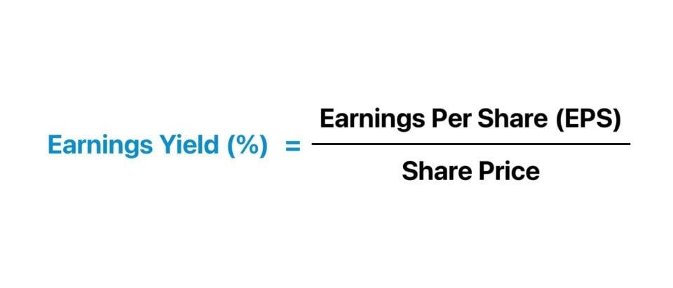

## Table of Contents

## What is earnings yield?

Earnings yield is a way to measure how much money a company makes compared to its stock price. It is calculated by dividing the company's earnings per share by its current stock price. This number is usually shown as a percentage. For example, if a company earns $2 per share and its stock price is $40, the earnings yield would be 5%.

Investors use earnings yield to see if a stock is a good buy. A higher earnings yield means the company is making more money for each dollar you spend on its stock. This can be a sign that the stock is undervalued, or priced lower than it should be. On the other hand, a lower earnings yield might mean the stock is overvalued, or priced higher than it should be. By comparing the earnings yield of different companies, investors can make better choices about where to put their money.

## How is earnings yield different from dividend yield?

Earnings yield and dividend yield are two different ways to look at how well a company is doing, but they focus on different things. Earnings yield is about how much profit a company makes for each dollar of its stock price. You find it by dividing the earnings per share by the stock price. This helps investors see if the stock is a good deal based on the company's earnings. A high earnings yield might mean the stock is undervalued, which could be a good sign for investors.

Dividend yield, on the other hand, is about how much money a company pays out to its shareholders in dividends. You calculate it by dividing the annual dividend per share by the stock price. This tells investors how much income they can expect to get from owning the stock. A high dividend yield can be attractive to investors who want regular income from their investments. So, while earnings yield focuses on the company's profits, dividend yield focuses on the cash payments to shareholders.

## Why is earnings yield important for investors?

Earnings yield is important for investors because it shows how much profit a company makes for each dollar you spend on its stock. If a company has a high earnings yield, it means you are getting a lot of earnings for your money. This can be a sign that the stock is a good deal, or undervalued. Investors like to see high earnings yields because it suggests that the stock might be priced lower than it should be, which could lead to good returns in the future.

On the other hand, a low earnings yield might mean the stock is overvalued, or priced higher than it should be. By looking at the earnings yield, investors can compare different companies and decide where to put their money. It helps them figure out which stocks might give them the best value for their investment. So, earnings yield is a key tool for making smart investment choices.

## How do you calculate earnings yield?

Earnings yield is a way to see how much money a company makes compared to its stock price. To calculate it, you take the company's earnings per share and divide it by the current stock price. The answer is usually shown as a percentage. For example, if a company earns $2 per share and its stock price is $40, you would do this: $2 divided by $40 equals 0.05, or 5%. That means the earnings yield is 5%.

This number is important because it helps investors figure out if a stock is a good buy. A high earnings yield means the company makes a lot of money for each dollar you spend on its stock. This can be a sign that the stock is undervalued, or priced lower than it should be. On the other hand, a low earnings yield might mean the stock is overvalued, or priced higher than it should be. By comparing the earnings yields of different companies, investors can make better choices about where to put their money.

## What are the components needed to calculate earnings yield?

To calculate earnings yield, you need two main pieces of information: the company's earnings per share and the current stock price. Earnings per share is the amount of money the company makes for each share of its stock. You can find this number in the company's financial reports. The current stock price is how much it costs to buy one share of the company's stock right now. You can find this number on stock market websites or through your broker.

Once you have these two numbers, you can calculate the earnings yield by dividing the earnings per share by the current stock price. The result is usually shown as a percentage. For example, if a company earns $2 per share and its stock price is $40, you would divide $2 by $40 to get 0.05, or 5%. This means the earnings yield is 5%. This number helps investors see if the stock is a good deal. A high earnings yield can mean the stock is undervalued, while a low earnings yield might mean it's overvalued.

## Can you provide an example of calculating earnings yield for a specific company?

Let's say we want to calculate the earnings yield for a company called ABC Corp. First, we need to find out ABC Corp's earnings per share and its current stock price. Let's say ABC Corp's earnings per share is $3, and the current stock price is $60. To find the earnings yield, we divide the earnings per share by the stock price. So, we do $3 divided by $60, which equals 0.05. When we turn that into a percentage, it's 5%. This means ABC Corp's earnings yield is 5%.

This number tells us how much profit ABC Corp makes for each dollar we spend on its stock. A 5% earnings yield means that for every $100 we spend on ABC Corp's stock, we get $5 in earnings. If we compare this to other companies, we can see if ABC Corp's stock is a good deal. A high earnings yield like this might mean the stock is undervalued, which could be a good sign for investors looking for a bargain.

## How does earnings yield relate to the price-to-earnings (P/E) ratio?

Earnings yield and the price-to-earnings (P/E) ratio are two sides of the same coin. They both help investors understand how much they are paying for a company's earnings. Earnings yield is calculated by dividing the earnings per share by the stock price, and it tells you how much profit you get for each dollar you spend on the stock. On the other hand, the P/E ratio is calculated by dividing the stock price by the earnings per share. This tells you how many dollars you need to spend to get one dollar of the company's earnings.

The relationship between earnings yield and the P/E ratio is simple: earnings yield is the inverse of the P/E ratio. If you know one, you can easily find the other by doing a quick calculation. For example, if a company has a P/E ratio of 20, its earnings yield would be 1 divided by 20, which is 0.05 or 5%. This means that if the P/E ratio goes up, the earnings yield goes down, and vice versa. Understanding this relationship helps investors see the value of a stock from different angles and make better investment decisions.

## What are the limitations of using earnings yield as an investment metric?

Earnings yield can be a helpful tool for investors, but it has some limitations. One big problem is that earnings can change a lot from year to year. If a company has a bad year, its earnings might drop, which makes the earnings yield look worse even if the stock price stays the same. This can make it hard to know if a stock is really a good deal or not. Also, earnings yield doesn't tell you anything about a company's debt or how it's growing. A company might have a high earnings yield, but if it has a lot of debt, it could be risky to invest in.

Another limitation is that earnings yield doesn't show you the whole picture. It's just one piece of information, and it doesn't tell you about other important things like how the company is doing compared to others in its industry or what the future might hold. Investors need to look at a lot of different numbers and facts to make good choices. Relying too much on earnings yield alone can lead to mistakes because it doesn't give you all the information you need to understand a company's true value.

## How can earnings yield be used to compare different investment opportunities?

Earnings yield is a great tool for comparing different investment opportunities because it shows you how much profit you get for each dollar you spend on a stock. If you look at two companies, one with an earnings yield of 5% and another with an earnings yield of 3%, the first company is giving you more earnings for your money. This can help you decide which stock might be a better deal. By comparing the earnings yields of different companies, you can see which ones are making more money for each dollar you invest, which might mean they are undervalued and a good buy.

But, it's important to remember that earnings yield is just one piece of the puzzle. You need to look at other things too, like how much debt a company has, how fast it's growing, and what's happening in its industry. Just because a company has a high earnings yield doesn't mean it's the best investment. You have to think about all these other factors to make a smart choice. Earnings yield can give you a quick way to compare stocks, but it's not the only thing you should look at when deciding where to put your money.

## What impact do different accounting methods have on the calculation of earnings yield?

Different accounting methods can change the earnings per share number, which is used to calculate earnings yield. For example, some companies use different ways to figure out how much their stuff is worth, like their buildings or machines. If they use a method that makes their stuff seem worth more, it can make their earnings look higher. But if they use a method that makes their stuff seem worth less, their earnings might look lower. This can make the earnings yield go up or down, even if the stock price stays the same.

Another way accounting methods can affect earnings yield is through how companies count their costs. Some might spread out the cost of big things they buy over many years, while others might count it all at once. This can make their earnings look different from year to year. If a company's earnings change because of how they count costs, it can make their earnings yield seem higher or lower than it really is. So, when you look at earnings yield, it's good to know that different accounting tricks can make the numbers look different.

## How do market conditions affect the interpretation of earnings yield?

Market conditions can change how you look at earnings yield. When the market is doing well and lots of people want to buy stocks, stock prices might go up a lot. This can make earnings yield look lower because the stock price is higher, even if the company's earnings stay the same. On the other hand, if the market is doing badly and people are selling their stocks, prices might go down. This can make earnings yield look higher because the stock price is lower, even if the earnings haven't changed. So, it's important to think about what's happening in the market when you look at earnings yield.

Also, different types of markets can affect what a good earnings yield looks like. In a bull market, where stock prices are going up, investors might be okay with a lower earnings yield because they think the stock price will keep going up. But in a bear market, where prices are going down, investors might want a higher earnings yield to feel safe about their investment. Knowing what kind of market you're in helps you decide if an earnings yield is good or not. It's all about looking at the big picture and not just the numbers.

## What advanced techniques can be used to adjust earnings yield for more accurate analysis?

To make earnings yield more accurate, you can use something called normalized earnings. This means looking at a company's earnings over several years instead of just one year. If a company had a really good or bad year, using just that year's earnings could make the earnings yield look wrong. By averaging the earnings over a few years, you get a better idea of what the company usually makes. This can help you see if a stock is really a good deal or not, even if the last year was unusual.

Another way to adjust earnings yield is by looking at the quality of earnings. This means checking if the company's earnings come from real business activities or if they're just from accounting tricks. For example, if a company sells a building and counts that money as earnings, it might make the earnings yield look good, but it's not from their regular business. By looking at where the earnings come from, you can get a clearer picture of how well the company is doing and if the earnings yield is a true reflection of its value.

## What are Financial Ratios and How are Investment Calculations Understood?

Financial ratios are quantitative tools that play a crucial role in analyzing a company's financial statements, offering insights into its operational efficiency, liquidity, profitability, and solvency. Among the key financial ratios is the earnings yield, which is particularly valuable for assessing the potential return on investment from a company's earnings relative to its share price.

### Key Financial Ratios

1. **Earnings Yield**: 
   The earnings yield is calculated by dividing the Earnings Per Share (EPS) by the share price. It is expressed as a percentage and offers an indication of the income a shareholder can expect from an investment in a company's stock. The formula is:
$$
   \text{Earnings Yield} = \left( \frac{\text{EPS}}{\text{Share Price}} \right) \times 100

$$

2. **Price to Earnings (P/E) Ratio**: 
   This ratio provides insights into how much investors are willing to pay per dollar of earnings. It is the inverse of the earnings yield, calculated by dividing the share price by the earnings per share (EPS):
$$
   \text{P/E Ratio} = \frac{\text{Share Price}}{\text{EPS}}

$$

3. **Debt to Equity Ratio**: 
   This ratio shows the relative proportions of shareholders' equity and debt used to finance a company's assets. It is a critical measure of financial leverage and risk.
$$
   \text{Debt to Equity Ratio} = \frac{\text{Total Liabilities}}{\text{Shareholders' Equity}}

$$

4. **Return on Equity (ROE)**:
   ROE indicates a company's ability to generate profits from shareholders' equity. It is calculated by dividing net income by shareholders' equity.
$$
   \text{ROE} = \frac{\text{Net Income}}{\text{Shareholders' Equity}}

$$

5. **Current Ratio**: 
   This [liquidity](/wiki/liquidity-risk-premium) ratio measures a company's ability to cover its short-term obligations with its short-term assets. A higher ratio indicates greater short-term financial health.
$$
   \text{Current Ratio} = \frac{\text{Current Assets}}{\text{Current Liabilities}}

$$

### Importance of Financial Ratios

Financial ratios are vital in determining a company's financial health and investment attractiveness. By providing a standardized method for viewing a company's operational efficiency, liquidity, profitability, and solvency, these ratios enable investors, analysts, and managers to make well-informed decisions. They also help in comparing companies within the same industry.

- **Assessing Financial Health**: Ratios like the current ratio and debt to equity ratio provide insights into a company's liquidity and financial risk.
- **Investment Decisions**: The earnings yield and P/E ratio assist in evaluating if a stock is undervalued or overvalued. A higher earnings yield may suggest a better investment opportunity if the company's fundamentals are strong.

### Common Financial Ratio Benchmarks

Benchmarks serve as points of reference for evaluating financial ratios. They can be derived from industry averages, historical performance, or predetermined standards.

- **P/E Ratio Benchmark**: Typically, a P/E below the industry average may indicate a stock is undervalued, whereas a higher P/E suggests overvaluation.
- **Earnings Yield Benchmark**: A higher earnings yield compared to bond yields or the industry average might indicate a potentially attractive investment.
- **Current Ratio Benchmark**: A current ratio above 1 generally indicates good short-term financial health, signaling that the company can meet debt obligations as they arise.

In market analysis, these benchmarks allow for the identification of trends and the development of strategies tailored to specific financial environments. As such, understanding and utilizing these financial ratios and benchmarks are foundational for effective investment analysis and decision-making processes.

## What is Earnings Yield Explained?

Earnings yield is a crucial financial ratio used to evaluate a stock's return relative to its price. It is calculated as the earnings per share (EPS) divided by the share price, represented mathematically as:

$$
\text{Earnings Yield} = \frac{\text{Earnings per Share (EPS)}}{\text{Share Price}}
$$

This ratio provides a percentage that indicates how much a company earns relative to its stock price. For investors, a higher earnings yield suggests a potentially undervalued stock or a profitable investment opportunity, as it reflects more earnings for each dollar invested.

The earnings yield has an inverse relationship with the price-to-earnings (P/E) ratio, another widely used metric for investment analysis. While the P/E ratio determines how much investors are willing to pay for each dollar of earnings, the earnings yield provides a direct measure of potential returns. The formula for P/E ratio is:

$$
\text{P/E Ratio} = \frac{\text{Share Price}}{\text{Earnings per Share (EPS)}}
$$

The inverse relationship between these two ratios is expressed as:

$$
\text{Earnings Yield} = \frac{1}{\text{P/E Ratio}}
$$

This inverse relationship signifies that as the P/E ratio decreases, the earnings yield increases, suggesting the stock might be undervalued and vice versa. Therefore, a low P/E ratio (high earnings yield) often attracts investors looking for good value stocks.

Practical applications of earnings yield are extensive in evaluating stock prices and identifying investment opportunities. Investors often use earnings yield to compare returns from stocks with returns from fixed-income securities, such as bonds. By comparing these yields, investors can decide whether stocks offer a reasonable return relative to their risks compared to other investments.

Moreover, in screening for potential investments, earnings yield can highlight stocks that are likely to provide better returns compared to their peers. For instance, by targeting stocks with higher earnings yield, investors might identify undervalued companies poised for growth or those that are overlooked by the market. Consequently, earnings yield becomes a pivotal tool for value investors aiming to uncover hidden gems within the stock market.

## References & Further Reading

[1]: ["Earnings Yield Definition"](https://www.investopedia.com/terms/e/earningsyield.asp), Investopedia.

[2]: Johnson, B. (2010). ["Algorithmic Trading and DMA: An Introduction to Direct Access Trading Strategies"](https://archive.org/details/algorithmictradi0000john). 4Myeloma Press.

[3]: Fridson, M. & Alvarez, F. (2011). ["Financial Statement Analysis: A Practitioner's Guide"](https://onlinelibrary.wiley.com/doi/book/10.1002/9781119457176). Wiley.

[4]: ["QuantConnect Documentation"](https://www.quantconnect.com/docs/v2/), QuantConnect.

[5]: ["API Documentation"](https://www.postman.com/api-platform/api-documentation/), Alpaca Markets.

[6]: ["Journal of Financial Markets"](https://www.sciencedirect.com/journal/journal-of-financial-markets), Elsevier.

[7]: ["Financial Ratios"](https://corporatefinanceinstitute.com/resources/accounting/financial-ratios/), Khan Academy.

[8]: Hilpisch, Y. (2018). ["Python for Finance: Analyze Big Financial Data"](https://www.amazon.com/Python-Finance-Analyze-Financial-Data/dp/1491945281). O'Reilly Media.