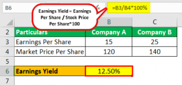

Financial ratio investment calculation serves as a foundational tool for investors analyzing potential investments. Among these ratios, earnings yield is particularly significant. Earnings yield is a measure of the return on an investment relative to the price paid, calculated as the earnings per share (EPS) divided by the current share price. This ratio allows investors to assess how much they earn from each dollar invested in the stock, providing a straightforward metric to evaluate investment opportunities.

In the modern financial landscape, financial ratios are indispensable tools used by investors and analysts to interpret the financial statements of companies. Such ratios offer a lens through which the financial health, profitability, and potential growth of a business can be assessed. Earnings yield, for instance, can offer insight into whether a stock is undervalued or overvalued. A higher earnings yield suggests a potentially undervalued stock or higher earning potential, which can influence the investment decision-making process.



Algorithmic trading has revolutionized the way financial markets operate, offering the capacity to process large datasets and execute trades at speeds surpassing human capability. Financial ratios, including earnings yield, are integral to these algorithmic trading strategies. By automating the analysis of these financial metrics, trading algorithms can swiftly screen and execute trades based on predefined financial criteria. Incorporating earnings yield into algorithmic trading models allows these systems to filter for stocks that exhibit desirable financial characteristics, thereby optimizing the selection of high-potential investment opportunities.

In summary, financial ratios, particularly earnings yield, are crucial in driving investment strategies and decisions, especially within algorithmic trading platforms. These ratios not only facilitate detailed evaluations of a company’s worth but also provide a systematic means of selecting investments through automated trading systems. As financial markets continue to evolve, the integration of tools like earnings yield into algorithmic trading strategies is likely to become increasingly sophisticated, offering both challenges and opportunities for investors and traders.

## Table of Contents

## Understanding Financial Ratios and Investment Calculations

Financial ratios are quantitative tools that play a crucial role in analyzing a company's financial statements, offering insights into its operational efficiency, liquidity, profitability, and solvency. Among the key financial ratios is the earnings yield, which is particularly valuable for assessing the potential return on investment from a company's earnings relative to its share price.

### Key Financial Ratios

1. **Earnings Yield**: 
   The earnings yield is calculated by dividing the Earnings Per Share (EPS) by the share price. It is expressed as a percentage and offers an indication of the income a shareholder can expect from an investment in a company's stock. The formula is:
$$
   \text{Earnings Yield} = \left( \frac{\text{EPS}}{\text{Share Price}} \right) \times 100

$$

2. **Price to Earnings (P/E) Ratio**: 
   This ratio provides insights into how much investors are willing to pay per dollar of earnings. It is the inverse of the earnings yield, calculated by dividing the share price by the earnings per share (EPS):
$$
   \text{P/E Ratio} = \frac{\text{Share Price}}{\text{EPS}}

$$

3. **Debt to Equity Ratio**: 
   This ratio shows the relative proportions of shareholders' equity and debt used to finance a company's assets. It is a critical measure of financial leverage and risk.
$$
   \text{Debt to Equity Ratio} = \frac{\text{Total Liabilities}}{\text{Shareholders' Equity}}

$$

4. **Return on Equity (ROE)**:
   ROE indicates a company's ability to generate profits from shareholders' equity. It is calculated by dividing net income by shareholders' equity.
$$
   \text{ROE} = \frac{\text{Net Income}}{\text{Shareholders' Equity}}

$$

5. **Current Ratio**: 
   This [liquidity](/wiki/liquidity-risk-premium) ratio measures a company's ability to cover its short-term obligations with its short-term assets. A higher ratio indicates greater short-term financial health.
$$
   \text{Current Ratio} = \frac{\text{Current Assets}}{\text{Current Liabilities}}

$$

### Importance of Financial Ratios

Financial ratios are vital in determining a company's financial health and investment attractiveness. By providing a standardized method for viewing a company's operational efficiency, liquidity, profitability, and solvency, these ratios enable investors, analysts, and managers to make well-informed decisions. They also help in comparing companies within the same industry.

- **Assessing Financial Health**: Ratios like the current ratio and debt to equity ratio provide insights into a company's liquidity and financial risk.
- **Investment Decisions**: The earnings yield and P/E ratio assist in evaluating if a stock is undervalued or overvalued. A higher earnings yield may suggest a better investment opportunity if the company's fundamentals are strong.

### Common Financial Ratio Benchmarks

Benchmarks serve as points of reference for evaluating financial ratios. They can be derived from industry averages, historical performance, or predetermined standards.

- **P/E Ratio Benchmark**: Typically, a P/E below the industry average may indicate a stock is undervalued, whereas a higher P/E suggests overvaluation.
- **Earnings Yield Benchmark**: A higher earnings yield compared to bond yields or the industry average might indicate a potentially attractive investment.
- **Current Ratio Benchmark**: A current ratio above 1 generally indicates good short-term financial health, signaling that the company can meet debt obligations as they arise.

In market analysis, these benchmarks allow for the identification of trends and the development of strategies tailored to specific financial environments. As such, understanding and utilizing these financial ratios and benchmarks are foundational for effective investment analysis and decision-making processes.

## Earnings Yield Explained

Earnings yield is a crucial financial ratio used to evaluate a stock's return relative to its price. It is calculated as the earnings per share (EPS) divided by the share price, represented mathematically as:

$$
\text{Earnings Yield} = \frac{\text{Earnings per Share (EPS)}}{\text{Share Price}}
$$

This ratio provides a percentage that indicates how much a company earns relative to its stock price. For investors, a higher earnings yield suggests a potentially undervalued stock or a profitable investment opportunity, as it reflects more earnings for each dollar invested.

The earnings yield has an inverse relationship with the price-to-earnings (P/E) ratio, another widely used metric for investment analysis. While the P/E ratio determines how much investors are willing to pay for each dollar of earnings, the earnings yield provides a direct measure of potential returns. The formula for P/E ratio is:

$$
\text{P/E Ratio} = \frac{\text{Share Price}}{\text{Earnings per Share (EPS)}}
$$

The inverse relationship between these two ratios is expressed as:

$$
\text{Earnings Yield} = \frac{1}{\text{P/E Ratio}}
$$

This inverse relationship signifies that as the P/E ratio decreases, the earnings yield increases, suggesting the stock might be undervalued and vice versa. Therefore, a low P/E ratio (high earnings yield) often attracts investors looking for good value stocks.

Practical applications of earnings yield are extensive in evaluating stock prices and identifying investment opportunities. Investors often use earnings yield to compare returns from stocks with returns from fixed-income securities, such as bonds. By comparing these yields, investors can decide whether stocks offer a reasonable return relative to their risks compared to other investments.

Moreover, in screening for potential investments, earnings yield can highlight stocks that are likely to provide better returns compared to their peers. For instance, by targeting stocks with higher earnings yield, investors might identify undervalued companies poised for growth or those that are overlooked by the market. Consequently, earnings yield becomes a pivotal tool for value investors aiming to uncover hidden gems within the stock market.

## Algorithmic Trading and its Impact on Financial Ratios

Algorithmic trading, often referred to as algo trading or automated trading, utilizes computer algorithms to execute trades based on predefined criteria. Its influence in financial markets has grown significantly, driven by the need for speed, precision, and the ability to process large volumes of data rapidly. Algorithms can analyze various market conditions and execute orders within milliseconds, a feat unachievable by human traders alone.

One of the critical aspects of [algorithmic trading](/wiki/algorithmic-trading) is the incorporation of financial ratios, such as the earnings yield, to optimize trading strategies. Earnings yield, which is calculated as the Earnings per Share (EPS) divided by the share price, provides a measure of the return on investment relative to the price paid for a stock. By analyzing this yield, algorithms can assess the attractiveness of a stock compared to its current market price, enabling more informed trading decisions.

The integration of earnings yield into algorithmic trading models offers several advantages. First, it allows for the creation of systematic trading strategies that operate based on quantitative data rather than emotional or speculative factors. For instance, algorithms can be programmed to screen for stocks with high earnings yields, identifying potentially undervalued stocks for investment. This systematic approach not only increases the efficiency and effectiveness of trading strategies but also reduces human error and biases.

Moreover, the use of financial ratios like earnings yield can enhance risk management strategies. Algorithms can continuously monitor earnings yield alongside other financial indicators, adjusting their trading strategies in real-time as market conditions change. This dynamic adjustment capability ensures that trading strategies remain aligned with current market realities, optimizing portfolio performance and mitigating risks.

In practical application, algorithms can leverage earnings yield in a variety of trading strategies. For example, a common strategy might involve executing trades only when a stock's earnings yield meets or exceeds a predetermined threshold, which signals favorable investment conditions. Additionally, algorithms can pair stocks with differing yields to maintain diversified portfolios that balance risk with return potential.

In conclusion, algorithmic trading, by incorporating financial ratios like earnings yield, enhances the decision-making process and provides a robust framework for executing trades. This integration not only supports better investment decisions but also allows traders to capitalize on market opportunities with precision and speed. As algorithmic trading technology continues to evolve, its capacity to incorporate complex financial analyses, including earnings yield, will become increasingly sophisticated, further solidifying its role in modern financial markets.

## Utilizing Earnings Yield in Algorithmic Trading Strategies

Earnings yield is a crucial financial ratio that serves as a versatile tool in algorithmic trading strategies. It is calculated by taking the Earnings per Share (EPS) and dividing it by the current share price. This ratio is used to evaluate a company's profitability relative to its stock price, providing a quick snapshot of the potential return on investment. In algorithmic trading, the integration of earnings yield can be done through various strategies, enhancing decision-making processes and optimizing trading performance.

**Screening for Undervalued Stocks**

One algorithmic strategy that incorporates earnings yield involves screening for undervalued stocks. Trading algorithms can be programmed to scan a universe of stocks, identify those with a high earnings yield, and flag them as potential investment opportunities. This approach assumes that stocks with a higher earnings yield may be undervalued by the market and thus present a buying opportunity. A simple Python script using a library like pandas can facilitate this process:

```python
import pandas as pd

# Sample data: stock information with EPS and current price
data = {
    'stock': ['A', 'B', 'C', 'D'],
    'eps': [5.0, 2.0, 3.0, 4.0],
    'price': [50.0, 20.0, 45.0, 60.0]
}

# Convert data to DataFrame
df = pd.DataFrame(data)

# Calculate earnings yield
df['earnings_yield'] = df['eps'] / df['price']

# Filter stocks with high earnings yield
high_earnings_yield_stocks = df[df['earnings_yield'] > 0.1]  # threshold of 10%
print(high_earnings_yield_stocks)
```

**Pairing High-Yield Stocks with Low-Yield Alternatives**

Another strategy is to pair high-yield stocks with low-yield alternatives to create a hedged position. This strategy involves going long on stocks with high earnings yields and shorting those with low yields, based on the hypothesis that the market will eventually correct the valuation disparity. Such strategies can mitigate risk and exploit pricing inefficiencies in the market. This approach can be particularly effective in volatile market conditions, where asset prices often diverge from intrinsic values.

**Building Robust, Data-Driven Trading Systems**

Earnings yield plays a pivotal role in constructing robust, data-driven trading systems. By using earnings yield as a core component of the strategy, traders can filter out noise and focus on fundamental value indicators. This effect is amplified when earnings yield is combined with other financial metrics, such as return on equity or debt-to-equity ratios, to create multi-[factor](/wiki/factor-investing) models that can guide more informed trading decisions.

Algorithmic systems equipped with such analytical depth are better positioned to navigate diverse market conditions, identifying profitable trades based on quantifiable financial health instead of speculative criteria. Consequently, incorporating earnings yield in algorithmic models not only fortifies the analytical framework but also enhances the potential for achieving superior risk-adjusted returns in financial markets.

## Real-World Applications and Case Studies

The application of earnings yield in investment decision-making has been well-documented, with practical examples illustrating its effectiveness. Earnings yield, calculated as Earnings per Share (EPS) divided by Share Price, serves as a crucial financial ratio in assessing the return on investment relative to the price of stocks. One notable case study is the strategy employed by a quantitative research firm that successfully used earnings yield to outperform market benchmarks during a period of [volatility](/wiki/volatility-trading-strategies). By prioritizing high earnings yield stocks, the firm capitalized on undervalued opportunities, resulting in a portfolio that demonstrated superior risk-adjusted returns.

In recent years, algorithmic trading platforms such as QuantConnect and Alpaca have increasingly leveraged the earnings yield within their frameworks to enhance trading models. These platforms allow developers to design and test algorithms that systematically implement earnings yield criteria for stock selection. For instance, QuantConnect, known for its open-source algorithmic trading environment, enables users to incorporate earnings yield filters in their stock screening processes. This capability facilitates the identification of potentially undervalued stocks that may offer higher returns relative to their market price.

Python code in QuantConnect, for example, might include:

```python
class EarningsYieldAlgorithm(QCAlgorithm):
    def Initialize(self):
        self.SetStartDate(2020, 1, 1)
        self.SetCash(100000)
        self.AddEquity("AAPL", Resolution.Daily)

    def OnData(self, data):
        if "AAPL" not in data.Bars:
            return

        # Calculate earnings yield
        eps = self.GetEPS("AAPL")
        price = data["AAPL"].Close
        earnings_yield = eps / price

        # Check if earnings yield meets criteria
        if earnings_yield > 0.05:  # Threshold for good earnings yield
            self.SetHoldings("AAPL", 1)
        else:
            self.Liquidate("AAPL")
```

In a similar vein, Alpaca provides a commission-free trading platform where users can integrate earnings yield metrics into their trading strategies. Through its API, users are able to automate trades by selecting securities with favorable earnings yields, thus enhancing investment returns by targeting stocks that offer better value prospects.

The application of earnings yield-driven strategies has proven advantageous not only during periods of market stability but also amid turbulent market conditions. By selecting stocks with high earnings yields, investors can achieve a cushion against market downturns as such stocks are often undervalued, thereby minimizing potential losses. In practice, earnings yield-driven strategies have shown to bolster portfolio performance by balancing potential returns against the inherent risk of investments.

Overall, the adoption of earnings yield in algorithmic frameworks like those of QuantConnect and Alpaca underscores its significance in contemporary trading strategies. These platforms exemplify how the integration of financial ratios like earnings yield can lead to data-driven investment decisions that enhance portfolio performance across diverse market scenarios.

## Conclusion: The Future of Financial Ratios in Algorithmic Trading

Financial ratios, such as earnings yield, have become instrumental in enhancing algorithmic trading performance by providing actionable insights into a company’s financial health. The earnings yield, calculated as Earnings per Share (EPS) divided by Share Price, offers a measure akin to an [interest rate](/wiki/interest-rate-trading-strategies) or yield in the fixed income market, thereby allowing traders to quickly gauge the investment potential of a stock. This ratio is inversely related to the Price-to-Earnings (P/E) ratio and serves as a vital tool in identifying undervalued stocks in the market.

The integration of financial ratio analysis with algorithmic trading technology is expected to evolve substantially. With advancements in [machine learning](/wiki/machine-learning) and [artificial intelligence](/wiki/ai-artificial-intelligence), algorithms will likely become adept at processing vast datasets, incorporating real-time financial ratios, and adjusting trading strategies dynamically. This evolution may lead to an increased use of complex algorithms that not only consider earnings yield but also synergize it with other financial indicators to enhance prediction accuracy and optimize returns.

For investors and traders, understanding and utilizing earnings yield and similar financial ratios is paramount. These ratios offer a quantitative foundation that complements technical analysis and market sentiment, providing a comprehensive approach to investment decision-making. As algorithmic trading platforms continue to grow in accessibility and sophistication, applying financial ratio analysis could lead to more informed strategies, particularly in identifying opportunities in undervalued or high-yield stocks. Investors are encouraged to incorporate these financial insights into their trading models to harness the full potential of algorithmic trading and improve portfolio performance across varying market conditions.

## References

1. **Investopedia**: A comprehensive guide on earnings yield and its significance in financial analysis. It covers calculation formulas and the implications of using earnings yield for evaluating stocks. Accessible at: [Investopedia - Earnings Yield](https://www.investopedia.com/terms/e/earningsyield.asp).

2. **"Algorithmic Trading and DMA" by Barry Johnson**: This book provides a detailed overview of algorithmic trading, including how financial ratios like earnings yield can be incorporated into various trading strategies.

3. **"Financial Statement Analysis" by Martin Fridson and Fernando Alvarez**: A deep dive into different financial ratios, including earnings yield, and their role in assessing a company’s financial health.

4. **QuantConnect Documentation**: An online platform offering resources and tools for algorithmic trading. This includes examples of how to apply earnings yield in trading algorithms. Visit: [QuantConnect](https://www.quantconnect.com/docs).

5. **Alpaca**: A commission-free trading platform with an API for algorithmic trading. It supports developing strategies using financial ratios such as earnings yield. More information can be found at: [Alpaca](https://alpaca.markets/).

6. **Journal of Financial Markets**: Includes several case studies and research articles on the use of financial ratios in algorithmic trading and their effect on market dynamics.

7. **Khan Academy - Financial Ratios**: Free resources explaining financial ratios, their calculations, and implications. This includes a segment on earnings yield available at: [Khan Academy - Financial Ratios](https://www.khanacademy.org/college-careers-more/financial-literacy).

8. **Python for Finance: Analyze Big Financial Data by Yves Hilpisch**: A resource that provides practical examples of using Python for financial analysis and algorithmic trading, including modules that can analyze earnings yield.

## References & Further Reading

[1]: ["Earnings Yield Definition"](https://www.investopedia.com/terms/e/earningsyield.asp), Investopedia.

[2]: Johnson, B. (2010). ["Algorithmic Trading and DMA: An Introduction to Direct Access Trading Strategies"](https://archive.org/details/algorithmictradi0000john). 4Myeloma Press.

[3]: Fridson, M. & Alvarez, F. (2011). ["Financial Statement Analysis: A Practitioner's Guide"](https://onlinelibrary.wiley.com/doi/book/10.1002/9781119457176). Wiley.

[4]: ["QuantConnect Documentation"](https://www.quantconnect.com/docs/v2/), QuantConnect.

[5]: ["API Documentation"](https://www.postman.com/api-platform/api-documentation/), Alpaca Markets.

[6]: ["Journal of Financial Markets"](https://www.sciencedirect.com/journal/journal-of-financial-markets), Elsevier.

[7]: ["Financial Ratios"](https://corporatefinanceinstitute.com/resources/accounting/financial-ratios/), Khan Academy.

[8]: Hilpisch, Y. (2018). ["Python for Finance: Analyze Big Financial Data"](https://www.amazon.com/Python-Finance-Analyze-Financial-Data/dp/1491945281). O'Reilly Media.