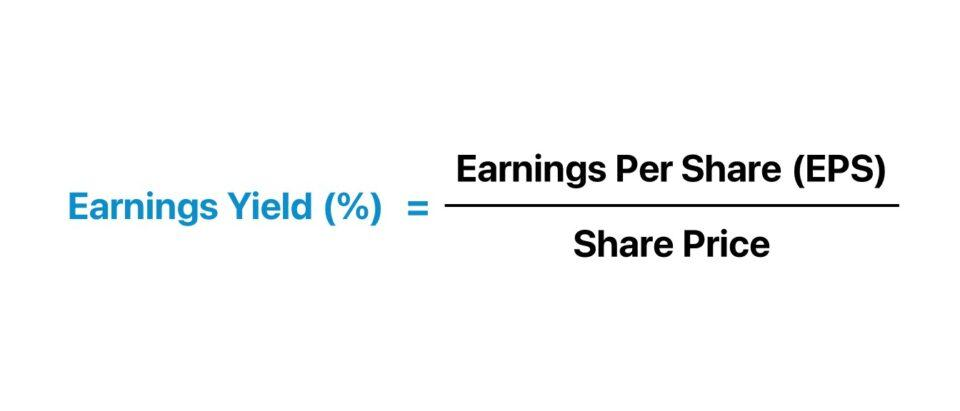

## Table of Contents

## What is earnings yield and how is it calculated?

Earnings yield is a way to measure how much money a company makes compared to its stock price. It tells investors how much they earn for each dollar they invest in the company's stock. To find the earnings yield, you take the company's earnings per share and divide it by the current stock price. Then, you multiply the result by 100 to get a percentage. This percentage shows the return on investment from the company's earnings.

Earnings yield is useful because it helps investors compare different investment options. For example, if a company has an earnings yield of 5%, it means that for every dollar invested, the investor gets 5 cents in earnings. This can be compared to other investments like bonds or other stocks. If the earnings yield is higher than the yield from other investments, it might be a good choice. But, it's important to look at other factors too, like the company's growth and risk, before deciding to invest.

## How does earnings yield differ from other financial ratios like P/E ratio?

Earnings yield and the P/E (price-to-earnings) ratio are two different ways to look at a company's stock, but they are closely related. Earnings yield is calculated by dividing the earnings per share by the stock price and then turning it into a percentage. It shows how much money you earn for every dollar you invest in the stock. On the other hand, the P/E ratio is found by dividing the stock price by the earnings per share. It tells you how much you are paying for each dollar of the company's earnings. So, earnings yield is like the opposite of the P/E ratio. If you take the P/E ratio and divide 1 by it, you get the earnings yield.

These two ratios can give you different insights into a company's value. The P/E ratio is often used to see if a stock is priced too high or too low compared to its earnings. A high P/E might mean the stock is expensive, while a low P/E could mean it's a good deal. Earnings yield, however, helps you compare the return from the stock to other investments like bonds. If the earnings yield is higher than what you can get from a bond, the stock might be a better choice. Both ratios are useful, but they help answer different questions about the value and potential return of a stock.

## Why is earnings yield important for investors?

Earnings yield is important for investors because it shows how much money they can earn from a company's stock compared to what they pay for it. It's like a quick way to see if a stock is a good deal. If the earnings yield is high, it means the stock might give you more money back for each dollar you spend on it. This can help investors decide if a stock is worth buying, especially when they are looking at different investment options like bonds or other stocks.

Investors also use earnings yield to compare the return from stocks to other types of investments. For example, if a stock has an earnings yield of 5%, and a bond gives you a 3% return, the stock might be a better choice if you're looking for higher earnings. But, it's not just about the numbers. Investors need to think about other things too, like how safe the investment is and if the company is likely to grow. Earnings yield is a helpful tool, but it's one part of a bigger picture when making investment choices.

## Can you explain the relationship between earnings yield and stock prices?

Earnings yield and stock prices have an inverse relationship. This means that when the stock price goes up, the earnings yield goes down. It's like a seesaw: if one side goes up, the other side goes down. Earnings yield is calculated by dividing the earnings per share by the stock price. So, if the stock price gets higher, the earnings yield gets smaller because you're dividing by a bigger number.

This relationship is important for investors because it helps them understand how much they are getting back for their investment. If the stock price is low, the earnings yield will be high, which might mean the stock is a good deal. But if the stock price is high, the earnings yield will be low, and the stock might not be as good of a deal. Investors use this information to decide if a stock is worth buying or if they should look for other investments that might give them a better return.

## How can earnings yield be used to compare different investment options?

Earnings yield is a helpful tool for comparing different investment options like stocks and bonds. It tells you how much money you get back for each dollar you invest in a stock. For example, if a stock has an earnings yield of 5%, that means for every dollar you put into the stock, you get 5 cents back in earnings. This is useful when you want to see if a stock is a better deal than other investments. If a bond gives you a 3% return, and a stock has a 5% earnings yield, the stock might be a better choice if you're looking for a higher return.

But, earnings yield is just one piece of the puzzle. When comparing investments, you also need to think about other things like how safe the investment is and if the company is likely to grow. A high earnings yield might look good, but if the company is risky or not growing, it might not be the best choice. So, while earnings yield can help you see which investment might give you more money back, it's important to look at the whole picture before making a decision.

## What are the limitations of using earnings yield as an investment metric?

Using earnings yield as an investment metric has some limitations. One big problem is that it only looks at the past earnings of a company. It doesn't tell you if the company will keep making the same amount of money in the future. If a company's earnings go down, the earnings yield might not be a good guide anymore. Also, earnings yield doesn't think about how risky the company is. A high earnings yield might look good, but if the company is risky, it might not be a safe investment.

Another limitation is that earnings yield doesn't consider other important things like how fast the company is growing or how much money it has to pay back loans. If a company is growing quickly, it might be worth more than what the earnings yield shows. And if a company has a lot of debt, it might be riskier than the earnings yield suggests. So, while earnings yield can help you compare different investments, it's not the only thing you should look at when deciding where to put your money.

## How does earnings yield relate to the concept of return on investment (ROI)?

Earnings yield and return on investment (ROI) both help investors see how much money they can get back from their investments, but they look at it in different ways. Earnings yield is like a quick snapshot of what you earn from a company's stock right now. It tells you how much money you get back for every dollar you spend on the stock. For example, if a stock has an earnings yield of 5%, that means for every dollar you invest, you get 5 cents back in earnings. It's a useful number to compare the return from a stock to other investments like bonds.

ROI, on the other hand, is a broader measure that looks at the total gain or loss from an investment over time. It takes into account not just the earnings, but also any changes in the stock's price and any dividends you might get. ROI gives you a full picture of how much money you made or lost from your investment. While earnings yield is a good starting point for comparing different investments, ROI is more complete because it shows the actual return you got over the time you held the investment. Both are important, but they help answer different questions about your investment's performance.

## What role does earnings yield play in value investing strategies?

Earnings yield is a key tool in value investing because it helps investors find stocks that might be a good deal. Value investors look for companies that are priced lower than what their earnings suggest they should be. Earnings yield shows how much money you get back for each dollar you spend on a stock. If the earnings yield is high, it means the stock might be undervalued, which is what value investors like to see. They use earnings yield to compare different stocks and find ones that offer a higher return on their investment compared to the stock's price.

However, earnings yield is just one part of a value investor's toolkit. While a high earnings yield can point to a good investment, value investors also look at other things like the company's growth, how much debt it has, and its overall financial health. Earnings yield helps them make quick comparisons, but they need to do more research to make sure the stock is really a good value. By using earnings yield along with other measures, value investors can find stocks that are not only cheap but also have the potential to grow and provide a good return over time.

## How can changes in earnings yield signal market trends or economic conditions?

Changes in earnings yield can tell us a lot about what's happening in the stock market and the economy. When earnings yield goes up, it usually means stock prices are going down, or companies are making more money. This can be a sign that people are worried about the economy and are selling their stocks, making prices fall. Or it could mean that companies are doing really well and making more money than before. Either way, a rising earnings yield might show that the market is getting cheaper, which could be a good time for investors to buy stocks.

On the other hand, when earnings yield goes down, it often means stock prices are going up, or companies are making less money. This can happen when people feel good about the economy and are buying more stocks, pushing prices higher. Or it could mean that companies are not doing as well as before. A falling earnings yield might show that the market is getting more expensive, which could be a sign for investors to be careful or look for other investments. By watching how earnings yield changes, investors can get clues about where the market and the economy might be headed.

## What are some advanced methods for adjusting earnings yield to account for growth and risk?

To make earnings yield more useful, investors can adjust it to think about how fast a company is growing and how risky it is. One way to do this is by looking at the PEG ratio, which stands for Price/Earnings to Growth ratio. The PEG ratio takes the P/E ratio, which is kind of the opposite of earnings yield, and divides it by the company's expected growth rate. A low PEG ratio might mean the stock is a good deal because it's growing fast compared to its price. By using the PEG ratio, you can see if a high earnings yield is because the company is cheap or because it's growing a lot.

Another way to adjust earnings yield is to think about risk. One way to do this is by using the risk-adjusted earnings yield. This means you look at how risky the company is and change the earnings yield to make it lower if the company is risky. For example, if a company has a lot of debt or is in a business that goes up and down a lot, you might lower its earnings yield to show that it's riskier. By doing this, you get a better idea of what the real return might be after thinking about how safe the investment is. Both of these methods help investors get a clearer picture of whether a stock is a good buy when thinking about growth and risk.

## How do different sectors typically perform in terms of earnings yield, and why?

Different sectors can have very different earnings yields because of how they work and how much money they make. Sectors like utilities and consumer staples often have lower earnings yields. This is because they are seen as safe and stable, so people are willing to pay more for their stocks. These companies usually make a steady amount of money, but they don't grow very fast. On the other hand, sectors like technology and biotech can have higher earnings yields. These sectors are seen as riskier because they can go up and down a lot, and they might not make money right away. But if they do well, they can grow very fast, which can make their stocks more attractive to investors looking for big returns.

The reason why earnings yields differ across sectors also has to do with how much money companies need to grow. For example, tech companies often need a lot of money to keep growing and coming up with new ideas. This can make their earnings look smaller compared to their stock prices, leading to higher earnings yields. On the other hand, companies in sectors like utilities might not need as much money to keep going, so their earnings might look bigger compared to their stock prices, leading to lower earnings yields. By understanding these differences, investors can see why some sectors might be a better fit for them based on how much risk they want to take and how much growth they are looking for.

## Can you discuss historical data on earnings yield and its predictive power for market performance?

Looking at past data, earnings yield has been a helpful tool for guessing how the stock market might do in the future. When earnings yields are high, it often means that stocks are cheaper compared to how much money companies are making. This can be a good sign for investors because it might mean that stocks will go up in price later. For example, if the earnings yield is high and then goes down over time, it could mean that stock prices are going up because people are buying more stocks. Studies have shown that when earnings yields are high, the stock market often does well in the next few years.

However, earnings yield is not perfect at predicting the future. Sometimes, other things like how fast the economy is growing, what the government is doing with interest rates, and even big events like wars or pandemics can change how the market does. So, while earnings yield can give you a good idea of what might happen, it's important to look at other things too. By using earnings yield along with other information, investors can make better guesses about where the market might be headed.

## What is Understanding Earnings Yield?

Earnings yield is a crucial financial metric used to assess the attractiveness of a stock by comparing its earnings to its current market price. The calculation of earnings yield is relatively straightforward: it is the inverse of the price-to-earnings (P/E) ratio. Mathematically, earnings yield is expressed as:

$$
\text{Earnings Yield} = \frac{\text{Earnings Per Share (EPS)}}{\text{Market Price Per Share}} \times 100\%
$$

or, equivalently, 

$$
\text{Earnings Yield} = \frac{1}{\text{P/E Ratio}}
$$

Understanding the inverse relationship between earnings yield and the P/E ratio is essential for investors. While the P/E ratio calculates how much investors are willing to pay per dollar of earnings, earnings yield expresses the percentage return expected from earnings at the current stock price. Thus, a high earnings yield indicates a potentially undervalued stock, whereas a low earnings yield could suggest an overvalued stock.

The earnings yield is a vital tool for assessing stock valuation and potential investment returns. Investors and analysts use this metric to evaluate whether stocks are priced appropriately relative to their earnings potential. For instance, a company with an earnings yield significantly higher than the industry average might be undervalued, suggesting a good investment opportunity. Conversely, a company with a lower earnings yield compared to its peers may be overvalued, cautioning investors to exercise due diligence.

For example, consider a company with an EPS of $5 and a current stock price of $50. The earnings yield would be:

$$
\text{Earnings Yield} = \frac{5}{50} \times 100\% = 10\%
$$

If another company in the same industry has an earnings yield of 5%, this could imply that the first company might be undervalued, thereby presenting a more lucrative investment opportunity. However, it is essential to consider the broader context, such as industry trends and economic conditions, when interpreting earnings yield figures.

In summary, earnings yield is a fundamental metric for investors aiming to identify undervalued stocks and optimize their investment decisions. By comparing earnings yield with industry benchmarks and historical data, investors can make informed assessments about the potential returns and risks associated with a particular stock.

## What is the importance of earnings yield in financial analysis?

Earnings yield is a vital metric in assessing stock valuation and financial risk, serving as a cornerstone in financial analysis. This ratio is calculated as the inverse of the price-to-earnings (P/E) ratio and is expressed as a percentage. It provides an efficient way to compare the earnings power of a stock relative to its price, offering a clear perspective on a company's profitability. The formula for earnings yield is:

$$
\text{Earnings Yield} = \frac{\text{Earnings Per Share (EPS)}}{\text{Market Price per Share}} \times 100\%
$$

### Role in Stock and Fixed-Income Comparison

Earnings yield is particularly useful when comparing stocks within the same sector or against fixed-income securities. By providing an earnings return perspective, earnings yield offers insights into whether a stock is undervalued compared to others in the same industry. This comparison is crucial as it aids investors in selecting stocks based on their relative attractiveness from a profitability standpoint.

For instance, if Stock A has an earnings yield of 7% and Stock B, within the same sector, has an earnings yield of 4%, Stock A might be deemed a better investment opportunity if all else is equal. This type of analysis is essential for equity investors who also weigh opportunities against more conservative investments such as bonds or other fixed-income securities. In these comparisons, a higher earnings yield might suggest that the stock offers better returns relative to fixed-income securities, pending consideration of risk factors.

### Indicator of Profitability

Earnings yield acts as a straightforward indicator of a company's profitability in relation to its stock price. A higher earnings yield not only indicates that a stock might be undervalued but also that the company's earnings are robust relative to the current market valuation. This characteristic makes earnings yield an essential tool for investors who prioritize profitability when evaluating investments.

Let’s consider an example where a company's stock is trading at $50 with an EPS of $5. The earnings yield is:

$$
\text{Earnings Yield} = \frac{5}{50} \times 100\% = 10\%
$$

If another company in the same sector has a lower earnings yield, it may suggest the first company is more profitable relative to its share price.

### Identifying High Return Opportunities

One of the critical benefits of utilizing earnings yield is its capacity to identify investment opportunities with potentially higher returns. It enhances decision-making by highlighting stocks that provide substantial earnings relative to price, suggesting better risk-adjusted returns. In an investment environment increasingly focused on value, earnings yield helps isolate opportunities where the market may have underestimated a company's [earning](/wiki/earning-announcement) potential.

By integrating earnings yield into their analysis, investors can better navigate the complexities of financial risk and valuation, making informed decisions that align with their financial goals. This perspective not only applies to traditional stock investments but also enriches the portfolio evaluation process by offering a quantitative measure of profit potential, particularly in a diversified portfolio that includes various asset classes.

## What is the conclusion?

The earnings yield, as explored in this article, is a vital financial metric, playing a significant role in both traditional and algorithmic trading landscapes. By offering a measure of a company's earnings relative to its share price, earnings yield provides an accessible way for investors to evaluate potential investment opportunities. It is calculated using the formula:  

$$
\text{Earnings Yield} = \frac{\text{Earnings Per Share (EPS)}}{\text{Share Price}}
$$

This yield has been highlighted for its capacity to signal undervalued stocks, thereby assisting investors in making informed decisions. Its significance extends beyond traditional applications, proving to be a powerful tool when integrated into algorithmic trading strategies. By incorporating earnings yield, traders can refine algorithmic models to better assess stock valuations and enhance predictions of market movements.

Moreover, the practical applications of earnings yield within algorithmic trading platforms, such as QuantConnect and Kensho Technologies, illustrate its effectiveness in real-world scenarios. These platforms demonstrate how earnings yield, when paired with advanced technologies like machine learning, can lead to sophisticated and effective trading strategies.  

As we look to the future, the integration of earnings yield with cutting-edge trading technologies and analytics is poised to expand. Machine learning models, data analytics, and other technological advancements are likely to provide further opportunities to leverage earnings yield in predicting market trends and optimizing investment portfolios. As such, continued exploration and adoption of earnings yield as part of a comprehensive trading framework is encouraged. Its potential to enhance decision-making processes and improve financial returns makes it an indispensable component for traders and investors aiming to optimize their strategies in the evolving financial landscape.

## References & Further Reading

[1]: ["Quantitative Equity Investing: Techniques and Strategies"](https://www.wiley.com/en-us/Quantitative+Equity+Investing%3A+Techniques+and+Strategies-p-9780470617526) by Frank J. Fabozzi, Huusun Kim, and Sergio M. Focardi

[2]: ["Advances in Financial Machine Learning"](https://www.amazon.com/Advances-Financial-Machine-Learning-Marcos/dp/1119482089) by Marcos Lopez de Prado

[3]: Pinkowitz, L., & Williamson, R. (2004). ["What is the Market Value of a Dollar of Earnings?"](https://www.quantcorpfin.com/wp-content/uploads/2019/11/MV-of-cash-Pinkowitz-and-Williamson-2002.pdf) The role of marketability and reputation. 

[4]: ["Quantitative Trading Systems"](https://www.investopedia.com/terms/q/quantitative-trading.asp) by Howard B. Bandy

[5]: Chan, E. (2009). ["Quantitative Trading: How to Build Your Own Algorithmic Trading Business"](https://github.com/ftvision/quant_trading_echan_book)

[6]: ["Machine Learning for Algorithmic Trading: Predictive Models to Extract Signals from Market and Alternative Data for Systematic Trading Strategies with Python"](https://github.com/stefan-jansen/machine-learning-for-trading) by Stefan Jansen

[7]: Fama, E. F., & French, K. R. (1992). ["The Cross-Section of Expected Stock Returns."](https://onlinelibrary.wiley.com/doi/full/10.1111/j.1540-6261.1992.tb04398.x) The Journal of Finance, 47(2), 427-465.