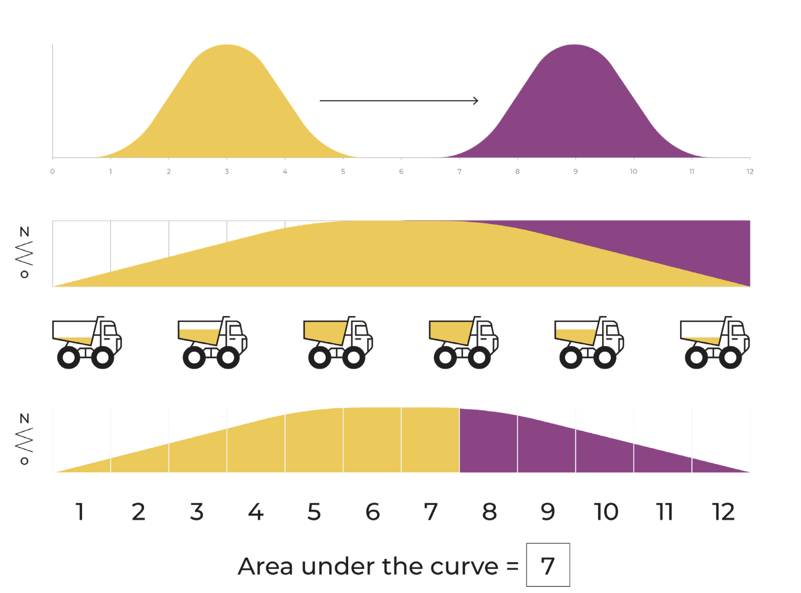

## Table of Contents

## What is Earth Mover's Distance (EMD) in the context of machine learning?

Earth Mover's Distance (EMD) is a way to measure how different two groups of things are. Imagine you have two piles of dirt, and you want to move one pile to match the other pile exactly. The EMD tells you the least amount of work needed to move the dirt from one pile to the other. In machine learning, this idea helps compare things like images or groups of data. Instead of dirt, you're moving "probability mass" from one group to another, and the distance tells you how similar or different the groups are.

For example, if you have two pictures and want to see how similar they are, you can use EMD to figure out how much you need to change one picture to make it look like the other. This can be useful in tasks like searching for similar images or recognizing patterns in data. The math behind EMD can be a bit complex, but the basic idea is simple: it measures the effort needed to make two things the same. This makes it a powerful tool in many areas of machine learning where understanding similarity is important.

## How does EMD differ from other distance metrics like Euclidean distance?

Earth Mover's Distance (EMD) and Euclidean distance measure how different two things are, but they do it in different ways. Euclidean distance is like measuring the straight line between two points. If you have two points in space, you can use the Pythagorean theorem to find the shortest distance between them. For example, if you have two points (x1, y1) and (x2, y2), the Euclidean distance is calculated as $$ \sqrt{(x2 - x1)^2 + (y2 - y1)^2} $$. This method works well when comparing things that can be thought of as points in space, like the coordinates of objects.

On the other hand, EMD is more like moving piles of dirt from one place to another. Imagine you have two piles of dirt and you want to move one pile to match the other exactly. EMD calculates the least amount of work needed to do this. It's useful when you're comparing things that can't be easily thought of as points, like groups of data or images. For example, if you're comparing two images, EMD can tell you how much you need to change one image to make it look like the other. This makes EMD a powerful tool for tasks where understanding how to transform one thing into another is important, like in image recognition or data analysis.

In summary, Euclidean distance is great for simple, point-to-point comparisons, while EMD is better suited for more complex comparisons where you need to understand how to move or transform one set of data into another. Both methods have their place in machine learning, depending on what you're trying to measure and compare.

## What are the basic steps to calculate EMD between two distributions?

To calculate Earth Mover's Distance (EMD) between two distributions, you first need to think of each distribution as a pile of dirt. One distribution is the "source" pile, and the other is the "target" pile. Your goal is to move dirt from the source to the target so that the source pile looks exactly like the target pile. The EMD is the least amount of work needed to do this. Work is calculated by multiplying the amount of dirt you move by the distance you move it.

To find the EMD, you set up a problem where you figure out the best way to move the dirt. This is done using a method called linear programming. You need to find the best "flow" of dirt from the source to the target that uses the least amount of work. The formula for EMD can be written as $$ \text{EMD} = \min \sum_{i,j} f_{ij} d_{ij} $$, where \( f_{ij} \) is the amount of dirt moved from the i-th part of the source to the j-th part of the target, and \( d_{ij} \) is the distance between these parts. Once you solve this problem, the minimum value you get is the Earth Mover's Distance between the two distributions.

## Can you explain the concept of 'flow' in EMD?

In Earth Mover's Distance (EMD), the concept of 'flow' is like moving dirt from one pile to another. Imagine you have two piles of dirt, one is the source and the other is the target. The flow is the way you move dirt from the source pile to the target pile so that the source pile ends up looking exactly like the target pile. The goal is to find the best way to move the dirt that uses the least amount of work. Work is calculated by multiplying the amount of dirt you move by the distance you move it.

To find the best flow, you use a method called linear programming. This method helps you figure out how much dirt to move from each part of the source pile to each part of the target pile. The formula for EMD can be written as $$ \text{EMD} = \min \sum_{i,j} f_{ij} d_{ij} $$, where \( f_{ij} \) is the amount of dirt moved from the i-th part of the source to the j-th part of the target, and \( d_{ij} \) is the distance between these parts. Once you solve this problem, the minimum value you get is the Earth Mover's Distance between the two distributions.

## What are some common applications of EMD in machine learning?

Earth Mover's Distance (EMD) is used a lot in machine learning for tasks like comparing images. Imagine you have two pictures and want to know how similar they are. EMD helps by figuring out how much you need to change one picture to make it look like the other. This is useful in image retrieval, where you search for images that look like a given picture, and in image recognition, where computers identify objects in images. By using EMD, these systems can better understand and match images based on their content, not just their pixel values.

Another common use of EMD is in comparing groups of data. If you have two sets of data and want to see how different they are, EMD can help. It's like moving dirt from one pile to another, but instead of dirt, you're moving "probability mass" from one group to the other. This makes EMD useful in tasks like clustering, where you group similar data points together, and in anomaly detection, where you find unusual data points. By using EMD, these tasks can be done more accurately because EMD captures the true differences between the data sets.

EMD is also used in natural language processing (NLP) to compare texts. Imagine you have two pieces of text and want to know how similar they are in meaning. EMD can help by figuring out how much you need to change one text to make it mean the same as the other. This is useful in tasks like text summarization, where you create a shorter version of a text that keeps the main ideas, and in machine translation, where you convert text from one language to another. By using EMD, these systems can better understand and transform text to keep the original meaning intact.

## How is EMD used in image retrieval and comparison?

Earth Mover's Distance (EMD) is a useful tool in image retrieval and comparison because it helps measure how similar two images are. Imagine you have two pictures and want to know how much you need to change one to make it look like the other. EMD does this by treating the images as piles of dirt. It calculates the least amount of work needed to move the "dirt" from one image to match the other. This makes it easier for computers to search for images that look like a given picture or to recognize objects in images by comparing them to known examples.

In image retrieval, EMD helps by figuring out how similar an image is to the ones in a database. When you search for an image, the computer uses EMD to find images that require the least amount of "work" to match your query image. This means the retrieved images are the ones that look the most like the image you're searching for. In image comparison, EMD is used to see how different two images are. It can tell you if two images are very similar or very different, which is helpful in tasks like recognizing patterns or objects in photos. By using EMD, computers can better understand and match images based on their content, not just their pixel values.

## What are the computational challenges associated with calculating EMD?

Calculating Earth Mover's Distance (EMD) can be tough because it takes a lot of computer power. EMD is like trying to move dirt from one pile to another in the best way possible. To find this best way, you use something called linear programming. This means solving a big math problem that looks at all the possible ways to move the dirt and picks the one that needs the least amount of work. The formula for EMD is $$ \text{EMD} = \min \sum_{i,j} f_{ij} d_{ij} $$, where \( f_{ij} \) is how much dirt you move from one spot to another, and \( d_{ij} \) is the distance between those spots. Solving this problem can take a long time, especially if the piles of dirt are big or if there are many different spots to move the dirt to.

Another challenge is that EMD can be slow when you're comparing many images or big sets of data. Imagine you have a lot of pictures and you want to find the one that looks most like your favorite picture. You would need to calculate EMD for each picture, and that can take a lot of time. To make things faster, people sometimes use simpler ways to guess the EMD, but these guesses might not be as accurate. This trade-off between speed and accuracy is something that researchers and engineers need to think about when using EMD in real-world applications.

## How can EMD be approximated to reduce computational complexity?

To make Earth Mover's Distance (EMD) easier to calculate, people often use simpler methods to guess the EMD. These methods are called approximations. One common way is to use something called the "signature" of an image or data set. A signature is like a summary that only keeps the most important parts of the data. By comparing these signatures instead of the whole data, you can get a quick estimate of the EMD. This can be much faster, but the guess might not be as exact as the real EMD.

Another way to approximate EMD is to use a method called the "Sinkhorn algorithm." This algorithm helps find a good way to move the dirt without having to look at all possible ways. It's like finding a shortcut to the best solution. The Sinkhorn algorithm uses a formula $$ \text{EMD} \approx \min \sum_{i,j} f_{ij} (d_{ij} + \epsilon \log f_{ij}) $$, where \( \epsilon \) is a small number that helps make the calculation easier. By using this formula, you can get a close guess of the EMD much faster than the full calculation.

## What role does EMD play in generative adversarial networks (GANs)?

Earth Mover's Distance (EMD) is used in generative adversarial networks (GANs) to help measure how different the generated images are from real images. In GANs, there's a generator that makes fake images and a discriminator that tries to tell if an image is real or fake. EMD helps the discriminator do its job better by figuring out how much you need to change a fake image to make it look like a real one. This is like moving dirt from one pile to another, where the least amount of work needed to move the dirt is the EMD. By using EMD, the GAN can learn to make better fake images that look more like real ones.

One way EMD is used in GANs is in a special kind of GAN called the Wasserstein GAN (WGAN). In WGANs, EMD is used to make the training process more stable. The formula for the loss function in a WGAN is $$ \min_G \max_D \mathbb{E}_{x \sim P_r}[D(x)] - \mathbb{E}_{\tilde{x} \sim P_g}[D(\tilde{x})] $$, where \( P_r \) is the real data distribution, \( P_g \) is the generated data distribution, \( D \) is the discriminator, and \( G \) is the generator. By using EMD, or the Wasserstein distance, the GAN can learn more smoothly and avoid problems like mode collapse, where the generator only makes a few types of images. This makes WGANs a powerful tool for creating realistic images.

## How does EMD contribute to the evaluation of clustering algorithms?

Earth Mover's Distance (EMD) helps evaluate clustering algorithms by measuring how different the clusters are from the ideal groups. Imagine you have a bunch of points and you want to group them into clusters. EMD can tell you how much you need to move these points around to make the clusters match the perfect groups. This is like moving dirt from one pile to another, where the least amount of work needed is the EMD. By using EMD, you can see how well the clustering algorithm did its job. If the EMD is small, it means the clusters are close to the ideal groups, and the algorithm worked well.

In practice, EMD can be used to compare the results of different clustering algorithms. For example, if you have two different ways to group the same set of points, you can use EMD to see which method creates clusters that are more like the ideal groups. The formula for EMD is $$ \text{EMD} = \min \sum_{i,j} f_{ij} d_{ij} $$, where \( f_{ij} \) is how much you move from one point to another, and \( d_{ij} \) is the distance between those points. By calculating EMD for each clustering method, you can pick the one that gives the smallest EMD, meaning it created the best clusters. This makes EMD a useful tool for choosing the best clustering algorithm for your data.

## What are some advanced techniques for optimizing EMD calculations?

To make Earth Mover's Distance (EMD) calculations faster and easier, people use special methods called "approximations." One popular way is to use the "Sinkhorn algorithm." This algorithm helps find a good way to move the dirt without looking at all possible ways. It's like finding a shortcut to the best solution. The Sinkhorn algorithm uses a formula $$ \text{EMD} \approx \min \sum_{i,j} f_{ij} (d_{ij} + \epsilon \log f_{ij}) $$, where \( \epsilon \) is a small number that helps make the calculation easier. By using this formula, you can get a close guess of the EMD much faster than the full calculation.

Another advanced technique is to use "hierarchical clustering" to break down the problem into smaller parts. Imagine you have a big pile of dirt and you want to move it to another big pile. Instead of moving it all at once, you can break it into smaller piles and move them one by one. This can make the calculation easier and faster. By using these methods, you can get good results without spending too much time or computer power.

## How can EMD be integrated into deep learning models for improved performance?

Earth Mover's Distance (EMD) can be used in deep learning models to make them work better, especially in tasks like image generation and comparison. Imagine you have a deep learning model that makes fake images, like in a generative adversarial network (GAN). EMD helps the model by figuring out how much you need to change a fake image to make it look like a real one. This is like moving dirt from one pile to another, where the least amount of work needed to move the dirt is the EMD. By using EMD, the model can learn to make better fake images that look more like real ones. For example, in a Wasserstein GAN (WGAN), the formula for the loss function is $$ \min_G \max_D \mathbb{E}_{x \sim P_r}[D(x)] - \mathbb{E}_{\tilde{x} \sim P_g}[D(\tilde{x})] $$, where \( P_r \) is the real data distribution, \( P_g \) is the generated data distribution, \( D \) is the discriminator, and \( G \) is the generator. Using EMD helps the GAN learn more smoothly and avoid problems like mode collapse, where the generator only makes a few types of images.

Another way EMD can help deep learning models is in tasks like image retrieval and clustering. Imagine you have a bunch of images and you want to find the one that looks most like a given picture. EMD can help by figuring out how similar an image is to the ones in a database. When you search for an image, the model uses EMD to find images that require the least amount of "work" to match your query image. This means the retrieved images are the ones that look the most like the image you're searching for. In clustering, EMD helps by measuring how different the clusters are from the ideal groups. By using EMD, you can see how well the clustering algorithm did its job. If the EMD is small, it means the clusters are close to the ideal groups, and the algorithm worked well.