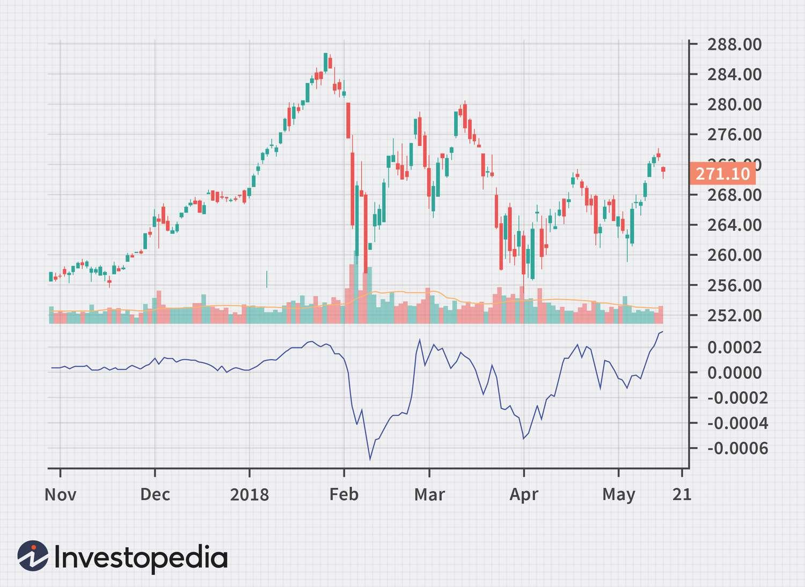

## Table of Contents

## What is the Ease of Movement Indicator?

The Ease of Movement Indicator, often called EMV, is a tool used in trading to see how easy or hard it is for a stock's price to move. It looks at how much the price changes compared to how many shares are traded. If the price goes up easily with fewer shares traded, the EMV will be high, showing that the stock is moving smoothly. If the price needs a lot of shares to move, the EMV will be low, showing that it's harder for the price to change.

Traders use the EMV to spot trends and possible changes in a stock's price. When the EMV line goes above zero, it might mean the stock's price will go up. When it goes below zero, it might mean the price will go down. By watching the EMV, traders can make better guesses about when to buy or sell a stock. It's a helpful tool, but it's best used with other indicators to get a full picture of what's happening in the market.

## Who developed the Ease of Movement Indicator and when?

The Ease of Movement Indicator was created by Richard W. Arms Jr. He came up with this tool in the 1990s. Richard W. Arms Jr. is well-known in the world of trading because he also invented other important indicators like the Arms Index.

Richard W. Arms Jr. wanted to help traders understand how easily a stock's price was moving. He thought that if a stock's price could move a lot with just a few shares being traded, it was moving easily. If it took a lot of shares to move the price, it was harder. This idea led him to develop the Ease of Movement Indicator, which traders now use to spot trends and make decisions about buying or selling stocks.

## How is the Ease of Movement Indicator calculated?

The Ease of Movement Indicator, or EMV, is calculated by looking at two main things: the change in a stock's price and the volume of shares traded. To find the EMV, you first figure out the "distance moved" by subtracting the stock's low price from its high price and dividing that by two. Then, you find the "box ratio" by dividing the volume of shares traded by the distance moved. The EMV is then calculated by dividing the difference between the high and low prices by the box ratio. To smooth out the results, traders often use a 14-day moving average of the EMV.

Once you have the EMV, it's helpful to know that positive values mean the stock is moving up easily, and negative values mean it's moving down easily. If the EMV is high and positive, it suggests that the stock's price is going up with less effort, which could be a good sign for buyers. If the EMV is low and negative, it suggests that the stock's price is going down with less effort, which could be a warning for sellers. By watching the EMV over time, traders can spot trends and make better decisions about when to buy or sell a stock.

## What does the Ease of Movement Indicator measure in a market?

The Ease of Movement Indicator, or EMV, measures how easily a stock's price can move up or down. It looks at the change in the stock's price and the number of shares traded. If the price goes up or down with fewer shares being traded, the EMV will be high, showing that the stock is moving smoothly. If it takes a lot of shares to move the price, the EMV will be low, showing that it's harder for the price to change.

Traders use the EMV to spot trends and possible changes in a stock's price. When the EMV line goes above zero, it might mean the stock's price will go up. When it goes below zero, it might mean the price will go down. By watching the EMV, traders can make better guesses about when to buy or sell a stock. It's a helpful tool, but it's best used with other indicators to get a full picture of what's happening in the market.

## How can the Ease of Movement Indicator be used to identify trends?

The Ease of Movement Indicator, or EMV, helps traders spot trends by showing how easily a stock's price is moving. If the EMV line goes above zero, it means the stock's price is going up easily, which could be the start of an upward trend. On the other hand, if the EMV line goes below zero, it means the stock's price is going down easily, which could signal a downward trend. By watching where the EMV line is, traders can see if a stock is likely to keep moving in the same direction or if it might change soon.

Traders also look at the EMV over time to see if a trend is getting stronger or weaker. If the EMV stays high and positive for a while, it suggests that the upward trend is strong and might continue. If the EMV stays low and negative, it suggests that the downward trend is strong. But if the EMV starts to move back toward zero, it could mean the trend is losing strength, and the stock's price might soon change direction. By keeping an eye on these changes, traders can make better decisions about when to buy or sell a stock.

## What are the key components of the Ease of Movement formula?

The Ease of Movement Indicator, or EMV, is calculated using two main parts: the change in a stock's price and the volume of shares traded. To find the EMV, you first need to figure out the "distance moved." This is done by taking the difference between the stock's high and low prices and dividing it by two. Then, you calculate the "box ratio" by dividing the volume of shares traded by the distance moved. The EMV itself is found by dividing the difference between the high and low prices by the box ratio. To make the results smoother and easier to read, traders often use a 14-day moving average of the EMV.

Once you have the EMV, it tells you how easily the stock's price is moving. If the EMV is positive, it means the stock is moving up easily, and if it's negative, it means the stock is moving down easily. A high and positive EMV suggests that the stock's price is going up with less effort, which could be a good sign for buyers. A low and negative EMV suggests that the stock's price is going down with less effort, which could be a warning for sellers. By watching the EMV over time, traders can spot trends and make better decisions about when to buy or sell a stock.

## Can the Ease of Movement Indicator be used for all types of financial markets?

The Ease of Movement Indicator can be used for different types of financial markets, like stocks, futures, and forex. It looks at how easily a price can move up or down. This can be helpful for traders in any market where they can see the high and low prices and the number of shares or contracts traded. So, whether you're trading stocks on the New York Stock Exchange, futures on the Chicago Mercantile Exchange, or currencies in the forex market, you can use the EMV to help spot trends and make trading decisions.

However, the EMV might work better in some markets than others. Markets with high liquidity, like major stock exchanges or the forex market, tend to have more reliable EMV readings because there's a lot of trading happening. In less liquid markets, like some smaller stocks or certain commodities, the EMV might not be as accurate because the price might jump around more with fewer trades. So, while the EMV can be used in all types of markets, it's important to consider the market's liquidity and how well the EMV fits with other tools you're using to make trading decisions.

## How does volume affect the Ease of Movement Indicator?

Volume is a big part of the Ease of Movement Indicator, or EMV. The EMV looks at how much a stock's price changes compared to how many shares are traded. If the price goes up or down a lot with just a few shares traded, the EMV will be high. This means the stock's price is moving easily. But if it takes a lot of shares to move the price, the EMV will be low. This means it's harder for the price to change.

Traders use the EMV to see if a stock's price is moving easily or not. When the volume is low and the price still moves a lot, it can mean the stock is in a strong trend. A high EMV with low volume might show that the price will keep going up or down. But if the volume is high and the price doesn't move much, it can mean the stock's price is stuck and might not change much soon. A low EMV with high volume might show that the price is having a hard time moving.

## What are the common trading strategies that involve the Ease of Movement Indicator?

Traders use the Ease of Movement Indicator, or EMV, to help them decide when to buy or sell stocks. One common strategy is to look for when the EMV line crosses above zero. When this happens, it might mean the stock's price will start going up. So, traders might buy the stock, hoping to sell it later for more money. On the other hand, if the EMV line goes below zero, it might mean the stock's price will start going down. Traders might then sell the stock or even short it, expecting to buy it back at a lower price.

Another strategy is to watch for when the EMV line starts to move back toward zero after being high or low for a while. If the EMV has been high and positive, showing that the stock's price was going up easily, but then it starts to drop toward zero, it might mean the upward trend is getting weaker. This could be a sign for traders to sell the stock before the price goes down. If the EMV has been low and negative, showing that the stock's price was going down easily, but then it starts to rise toward zero, it might mean the downward trend is getting weaker. This could be a sign for traders to buy the stock, expecting the price to start going up.

Traders often use the EMV along with other tools to make their decisions. For example, they might look at the EMV and also use moving averages or other indicators to get a better idea of what's happening with the stock's price. By combining different tools, traders can feel more confident about when to buy or sell. But it's important to remember that no tool can predict the future perfectly, so it's always a good idea to use the EMV as just one part of a bigger trading plan.

## How can the Ease of Movement Indicator be combined with other technical indicators for better analysis?

Traders often use the Ease of Movement Indicator, or EMV, along with other tools to get a better picture of what's happening with a stock's price. One common way to do this is by using the EMV with moving averages. For example, if the EMV line goes above zero and the stock's price is also above its 50-day moving average, it might be a strong sign that the stock's price will keep going up. Traders might see this as a good time to buy the stock. On the other hand, if the EMV line goes below zero and the stock's price is below its 50-day moving average, it could be a strong sign that the stock's price will keep going down. This might be a good time to sell the stock or short it.

Another way to use the EMV with other indicators is by looking at the Relative Strength Index, or RSI. The RSI helps traders see if a stock is overbought or oversold. If the EMV shows that the stock's price is moving up easily and the RSI is also high, it might mean the stock is overbought and due for a price drop. This could be a warning for traders to sell the stock before the price goes down. If the EMV shows that the stock's price is moving down easily and the RSI is low, it might mean the stock is oversold and due for a price rise. This could be a good time for traders to buy the stock, expecting the price to go up soon. By combining the EMV with other indicators like moving averages and the RSI, traders can make better decisions about when to buy or sell a stock.

## What are the limitations and potential pitfalls of using the Ease of Movement Indicator?

The Ease of Movement Indicator, or EMV, can be a helpful tool for traders, but it has some limits. One big problem is that it can give wrong signals sometimes. The EMV looks at how easily a stock's price moves, but it doesn't always predict what will happen next. If the market is very busy with lots of buying and selling, the EMV might show the stock's price is moving easily when it's really just jumping around a lot. This can trick traders into thinking a trend is starting when it's not. Also, the EMV works best in markets where a lot of trading happens, like big stock markets or forex. In smaller markets with less trading, the EMV might not be as useful because the price can change a lot with just a few trades.

Another thing to watch out for is that the EMV should not be used by itself. It's best to use it with other tools, like moving averages or the RSI, to get a better idea of what's happening with a stock's price. If traders only use the EMV, they might miss important signs that the market is changing. For example, the EMV might say the stock's price is moving up easily, but other indicators might show that the stock is overbought and due for a drop. By not looking at the whole picture, traders could make bad choices about when to buy or sell. So, while the EMV can be a good tool, it's important to use it carefully and with other indicators to avoid these pitfalls.

## How can one optimize the settings of the Ease of Movement Indicator for different trading scenarios?

To optimize the settings of the Ease of Movement Indicator, or EMV, for different trading scenarios, you need to think about how long you plan to hold onto a stock. If you're a day trader, looking to buy and sell stocks within the same day, you might want to use a shorter time frame for the EMV, like a 5-day or 7-day moving average. This can help you spot quick changes in the stock's price and make fast decisions. But if you're a long-term investor, holding stocks for weeks or months, you might want to use a longer time frame, like a 20-day or 30-day moving average. This can help you see bigger trends and make more patient decisions about when to buy or sell.

Another way to optimize the EMV is by adjusting it to fit the market you're trading in. If you're trading in a very busy market with lots of buying and selling, like the forex market, you might want to use a shorter time frame for the EMV to catch quick changes. But if you're trading in a quieter market, like some smaller stocks, you might want to use a longer time frame to smooth out the ups and downs and see the bigger picture. By changing the settings of the EMV to fit your trading style and the market you're in, you can make better use of this tool and spot trends that match your goals.

## How can one calculate the ease of movement?

Calculating the Ease of Movement (EMV) involves understanding two primary components: Distance Moved and Box Ratio. These components are pivotal in determining how effortlessly the price of a stock moves relative to its trading volume.

### Distance Moved

The Distance Moved is calculated by evaluating the change in the midpoint price between two consecutive periods. The midpoint price is the average of the high and low prices for a given period. Mathematically, it is expressed as:

$$
\text{Midpoint} = \frac{(\text{High} + \text{Low})}{2}
$$

The Distance Moved from one period to the next is then:

$$
\text{Distance Moved} = \text{Midpoint}_{\text{current period}} - \text{Midpoint}_{\text{previous period}}
$$

This measurement indicates how much the price has effectively changed, providing an indicator of price movement strength over that period.

### Box Ratio

The Box Ratio takes into account the volume of trades and is crucial for assessing market liquidity. It is computed by dividing the volume of trades by the range of high and low prices for the current period. The formula for the Box Ratio is:

$$
\text{Box Ratio} = \frac{\text{Volume}}{\text{High} - \text{Low}}
$$

This ratio provides insight into the liquidity conditions under which the price movement occurred. A lower Box Ratio suggests that a given price movement required fewer shares to be traded, indicating higher liquidity.

### Ease of Movement (EMV) Formula

Combining these components, the Ease of Movement is calculated using the formula:

$$
\text{EMV} = \frac{\text{Distance Moved}}{\text{Box Ratio}}
$$

The resulting EMV value helps traders understand whether a price change in the security happened with significant trading volume. A higher EMV indicates that prices are moving with ease, suggesting strong trends, whereas lower values might imply that substantial volume is required to move prices, indicating weaker trends.

In practice, traders often use smoothed EMV values over certain periods to create more reliable signals and better gauge trend strength using moving averages of the EMV values.

## References & Further Reading

[1]: Arms, R. W. (1996). "Volume Cycles in the Stock Market." Traders Press.

[2]: Aronson, D. R. (2006). ["Evidence-Based Technical Analysis: Applying the Scientific Method and Statistical Inference to Trading Signals."](https://www.amazon.com/Evidence-Based-Technical-Analysis-Scientific-Statistical/dp/0470008741) Wiley.

[3]: Murphy, J. J. (1999). "Technical Analysis of the Financial Markets: A Comprehensive Guide to Trading Methods and Applications." New York Institute of Finance.

[4]: Pring, M. J. (2014). "Technical Analysis Explained: The Successful Investor's Guide to Spotting Investment Trends and Turning Points." McGraw-Hill Education.

[5]: Lopez de Prado, M. (2018). ["Advances in Financial Machine Learning."](https://www.amazon.com/Advances-Financial-Machine-Learning-Marcos/dp/1119482089) Wiley.

[6]: Chan, E. P. (2009). ["Quantitative Trading: How to Build Your Own Algorithmic Trading Business."](https://github.com/ftvision/quant_trading_echan_book) Wiley.