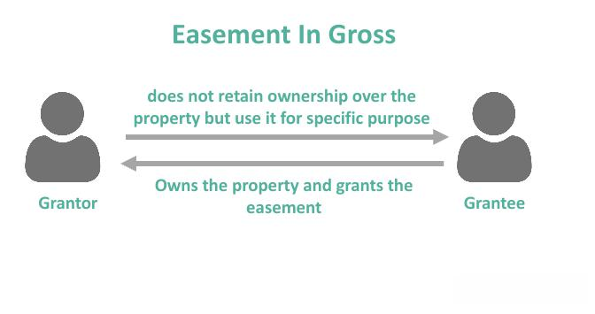

Understanding easements is of vital importance in property law and real estate investment. Easements establish defined rights that allow individuals or entities to use property that does not belong to them. These rights can significantly influence property transactions and investments, as they often dictate how land can be accessed or used.

There are two primary types of easements: easement appurtenant and easement in gross. An easement appurtenant involves two parcels of land, granting usage rights to the owner of one parcel over the other. In contrast, an easement in gross is a personal right to use the property and is typically not tied to land ownership.



As the real estate industry continues to evolve, easements intersect with modern trends such as algorithmic trading. This form of trading, which leverages computer algorithms to manage investment portfolios, increasingly utilizes extensive datasets, including those related to property easements. By incorporating easement data into algorithmic models, investors can make more informed decisions, potentially optimizing property use and assessing risks more effectively.

In this article, we will explore the definitions, examples, and implications of both easement types and their relevance to contemporary real estate investment strategies. Additionally, we will consider the impact of technology, particularly algorithmic trading, on managing data related to easements in the real estate market.

## Table of Contents

## Understanding Property Easements

A property easement is a legal provision granting a specific right to use another person's property for a designated purpose. This does not confer ownership but allows for limited use, such as accessing a passage through a neighboring lot or the installation of utilities. Easements can significantly impact property value and play essential roles in legal standings and strategies in real estate ventures. Their influence is evident across residential, commercial, and investment properties, necessitating awareness and understanding among property owners and investors.

Easements are distinct from ownership because they only grant limited usage rights rather than transferring any title or interest in the property itself. For example, an easement might permit a utility company to run cables or pipelines through a property without owning it. This distinction can lead to complex legal questions regarding maintenance, liability, and access rights, affecting property transactions and negotiations.

In the context of property value, easements may enhance or diminish a property's market appeal. A beneficial easement, like a right of way that provides crucial access to a secluded plot, may increase property desirability. Conversely, an easement granting a commercial entity passage through residential areas might lower property values due to perceived or actual disturbances.

From an investment perspective, understanding the intricacies of easements is vital. They can alter development potential, affect mortgage eligibility, and influence the perception of risk by potential buyers or investors. When evaluating properties, savvy investors consider existing easements, scrutinizing their duration, breadth, and legal enforceability.

In summary, property easements feature prominently in the dynamics of real estate. Whether shaping residential property boundaries or dictating terms in commercial agreements, their legal implications and impact on property valuation and investment strategies are profound.

## Easement Appurtenant Defined

An easement appurtenant is a specific kind of property easement that involves two distinct parcels of land: the dominant estate, which benefits from the easement, and the servient estate, which grants the easement. The defining characteristic of an easement appurtenant is that it "runs with the land," meaning it is inherently linked to the dominant estate and automatically transfers with any change in property ownership. This connection to the land ensures the easement persists regardless of who owns the properties involved.

The practical applications of an easement appurtenant often manifest in situations where one property requires access over another. Common examples include rights of way that enable owners of landlocked or less accessible properties to access public roads, shared driveways facilitating entrance to multiple parcels, or footpaths that traverse neighboring lands. These easements ensure essential services or conveniences that may influence property utility and desirability.

The benefits associated with an easement appurtenant include increased accessibility and potential enhancement of property value for the dominant estate. By ensuring access or utility services, it may also make the property more appealing to prospective buyers, potentially increasing its market value. Conversely, the servient estate may experience limitations or obligations, such as maintenance duties or restricted development options, which could impact its usage or attractiveness.

Owners of the dominant estate must adhere to specific obligations in relation to the easement. This includes using the easement in a manner consistent with its intended purpose and not interfering with the servient estate beyond the agreed terms. Similarly, the servient estate has obligations, such as ensuring the easement's terms are respected and not obstructing the dominant estate's rights.

Ultimately, understanding the nuances of an easement appurtenant is critical for property owners and investors. It highlights the importance of reviewing property deeds, conducting thorough due diligence, and consulting legal experts when buying or managing property. The continued relevance of easements in contemporary real estate underscores their role in shaping property relations and values.

## Easement in Gross Explained

An easement in gross represents a specific type of interest in real property where the right is held by an individual or entity, rather than being attached to a parcel of land. Unlike an easement appurtenant, which is inherently connected to a piece of property and benefits its owner, an easement in gross confers its benefits directly to the individual or organization, irrespective of land ownership.

This type of easement is predominantly utilized by utility companies. It facilitates the installation, operation, and maintenance of essential infrastructure such as power lines, water pipes, gas lines, and telecommunications cables across several properties. This right ensures that utilities can provide their services without owning the land directly, and property owners are compelled to accommodate these installations.

An easement in gross may not automatically transfer with the sale of a property. Its continuity depends on whether the easement rights are specified as transferable. Typically, personal easements in gross, such as those granted to a specific individual for recreation or access, terminate upon the individual's death or cessation of use. However, commercial easements in gross, like those held by utility companies, are usually structured to be transferable due to the enduring nature of the utilities' operational needs.

The presence of an easement in gross can influence property values and transactions. From a buyer's perspective, property encumbered with such an easement might be less appealing due to the restrictions on how the land can be used or modified. For sellers, disclosing the existence of an easement in gross is crucial to avoid potential legal disputes or sale cancellations. Buyers might negotiate for lower prices reflecting the limitations imposed by the easement.

In investment scenarios, easements in gross require careful consideration in due diligence processes. For instance, real estate investors engaged in redevelopment might face constraints due to the non-relocatable nature of utility easements, thereby affecting project feasibility and value. Evaluating the impact of easements in gross involves understanding both the current utility placements and any future utility expansions planned in the area.

Ultimately, recognizing how easements in gross function helps investors and property owners navigate the complexities of property use and ensure compliance with legal and operational requirements, thereby maintaining the integrity of property transactions and investment value.

## Key Differences Between Easements

Easements are essential components of property law that define a legal right to use another person's land for a specific purpose. Understanding the differences between easement appurtenant and easement in gross is fundamental for property investors, as these distinctions affect property value, legal considerations, and investment strategies.

**Attachment to the Property vs. Personal Rights**

The primary distinction between an easement appurtenant and an easement in gross lies in the attachment to the property or personal rights. An easement appurtenant involves two parcels of land: the dominant estate, which benefits from the easement, and the servient estate, which bears the burden of the easement. This type of easement is inherently tied to the land and transfers with the ownership of the dominant property. In contrast, an easement in gross is not tied to any parcel of land but is a personal right granted to an individual or entity. Common examples of easement in gross include utility easements for companies to lay infrastructure like power lines or water pipes.

**Scenarios Favoring One Easement Type Over the Other**

In property investment, the choice between an easement appurtenant and an easement in gross depends on the nature of the transaction and the roles of properties involved. Easement appurtenant might be preferred in residential situations where shared amenities, such as driveways or pathways, enhance property accessibility and value. Easements in gross are often more applicable for commercial or industrial investments where utility access is necessary to maintain or improve service infrastructure.

**Legal Implications in Sales, Easement Termination, and Disputes**

Easement appurtenant carries significant legal implications during property sales. As it is attached to the land, the easement automatically transfers to new property owners, which must be considered in purchase agreements. The termination of an easement appurtenant can occur if the dominant and servient estates come under the same ownership or through mutual agreement.

In contrast, easement in gross does not automatically transfer during a property sale unless specified, offering more flexibility but also requiring explicit contractual arrangements. Termination can happen upon the death of the holder (if personal) or cessation of the activity for which the easement was granted.

Disputes regarding easements often relate to the extent of use and maintenance obligations. For example, conflicts can emerge if the use of an easement appurtenant exceeds agreed limits or if an easement in gross restricts property development. In such cases, legal intervention may be necessary to delineate responsibilities and rights.

Understanding these distinctions enables property investors to navigate easement-related complexities, ensuring that both legal obligations and investment goals are met.

## Algorithmic Trading in Real Estate Investing

Algorithmic trading, a method of executing orders using automated pre-programmed trading instructions, has seen a growing application in real estate markets. The integration of [algorithmic trading](/wiki/algorithmic-trading) facilitates swift analysis and transactions in an industry traditionally dominated by slower, more manual processes. This modernization allows investors to capitalize on data-driven insights, potentially giving them an edge in a competitive market.

Property easements, which can significantly affect the utility and value of a real estate asset, are critical data points in these algorithms. By incorporating easements data into trading models, investors can more accurately assess the true value and potential profitability of a property. Easements can influence access, usage rights, and future development opportunities, all of which are vital considerations in real estate investment strategies.

Technology and data analytics play key roles in navigating the complexities introduced by property easements. Through [machine learning](/wiki/machine-learning) and predictive analytics, trading systems can process large sets of data to identify optimal investment opportunities. For example, algorithms can analyze historical property transactions, zoning laws, and easement agreements to forecast potential appreciation or depreciation in property value. This process helps investors identify which properties are likely to yield high returns, despite the presence of easements.

Case studies highlight how algorithmic trading considers easement implications in real estate investments. For instance, an investment firm might deploy a Python-based system that integrates GIS (Geographical Information Systems) data to account for easement constraints on development projects. Consider the following simplified Python code snippet that could be part of a model evaluating easement impact:

```python
import pandas as pd

# Load property and easement data
property_data = pd.read_csv('property_data.csv')
easement_data = pd.read_csv('easement_data.csv')

# Merge datasets on property ID
merged_data = pd.merge(property_data, easement_data, on='property_id')

# Evaluate impact of easements on property value
merged_data['adjusted_value'] = merged_data['market_value'] - merged_data['easement_impact']

# Identify optimal investments
optimal_investments = merged_data[merged_data['adjusted_value'] > merged_data['market_value'] * 0.8]
```

In this example, `property_data` and `easement_data` contain records of properties and respective easements, such as right-of-way or access restrictions. The `easement_impact` reflects potential cost considerations related to easements. The script calculates an `adjusted_value`, providing investors with refined insights into property investment potential.

Overall, algorithmic trading in real estate, bolstered by technology and comprehensive data analytics, presents a robust framework for managing risks and maximizing returns. The inclusion of easement data ensures that investment decisions are informed and aligned with long-term growth potential. As the real estate sector continues to evolve, the strategic use of algorithms promises to advance investment success.

## Legal and Investment Considerations

Legal responsibilities and rights associated with easements depend significantly on whether the easement is classified as appurtenant or in gross. Easements appurtenant are typically tied to a specific parcel of land, granting the dominant estate certain usage rights over the servient estate. Legal responsibilities might include maintaining the easement area and ensuring it is used according to the terms set forth in the easement agreement. In contrast, easements in gross are often personal to the holder and may not automatically transfer with property ownership, which can alter the legal obligations depending on the specifics of the easement agreement.

Easements can have a notable impact on the market value of a property. Easements appurtenant often enhance accessibility and utility for the dominant estate, potentially increasing its value. Conversely, the servient estate might experience a decrease in value due to usage restrictions. Easements in gross, commonly used by utility companies, might not significantly affect property value unless they restrict future development prospects.

Negotiating strategies for buyers and sellers regarding properties with easements should focus on clarifying the terms and potential impacts of the easement. Ensuring that all parties understand the scope of easement rights and associated responsibilities is crucial. Buyers should conduct thorough due diligence and may wish to negotiate price adjustments based on how the easement affects property use and value. Sellers can benefit from clear documentation of the easement's terms and benefits to mitigate any negative perceptions from potential buyers.

Algorithmic tools can play a vital role in assessing the impacts of easements on investment portfolios. By integrating comprehensive data analytics, investors can evaluate how easements influence property value trends and usage forecasts. Algorithms can process large datasets to identify patterns and correlations, providing strategic insights into optimal investment opportunities. For instance, an algorithm could assess how proximity to utility easements affects residential property values over time, enabling investors to make informed decisions.

Incorporating these considerations into investment strategies helps ensure that properties with easements are accurately valued and strategically positioned within an investment portfolio. Successful navigation of the complexities associated with easements can enhance decision-making and investment outcomes in the real estate market.

## Conclusion

Understanding easements is vital for anyone involved in real estate transactions or investments. Easement appurtenant and easement in gross, the two principal types of easements, have distinct implications for property value and usage. The attachment to properties seen in easements appurtenant makes them integral to property transactions, as they enhance or constrain property utility by defining specific use rights tied to the land's ownership. In contrast, easements in gross are personal rights that do not automatically transfer with property ownership, adding complexity to real estate dealings as they may require explicit agreement for continuation when properties change hands.

Algorithmic trading presents a modern approach to managing the intricate data associated with easements, offering investment advantages by processing vast amounts of legal and property information to optimize decision-making in real estate markets. By integrating easement considerations into algorithmic models, investors can refine their strategies, acknowledging how access rights, utility installations, and other easement-related factors might influence property desirability and market value.

Looking ahead, we can expect an even greater integration of technology into the management of real estate investments, especially concerning easement-related risks. The increasing use of advanced data analytics and machine learning tools enables stakeholders to predict and mitigate potential investment risks linked to easements. This technological evolution suggests a future where real estate investments are informed by comprehensive analyses, ensuring that easements are calculated factors in investment portfolio decisions and contributing to more robust real estate market strategies.

## References & Further Reading

[1]: Dorsey, J. E. (2021). ["The Law of Easements & Licenses in Land"](https://www.amazon.com/Law-Easements-Licenses-Land-2024-1/dp/1668741652). Thomson Reuters.

[2]: ["Easements Relating to Land Surveying and Title Examination"](https://onlinelibrary.wiley.com/doi/epdf/10.1002/9781118675243.fmatter) by Donald A. Wilson

[3]: Backman, R. A. (2007). ["Real Estate Law and Practice"](https://www.tandfonline.com/doi/abs/10.1080/10835547.2007.12091625). American Bar Association.

[4]: ["Algorithmic and High-Frequency Trading"](https://www.amazon.com/Algorithmic-High-Frequency-Trading-Mathematics-Finance/dp/1107091144) by Albert Friedemann

[5]: Armitage, P. (2020). ["Property Records and Information Systems in the United States"](https://historyhub.history.gov/land-records/b/land-records-blog/posts/researching-the-history-of-your-property).####