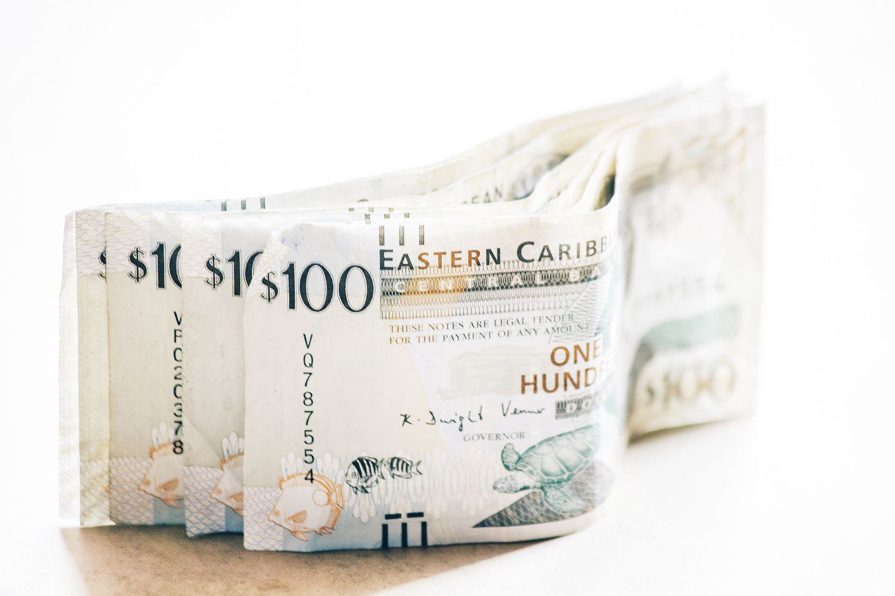

## Table of Contents

## What is the Eastern Caribbean Dollar?

The Eastern Caribbean Dollar, often shortened to EC Dollar, is the official currency used in several countries and territories in the Eastern Caribbean. These places include Antigua and Barbuda, Dominica, Grenada, Saint Kitts and Nevis, Saint Lucia, Saint Vincent and the Grenadines, Anguilla, and Montserrat. The currency is managed by the Eastern Caribbean Central Bank, which was set up in 1983 to help these countries work together on their money matters.

The EC Dollar is divided into 100 cents, just like many other currencies. It's symbolized as "EC$" or "XCD" when you see it written. The currency is fixed to the US dollar, which means its value doesn't change much compared to the US dollar. For every 2.70 EC dollars, you get 1 US dollar. This makes it easier for people in these countries to trade and do business with places that use the US dollar.

## Which countries use the Eastern Caribbean Dollar?

The Eastern Caribbean Dollar is used in eight places in the Caribbean. These places are Antigua and Barbuda, Dominica, Grenada, Saint Kitts and Nevis, Saint Lucia, Saint Vincent and the Grenadines, Anguilla, and Montserrat. All these places are in the Eastern part of the Caribbean Sea.

The Eastern Caribbean Central Bank looks after the Eastern Caribbean Dollar. It helps these countries work together on their money. The currency is tied to the US dollar, so it stays stable. For every 2.70 Eastern Caribbean Dollars, you get 1 US dollar. This makes it easier for people in these countries to buy and sell things with places that use the US dollar.

## What is the history of the Eastern Caribbean Dollar?

The Eastern Caribbean Dollar (EC Dollar) started in 1965. Before that, these countries used the British West Indies Dollar. The British West Indies Dollar was used by many places in the Caribbean that were part of the British Empire. But in 1965, the EC Dollar was made just for the Eastern Caribbean countries. At first, it was managed by the British Caribbean Currency Board. This board helped keep the money stable and made sure there was enough money for everyone to use.

In 1983, things changed again. The Eastern Caribbean Central Bank was created to take over from the British Caribbean Currency Board. This new bank was run by the countries that use the EC Dollar, not by Britain. The Eastern Caribbean Central Bank made the EC Dollar even more stable by fixing its value to the US dollar. For every 2.70 EC Dollars, you get 1 US dollar. This made it easier for people in these countries to trade with other places that use the US dollar. Since then, the EC Dollar has been an important part of the economy in the Eastern Caribbean.

## How is the Eastern Caribbean Dollar abbreviated?

The Eastern Caribbean Dollar is often shortened to EC Dollar. When you see it written, it might be shown as "EC$" or "XCD". These abbreviations help people quickly know which currency is being talked about.

The EC Dollar is used in places like Antigua and Barbuda, Dominica, Grenada, Saint Kitts and Nevis, Saint Lucia, Saint Vincent and the Grenadines, Anguilla, and Montserrat. The Eastern Caribbean Central Bank looks after the EC Dollar and makes sure it stays stable.

## What is the exchange rate of the Eastern Caribbean Dollar to the US Dollar?

The Eastern Caribbean Dollar (EC Dollar) is tied to the US Dollar. This means its value does not change much compared to the US Dollar. The exchange rate is set so that 2.70 EC Dollars equal 1 US Dollar. This fixed rate helps keep the EC Dollar stable and makes it easier for people in the Eastern Caribbean to trade with countries that use the US Dollar.

The Eastern Caribbean Central Bank manages this exchange rate. They make sure that the EC Dollar stays at 2.70 to 1 US Dollar. This stability is good for the economy of the countries that use the EC Dollar, like Antigua and Barbuda, Dominica, Grenada, Saint Kitts and Nevis, Saint Lucia, Saint Vincent and the Grenadines, Anguilla, and Montserrat. It helps these countries do business with other places without worrying about big changes in money value.

## Who issues the Eastern Caribbean Dollar?

The Eastern Caribbean Dollar is issued by the Eastern Caribbean Central Bank. This bank was set up in 1983 to help manage the money for several countries in the Eastern Caribbean. These countries are Antigua and Barbuda, Dominica, Grenada, Saint Kitts and Nevis, Saint Lucia, Saint Vincent and the Grenadines, Anguilla, and Montserrat. Before the Eastern Caribbean Central Bank was created, the British Caribbean Currency Board used to issue the Eastern Caribbean Dollar.

The Eastern Caribbean Central Bank makes sure the Eastern Caribbean Dollar stays stable. They do this by fixing its value to the US Dollar. For every 2.70 Eastern Caribbean Dollars, you get 1 US Dollar. This fixed rate helps people in these countries trade easily with other places that use the US Dollar. It also helps keep the economy of these countries steady and strong.

## What are the different denominations of the Eastern Caribbean Dollar?

The Eastern Caribbean Dollar comes in different amounts of money, both as coins and paper money. The coins are worth 1 cent, 2 cents, 5 cents, 10 cents, 25 cents, and 1 dollar. These coins help people buy things that cost less money. The paper money, or banknotes, come in bigger amounts like 5 dollars, 10 dollars, 20 dollars, 50 dollars, and 100 dollars. These notes are used for buying things that cost more money.

All these different amounts of money make it easy for people in the Eastern Caribbean to use the Eastern Caribbean Dollar every day. Whether they need to buy something small or something big, there's a coin or note that fits. The Eastern Caribbean Central Bank makes sure there are enough of these coins and notes for everyone to use.

## How is the value of the Eastern Caribbean Dollar maintained?

The value of the Eastern Caribbean Dollar is kept stable by the Eastern Caribbean Central Bank. They do this by fixing the value of the Eastern Caribbean Dollar to the US Dollar. This means that 2.70 Eastern Caribbean Dollars always equal 1 US Dollar. By keeping this rate the same, the Eastern Caribbean Central Bank makes sure the money does not change too much in value. This helps people in the Eastern Caribbean know how much their money is worth and makes it easier for them to buy and sell things with other countries that use the US Dollar.

The Eastern Caribbean Central Bank also manages how much money is in the economy. They make sure there is enough money for people to use but not too much that it could make the money worth less. By controlling the amount of money and keeping the exchange rate the same, the bank helps keep the Eastern Caribbean Dollar strong and reliable. This stability is important for the countries that use the Eastern Caribbean Dollar, like Antigua and Barbuda, Dominica, Grenada, Saint Kitts and Nevis, Saint Lucia, Saint Vincent and the Grenadines, Anguilla, and Montserrat, because it helps their economies stay strong and grow.

## What are the monetary policies governing the Eastern Caribbean Dollar?

The Eastern Caribbean Central Bank sets the rules for the Eastern Caribbean Dollar to keep it stable. They make sure the value of the Eastern Caribbean Dollar stays the same by pegging it to the US Dollar. This means 2.70 Eastern Caribbean Dollars always equals 1 US Dollar. By keeping this rate fixed, the bank helps people in the Eastern Caribbean know exactly how much their money is worth. This makes it easier for them to trade with countries that use the US Dollar and helps keep their economy steady.

The Eastern Caribbean Central Bank also controls how much money is in the economy. They do this to make sure there is enough money for everyone to use, but not too much that it could make the money worth less. This is called managing the money supply. By keeping a close watch on how much money is out there and making sure the exchange rate stays the same, the bank helps keep the Eastern Caribbean Dollar strong and reliable. This stability is important for the countries that use the Eastern Caribbean Dollar, like Antigua and Barbuda, Dominica, Grenada, Saint Kitts and Nevis, Saint Lucia, Saint Vincent and the Grenadines, Anguilla, and Montserrat, because it helps their economies grow and stay healthy.

## How does the Eastern Caribbean Central Bank influence the economy through the Eastern Caribbean Dollar?

The Eastern Caribbean Central Bank helps control the economy by managing the Eastern Caribbean Dollar. They make sure the Eastern Caribbean Dollar stays at a fixed value compared to the US Dollar. This means 2.70 Eastern Caribbean Dollars always equals 1 US Dollar. By keeping this rate the same, the bank helps people in the Eastern Caribbean know exactly how much their money is worth. This makes it easier for them to buy and sell things with other countries that use the US Dollar. It also helps keep prices stable, which is good for the economy because people can plan better when they know how much things will cost.

The bank also controls how much money is in the economy. They make sure there is enough money for everyone to use, but not too much that it could make the money worth less. This is important because if there's too much money, prices can go up a lot, and that's not good for people. By watching how much money is out there and keeping the exchange rate steady, the Eastern Caribbean Central Bank helps keep the Eastern Caribbean Dollar strong and reliable. This stability helps the countries that use the Eastern Caribbean Dollar, like Antigua and Barbuda, Dominica, Grenada, Saint Kitts and Nevis, Saint Lucia, Saint Vincent and the Grenadines, Anguilla, and Montserrat, keep their economies healthy and growing.

## What are the advantages and disadvantages of using the Eastern Caribbean Dollar?

Using the Eastern Caribbean Dollar has some good things about it. One big advantage is that it's tied to the US Dollar. This means 2.70 Eastern Caribbean Dollars always equals 1 US Dollar. This makes the money stable, so people know exactly how much their money is worth. It's easier to trade with other countries that use the US Dollar because the exchange rate doesn't change. This helps the economy stay strong because businesses can plan better when they know how much things will cost. Also, having one currency for many countries in the Eastern Caribbean makes it easier for people to travel and do business between these places.

There are also some challenges with using the Eastern Caribbean Dollar. Because it's tied to the US Dollar, the Eastern Caribbean countries can't change their money's value on their own. If the US Dollar goes up or down a lot, it can affect the Eastern Caribbean Dollar too. This can make it harder for these countries to control their own economy. Also, because the Eastern Caribbean Dollar is used in several countries, if one country has a big economic problem, it might affect the other countries too. This means they have to work together closely to keep their money and economy stable.

## How does the Eastern Caribbean Dollar compare to other regional currencies in terms of stability and usage?

The Eastern Caribbean Dollar is pretty stable because it's tied to the US Dollar. This means it always stays at a fixed rate of 2.70 Eastern Caribbean Dollars to 1 US Dollar. This makes it easier for people in the Eastern Caribbean to know how much their money is worth and to trade with other countries that use the US Dollar. Compared to other regional currencies like the Jamaican Dollar or the Trinidad and Tobago Dollar, the Eastern Caribbean Dollar is more stable because those currencies can change in value more often. The Eastern Caribbean Dollar is used in eight countries and territories, which makes it easier for people in these places to travel and do business with each other.

However, not all regional currencies have the same level of stability or usage. For example, the Jamaican Dollar and the Trinidad and Tobago Dollar are not tied to the US Dollar, so their values can go up and down more. This can make it harder for people in Jamaica or Trinidad and Tobago to plan their money because the value of their currency can change. These currencies are only used in their own countries, which means they don't have the same advantage of being used across multiple countries like the Eastern Caribbean Dollar. So, while the Eastern Caribbean Dollar has the benefit of stability and wider usage, other regional currencies might face more challenges in keeping their value steady and being used in more places.

## References & Further Reading

[1]: Henwood, D. (1994). ["Fixing the Dollar Now: The North American Monetary Union Option"](https://www.finnotes.org/publications/fixing-the-dollar-now), World Policy Journal, 11(4), pp. 31-42.

[2]: ["The Eastern Caribbean Central Bank and the Regulation of the Financial System of Saint Lucia"](https://www.eccb-centralbank.org/frequently-asked-questions-faqs-licensing-and-regulation) (2020). The Central Bank of Saint Lucia and Financial Regulation.

[3]: Robleh, A. A., & Banks, J. (2016). ["Financial Reporting and Conduct of Business Rules applicable by Banks and other Financial Institutions"](https://en.wikipedia.org/wiki/Egyptian_invasion_of_Harar).

[4]: ["Economics in a Changed Universe: Joseph Stiglitz and the U.S. Economy"](https://www.amazon.com/Economics-Changed-Universe-Globalization-Enterprise/dp/0739127144) (1998). Urban Institute.

[5]: Butkiewicz, J. L., & Stekler, H. O. (1983). ["The Relationship between Federal Reserve Behavior, Interest Rates and the Stock Market"](https://www.jstor.org/stable/1992790), The Journal of Finance, 38(4), pp. 1157-1170.