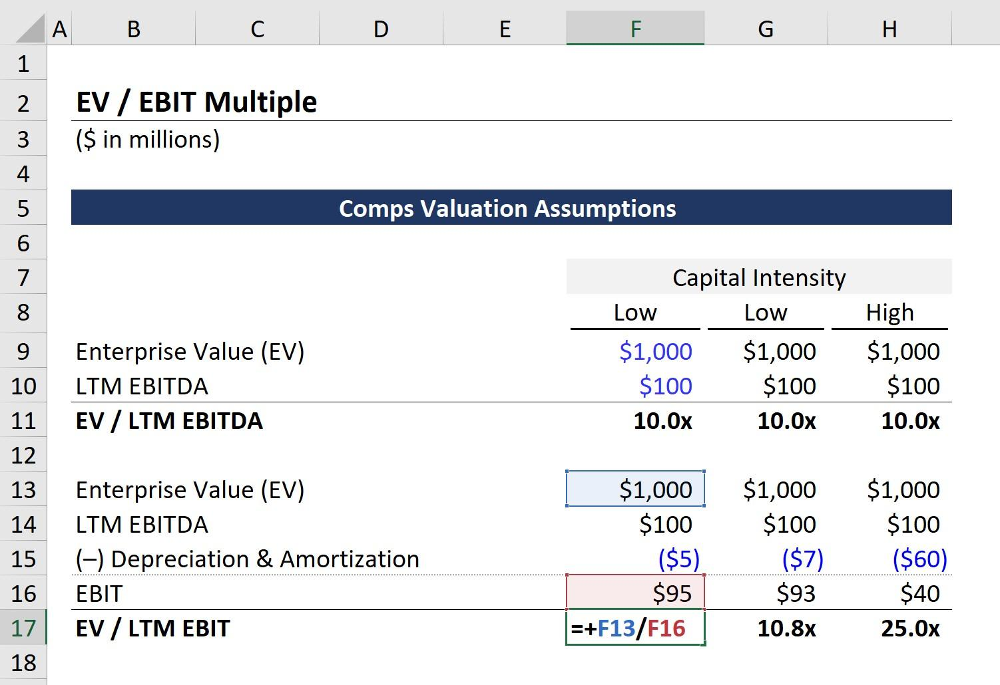

## Table of Contents

## What is EBIT?

EBIT stands for Earnings Before Interest and Taxes. It is a measure of a company's profitability that shows how much money the company made from its operations before paying interest on any loans and before paying taxes. It helps people see how well the core business is doing without being affected by how the company is financed or the tax laws.

You can find EBIT by starting with the company's revenue, then subtracting the cost of goods sold and other operating expenses. It does not include interest expenses or tax expenses. This makes EBIT a useful number for comparing the performance of different companies, even if they have different levels of debt or are in different countries with different tax rates.

## What is Enterprise Value (EV)?

Enterprise Value (EV) is like a total price tag for a company. It tells you how much it would cost to buy the whole business, including all its debts and cash. To find EV, you start with the company's market value, which is the total value of its stock. Then, you add any money the company owes, like loans or bonds. But, you also subtract any cash the company has, because that cash could be used to pay off some of the debt.

EV is useful because it gives a clearer picture of a company's value than just looking at its stock price. It shows what the company is really worth to someone thinking about buying it, taking into account everything the company owns and owes. This way, you can compare companies more fairly, even if they have different amounts of debt or cash.

## How is the EBIT to EV multiple calculated?

The EBIT to EV multiple is a way to see how much money a company makes compared to its total value. You find it by dividing the company's EBIT by its Enterprise Value (EV). EBIT is how much money the company earns before paying interest and taxes, and EV is the total value of the company including its debts and minus its cash.

This multiple helps investors understand if a company is a good buy. A higher EBIT to EV multiple can mean the company is making a lot of money for its size, which might make it a good investment. But, it's important to compare this multiple with other companies in the same industry to know if it's really a good deal.

## Why is the EBIT to EV multiple important for investors?

The EBIT to EV multiple is important for investors because it helps them see how profitable a company is compared to its total value. It's like looking at how much money the company makes for every dollar you would spend to buy the whole business. If the multiple is high, it means the company is making a lot of money for its size, which could be a good sign for investors looking for a good deal.

This multiple also lets investors compare different companies more easily. Since it uses EBIT, which doesn't include interest and taxes, and EV, which includes the company's debts and cash, it gives a clearer picture of a company's value. By comparing the multiples of different companies, investors can see which ones might be undervalued and could be a smart investment.

## How does the EBIT to EV multiple differ from other valuation metrics?

The EBIT to EV multiple is different from other valuation metrics because it looks at a company's earnings before interest and taxes (EBIT) compared to its total value, including debts and cash (Enterprise Value, or EV). This is different from common metrics like the Price-to-Earnings (P/E) ratio, which only uses the market value of the company's stock and its net earnings. The P/E ratio doesn't take into account the company's debt or cash, so it might not give a full picture of the company's value. The EBIT to EV multiple, on the other hand, gives a clearer idea of how much profit the company makes for its total value, making it useful for comparing companies with different levels of debt.

Another way the EBIT to EV multiple differs is that it focuses on operational performance. Metrics like the Price-to-Book (P/B) ratio look at the company's book value, which is based on its assets and liabilities. While the P/B ratio can be useful, it doesn't directly show how well the company is making money from its operations. The EBIT to EV multiple, by using EBIT, directly reflects the company's ability to generate earnings from its core business activities. This makes it a valuable tool for investors who want to understand the operational efficiency and profitability of a company in relation to its total value.

## What industries typically have higher EBIT to EV multiples?

Industries that usually have higher EBIT to EV multiples are often those with strong and stable earnings. Tech companies, for example, can have high multiples because they make a lot of money and don't need a lot of physical stuff to run their business. Software companies, in particular, can keep making money from the same product over and over without spending much more. This means they can have high earnings compared to their total value.

Another industry with higher EBIT to EV multiples is healthcare, especially companies that make drugs or medical devices. These companies can have high multiples because they have strong earnings from their products, and they often have patents that keep others from copying what they do. This can make their earnings more predictable and valuable compared to the total cost of the business.

Consumer goods companies can also have higher multiples if they have strong brands that people trust. Brands like Coca-Cola or Nike can charge more for their products because people want to buy them. This leads to higher earnings, which can make their EBIT to EV multiples higher than companies without such strong brands.

## Can you provide an example of how to calculate the EBIT to EV multiple for a company?

Let's say we have a company called "TechCo" and we want to find out its EBIT to EV multiple. First, we need to know TechCo's EBIT, which is how much money it makes before paying interest and taxes. Let's say TechCo's EBIT is $50 million. Next, we need to find TechCo's Enterprise Value (EV), which is the total value of the company including its debts and minus its cash. Let's say TechCo's market value is $300 million, it has debts of $100 million, and it has $50 million in cash. So, TechCo's EV would be $300 million (market value) + $100 million (debts) - $50 million (cash) = $350 million.

To calculate the EBIT to EV multiple, we divide TechCo's EBIT by its EV. So, it would be $50 million (EBIT) divided by $350 million (EV), which equals 0.1429. This means for every dollar of TechCo's total value, it makes $0.1429 in earnings before interest and taxes. A higher number would mean the company is making more money for its size, which could be a good sign for investors.

## How can the EBIT to EV multiple be used to compare companies within the same industry?

The EBIT to EV multiple helps investors see how much money a company makes compared to its total value. When looking at companies in the same industry, this multiple can show which ones are making more money for their size. For example, if Company A has an EBIT to EV multiple of 0.15 and Company B has a multiple of 0.10, it means Company A is making more earnings for every dollar of its total value. This can suggest that Company A might be a better investment because it's more profitable compared to its size.

Using the EBIT to EV multiple to compare companies in the same industry can also help spot undervalued or overvalued companies. If most companies in an industry have an average multiple of 0.12, and one company has a multiple of 0.08, it might mean that company is undervalued. Investors might see this as a good chance to buy the company's stock at a lower price, expecting it to go up as the market realizes its true value. By comparing these multiples, investors can make smarter choices about where to put their money.

## What are the limitations of using the EBIT to EV multiple for valuation?

The EBIT to EV multiple can be a useful tool for investors, but it has some limitations. One big problem is that it doesn't take into account how much a company needs to spend to keep growing. Some companies might need to spend a lot of money on new things, like factories or research, to keep making money. The EBIT to EV multiple doesn't show this, so it might make a company look more profitable than it really is.

Another limitation is that this multiple can be affected by how a company decides to pay for itself. If a company borrows a lot of money, it might look like it's making more money because the interest on the debt isn't included in EBIT. But having a lot of debt can be risky. Also, the EBIT to EV multiple doesn't consider different tax situations. Companies in different countries might have different tax rates, which can change how much money they keep after taxes. So, while the EBIT to EV multiple can give a quick idea of a company's value, it's important to look at other things too.

## How does the EBIT to EV multiple change with economic cycles?

The EBIT to EV multiple can change a lot depending on what's happening in the economy. When the economy is doing well, companies usually make more money, and their stock prices might go up too. This can make their EBIT go up and their EV go up as well. But if their EBIT goes up more than their EV, then their EBIT to EV multiple will go up. This means that during good economic times, companies might look more profitable compared to their total value.

On the other hand, when the economy is not doing so well, companies might make less money, and their stock prices might go down. This can make their EBIT go down and their EV go down too. If their EV goes down more than their EBIT, then their EBIT to EV multiple will go up. But usually, both EBIT and EV go down, and the multiple might not change much or could even go down if the drop in EBIT is bigger. So, the EBIT to EV multiple can be a helpful way to see how a company is doing, but it's important to think about what's happening in the economy too.

## What are some advanced techniques for adjusting the EBIT to EV multiple for more accurate valuations?

One way to make the EBIT to EV multiple more accurate is by adjusting for capital expenditures. Some companies need to spend a lot of money on new things like buildings or machines to keep growing. This money is not included in EBIT, so the multiple might make the company look more profitable than it really is. To fix this, you can subtract the money spent on these new things from the EBIT before you calculate the multiple. This gives a better idea of how much money the company is really making after it spends on what it needs to grow.

Another technique is to adjust for working capital changes. Working capital is the money a company needs to run its day-to-day business, like paying for supplies or keeping some cash on hand. If a company is using more money for working capital, it might not have as much money left over as EBIT suggests. To get a more accurate multiple, you can subtract the change in working capital from EBIT. This way, the multiple shows how much money the company is making after it takes care of its everyday needs.

Lastly, you can adjust for non-recurring items. Sometimes, a company's earnings can be affected by things that won't happen again, like selling a piece of property or having a big legal expense. These one-time events can make the EBIT look different from what it usually is. By taking out these non-recurring items from the EBIT, you can get a clearer picture of the company's regular earnings. This helps make the EBIT to EV multiple more accurate because it's based on the money the company makes all the time, not just from one-time events.

## How can historical EBIT to EV multiples be used to predict future company performance?

Looking at how a company's EBIT to EV multiple has changed over time can help guess how it might do in the future. If the multiple has been going up, it means the company has been making more money for its size. This could be a good sign that the company will keep doing well. But if the multiple has been going down, it might mean the company is not making as much money as before, which could be a warning that it might not do so well in the future.

It's also important to compare the company's historical multiples with other companies in the same industry. If a company's multiple is usually higher than others in its industry, it might mean it's better at making money. This can help guess if the company will keep being a good investment. But remember, past numbers don't always tell the whole story, and other things like changes in the economy or new competition can change how a company does in the future.

## What is the EBIT/EV Multiple?

Earnings Before Interest and Taxes (EBIT) and Enterprise Value (EV) are two essential financial metrics used to assess a company's performance and value. EBIT represents a company's profit before deducting interest and taxes, reflecting its core operational efficiency. It provides an insight into the firm's ability to generate earnings from its operations, excluding the effects of capital structure and tax rates. Meanwhile, EV encompasses the total value of a company, considering not only its equity but also its debt and any minority interests. It is calculated as:

$$
\text{EV} = \text{Market Capitalization} + \text{Total Debt} - \text{Cash and Cash Equivalents}
$$

The EBIT/EV ratio, hence, is a meaningful measure, often termed as an earnings yield, which helps investors evaluate the returns expected from the company's enterprise value. The ratio is given as:

$$
\text{EBIT/EV} = \frac{\text{EBIT}}{\text{Enterprise Value}}
$$

This ratio gives an indicator of how efficiently a company is generating earnings relative to its valuation, providing a basis to compare companies regardless of differences in capital structure and other non-operational factors.

Joel Greenblatt, a renowned investor, popularized the use of the EBIT/EV multiple through his investment philosophy, particularly emphasizing its utility in comparing firms' profitability before reducing effects of financial leverage and tax strategies. His approach focused on the simplicity and effectiveness of this metric in screening for undervalued companies with potential high return on capital.

Calculating the EBIT/EV ratio involves a clear understanding of its components. EBIT can be extracted from the income statement by taking the operating income, which excludes interest and tax expenses. EV, on the other hand, requires a comprehensive look at the firm's balance sheet to gather market capitalization, total debt, and cash reserves.

The EBIT/EV ratio simplifies cross-company comparisons by allowing a normalized view of profitability that accounts for different capital structures, providing investors with a more objective evaluation metric.

## References & Further Reading

[1]: Greenblatt, J. (2006). ["The Little Book That Beats the Market."](https://www.amazon.com/Little-Book-That-Beats-Market/dp/0471733067) Wiley.

[2]: Damodaran, A. (2012). ["Investment Valuation: Tools and Techniques for Determining the Value of Any Asset."](https://books.google.com/books/about/Investment_Valuation.html?id=5SRHAAAAQBAJ) Wiley.

[3]: Chincarini, L. B., & Kim, D. (2006). ["Quantitative Equity Portfolio Management: An Active Approach to Portfolio Construction and Management."](https://archive.org/details/quantitativeequi0000chin_c9d6) McGraw-Hill.

[4]: Fabozzi, F. J., & Peterson Drake, P. (2009). ["Finance: Capital Markets, Financial Management, and Investment Management."](https://books.google.com/books/about/Finance.html?id=mUBsAwAAQBAJ) Wiley.

[5]: ["Utilizing Financial Ratios in Algorithmic Trading."](https://github.com/stefan-jansen/machine-learning-for-trading) Investopedia.