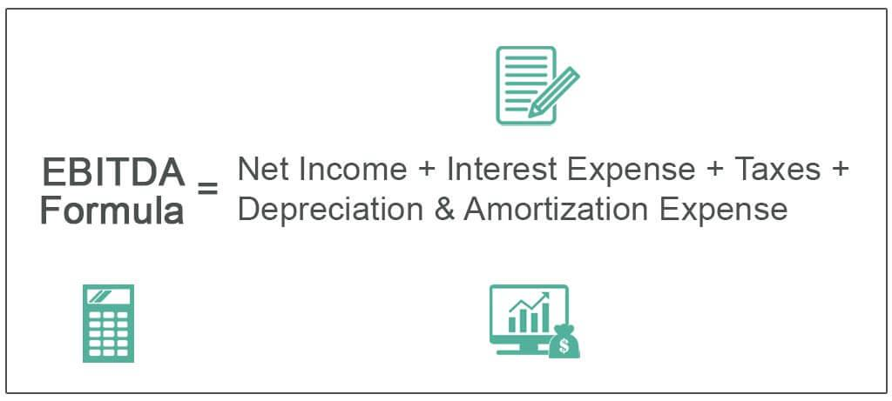

Earnings Before Interest, Taxes, and Amortization (EBITA) is a key financial metric utilized in evaluating a company's profitability without the influence of non-operational costs and tax liabilities. EBITA offers a clearer picture of a company's operational efficiency by excluding expenses related to interest, taxes, and amortization. This metric helps analysts and investors to assess whether a company's core business operations are profitable by focusing purely on its operating performance. Unlike net income, which includes all expenses and income, EBITA provides a more focused view, enabling better comparison across companies and industries, especially those with varying tax situations and capital structures.

The importance of EBITA in financial analysis is particularly pronounced when comparing companies with significant differences in tax rates and debt levels. By stripping away interest and tax expenses, EBITA gives a more equitable basis for assessing operational performance across various firms. Furthermore, the exclusion of amortization, which involves non-cash charges related to intangible assets, allows analysts to focus on cash-generating capabilities and operational health.



In recent years, the financial landscape has been transformed by the advent of algorithmic trading, which harnesses advanced mathematical models and high-speed data processing to execute trades at lightning speed. As an integral part of modern finance, algorithmic trading capitalizes on small market inefficiencies and leverages large volumes of data to make informed trading decisions. Financial metrics such as EBITA can be pivotal in shaping these algorithms, guiding strategies based on robust and transparent assessment of a company's core profitability. Thus, the effective analysis and interpretation of EBITA can provide crucial insights, shaping the decision-making process in trading algorithms and enhancing the overall trading strategy.

## Table of Contents

## Understanding EBITA

Earnings Before Interest, Taxes, and Amortization (EBITA) is a financial metric used to evaluate a company's operational efficiency and profitability. It represents a firm's earnings derived purely from its core business operations, without the influence of interest expenses, tax obligations, and amortization of intangible assets. By excluding these factors, EBITA provides a clearer picture of a company's operational performance.

**Significance of Excluding Interest, Taxes, and Amortization:**

1. **Interest:** Excluding interest allows analysts to assess a company's operational profitability without the impact of its capital structure. This is crucial as interest payments are influenced by external factors such as interest rates and funding strategies, which can vary significantly between companies.

2. **Taxes:** Taxes vary based on jurisdiction and changes in legislation, making them an external factor that can distort comparisons between the core operational efficiencies of different companies. By excluding taxes, EBITA offers a more standardized measure for comparing companies.

3. **Amortization:** This non-cash expense arises from the gradual write-off of intangible assets like patents or trademarks. Amortization doesn't impact cash flow, so excluding it provides a purer sense of operational cash generation.

**Comparison of EBITA with Other Financial Metrics:**

EBITA is often compared with other financial metrics, notably Earnings Before Interest, Taxes, Depreciation, and Amortization (EBITDA). While both EBITA and EBITDA are designed to measure profitability before non-operational expenses, the key difference lies in the handling of depreciation.

- **EBITDA:** Includes both depreciation and amortization, providing a view of earnings before these non-cash charges. Depreciation accounts for the wear and tear of tangible assets over time, giving EBITDA a slightly broader scope compared to EBITA. It is particularly useful for asset-heavy industries where depreciation can significantly impact financial statements.

**Mathematical Representation:**

The formula for calculating EBITA is:

$$
\text{EBITA} = \text{Operating Income} + \text{Amortization}
$$

In income statements, operating income is typically the figure listed before interest and taxes are deducted. Adding back amortization adjusts for non-cash charges, thus isolating the operational earnings from core business activities.

Overall, EBITA provides valuable insights into a company’s operational performance and is an essential tool for stakeholders to compare firms on a more level field, devoid of the varied impacts of financing choices, tax environments, and non-cash amortization expenses.

## Calculating EBITA

Earnings Before Interest, Taxes, and Amortization (EBITA) is a financial metric that provides insight into a company's operational efficiency by focusing on core business profitability. To derive EBITA from an income statement, follow these steps:

1. **Start with Operating Income**: Locate the operating income or earnings before interest and taxes (EBIT) on the income statement. This figure represents the company's profitability from regular operations before factoring in interest and tax expenses.

2. **Add Back Amortization**: Identify the amortization expense, which is the gradual write-off of intangible assets over time. This is typically found as a line item under expenses in the income statement. Add this amount back to the EBIT to arrive at EBITA.

**Formula for Calculating EBITA:**

$$
\text{EBITA} = \text{Operating Income (EBIT)} + \text{Amortization}
$$

**Practical Example:**

Consider a company with the following selected data from its income statement for a financial year:

- Operating Income (EBIT): $500,000
- Amortization Expense: $50,000

To calculate EBITA:

$$
\text{EBITA} = \$500,000 + \$50,000 = \$550,000
$$

In this example, the company's EBITA is $550,000, providing a metric of profitability that acknowledges operational income while neutralizing the impact of amortization.

**Python Example for Automation:**

Incorporating EBITA calculation in Python can be useful for automating financial analysis, especially when dealing with large datasets. Below is a basic Python script to calculate EBITA given operating income and amortization figures:

```python
def calculate_ebita(operating_income, amortization):
    return operating_income + amortization

# Example data
operating_income = 500000
amortization = 50000

# Calculate EBITA
ebita = calculate_ebita(operating_income, amortization)
print("EBITA:", ebita)
```

This Python function helps streamline the calculation process, making it easy to integrate EBITA computation into more complex financial models or trading algorithms.

## EBITA vs. Other Financial Metrics

Earnings Before Interest, Taxes, and Amortization (EBITA) is a financial metric used to evaluate a company's operational efficiency by excluding the costs of interest, taxes, and amortization. This metric is closely related to Earnings Before Interest, Taxes, Depreciation, and Amortization (EBITDA), yet there are distinctions between the two that can significantly influence their application in financial analysis.

**Differentiation between EBITA and EBITDA**

EBITA is calculated by taking the net income and adding back interest expenses, tax expenses, and amortization costs. In contrast, EBITDA further excludes depreciation costs. The formula for EBITA is:

$$
\text{EBITA} = \text{Net Income} + \text{Interest} + \text{Taxes} + \text{Amortization}
$$

For EBITDA, the formula extends to:

$$
\text{EBITDA} = \text{EBITA} + \text{Depreciation}
$$

The differentiation between EBITA and EBITDA is crucial because depreciation and amortization reflect different aspects of a company’s cost structure. While amortization deals with intangible assets, depreciation covers tangible assets. Companies with high capital expenditures and substantial tangible asset bases may have more significant depreciation costs, making EBITDA a more forgiving metric that could cloud true operational efficiency when compared to EBITA.

**Comparison with GAAP Earnings and Implications for Investors**

Generally Accepted Accounting Principles (GAAP) earnings encompass all expenses, including interest, taxes, depreciation, and amortization, providing a comprehensive view of a company's financial performance. Unlike EBITA and EBITDA, GAAP earnings consider all operational and non-operational activities, giving investors a clearer picture of net profitability. The primary implication for investors is that EBITA and EBITDA can sometimes overstate a company’s financial health by excluding certain costs, potentially leading to more favorable but less realistic evaluations of performance and valuation.

Investors should understand that EBITA offers a focused view on operations by excluding non-operational and non-cash expenses like amortization. However, relying solely on these adjusted metrics might fail to account for the entire scope of a company’s financial obligations. GAAP earnings, though inclusive of all factors, might be influenced by one-time or non-recurring items, making them less relevant for evaluating ongoing operational performance.

**The Significance of Depreciation in Financial Metrics**

Depreciation is the systematic reduction in the recorded cost of a tangible asset over its useful life and affects metrics that measure profitability and efficiency. Its exclusion in EBITDA can lead to a temporary inflation of profit figures, especially in asset-intensive industries like manufacturing and transportation. While investors may turn to EBITDA for insights into cash flow and operational effectiveness, ignoring depreciation can obscure a company's long-term asset renewal needs and investment cycles.

Depreciation's significance becomes evident when assets require replacement or upgrading. By not considering these future expenditures, EBITDA might appear better positioned than reality, particularly when forecasting future cash needs or assessing the sustainability of profit margins.

In summary, while EBITA serves as an important tool for measuring operational efficiency by excluding interest, taxes, and amortization, it is vital to understand its relationship with other financial metrics such as EBITDA and GAAP earnings. Depreciation, a key component absent from both EBITA and EBITDA yet included in GAAP, plays an essential role in portraying a complete picture of a company’s financial status for informed investment decisions.

## Application of EBITA in Algo Trading

Earnings Before Interest, Taxes, and Amortization (EBITA) is a crucial financial metric that plays a significant role in [algorithmic trading](/wiki/algorithmic-trading) strategies. By isolating a company's operational performance from capital structure and tax considerations, EBITA provides traders with a clearer understanding of the true operating effectiveness of a company. In algorithmic trading, EBITA can be integrated into various strategies to enhance decision-making and improve investment outcomes. 

### Leveraging EBITA in Algorithmic Trading Strategies

EBITA serves as a reliable indicator of a company’s core operating profitability, which can be particularly useful in developing automated trading strategies. Since EBITA excludes interest expenses, tax liabilities, and amortization, it reflects the internal financial health of a business, offering critical insights that can drive trading decisions. This makes EBITA a valuable component in creating algorithms that aim to identify undervalued stocks based on operational efficiency.

#### Examples of Trading Algorithms Utilizing EBITA for Decision-Making

Algorithmic traders can use EBITA to develop quantitative models that screen and rank companies based on their operational performance. For instance, a trading algorithm might employ a rule-based approach to filter companies with a high EBITA margin, suggesting potential for superior profitability from core operations. This can be particularly effective in sectors where capital expenditure or tax exposure significantly skew traditional earnings metrics.

A simple Python-based example could involve filtering a dataset of companies to identify those with a consistently growing EBITA margin over several quarters:

```python
import pandas as pd

# Assume `data` is a DataFrame containing columns: 'Company', 'Quarter', 'EBITA'
data = pd.read_csv('financial_data.csv')

# Filter for companies with increasing EBITA over the past 4 quarters
def is_ebita_growing(company_data):
    return all(company_data['EBITA'].pct_change().dropna() > 0)

growing_ebita_companies = data.groupby('Company').filter(is_ebita_growing)
```

#### Backtesting Strategies Involving EBITA in Algorithmic Models

Backtesting is an essential part of developing and validating algorithmic trading strategies. It involves running trading algorithms on historical data to assess potential performance and risks. For strategies focusing on EBITA, [backtesting](/wiki/backtesting) can help determine whether a high EBITA margin correlates with stock price appreciation over time.

In a backtesting scenario, an algorithm might track past stock performance against changes in EBITA, adjusting for other market variables to evaluate the effectiveness of EBITA as a predictive signal:

```python
from backtesting import Strategy
from backtesting import Backtest

class EbitdaStrategy(Strategy):
    def init(self):
        # Retrieve EBITA data
        self.ebita = self.data.EBITA

    def next(self):
        if len(self.ebita) > 4 and all(self.ebita[-4:] > self.ebita[-5]):
            self.buy()
        elif self.position:
            self.sell()

# Assume 'data' includes historical price and EBITA metrics
bt = Backtest(data, EbitdaStrategy, cash=10000)
results = bt.run()
bt.plot()
```

These strategic approaches highlight how EBITA can be effectively utilized in algorithmic trading to identify potential investment opportunities. The use of EBITA in algorithms offers the potential to uncover intrinsic value overlooked by other less focused metrics. However, it is crucial to combine EBITA with a comprehensive set of financial and market indicators to create robust, actionable trading models.

## Benefits and Limitations of Using EBITA

EBITA, or Earnings Before Interest, Taxes, and Amortization, serves as a key metric in evaluating a company's operational efficiency by focusing on earnings generated from core business activities. One of the primary advantages of EBITA is its ability to provide a clearer picture of a company's operational performance without the distortion caused by interest, taxes, and amortization. This focus on operational earnings allows investors and analysts to assess the company's ability to generate profit solely from its primary business operations, making it a valuable tool in financial analysis.

### Advantages of EBITA

1. **Clear Assessment of Operational Efficiency**: EBITA provides insight into a company's performance by excluding financial strategies and accounting decisions, thus offering a pure view of operational success. This exclusion of interest and taxes eliminates variations due to changes in capital structure or tax environments.

2. **Comparison Across Industries**: Given its exclusion of region-specific tax liabilities and varied amortization policies, EBITA is particularly useful in comparing companies across different industries and regions. It normalizes earnings figures to account for these disparities.

3. **Focus on Core Business Health**: By focusing solely on operating performance, EBITA provides a streamlined metric for assessing the core health of a business, useful for strategic decision-making, such as mergers and acquisitions. Buyers can use EBITA to compare operational efficiencies effectively.

### Limitations and Potential Pitfalls

1. **Exclusion of Financial and Tax Obligations**: While EBITA removes interest and tax effects to focus on operations, this exclusion can also be a limitation as it overlooks the reality of financial obligations and tax responsibilities, which are crucial for comprehensive financial health assessment.

2. **Potential for Misleading Figures**: Amortization is typically associated with intangible assets, which can be significant in industries such as technology or pharmaceuticals. The exclusion of amortization might obscure the long-term capital expenditure requirements or the value of intangible assets.

3. **Neglects Capital Structure**: By omitting interest, EBITA does not consider the impact of a company's capital structure, which can be significant for highly leveraged firms. As a result, EBITA might present an overly optimistic view of companies with heavy debt loads by ignoring the cost of servicing that debt.

### Consideration of Non-Cash Items like Amortization

Amortization, while excluded in EBITA, represents the allocation of the cost of intangible assets over time. It is a non-cash expense that can have substantial long-term implications for a company's balance sheet. When entirely removed from consideration, as with EBITA, such non-cash expenses could lead to an incomplete analysis. This necessitates a critical appraisal from investors who must balance the benefits of isolating operational performance against the broader financial tapestry. Hence, greater emphasis on considering both EBITA and other financial metrics is advisable for a holistic view.

In summary, though EBITA is beneficial in providing an undistorted view of a company's operational efficiency, it has significant limitations that need to be accounted for. Using EBITA alongside other financial metrics can mitigate these risks, providing a more balanced analysis of a company's overall performance.

## Case Study: EBITA in Real-World Investments

Earnings Before Interest, Taxes, and Amortization (EBITA) is a significant metric widely utilized in financial reporting and analysis to evaluate a company's core profitability. Companies across various sectors use EBITA to present an unbiased view of their operational performance to stakeholders. By excluding interest, taxes, and amortization, EBITA provides a clearer picture of the company's ability to generate profit from operations alone. Here we explore real-world applications of EBITA in financial reporting, mergers and acquisitions, and among [quantitative trading](/wiki/quantitative-trading) firms.

### Real-Life Examples of Companies Using EBITA

Many corporations, particularly in industries with substantial amortization expenses from intangible assets, report EBITA to give investors a transparent measure of operational profit. Companies like telecommunications and software enterprises often report EBITA due to significant intangible capital expenditures. For instance, companies such as AT&T and Microsoft might present EBITA in their financial disclosures to highlight profits from their ongoing operational activities, providing clarity on business performance without the distortions from tax structures or financing decisions.

### The Role of EBITA in Evaluating Mergers and Acquisitions

In the context of mergers and acquisitions, EBITA is frequently used to assess the prospective profitability of the target company. It allows potential investors and acquiring companies to evaluate how much profit the target could generate without being affected by interest or tax burdens that might change post-acquisition. This clear focus on operational [earning](/wiki/earning-announcement) power supports strategic decisions and valuation negotiations during M&A activity. For instance, when assessing an acquisition, EBITA can help determine whether the target company's operational efficiency will enhance the acquiring company's balance sheet post-merger.

### Insights from Successful Quantitative Trading Firms Employing EBITA

Quantitative trading firms utilize EBITA to develop models for predicting stock performance and managing investment portfolios. These firms harness algorithmic models that incorporate EBITA to evaluate company performance, often backtesting strategies to refine forecasts of stock price movements. For example, an algorithm might weigh EBITA against other metrics to signal buy or sell decisions in equity trading strategies. Python, being a popular tool in quantitative analysis, allows creation of models that can incorporate EBITA using libraries such as pandas and numpy for data manipulation. A simple pseudo-code example might look like the following:

```python
import pandas as pd

# Assuming `financial_data` is a DataFrame containing company financials
financial_data['EBITA'] = financial_data['OperatingIncome'] - financial_data['AmortizationExpenses']

def trading_signal(row):
    if row['EBITA'] > threshold:  # threshold defined based on historical data
        return "Buy"
    else:
        return "Sell"

financial_data['Signal'] = financial_data.apply(trading_signal, axis=1)
```

Here, the EBITA provides an adjustable parameter within trading algorithms, enhancing profitability by anchoring automated decisions to tangible operational performance metrics. These strategies exemplify how critical EBITA is in both traditional and contemporary financial methodologies.

## Conclusion

Earnings Before Interest, Taxes, and Amortization (EBITA) is a powerful and versatile financial metric that plays a crucial role in assessing a company's core operational profitability. By focusing on earnings before the deductions of interest, taxes, and amortization, EBITA provides investors and analysts with a clearer perspective on a company's operational efficiency, independent of financial structure and accounting practices. This clarity allows for a more straightforward comparison across different companies and industries, making EBITA a valuable tool for financial analysis.

Incorporating EBITA into algorithmic trading and investment analysis can enhance decision-making processes. Algorithmic trading strategies that utilize EBITA can swiftly evaluate operational performance, aiding in the identification of investment opportunities that traditional metrics might overlook. By embedding EBITA-focused parameters into trading algorithms, investors can leverage quantitative models to predict future stock performances based on past operational efficiencies.

However, it's essential to approach EBITA with a critical mindset. Although EBITA is useful for operational analysis, it should not be used in isolation. Investors need to complement it with other financial metrics to gain a holistic understanding of a company’s financial health. For example, comparing EBITA with metrics like EBITDA or GAAP earnings can provide insights into how depreciation and other non-operational factors affect the company's overall profitability.

As financial landscapes continue to grow in complexity, the strategic application of EBITA alongside other key performance indicators can empower investors to make informed and effective decisions. By critically analyzing EBITA, investors can better navigate market dynamics, ensuring robust investment analyses and outcomes.

## References & Further Reading

[1]: ["Valuation: Measuring and Managing the Value of Companies"](https://www.amazon.com/Valuation-Measuring-Managing-Companies-Finance/dp/1119610885) by McKinsey & Company Inc.

[2]: ["Algorithmic Trading and DMA: An Introduction to Direct Access Trading Strategies"](https://archive.org/details/algorithmictradi0000john) by Barry Johnson

[3]: ["Corporate Finance: The Core"](https://www.pearson.com/en-us/subject-catalog/p/corporate-finance-the-core/P200000005828/9780135870488) by Jonathan Berk and Peter DeMarzo

[4]: ["Financial Statement Analysis and Security Valuation"](https://www.amazon.com/Financial-Statement-Analysis-Security-Valuation/dp/0073379662) by Stephen Penman

[5]: ["Earnings Before Interest, Taxes, Depreciation, and Amortization: It’s Not All You Need To Know"](https://investinganswers.com/dictionary/e/ebitda) from Investopedia