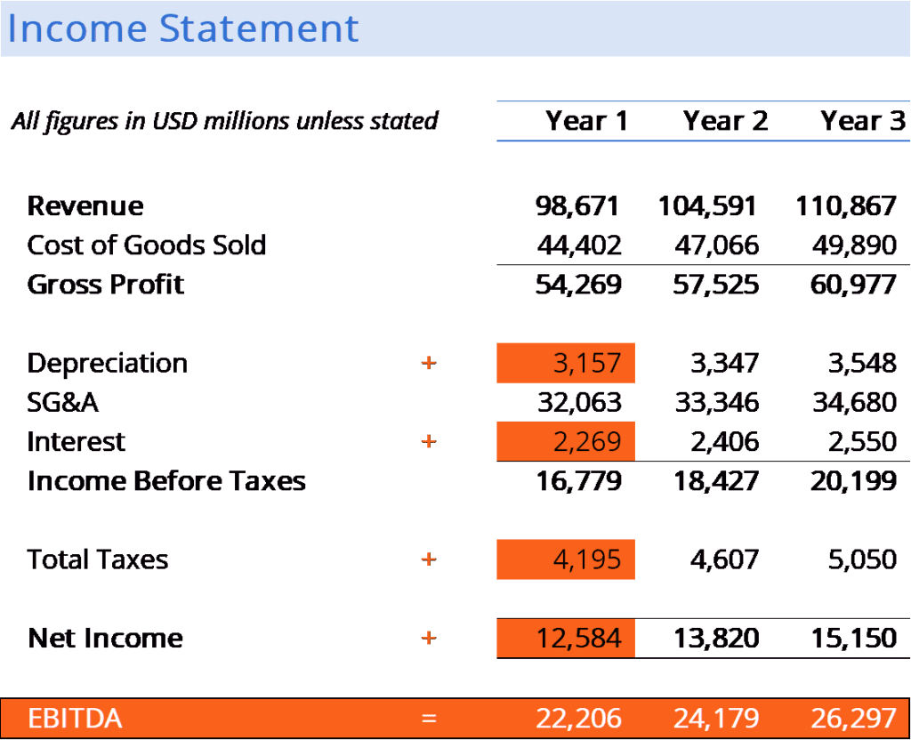

## Table of Contents

## What does EBITA stand for?

EBITA stands for Earnings Before Interest, Taxes, and Amortization. It is a financial metric used to measure a company's profitability by looking at its earnings before taking away the costs of interest, taxes, and amortization. This helps to show how well the company is doing at making money from its main business activities, without the influence of how it is financed or how it handles its taxes and amortization.

EBITA is useful because it gives a clearer picture of a company's operating performance. By not including interest, taxes, and amortization, it focuses on the profits generated from the core operations. This can be helpful when comparing companies in the same industry, as it removes the effects of different financing structures and tax strategies. However, it's important to remember that EBITA is just one of many financial metrics, and it should be used alongside others to get a full understanding of a company's financial health.

## How is EBITA calculated?

To calculate EBITA, you start with the company's earnings before interest and taxes (EBIT). You can find this number on the income statement. Then, you add back any amortization expenses that were subtracted to get to EBIT. Amortization is the gradual writing off of the cost of an intangible asset over its useful life. So, EBITA is simply EBIT plus amortization.

EBITA gives you a clear view of how much money a company is making from its main business activities, without considering how it pays for its operations or handles its taxes. It's useful for comparing companies in the same industry because it removes the effects of different financing and tax strategies. However, it's just one way to look at a company's financial health and should be used with other metrics for a complete picture.

## What is the difference between EBITA and EBITDA?

EBITA and EBITDA are both ways to measure how much money a company makes from its main business activities. The main difference between them is what they include or leave out. EBITA stands for Earnings Before Interest, Taxes, and Amortization. It looks at a company's earnings before taking away the costs of interest, taxes, and amortization. Amortization is the gradual writing off of the cost of an intangible asset over its useful life. So, EBITA gives you a clear picture of how well a company is doing at making money from its core operations, without considering how it pays for its operations or handles its taxes.

EBITDA, on the other hand, stands for Earnings Before Interest, Taxes, Depreciation, and Amortization. It goes one step further than EBITA by also adding back depreciation. Depreciation is the gradual writing off of the cost of a tangible asset over its useful life. By including both depreciation and amortization, EBITDA gives an even clearer view of a company's operating performance. It's useful for comparing companies in the same industry because it removes the effects of different financing structures, tax strategies, and how they handle their tangible and intangible assets. However, both EBITA and EBITDA are just two of many financial metrics, and they should be used alongside others to get a full understanding of a company's financial health.

## Why is EBITA important for financial analysis?

EBITA is important for financial analysis because it helps show how well a company is doing at making money from its main business activities. It does this by looking at the company's earnings before taking away the costs of interest, taxes, and amortization. This gives a clear picture of how profitable the company's core operations are, without the influence of how it pays for its operations or handles its taxes. By using EBITA, analysts can compare companies in the same industry more easily, as it removes the effects of different financing and tax strategies.

However, EBITA is just one way to look at a company's financial health. It's useful, but it should be used with other financial metrics to get a complete picture. For example, while EBITA shows the earnings from core operations, it doesn't tell you about the company's cash flow or how it's managing its debts. So, while EBITA is a helpful tool for understanding a company's operating performance, it's important to consider it alongside other measures like net income, cash flow, and debt levels to fully understand the company's financial situation.

## How does EBITA help in comparing company performance?

EBITA helps in comparing company performance by focusing on the earnings from their main business activities, without considering how they pay for their operations or handle their taxes. This is important because different companies might have different ways of financing their operations or different tax situations. By looking at EBITA, you can see how well each company is doing at making money from what they do best, without these other factors getting in the way. This makes it easier to compare companies in the same industry, even if they have different ways of handling their finances.

However, EBITA is just one way to look at how a company is doing. It's a helpful tool, but it doesn't tell you everything. For example, it doesn't show you how much cash the company has or how well it's managing its debts. So, while EBITA can give you a good idea of a company's operating performance, it's important to use it with other financial measures like net income, cash flow, and debt levels to get a full picture of the company's financial health.

## What are the limitations of using EBITA as a financial metric?

Using EBITA as a financial metric has some limitations. One big limitation is that it doesn't tell you about a company's cash flow. Cash flow is how much money a company has coming in and going out, which is really important for understanding if a company can pay its bills. EBITA only shows you how much money a company makes from its main business activities before interest, taxes, and amortization. So, if you only look at EBITA, you might think a company is doing well, but it could actually be struggling to pay its bills because it doesn't have enough cash.

Another limitation is that EBITA doesn't take into account how a company handles its debts. Interest payments on debt can be a big expense for a company, and if a company has a lot of debt, it might have trouble making these payments. EBITA doesn't include these interest payments, so it might make a company look more profitable than it really is. It's important to look at other financial metrics, like net income and debt levels, to get a full picture of a company's financial health.

Lastly, EBITA doesn't show you the impact of taxes on a company's earnings. Different companies might have different tax situations, and taxes can have a big effect on how much money a company keeps at the end of the day. By not including taxes, EBITA might not give you a complete view of a company's profitability. So, while EBITA is a helpful tool for understanding a company's operating performance, it's important to use it with other financial measures to get a full understanding of the company's financial situation.

## Can EBITA be manipulated by company management?

Yes, company management can manipulate EBITA. They can do this by changing how they report their earnings or by changing how they handle amortization. For example, they might decide to change the way they calculate amortization, which would change the amount of earnings they report before interest, taxes, and amortization. This can make the company look more or less profitable than it really is.

However, there are rules and checks in place to stop companies from manipulating their financial numbers too much. These rules are set by accounting standards and are watched by auditors and regulators. So, while management can try to manipulate EBITA, it's not easy to do without getting caught. It's important for investors and analysts to look at other financial metrics too, to get a full picture of a company's health.

## How does EBITA affect valuation in mergers and acquisitions?

EBITA is important when companies are buying or merging with other companies. It helps the buyers figure out how much the company they want to buy is worth. They look at the EBITA to see how much money the company makes from its main business activities, before taking away the costs of interest, taxes, and amortization. This gives them a clear picture of how profitable the company's core operations are, which is useful for deciding how much to pay for the company.

However, EBITA is just one piece of the puzzle. It doesn't tell the whole story about a company's financial health. For example, it doesn't show how much cash the company has or how it's managing its debts. So, while EBITA can give a good idea of a company's operating performance, buyers need to look at other financial measures too, like net income, cash flow, and debt levels, to make a smart decision about how much to pay for the company.

## What industries typically focus on EBITA as a key performance indicator?

Some industries that often use EBITA as a key performance indicator are technology and software companies. These businesses often have a lot of intangible assets, like patents or software, that they need to amortize over time. By looking at EBITA, they can see how much money they are making from their main business activities without the effect of amortization, which helps them understand their true operating performance.

Another industry that focuses on EBITA is the service industry, like consulting or professional services firms. These companies usually don't have a lot of physical assets, so they don't have much depreciation to worry about. But they might still have intangible assets that they need to amortize. By using EBITA, they can compare their performance with other companies in the same industry, without the influence of how they handle their taxes or financing.

## How does EBITA relate to operating income?

EBITA and operating income are similar because they both show how much money a company makes from its main business activities. Operating income is what you get when you take away all the costs of running the business from the money the company makes. This includes things like salaries, rent, and the cost of goods sold. EBITA goes a step further by adding back the costs of amortization to the operating income. Amortization is the gradual writing off of the cost of an intangible asset over its useful life. So, EBITA gives you a clearer picture of how well the company is doing at making money from its core operations, without the effect of how it handles its intangible assets.

However, there's a small difference between the two. Operating income includes all operating expenses, but it doesn't add back amortization. EBITA, on the other hand, does add back amortization. This makes EBITA a bit higher than operating income. Both numbers are useful for understanding a company's financial health, but they give slightly different views. Operating income shows you the profit after all operating costs, while EBITA shows you the profit before considering the costs of amortization.

## What are some real-world examples of companies using EBITA in their financial reports?

A good example of a company using EBITA in their financial reports is Microsoft. They often talk about their EBITA in their earnings reports to show how well their main business activities are doing. Microsoft has a lot of intangible assets like software and patents, which they need to amortize over time. By looking at their EBITA, investors can see how much money Microsoft makes from things like Windows and Office, without the effect of how they handle their intangible assets. This helps investors understand the true operating performance of the company.

Another example is Accenture, a big consulting and professional services company. They use EBITA in their financial reports to show how profitable their core operations are. Accenture doesn't have a lot of physical assets, so they don't worry much about depreciation. But they do have intangible assets that they need to amortize. By focusing on EBITA, Accenture can give a clear picture of how well they are doing at making money from their consulting and services work, without the influence of how they handle their taxes or financing. This helps them compare their performance with other companies in the same industry.

## How can investors use EBITA to make informed decisions?

Investors can use EBITA to make informed decisions by looking at how much money a company makes from its main business activities, before taking away the costs of interest, taxes, and amortization. This helps investors see how well the company is doing at its core operations, without the influence of how it pays for its operations or handles its taxes. By focusing on EBITA, investors can compare companies in the same industry more easily. For example, if two companies in the tech industry have similar EBITA numbers, it might mean they are doing about the same at making money from their main business activities, even if one has more debt or a different tax situation.

However, investors should not rely only on EBITA. It's just one way to look at a company's financial health. EBITA doesn't tell you about the company's cash flow or how it's managing its debts. So, while EBITA can give a good idea of a company's operating performance, it's important to use it with other financial measures like net income, cash flow, and debt levels. By looking at all these numbers together, investors can get a full picture of the company's financial situation and make smarter decisions about whether to invest in it.

## What is EBITA and how can it be understood?

Earnings Before Interest, Taxes, and Amortization (EBITA) is a financial metric used to evaluate a company's operational efficiency and profitability. It represents a firm's earnings derived purely from its core business operations, without the influence of interest expenses, tax obligations, and amortization of intangible assets. By excluding these factors, EBITA provides a clearer picture of a company's operational performance.

**Significance of Excluding Interest, Taxes, and Amortization:**

1. **Interest:** Excluding interest allows analysts to assess a company's operational profitability without the impact of its capital structure. This is crucial as interest payments are influenced by external factors such as interest rates and funding strategies, which can vary significantly between companies.

2. **Taxes:** Taxes vary based on jurisdiction and changes in legislation, making them an external factor that can distort comparisons between the core operational efficiencies of different companies. By excluding taxes, EBITA offers a more standardized measure for comparing companies.

3. **Amortization:** This non-cash expense arises from the gradual write-off of intangible assets like patents or trademarks. Amortization doesn't impact cash flow, so excluding it provides a purer sense of operational cash generation.

**Comparison of EBITA with Other Financial Metrics:**

EBITA is often compared with other financial metrics, notably Earnings Before Interest, Taxes, Depreciation, and Amortization (EBITDA). While both EBITA and EBITDA are designed to measure profitability before non-operational expenses, the key difference lies in the handling of depreciation.

- **EBITDA:** Includes both depreciation and amortization, providing a view of earnings before these non-cash charges. Depreciation accounts for the wear and tear of tangible assets over time, giving EBITDA a slightly broader scope compared to EBITA. It is particularly useful for asset-heavy industries where depreciation can significantly impact financial statements.

**Mathematical Representation:**

The formula for calculating EBITA is:

$$
\text{EBITA} = \text{Operating Income} + \text{Amortization}
$$

In income statements, operating income is typically the figure listed before interest and taxes are deducted. Adding back amortization adjusts for non-cash charges, thus isolating the operational earnings from core business activities.

Overall, EBITA provides valuable insights into a company’s operational performance and is an essential tool for stakeholders to compare firms on a more level field, devoid of the varied impacts of financing choices, tax environments, and non-cash amortization expenses.

## How do you calculate EBITA?

Earnings Before Interest, Taxes, and Amortization (EBITA) is a financial metric that provides insight into a company's operational efficiency by focusing on core business profitability. To derive EBITA from an income statement, follow these steps:

1. **Start with Operating Income**: Locate the operating income or earnings before interest and taxes (EBIT) on the income statement. This figure represents the company's profitability from regular operations before factoring in interest and tax expenses.

2. **Add Back Amortization**: Identify the amortization expense, which is the gradual write-off of intangible assets over time. This is typically found as a line item under expenses in the income statement. Add this amount back to the EBIT to arrive at EBITA.

**Formula for Calculating EBITA:**

$$
\text{EBITA} = \text{Operating Income (EBIT)} + \text{Amortization}
$$

**Practical Example:**

Consider a company with the following selected data from its income statement for a financial year:

- Operating Income (EBIT): $500,000
- Amortization Expense: $50,000

To calculate EBITA:

$$
\text{EBITA} = \$500,000 + \$50,000 = \$550,000
$$

In this example, the company's EBITA is $550,000, providing a metric of profitability that acknowledges operational income while neutralizing the impact of amortization.

**Python Example for Automation:**

Incorporating EBITA calculation in Python can be useful for automating financial analysis, especially when dealing with large datasets. Below is a basic Python script to calculate EBITA given operating income and amortization figures:

```python
def calculate_ebita(operating_income, amortization):
    return operating_income + amortization

# Example data
operating_income = 500000
amortization = 50000

# Calculate EBITA
ebita = calculate_ebita(operating_income, amortization)
print("EBITA:", ebita)
```

This Python function helps streamline the calculation process, making it easy to integrate EBITA computation into more complex financial models or trading algorithms.

## What is the difference between EBITA and other financial metrics?

Earnings Before Interest, Taxes, and Amortization (EBITA) is a financial metric used to evaluate a company's operational efficiency by excluding the costs of interest, taxes, and amortization. This metric is closely related to Earnings Before Interest, Taxes, Depreciation, and Amortization (EBITDA), yet there are distinctions between the two that can significantly influence their application in financial analysis.

**Differentiation between EBITA and EBITDA**

EBITA is calculated by taking the net income and adding back interest expenses, tax expenses, and amortization costs. In contrast, EBITDA further excludes depreciation costs. The formula for EBITA is:

$$
\text{EBITA} = \text{Net Income} + \text{Interest} + \text{Taxes} + \text{Amortization}
$$

For EBITDA, the formula extends to:

$$
\text{EBITDA} = \text{EBITA} + \text{Depreciation}
$$

The differentiation between EBITA and EBITDA is crucial because depreciation and amortization reflect different aspects of a company’s cost structure. While amortization deals with intangible assets, depreciation covers tangible assets. Companies with high capital expenditures and substantial tangible asset bases may have more significant depreciation costs, making EBITDA a more forgiving metric that could cloud true operational efficiency when compared to EBITA.

**Comparison with GAAP Earnings and Implications for Investors**

Generally Accepted Accounting Principles (GAAP) earnings encompass all expenses, including interest, taxes, depreciation, and amortization, providing a comprehensive view of a company's financial performance. Unlike EBITA and EBITDA, GAAP earnings consider all operational and non-operational activities, giving investors a clearer picture of net profitability. The primary implication for investors is that EBITA and EBITDA can sometimes overstate a company’s financial health by excluding certain costs, potentially leading to more favorable but less realistic evaluations of performance and valuation.

Investors should understand that EBITA offers a focused view on operations by excluding non-operational and non-cash expenses like amortization. However, relying solely on these adjusted metrics might fail to account for the entire scope of a company’s financial obligations. GAAP earnings, though inclusive of all factors, might be influenced by one-time or non-recurring items, making them less relevant for evaluating ongoing operational performance.

**The Significance of Depreciation in Financial Metrics**

Depreciation is the systematic reduction in the recorded cost of a tangible asset over its useful life and affects metrics that measure profitability and efficiency. Its exclusion in EBITDA can lead to a temporary inflation of profit figures, especially in asset-intensive industries like manufacturing and transportation. While investors may turn to EBITDA for insights into cash flow and operational effectiveness, ignoring depreciation can obscure a company's long-term asset renewal needs and investment cycles.

Depreciation's significance becomes evident when assets require replacement or upgrading. By not considering these future expenditures, EBITDA might appear better positioned than reality, particularly when forecasting future cash needs or assessing the sustainability of profit margins.

In summary, while EBITA serves as an important tool for measuring operational efficiency by excluding interest, taxes, and amortization, it is vital to understand its relationship with other financial metrics such as EBITDA and GAAP earnings. Depreciation, a key component absent from both EBITA and EBITDA yet included in GAAP, plays an essential role in portraying a complete picture of a company’s financial status for informed investment decisions.

## References & Further Reading

[1]: ["Valuation: Measuring and Managing the Value of Companies"](https://www.amazon.com/Valuation-Measuring-Managing-Companies-Finance/dp/1119610885) by McKinsey & Company Inc.

[2]: ["Algorithmic Trading and DMA: An Introduction to Direct Access Trading Strategies"](https://archive.org/details/algorithmictradi0000john) by Barry Johnson

[3]: ["Corporate Finance: The Core"](https://www.pearson.com/en-us/subject-catalog/p/corporate-finance-the-core/P200000005828/9780135870488) by Jonathan Berk and Peter DeMarzo

[4]: ["Financial Statement Analysis and Security Valuation"](https://www.amazon.com/Financial-Statement-Analysis-Security-Valuation/dp/0073379662) by Stephen Penman

[5]: ["Earnings Before Interest, Taxes, Depreciation, and Amortization: It’s Not All You Need To Know"](https://investinganswers.com/dictionary/e/ebitda) from Investopedia