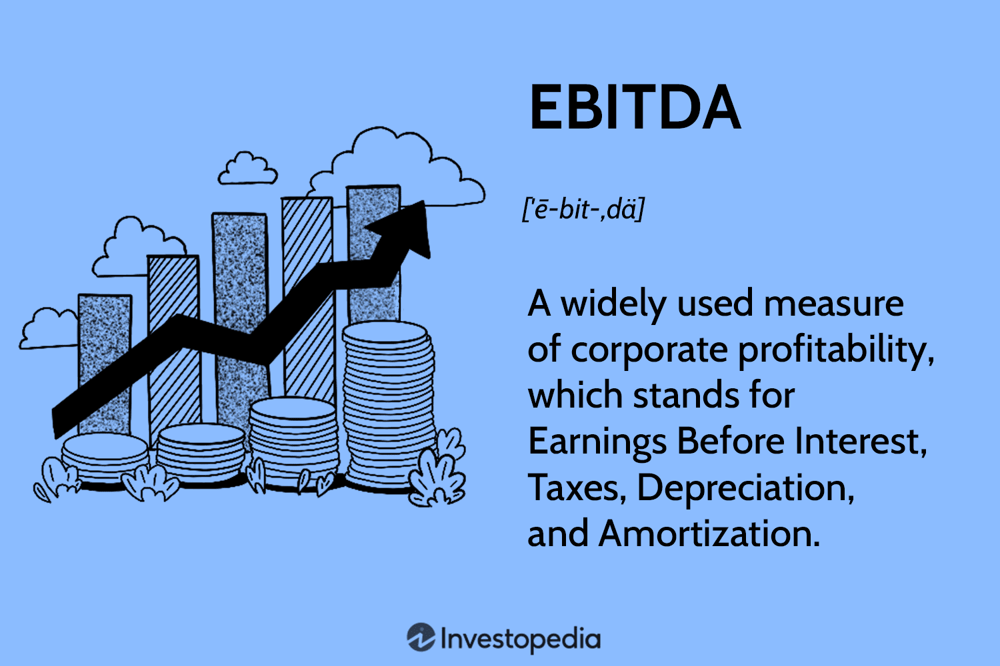

## Table of Contents

## What is EBITDA and what does it stand for?

EBITDA stands for Earnings Before Interest, Taxes, Depreciation, and Amortization. It is a way to measure a company's performance and profitability by looking at its earnings before taking away certain costs. These costs include interest on loans, taxes, and the gradual reduction in value of assets due to wear and tear (depreciation) or the spreading out of the cost of intangible assets (amortization).

EBITDA is useful because it gives a clearer picture of a company's operating performance without the influence of financial and accounting decisions. For example, two companies might have the same operating earnings, but different levels of debt, which affects their interest expenses. By looking at EBITDA, you can compare these companies more fairly, as it removes the impact of how they are financed or the tax rates they face. This makes it easier to see how well the core business is doing.

## How is EBITDA calculated?

To calculate EBITDA, you start with a company's net income, which is the profit after all expenses have been subtracted. Then, you add back the interest expense, which is the cost of borrowing money. Next, you add back the taxes the company paid. After that, you add back depreciation, which is the cost of wear and tear on physical assets like machinery, and amortization, which is the cost of using up intangible assets like patents over time. So, the formula is: Net Income + Interest + Taxes + Depreciation + Amortization = EBITDA.

EBITDA gives you a good idea of how much money a company is making from its main business activities, without the influence of how it's financed or the tax rates it faces. It's like looking at the company's earnings with some of the accounting and financial stuff taken out of the picture. This makes it easier to compare companies that might have different levels of debt or operate in different tax environments.

## Why is EBITDA important for businesses?

EBITDA is important for businesses because it shows how much money a company is making from its main activities, without worrying about things like loans, taxes, or the wear and tear of equipment. This makes it easier for business owners and investors to see if the company's core operations are doing well. For example, if a company has a high EBITDA, it means the business itself is strong, even if it has a lot of debt or pays a lot in taxes.

Another reason EBITDA is important is that it helps compare different companies more fairly. Since it doesn't include interest, taxes, depreciation, and amortization, you can look at two companies side by side and see which one is doing better at running its business, no matter where they are located or how they are financed. This is really helpful for investors who want to pick the best companies to invest in, or for business owners who want to see how they stack up against their competitors.

## Can you provide a brief history of EBITDA?

EBITDA became popular in the 1980s. It was used a lot during the big buyouts and takeovers that happened back then. People used EBITDA to figure out how much a company could borrow. They thought that if a company had a high EBITDA, it could handle a lot of debt. This made EBITDA a big deal in the world of business and finance.

Over time, EBITDA became more and more important. It's used not just for figuring out how much a company can borrow, but also for comparing different companies. It helps investors and business owners see how well a company is doing at its core business, without getting confused by things like taxes or how the company is financed. Today, EBITDA is a key number that many people look at when they want to understand a company's performance.

## How has the use of EBITDA evolved over time?

EBITDA started becoming popular in the 1980s. Back then, big companies were buying other companies, and they needed a way to figure out how much debt a company could handle. They found that EBITDA was a good way to do this. If a company had a high EBITDA, it meant it could probably take on a lot of debt. This made EBITDA really important in the world of business and finance during that time.

Over the years, the use of EBITDA has grown and changed. It's not just used for figuring out how much debt a company can handle anymore. Now, people use it to compare different companies and see how well they are doing at their main business. This helps investors and business owners understand a company's performance without getting confused by things like taxes or how the company is financed. Today, EBITDA is a key number that many people look at when they want to see how a company is doing.

## What are the common criticisms of using EBITDA as a financial metric?

Some people don't like using EBITDA because it can make a company look better than it really is. Since EBITDA doesn't include things like interest, taxes, depreciation, and amortization, it can make a company's earnings seem higher than they actually are. For example, if a company has a lot of debt, it will have to pay a lot of interest, but EBITDA doesn't show that. This can make the company look more profitable than it really is, which can be misleading.

Another problem with EBITDA is that it doesn't tell the whole story about a company's finances. Depreciation and amortization are real costs that a company has to deal with, even if they're not included in EBITDA. These costs represent the wear and tear on the company's equipment and the value of intangible assets over time. Ignoring these costs can give a false sense of how much money a company is really making. So, while EBITDA can be useful, it's important to look at other financial metrics too to get a complete picture of a company's health.

## How does EBITDA differ from net income?

EBITDA and net income are both ways to measure how much money a company is making, but they look at different things. Net income is the total profit a company makes after taking away all its costs, like the cost of making products, paying employees, interest on loans, taxes, and the wear and tear on equipment. It's the final number that shows how much money the company has left at the end of the day.

EBITDA, on the other hand, is a bit different. It stands for Earnings Before Interest, Taxes, Depreciation, and Amortization. This means it looks at the company's earnings before taking away the costs of interest on loans, taxes, and the wear and tear on equipment (depreciation) or the cost of using up intangible assets like patents (amortization). So, EBITDA gives you a picture of how much money the company is making from its main business activities, without worrying about how it's financed or the tax rates it faces.

## In what scenarios is EBITDA most useful?

EBITDA is really helpful when you want to see how well a company is doing at its core business, without getting confused by things like loans, taxes, or the wear and tear of equipment. For example, if a company is thinking about buying another company, they might look at the target company's EBITDA to see if it's making enough money from its main activities to cover the cost of the buyout. Investors also use EBITDA a lot because it helps them compare different companies more easily, no matter where they are or how they are financed.

Another scenario where EBITDA is useful is when a company is trying to figure out how much debt it can handle. If a company has a high EBITDA, it means it's making a lot of money from its main business, so it might be able to take on more debt. This is important for companies that are growing fast and need to borrow money to keep up. But, it's also important to remember that EBITDA doesn't tell the whole story, so it's best to use it along with other financial measures to get a complete picture of a company's health.

## What are the limitations of EBITDA when analyzing a company's financial health?

One big problem with using EBITDA to look at a company's financial health is that it can make a company look better than it really is. EBITDA doesn't include things like interest on loans, taxes, and the wear and tear on equipment. These are real costs that a company has to pay, but because they're not in the EBITDA number, the company can seem more profitable than it actually is. This can be misleading, especially if a company has a lot of debt or old equipment that needs to be replaced.

Another limitation is that EBITDA doesn't give you the full picture of a company's finances. It's good for seeing how much money a company makes from its main business, but it doesn't tell you about other important things like how much cash the company has or how much it owes. For example, a company might have a high EBITDA but not enough cash to pay its bills. So, while EBITDA can be a helpful tool, it's important to look at other financial measures too to really understand how healthy a company is.

## How can EBITDA be manipulated by companies, and what are the ethical considerations?

Companies can sometimes play around with EBITDA to make their financials look better. They might do things like change how they count depreciation or amortization, or they might move expenses around to make their EBITDA look higher. For example, a company could decide to spend a lot of money on something and call it a one-time cost, so it doesn't show up in EBITDA. This can make the company look more profitable than it really is, which can fool investors and other people who are looking at the company's numbers.

Playing around with EBITDA like this raises some big ethical questions. It's not right to trick people by making the company's financials look better than they are. When companies do this, they can hurt their investors, who might make bad decisions based on the wrong information. It's important for companies to be honest and clear about their finances, so everyone can trust them. Using EBITDA in a way that's fair and honest helps keep that trust and makes sure everyone has a good understanding of how the company is really doing.

## What are some alternatives to EBITDA that analysts might use?

Analysts might use other ways to look at a company's money situation instead of just using EBITDA. One common way is to look at the company's net income. Net income is the total profit a company makes after taking away all its costs, like the cost of making products, paying employees, interest on loans, taxes, and the wear and tear on equipment. It gives a full picture of how much money the company has left at the end of the day. Another way is to look at operating income, which is the profit a company makes from its main business activities before taking away interest and taxes. This can help show how well the company is doing at its core business, but it still includes costs like depreciation and amortization.

Another alternative is to look at free cash flow, which is the money a company has left after it pays for everything it needs to keep running and growing. Free cash flow is important because it shows how much money the company can use for things like paying back loans, buying back its own stock, or paying dividends to shareholders. It's a good way to see if a company is really making money, not just on paper but in real cash. By looking at these different measures, analysts can get a better understanding of a company's financial health and make more informed decisions.

## How do different industries view and utilize EBITDA differently?

Different industries use EBITDA in their own special ways. In industries like manufacturing or heavy machinery, where companies have a lot of big equipment that wears out over time, EBITDA is really important. These companies have high costs for depreciation because their machines get old and need to be replaced. By looking at EBITDA, they can see how much money they're making from their main business without worrying about these big costs. This helps them compare themselves to other companies in the same industry more easily.

In the tech industry, things are a bit different. Tech companies often have a lot of intangible assets like software or patents, which they spread out over time as amortization. They might also have less physical stuff that wears out, so their depreciation costs are lower. For these companies, EBITDA can still be useful, but they might focus more on other measures like free cash flow or net income to get a full picture of their financial health. Each industry has its own way of looking at EBITDA, depending on what's most important for their business.

## What is EBITDA and how can it be understood?

EBITDA, an acronym for Earnings Before Interest, Taxes, Depreciation, and Amortization, is a financial metric that provides an overview of a company's operational performance by focusing on its profitability from core business operations. This metric is particularly valuable as it excludes expenses associated with fluctuating financial and external factors such as interest and tax, alongside depreciation and amortization, which may not directly impact immediate operational efficiency.

To break down EBITDA: 
- **Earnings** refer to the net income generated before considering the expenses associated with interest, taxes, depreciation, and amortization. 
- **Interest** is the cost incurred due to borrowed funds.
- **Taxes** encompass the mandatory charges a company pays to the government.
- **Depreciation** is the accounting method of allocating the cost of tangible assets over their useful life.
- **Amortization** is the gradual write-off of an intangible asset over a period.

EBITDA is calculated using the following formula:

$$
\text{EBITDA} = \text{Net Income} + \text{Interest} + \text{Taxes} + \text{Depreciation} + \text{Amortization}
$$

Alternatively, starting from operating income, it can be calculated as:

$$
\text{EBITDA} = \text{Operating Income} + \text{Depreciation} + \text{Amortization}
$$

For example, consider a company with a net income of $100,000, interest expenses of $10,000, tax expenses of $20,000, depreciation costs of $15,000, and amortization expenses of $5,000. The company's EBITDA calculation would be:

$$
\text{EBITDA} = 100,000 + 10,000 + 20,000 + 15,000 + 5,000 = 150,000
$$

EBITDA is often used as an indicator of a company's operational efficiency because it provides insights into the operating profitability by factoring out financial and accounting decisions as well as certain non-cash items, making it easier to compare companies across and within industries. 

The advantages of using EBITDA in business evaluations include its ability to provide a clearer view of operational profitability by excluding volatile financial influences. It is particularly useful in comparing companies with different capital structures or tax environments, as these factors are excluded from the analysis. Additionally, many investors and analysts during mergers and acquisitions rely on EBITDA multiples to assess the value of a company, disregarding potential manipulations inherent in net income due to interest and tax strategies.

Despite its popularity, it is important to remember that EBITDA does not account for the cash costs a company incurs related to debt and capital investments, which can sometimes lead to an overly optimistic view of financial health if considered in isolation.

## What is the role of EBITDA in business evaluation?

EBITDA, which stands for Earnings Before Interest, Taxes, Depreciation, and Amortization, is a key financial metric widely used to evaluate a company's performance. It provides insights into a company's operational efficiency by isolating earnings generated from core business operations, excluding the effects of financing, accounting decisions, and taxation.

**Evaluation of Company Performance Using EBITDA**

EBITDA serves as a common standard for comparing the financial performance of firms within similar industries. By focusing on operational earnings, it enables analysts to assess intrinsic performance free from the skewing effects of varied taxation and capital structure across companies. For example, a company with a high EBITDA relative to its peers may be seen as more efficient in its operations, thereby offering a reliable benchmark for performance comparison.

**EBITDA Multiples in Mergers and Acquisitions**

In the context of mergers and acquisitions (M&A), EBITDA is often employed to determine the value of companies. EBITDA multiples, which are calculated by dividing the enterprise value by EBITDA, are commonly used to assess fair value and establish whether a company is over or undervalued. The formula for calculating the EBITDA multiple is:

$$
\text{EBITDA Multiple} = \frac{\text{Enterprise Value}}{\text{EBITDA}}
$$

Higher EBITDA multiples can indicate an expectation of significant future growth or market conditions favoring the company, making it a vital tool in M&A negotiations.

**Assessing Company Value Beyond Net Income**

EBITDA allows investors to gain a perspective on a company’s value that extends beyond net income. While net income includes non-cash items and interest expenses, EBITDA highlights the profit generated from a company's operations. By not accounting for capital investments, which vary greatly among industries and companies, EBITDA offers a clearer picture of operational cash flow potential, thereby aiding investors in understanding the business’s core profitability.

**Limitations and Criticisms of EBITDA**

Despite its advantages, EBITDA has limitations. One significant criticism is its exclusion of capital expenditures. Companies with substantial capital investments may appear more profitable under EBITDA analysis, yet their cash flow might be significantly lower due to these investments. Additionally, EBITDA does not provide a complete picture of an entity's financial health, as it ignores the impact of debt, interest, and changes in working capital. Critics argue that reliance on EBITDA could lead to oversight of financial liabilities and potential cash shortages.

In conclusion, while EBITDA is a useful indicator for comparing company performance and assessing operational efficiency, it should be used judiciously alongside other financial metrics to present a holistic view of a company's financial standing and its potential future growth.

## What is the relationship between Algorithmic Trading and Financial Metrics?

Algorithmic trading refers to the use of computer programs and algorithms to execute financial trades at speeds and frequencies far beyond human capability. These strategies rely heavily on data-driven decision-making processes, leveraging vast amounts of quantitative data to identify trading opportunities and optimize execution. Financial metrics, such as EBITDA (Earnings Before Interest, Taxes, Depreciation, and Amortization), are integral to developing [algorithmic trading](/wiki/algorithmic-trading) models. They provide insights into a company's financial health, operational efficiency, and market potential, which are crucial for informed trading decisions.

The inclusion of EBITDA in algorithmic trading models primarily aids in evaluating and comparing companies' financial performance before non-operational factors impact net income. By focusing on core earnings, without the influence of capital structure, tax environment, or accounting decisions regarding depreciation and amortization, algorithms can assess a company's true operational capacity. This assessment is particularly useful for fundamentally driven trading strategies that invest in or short stocks based on the intrinsic value implied by financial ratios.

Key performance metrics in algorithmic trading include the Sharpe Ratio, Maximum Drawdown, and Value-at-Risk (VaR).

1. **Sharpe Ratio**: This metric evaluates the risk-adjusted return of an investment portfolio. It is calculated as:
$$
   \text{Sharpe Ratio} = \frac{R_p - R_f}{\sigma_p}

$$

   where $R_p$ is the portfolio return, $R_f$ is the risk-free rate, and $\sigma_p$ is the standard deviation of the portfolio returns.

2. **Maximum Drawdown**: This measures the largest peak-to-trough decline in the value of a portfolio over a specified period. It indicates potential capital loss risk and helps in understanding the investment strategy's downside potential.

3. **Value-at-Risk (VaR)**: This quantifies the potential loss in the value of a portfolio over a defined period, given normal market conditions, at a certain confidence level. VaR allows risk managers to understand the potential exposure to market risks based on historical data.

EBITDA serves a crucial role in assessing companies for inclusion in trading strategies by offering a standardized measure of profitability. It helps identify companies with strong operational performance that may be undervalued or overvalued in the market. For instance, a trading algorithm might prioritize companies with high EBITDA margins compared to industry averages, targeting stocks with efficient operations that may translate into future growth potential. 

In conclusion, algorithmic trading's effectiveness hinges significantly on the quality of data employed, with financial metrics like EBITDA forming a foundational component of robust trading algorithms. By harmonizing these quantitative measures with other risk-adjusted metrics, traders and automated systems can craft strategies that are not only profitable but also resilient to market fluctuations.

## References & Further Reading

[1]: ["EBITDA: Earnings Before Interest, Taxes, Depreciation, and Amortization"](https://www.investopedia.com/terms/e/ebitda.asp) - Investopedia

[2]: Koller, T., Goedhart, M., & Wessels, D. (2015). ["Valuation: Measuring and Managing the Value of Companies"](https://www.mckinsey.com/capabilities/strategy-and-corporate-finance/our-insights/valuation-measuring-and-managing-the-value-of-companies) - Wiley Finance

[3]: Damodaran, A. (2012). ["Investment Valuation: Tools and Techniques for Determining the Value of Any Asset"](https://books.google.com/books/about/Investment_Valuation.html?id=5SRHAAAAQBAJ) - Wiley Finance

[4]: Lopez de Prado, M. (2018). ["Advances in Financial Machine Learning"](https://books.google.com/books/about/Advances_in_Financial_Machine_Learning.html?id=oU9KDwAAQBAJ) - Wiley

[5]: Narang, R. K. (2013). ["Inside the Black Box: A Simple Guide to Quantitative and High-Frequency Trading"](https://onlinelibrary.wiley.com/doi/book/10.1002/9781118662717) - Wiley

[6]: Chan, E. (2009). ["Quantitative Trading: How to Build Your Own Algorithmic Trading Business"](https://github.com/ftvision/quant_trading_echan_book) - Wiley

[7]: Khilov, V. M. (2016). ["Algorithmic Trading: Winning Strategies and Their Rationale"](https://www.researchgate.net/publication/378548435_Algorithmic_Trading_and_AI_A_Review_of_Strategies_and_Market_Impact) - Wiley Trading