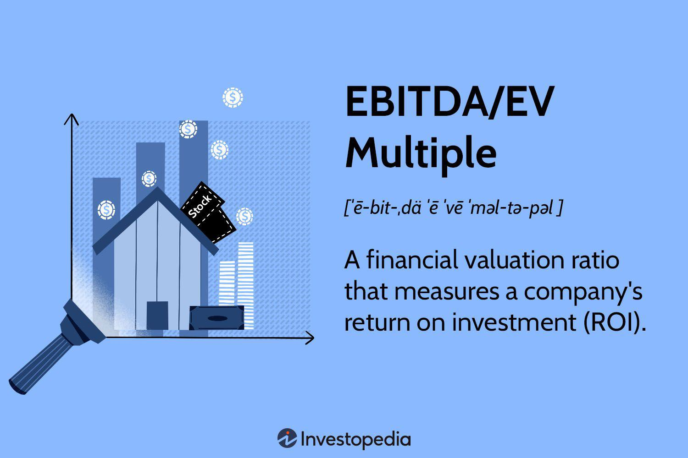

The EBITDA/EV multiple is a significant financial metric employed for evaluating company returns, particularly in the context of algorithmic trading. Recognized for its capacity to provide a comprehensive analysis of a company's operational performance, this ratio is increasingly utilized by algorithmic traders to inform strategic decisions. An understanding of EBITDA/EV is essential for investors seeking to parse complex financial landscapes and identify lucrative opportunities.

EBITDA, which stands for Earnings Before Interest, Taxes, Depreciation, and Amortization, offers a snapshot of a company's operational profitability. Meanwhile, the Enterprise Value (EV) metric represents the total value of a company, taking into account equity, debt, and cash reserves. The EBITDA/EV ratio is derived by dividing a company's EBITDA by its EV, thus serving as a reflection of return on investment while allowing for seamless company comparisons. This ratio is favored for its normalization of capital structure variations, facilitating clearer comparative analyses.



This article aims to provide insights into wielding this metric effectively for earnings analysis, with a special focus on algorithmic trading applications. By exploring its definitions and calculations, we attempt to illustrate its pivotal role in modern economic assessments. As algorithmic trading continues to evolve, the mastery of such financial metrics will increasingly become a critical factor in gaining competitive advantages in the markets.

## Table of Contents

## Understanding EBITDA/EV Multiple

EBITDA (Earnings Before Interest, Taxes, Depreciation, and Amortization) serves as a key indicator of a company's operational profitability. It is a measure that focuses on earnings derived from core business operations, excluding the effects of capital structure, non-cash accounting items, and taxes. By isolating these core earnings, EBITDA provides a clearer picture of operational efficiency and cash flow generation capabilities.

Enterprise Value (EV), on the other hand, represents the total value of a company. It includes the market capitalization of its equity, the market value of its debt, and any minority interest, minus the company's cash and cash equivalents. Essentially, EV offers a comprehensive view of a company's total valuation from both equity and debt holder perspectives, offering a fuller picture than just market capitalization alone.

The EBITDA/EV multiple, therefore, divides EBITDA by Enterprise Value:

$$
\text{EBITDA/EV} = \frac{\text{EBITDA}}{\text{Enterprise Value}}
$$

This ratio is instrumental in assessing a company's return on investment, as it indicates how much operating earnings a company generates per dollar of Enterprise Value. A lower EBITDA/EV multiple might suggest a company is undervalued relative to its peers, assuming comparable operational efficiencies and market conditions. Conversely, a higher multiple could imply overvaluation or superior operational performance.

The preferred use of the EBITDA/EV multiple stems from its normalization for differences in capital structures among companies. Since EBITDA excludes interest, taxes, depreciation, and amortization, it mitigates discrepancies arising from varied methods of financing capital projects and differences in local taxation. This makes the metric particularly useful for cross-company comparative analyses, as it isolates operating performance from capital structure decisions, ownership structures, and accounting policies.

Furthermore, the EBITDA/EV multiple is less affected by fluctuations in accounting policies compared to other valuation metrics such as the Price-to-Earnings (P/E) ratio. This advantage allows investors and analysts to focus more accurately on the intrinsic economic value created by the firm's core operations, independent of its capital and tax situations. As such, the EBITDA/EV multiple is a widely accepted standard for evaluating potential investment opportunities across different companies and industries.

## Significance in Earnings Analysis

EBITDA/EV is an essential metric for analyzing cash flow-driven earnings due to its unique ability to distill a company's operational performance, free from the influences of capital structure and tax considerations. EBITDA, or Earnings Before Interest, Taxes, Depreciation, and Amortization, effectively captures the core income generated by a company's operations. By dividing this by the Enterprise Value (EV), which sums a company's market capitalization, debt, and subtracts cash, the EBITDA/EV ratio offers a comprehensive view of operational efficiency and investment return potential.

This metric's primary strength lies in its focus on the sustainable cash [earning](/wiki/earning-announcement) power of a business, rather than transient fluctuations influenced by financial leverage, tax strategies, or capital expenditure policies. Consequently, EBITDA/EV allows investors and analysts to concentrate on core operational value and profitability, providing a clearer picture of a company's financial health. This is particularly beneficial for comparative analysis across firms with varying capital structures and tax regimes, as it levels the playing field and facilitates a more objective assessment of profitability potential.

The significance of EBITDA/EV in earnings analysis also extends to its utility in valuation comparisons. By standardizing earnings before the impact of financing and accounting decisions, this multiple aids in distinguishing genuine operational competency from mere financial engineering. As a result, it emerges as a robust tool for dissecting company performance, offering insights that are both comprehensive and objective.

## Algorithmic Trading and Financial Ratios

Algorithmic trading represents a pivotal shift in modern finance, capitalizing on computational power to execute trades at speeds and volumes impossible for human traders. Within this high-frequency trading landscape, financial ratios such as the EBITDA/EV multiple become indispensable tools for constructing robust trading algorithms. 

These ratios facilitate real-time assessments of company valuations, allowing algorithmic systems to make informed, strategic decisions. By integrating the EBITDA/EV multiple, which measures a company's operating profitability relative to its enterprise value, trading algorithms can efficiently parse through vast datasets to identify undervalued or overvalued securities.

The EBITDA/EV multiple stands out for its ability to normalize for capital structure discrepancies, offering a clear perspective on operational performance without the noise of debt or equity variance. This normalization ensures that algorithms can effectively compare companies across different industries or regions. The formula for calculating the EBITDA/EV multiple is straightforward:

$$
\text{EBITDA/EV} = \frac{\text{EBITDA}}{\text{Enterprise Value}}
$$

In practice, algorithmic traders employ advanced programming languages such as Python to automate the evaluation of these financial ratios. A simple Python function to calculate this ratio could look like this:

```python
def calculate_ebitda_ev(ebitda, enterprise_value):
    if enterprise_value == 0:
        return None  # Avoid division by zero
    return ebitda / enterprise_value

# Example usage
ebitda = 500000
enterprise_value = 2500000
ebitda_ev = calculate_ebitda_ev(ebitda, enterprise_value)
print(f"EBITDA/EV Multiple: {ebitda_ev}")
```

By harnessing such calculations, algorithmic traders can rank potential investments, focusing on those that align with predefined strategic criteria. The EBITDA/EV ratio not only quantifies a company’s current value but also streamlines the selection process, pinpointing the most promising opportunities amidst data-intensive trading environments. As [algorithmic trading](/wiki/algorithmic-trading) continues to evolve, mastery of financial ratios like EBITDA/EV will remain central to unlocking competitive market advantages.

## Calculating the EBITDA/EV Multiple

The EBITDA/EV multiple is a key financial metric calculated by dividing a company's Earnings Before Interest, Taxes, Depreciation, and Amortization (EBITDA) by its Enterprise Value (EV). This ratio provides a method to evaluate a company's operational profitability in relation to its overall valuation. It serves as a robust indicator for investors and analysts seeking to understand the intrinsic value of a business, devoid of the inconsistencies brought by varied capital structures. 

Mathematically, the EBITDA/EV multiple is expressed as:

$$
\text{EBITDA/EV} = \frac{\text{EBITDA}}{\text{Enterprise Value}}
$$

Here, EBITDA is a measure of a company's core earnings ability, excluding non-operational factors such as interest, taxes, and non-cash accounting items. EV, on the other hand, is a comprehensive valuation measure, considering market capitalization, debt, and cash balances, effectively capturing the total economic value of the business.

Utilizing both current and forecasted EBITDA values in calculating the EBITDA/EV multiple allows analysts to assess not only the existing profitability landscape but also future performance prospects. A high or increasing multiple can suggest that investors anticipate strong earnings growth, while a low or declining multiple might indicate potential undervaluation or anticipated challenges.

In financial modeling, the use of Python to calculate the EBITDA/EV multiple can streamline the analysis process. Below is an example of a basic Python function to calculate this ratio:

```python
def calculate_ebitda_ev_multiple(ebitda, enterprise_value):
    if enterprise_value == 0:
        return float('inf')
    return ebitda / enterprise_value

# Example usage:
ebitda = 5000000  # Example EBITDA in currency units
enterprise_value = 25000000  # Example Enterprise Value in currency units

ebitda_ev_multiple = calculate_ebitda_ev_multiple(ebitda, enterprise_value)
print(f"EBITDA/EV Multiple: {ebitda_ev_multiple}")
```

This ability to utilize projected data alongside historical values enhances the robustness of the EBITDA/EV multiple as a tool in earnings analysis, providing a dynamic picture of a company's market standing and potential growth trajectory.

## Case Studies and Real-World Applications

Wal-Mart Inc. and Target Corporation provide illustrative examples of the application of the EBITDA/EV multiple in assessing company value within the retail sector. The divergence in their EBITDA/EV multiples offers insights into how industry-specific benchmarks can guide investment decisions.

### Wal-Mart Inc.
Wal-Mart, as one of the largest global retail corporations, often exhibits a relatively low EBITDA/EV multiple. This can be attributed to its massive scale, steady cash flow, and broad market presence, which leads to lower perceived risk. A lower EBITDA/EV multiple is typically indicative of a more mature company with stable earnings and lower growth prospects. For investors, particularly those employing algorithmic trading, Wal-Mart's multiple may signal a stable investment with less [volatility](/wiki/volatility-trading-strategies), aligning with a long-term, value-based approach.

### Target Corporation
Conversely, Target tends to have a higher EBITDA/EV multiple compared to Wal-Mart. This can be reflective of its aggressive growth strategies, innovation in digital sales platforms, and investments in supply chain improvements. A higher EBITDA/EV could suggest higher growth potential but also increased risk. For algorithmic traders, Target's multiple might highlight opportunities for capitalizing on short-term movements driven by growth expectations or changes in market conditions.

### Key Insights
The contrasting EBITDA/EV multiples of Wal-Mart and Target underscore the importance of context in financial analysis. A comprehensive understanding of why one company may present a higher or lower multiple, considering factors such as market position, growth strategies, and risk profiles, is pivotal for investors. These metrics are not merely numerical; they reflect strategic business decisions and market perceptions. By integrating such insights into algorithmic models, traders can enhance their decision-making processes, adapting to diverse investment strategies and market conditions.

### Python Example for EBITDA/EV Calculation
To compute the EBITDA/EV ratio for a company, you can use the following Python example:

```python
# Sample Data
ebitda_walmart = 343.21  # in billions USD
ev_walmart = 400.50  # in billions USD
ebitda_target = 25.5  # in billions USD
ev_target = 32.0  # in billions USD

# Calculation of EBITDA/EV Multiple
ebitda_ev_walmart = ebitda_walmart / ev_walmart
ebitda_ev_target = ebitda_target / ev_target

print(f"Walmart EBITDA/EV Multiple: {ebitda_ev_walmart:.2f}")
print(f"Target EBITDA/EV Multiple: {ebitda_ev_target:.2f}")
```

This code snippet calculates the EBITDA/EV multiples for Walmart and Target using hypothetical financial data. By comparing these multiples, investors can derive insights into the relative valuation and growth potential of each company, helping to inform strategic investment decisions in the retail sector.

## Conclusion

The EBITDA/EV multiple is a fundamental tool for strategic earnings analysis in modern finance and trading. This ratio serves as a powerful lens through which operational efficiency and investment potential are evaluated, providing investors and analysts with critical insights into a company's financial health. By focusing on core operational performance and normalizing for capital structure differences, the EBITDA/EV multiple offers a clear, unobstructed view of a company's profitability.

Algorithmic trading relies heavily on precise and robust financial metrics like the EBITDA/EV multiple to inform trading models and investment decisions. As trading algorithms continue to advance, accurately interpreting and applying such metrics becomes crucial for optimizing trading strategies and maintaining competitiveness. Mastering the EBITDA/EV multiple, among other financial tools, can offer traders and investors a significant competitive edge, enabling them to navigate complex market environments more effectively and make more informed, strategic investment choices.

Ultimately, the ongoing evolution of algorithmic trading underscores the importance of deep financial expertise and the ability to harness mathematical and computational techniques. As the financial markets continue to grow in complexity, a thorough understanding of financial metrics like the EBITDA/EV multiple will be indispensable for identifying operational strengths and investment opportunities.

## References & Further Reading

[1]: ["Valuation: Measuring and Managing the Value of Companies"](https://www.amazon.com/Valuation-Measuring-Managing-Companies-Finance/dp/1119610885) by McKinsey & Company Inc. 

[2]: Damodaran, A. (2005). ["Valuation Approaches and Metrics: A Survey of the Theory and Evidence."](https://people.stern.nyu.edu/adamodar/pdfiles/papers/valuesurvey.pdf) Foundations and Trends in Finance, 1(8), 693-784.

[3]: Greenblatt, J. (2010). ["The Little Book That Still Beats the Market."](https://books.google.com/books/about/The_Little_Book_That_Still_Beats_the_Mar.html?id=M5HxYZaNQEQC) John Wiley & Sons.

[4]: Bodie, Z., Kane, A., & Marcus, A. (2014). ["Investments."](https://www.mheducation.com/highered/product/investments-bodie-kane/M9781264412662.html) McGraw-Hill Education.

[5]: ["Damodaran on Valuation: Security Analysis for Investment and Corporate Finance,"](https://www.amazon.com/Damodaran-Valuation-Security-Investment-Corporate/dp/0471751219) by Aswath Damodaran.