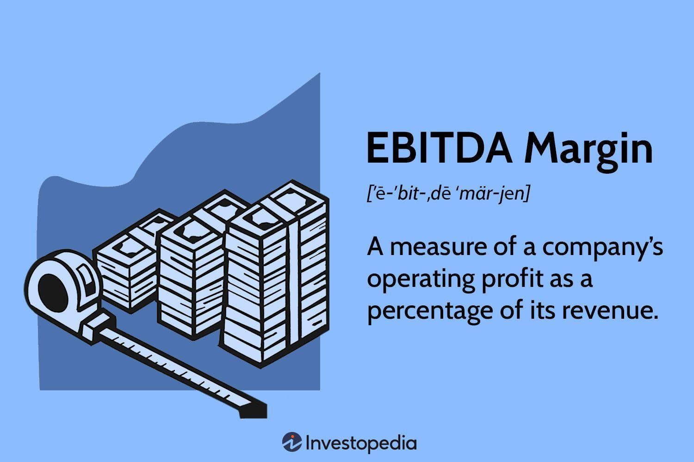

In the ever-evolving world of finance, understanding key metrics is crucial for evaluating business performance. This article explores critical components of business finance, including financial analysis, the EBITDA margin, and algorithmic trading. Each of these elements plays a vital role in shaping the methods by which financial metrics are utilized to make informed decisions.

Financial metrics such as EBITDA (Earnings Before Interest, Taxes, Depreciation, and Amortization) are central in assessing a firm's operational efficiency and profitability. EBITDA provides insight into the core earnings potential of a company by excluding non-operational and non-cash flow-related expenses. As a result, it is an effective tool for comparing companies within the same industry, as it focuses purely on operational performance without external factors influencing the outcome.



Algorithmic trading, another focus of this article, is transforming investment and trading strategies through automation and data analysis. By employing complex algorithms, investors and traders can process and react to vast amounts of market data with unprecedented speed and precision. Such capabilities allow for strategic financial decision-making based on real-time analyses and trends, often incorporating financial metrics like EBITDA to optimize investment strategies.

By examining the integration of EBITDA in algorithmic trading and the intersection of these disciplines within financial analysis, this article aims to provide a comprehensive overview of their collective role in enhancing financial decision-making. Understanding these concepts allows businesses and investors to develop robust strategies that align with current and future financial landscapes.

## Table of Contents

## Understanding Business Finance and Financial Analysis

Business finance is the strategic activity that involves the management of a company’s capital to achieve its financial goals. This includes finding effective sources of financing, managing capital structures, and making investment decisions that will maximize shareholder value. It is fundamental for ensuring that a company has the necessary resources to operate, grow, and thrive in competitive markets. Business finance also involves evaluating the best allocation of resources, conducting cost-benefit analyses, and maintaining a balance between risk and profitability.

Financial analysis plays a crucial role in this process. It provides the tools and methodologies required to interpret financial data, identify trends, and forecast future performance. Financial analysis aids businesses in planning by evaluating past and present financial conditions and using this information to make sound future decisions. This process not only supports effective decision-making but also helps in managing risks and seizing new opportunities.

One essential component of financial analysis is understanding various financial metrics. Among these, the EBITDA margin is a significant indicator used to gauge a company's profitability and operational efficiency. EBITDA, which stands for Earnings Before Interest, Taxes, Depreciation, and Amortization, offers a perspective on a company's core operational earnings without the influence of capital structure, tax rates, and fixed asset accounting. Calculating the EBITDA margin involves expressing EBITDA as a percentage of total revenue, providing insights into how much of each dollar in revenue translates into operating earnings. The formula is given by:

$$
\text{EBITDA Margin} = \left( \frac{\text{EBITDA}}{\text{Total Revenue}} \right) \times 100
$$

This metric is particularly useful for comparing companies within the same industry, as it provides a standardized measure of operating profitability. It removes variables that might distort comparisons, such as differences in tax jurisdictions or capital expenditures.

In business finance, metrics like EBITDA are employed to evaluate financial performance, support strategic financial planning, and inform investors and stakeholders about the company’s operational health. By understanding and utilizing these financial indicators, businesses can implement better strategic initiatives, optimize their financial structures, and improve overall financial health.

## EBITDA and EBITDA Margin

EBITDA, an acronym for Earnings Before Interest, Taxes, Depreciation, and Amortization, is a widely adopted financial metric used to evaluate a company's core operational earnings. It represents the earnings generated from core business operations, excluding the effects of capital structure, tax expenses, and non-cash accounting items such as depreciation and amortization. This metric provides insight into a company's financial health by emphasizing operational efficiency, free from external financial and accounting influences.

The EBITDA margin, on the other hand, expresses a company's EBITDA as a percentage of its total revenue. This ratio is vital because it allows for assessing operational efficiency across different companies, irrespective of capital structures and tax regimes. To calculate the EBITDA margin, the following formula can be applied:

$$
\text{EBITDA Margin} = \left(\frac{\text{EBITDA}}{\text{Total Revenue}}\right) \times 100
$$

High EBITDA margins typically suggest that a company is efficient in converting revenue into operational earnings, while lower margins may indicate inefficiency or higher operational costs.

EBITDA is crucial for evaluating a company’s performance relative to its peers within the industry. By focusing on operational profitability, it allows for a more straightforward comparison between companies with different financial structures or capital investments. Investors and analysts often use EBITDA as a benchmark to compare similar businesses and industry norms. It helps highlight the operational profitability potential without being obscured by differing financial policies concerning interest and taxes or regional accounting treatments regarding depreciation and amortization.

Understanding the calculation and interpretation of EBITDA and its margin is fundamental to financial analysis. These metrics are pivotal in conducting peer comparisons, assessing profitability, and making informed investment decisions. Analysts appreciate EBITDA because it can reveal underlying operational performance trends, allowing them to strip away noise created by financing and accounting decisions.

In summary, EBITDA and its margin provide a focused view of profitability that is particularly useful in comparing companies or assessing business efficiency. These metrics hold significant value for investors and analysts in evaluating the core operational performance absent the influence of extraneous financial and accounting factors.

## Algorithmic Trading: Revolutionizing Investment Strategies

Algorithmic trading represents a significant transformation in the investment landscape through the use of sophisticated computer algorithms to automate trading processes. These algorithms are designed to rapidly analyze vast datasets, enabling them to make timely and informed trading decisions. By employing [algorithmic trading](/wiki/algorithmic-trading), investors can execute trades with speed and precision, reducing the lag and errors associated with human intervention.

The integration of algorithmic trading with financial metrics like EBITDA (Earnings Before Interest, Taxes, Depreciation, and Amortization) allows traders to leverage quantitative data to formulate strategic investment decisions. This fusion enables the creation of algorithms that not only consider market conditions but also incorporate deep financial insights derived from corporate performance metrics. For instance, a trading algorithm might adjust trading strategies based on a company's EBITDA to ascertain its operational performance, thereby optimizing portfolio allocations and risk management.

Algorithms in trading comprise several types, including those executing high-frequency trades, analyzing market trends, or even forecasting market movements based on historical data patterns. The ability of these algorithms to rapidly process complex data enhances their capability to generate profits even in volatile market conditions. For example, an algorithm might employ statistical techniques to predict the movement of a stock based on financial ratios, including EBITDA margin, and initiate trades accordingly.

Incorporating financial metrics like EBITDA into algorithmic trading strategies involves several critical steps. The algorithms first parse financial statements and extract relevant data points. Next, these data points are analyzed to generate signals that guide trading decisions. Here is a simple representation of how an algorithm might integrate EBITDA:

```python
def evaluate_trade_opportunity(financial_data):
    # Extract EBITDA and Revenue from financial data
    ebitda = financial_data['EBITDA']
    revenue = financial_data['Revenue']

    # Calculate EBITDA Margin
    ebitda_margin = ebitda / revenue

    # Determine trading action based on EBITDA Margin
    if ebitda_margin > 0.25:  # Arbitrary threshold for demonstration
        return "Buy"
    elif ebitda_margin < 0.10:
        return "Sell"
    else:
        return "Hold"

# Example data
financial_data_example = {
    'EBITDA': 500000,
    'Revenue': 2000000
}

# Decision based on data
trading_decision = evaluate_trade_opportunity(financial_data_example)
```

Such algorithms illustrate how algorithmic strategies can be informed by financial metrics. The systemic efficiency of algorithmic trading is further underscored by its capacity to continuously adapt to changing market data in real-time, ensuring that investment decisions remain relevant and advantageous.

Algorithmic trading's transformational impact on investment strategies is underscored by its capacity to amalgamate financial analysis with technological advancements. By incorporating comprehensive financial metrics, algorithmic trading systems can significantly enhance the effectiveness of trading strategies, maximizing potential returns while meticulously managing risks.

## Integrating EBITDA in Algorithmic Trading Strategies

Incorporating financial metrics such as EBITDA into algorithmic trading strategies is a pivotal advancement in modern financial practices. Algorithmic trading, characterized by the rapid execution of trades through pre-defined criteria and automated systems, requires accurate and reliable financial indicators to make informed decisions. EBITDA, or Earnings Before Interest, Taxes, Depreciation, and Amortization, serves as a measure of a company's core operational performance, effectively excluding non-operational elements that may obscure its true economic value.

Traders use EBITDA to assess a company's operational performance and profitability consistently by focusing on its underlying earnings. This metric allows traders to filter out market noise and non-operational anomalies, providing a clearer picture of a company's efficient functioning. When integrated into algorithmic trading systems, EBITDA can serve as a critical criterion for identifying promising investment opportunities.

Python, a popular programming language in quantitative finance, can effectively be used to incorporate EBITDA into algorithmic trading systems. By implementing a program that retrieves and processes financial data, traders can automate the evaluation of EBITDA and set thresholds for initiating trades. The following is a simple representation of how such a system might function:

```python
import pandas as pd
import numpy as np
from trading_platform_api import fetch_financial_data, execute_trade

def calculate_ebitda(data):
    """Calculates EBITDA from financial data."""
    return data['Revenue'] - data['Operating Expenses']

def trading_strategy(company_id, ebitda_threshold):
    """Executes trading strategy based on EBITDA."""
    # Fetch financial data from a trading platform or financial data API
    financial_data = fetch_financial_data(company_id)

    # Calculate EBITDA
    ebitda = calculate_ebitda(financial_data)

    # Determine trading decision
    if ebitda > ebitda_threshold:
        execute_trade(company_id, action='buy')
    else:
        execute_trade(company_id, action='sell')

# Example usage
company_ids = ['AAPL', 'MSFT', 'GOOGL']
ebitda_threshold = 1e9  # Example threshold

for company in company_ids:
    trading_strategy(company, ebitda_threshold)
```

By automating the process of assessing EBITDA, traders can systematically evaluate a company's financial health and make more strategic decisions. This process maximizes financial outcomes by ensuring that only companies demonstrating solid operational performance and profitability, as indicated by a favorable EBITDA, are selected for investment.

This approach also aligns with the algorithmic emphasis on data-driven decision-making, where processing large volumes of data quickly and accurately is crucial. However, it is important to recognize the limitations and context-dependent nature of EBITDA. It should be integrated with other financial metrics and market analysis tools to ensure a robust and comprehensive trading strategy.

In conclusion, the practical integration of EBITDA into trading algorithms optimizes strategic decision-making by emphasizing core operational metrics, thus enhancing the effectiveness of algorithmic trading strategies.

## Limitations and Considerations

EBITDA, which stands for Earnings Before Interest, Taxes, Depreciation, and Amortization, is widely used to evaluate a company's operational performance by focusing on its core business activities. However, despite its utility, EBITDA is not without limitations, requiring contextualization within a broader financial analysis.

One essential consideration is that EBITDA does not account for changes in working capital, which can significantly impact cash flows. For instance, in industries with substantial inventory requirements, EBITDA may not provide an accurate reflection of cash generation capabilities. Furthermore, EBITDA excludes interest, taxes, depreciation, and amortization, which can present an incomplete picture of a company's financial health. By omitting interest and taxes, it ignores the financial structure and tax strategies of a company. Excluding depreciation and amortization may also overlook the costs associated with maintaining or replacing long-term assets, potentially leading to an overestimation of profitability, especially in asset-intensive industries.

In algorithmic trading, these limitations become particularly pronounced. Algorithmic trading systems, which automate trading processes through advanced algorithms, must handle the inherently dynamic nature of financial markets. These systems are tasked with processing vast amounts of data, often in real-time, to make informed investment decisions. Consequently, potential inaccuracies in the data—stemming from market [volatility](/wiki/volatility-trading-strategies), unexpected geopolitical events, or model risk—must be accounted for. Such inaccuracies can lead to faulty assumptions and decisions if the data, including metrics like EBITDA, is not thoroughly scrutinized.

Therefore, a comprehensive financial analysis requires exploring criticisms of EBITDA to avert potential pitfalls in decision-making. Recognizing that EBITDA is a non-GAAP measure and not standardized, variations in calculation across companies can impair comparability. Analysts and investors should cross-reference EBITDA with other metrics, such as Free Cash Flow (FCF) or Net Income, to gain a holistic view of financial performance. For instance, while EBITDA may suggest profitability, FCF provides insights into actual cash availability for reinvestment or distribution to shareholders.

Acknowledging both the advantages and the limitations of EBITDA is crucial for effective financial analysis and trading. Using a multifaceted approach that includes varied financial indicators allows stakeholders to make more informed, accurate decisions and effectively mitigate risks inherent in complex financial environments. This nuanced understanding becomes even more imperative as algorithmic trading continues to advance, underscoring the need for precision and adaptability in leveraging financial metrics.

## Conclusion

The integration of business finance, financial analysis, EBITDA margin, and algorithmic trading enhances the depth of understanding necessary for making informed financial decisions. Mastery of these concepts empowers businesses and investors to evaluate company performance with greater precision, leveraging financial metrics such as EBITDA for strategic investment decisions. 

EBITDA remains a pivotal metric due to its ability to highlight a company's operational performance by removing the effects of financing and accounting decisions. This focus on core profitability makes it a valuable tool for guiding algorithmic trading strategies, which often rely on quantifiable metrics for decision-making processes. By employing EBITDA in algorithms, traders can more effectively assess the operational health of companies, identify investment opportunities, and optimize trade outcomes.

Advancements in algorithmic trading technology continue to transform investment strategies. These advancements allow for more sophisticated analyses, integrating complex data and adaptive learning algorithms. As technology evolves, the ability to refine financial analysis and enhance trading strategies increases, providing a competitive edge in dynamic markets. This progression promises continual improvement in strategic decision-making, aligning financial analysis with real-time market data to maximize investment returns.

## References & Further Reading

[1]: ["Advances in Financial Machine Learning"](https://www.amazon.com/Advances-Financial-Machine-Learning-Marcos/dp/1119482089) by Marcos Lopez de Prado

[2]: ["Evidence-Based Technical Analysis: Applying the Scientific Method and Statistical Inference to Trading Signals"](https://www.amazon.com/Evidence-Based-Technical-Analysis-Scientific-Statistical/dp/0470008741) by David Aronson

[3]: ["Machine Learning for Algorithmic Trading"](https://github.com/stefan-jansen/machine-learning-for-trading) by Stefan Jansen

[4]: ["Quantitative Trading: How to Build Your Own Algorithmic Trading Business"](https://www.amazon.com/Quantitative-Trading-Build-Algorithmic-Business/dp/1119800064) by Ernest P. Chan

[5]: Damodaran, Aswath. (2007). ["Valuation Approaches and Metrics: A Survey of the Theory and Evidence."](https://people.stern.nyu.edu/adamodar/pdfiles/papers/valuesurvey.pdf) Now Publishers Inc.