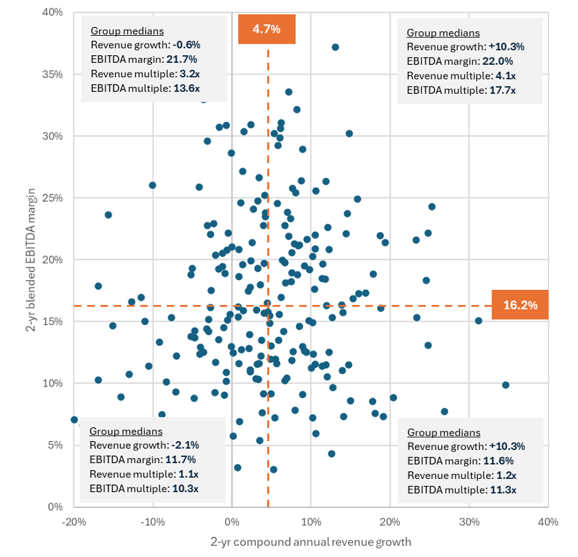

## Table of Contents

## What is EBITDA and how is it calculated?

EBITDA stands for Earnings Before Interest, Taxes, Depreciation, and Amortization. It's a way to measure how much money a company is making from its main business activities, without considering the costs of interest on loans, taxes, and the gradual reduction in value of its assets over time.

To calculate EBITDA, you start with the company's earnings, which is usually the net income found on the income statement. Then, you add back the expenses for interest, taxes, depreciation, and amortization. These expenses are added back because EBITDA aims to show the company's operational performance without these costs. So, the formula is: EBITDA = Net Income + Interest + Taxes + Depreciation + Amortization.

## What does the EBITDA margin represent in a company's financials?

The EBITDA margin shows how much of a company's money from sales is left after paying for the costs of running the business, but before paying interest, taxes, and the costs of wear and tear on its assets. It's a percentage that tells you how good a company is at making money from its main activities. You find it by dividing EBITDA by the total revenue and then multiplying by 100 to get a percentage.

This margin is useful because it helps compare how well different companies are doing, even if they are in different industries or have different ways of financing their business. A higher EBITDA margin means the company is keeping more money from each dollar of sales, which is a good sign. But, it's important to remember that this number doesn't tell the whole story because it leaves out important costs like interest and taxes.

## Why is the EBITDA margin important for investors?

The EBITDA margin is important for investors because it shows how well a company is doing at making money from its main business activities. It tells investors how much of each dollar in sales is left after paying for things like salaries, rent, and supplies, but before paying for interest, taxes, and the wear and tear on the company's assets. This helps investors see if the company is good at managing its costs and making profits from what it does every day.

Investors also use the EBITDA margin to compare different companies, even if they are in different industries or have different ways of borrowing money. A higher EBITDA margin means the company is keeping more money from its sales, which is a good sign that it's doing well. But, investors need to remember that the EBITDA margin doesn't show everything. It leaves out important costs like interest and taxes, so it's just one piece of the puzzle when deciding if a company is a good investment.

## How can the EBITDA margin be used to compare companies within the same industry?

The EBITDA margin is a useful tool for comparing companies within the same industry because it shows how much money each company makes from its main business activities, before paying for things like interest, taxes, and the wear and tear on their assets. By looking at the EBITDA margin, investors can see which company is better at keeping more money from each dollar of sales. For example, if Company A has an EBITDA margin of 25% and Company B has an EBITDA margin of 20%, it means Company A is doing a better job at managing its costs and making profits from its main business activities.

However, it's important to remember that the EBITDA margin is just one part of the picture. It doesn't include important costs like interest on loans and taxes, which can be different for each company. So, while a higher EBITDA margin is a good sign, investors should also look at other financial numbers to get a full understanding of how well a company is doing. By using the EBITDA margin along with other measures, investors can make a more informed decision about which company might be a better investment within the same industry.

## What are the limitations of using EBITDA margin as a performance metric?

Using the EBITDA margin as a performance metric has some limitations. One big problem is that it doesn't include important costs like interest on loans and taxes. Every company has different amounts of debt and different tax situations, so leaving these out can make it hard to see the true financial health of a company. For example, a company might have a high EBITDA margin but still struggle to pay back its loans because of high interest costs.

Another limitation is that the EBITDA margin doesn't show how much a company is spending on things like new equipment or buildings, which are important for growing the business. These costs, called capital expenditures, can be a big deal for some companies, and not including them can make a company look more profitable than it really is. So, while the EBITDA margin is helpful for comparing how well companies are doing at making money from their main business activities, it doesn't tell the whole story about a company's financial situation.

In summary, while the EBITDA margin is a useful tool for investors, it's important to look at other financial numbers too. Things like net income, cash flow, and the company's debt levels can give a fuller picture of how well a company is doing. By using the EBITDA margin along with these other measures, investors can make better decisions about where to put their money.

## How does EBITDA margin differ from net profit margin?

EBITDA margin and net profit margin are two different ways to measure how well a company is doing financially, but they look at different parts of the company's money. The EBITDA margin shows how much money a company makes from its main business activities before paying for things like interest on loans, taxes, and the wear and tear on its assets. It's a way to see how good a company is at managing its everyday costs and making money from what it does every day. To find the EBITDA margin, you take the EBITDA (which stands for Earnings Before Interest, Taxes, Depreciation, and Amortization) and divide it by the company's total sales, then multiply by 100 to get a percentage.

On the other hand, the net profit margin looks at how much money a company has left after paying for all its costs, including interest, taxes, depreciation, and amortization. This number tells you the final amount of profit the company makes from its sales. To find the net profit margin, you take the net profit (which is what's left after all expenses are paid) and divide it by the total sales, then multiply by 100 to get a percentage. The net profit margin gives a fuller picture of the company's financial health because it includes all the costs, not just the costs of running the business.

Both the EBITDA margin and the net profit margin are important for investors, but they give different information. The EBITDA margin is good for comparing how well different companies are at making money from their main activities, without worrying about how much debt they have or their tax situation. The net profit margin, however, shows the bottom line and can help investors see if a company is making enough money to cover all its costs and still have profit left over. By looking at both margins, investors can get a better understanding of a company's financial performance.

## Can EBITDA margin be manipulated by management, and if so, how?

Yes, management can manipulate the EBITDA margin. They can do this by changing how they report their costs. For example, if a company wants to show a higher EBITDA margin, it might decide to classify some operating expenses as one-time or non-recurring costs. These costs are then not included in the EBITDA calculation, making the margin look better than it really is. Another way is by delaying maintenance or repairs, which reduces the depreciation and amortization expenses in the short term, boosting the EBITDA margin.

However, these manipulations can only hide the true financial health of a company for a while. Eventually, the real costs will catch up, and the company might have to pay more in the future. That's why it's important for investors to look at other financial numbers, like cash flow and net profit margin, to get a full picture of how well a company is doing. By comparing the EBITDA margin with these other measures, investors can spot if something doesn't add up and make better decisions about where to put their money.

## What trends in EBITDA margin should investors look for over time?

Investors should look for a steady or growing EBITDA margin over time because it shows that a company is getting better at making money from its main business activities. If the EBITDA margin keeps going up, it means the company is managing its costs well and making more profit from each dollar of sales. This is a good sign that the company is doing well and might be a good investment. But, if the margin stays the same or goes down, it could mean the company is having trouble controlling its costs or making money from its sales, which might be a warning sign for investors.

Another trend to watch is how the EBITDA margin compares to other companies in the same industry. If a company's margin is growing while others in the industry are staying the same or shrinking, it could mean the company is doing something better than its competitors. This could be a sign that the company has a strong position in the market and is a good investment. However, if the company's margin is falling while others in the industry are doing better, it might mean the company is losing ground to its competitors, which could be a red flag for investors.

## How do changes in revenue and operating expenses impact the EBITDA margin?

Changes in revenue and operating expenses can have a big impact on a company's EBITDA margin. If a company's revenue goes up but its operating expenses stay the same, the EBITDA margin will go up too. This is because the company is making more money from its sales without spending more on things like salaries, rent, or supplies. On the other hand, if revenue stays the same but operating expenses go up, the EBITDA margin will go down. This means the company is spending more money to make the same amount of sales, which makes it harder to keep more money from each dollar of sales.

It's also important to look at how changes in revenue and operating expenses compare to each other. If a company can increase its revenue faster than its operating expenses, the EBITDA margin will grow. This shows that the company is getting better at making money from its main business activities. But, if operating expenses grow faster than revenue, the EBITDA margin will shrink. This can be a warning sign that the company is not managing its costs well and might struggle to make profits in the future. By watching these trends, investors can get a better idea of how well a company is doing and make smarter decisions about where to put their money.

## What role does industry-specific factors play in interpreting EBITDA margins?

Industry-specific factors are really important when you're looking at a company's EBITDA margin. Different industries have different costs and ways of making money. For example, a tech company might spend a lot on research and development, which can make its EBITDA margin look lower than a company in a different industry. On the other hand, a restaurant might have high food costs but lower research costs, so its EBITDA margin might look different. Knowing what's normal for an industry helps you understand if a company's EBITDA margin is good or not.

Also, some industries might have big ups and downs in their business. For example, the travel industry can be affected a lot by things like the economy or big events like a global health crisis. These changes can make the EBITDA margins go up and down a lot. So, when you're looking at a company's EBITDA margin, it's important to think about what's happening in its industry. This helps you see if the margin is changing because of the company's own performance or because of things happening in the whole industry.

## How can investors use EBITDA margin in conjunction with other financial ratios for deeper analysis?

Investors can use the EBITDA margin along with other financial ratios to get a fuller picture of a company's health. For example, they can look at the net profit margin, which shows the final amount of profit a company makes after paying all its costs, including interest, taxes, and the wear and tear on its assets. By comparing the EBITDA margin with the net profit margin, investors can see how much of the company's earnings are eaten up by these other costs. They can also use the return on assets (ROA) ratio, which shows how well a company is using its assets to make money. A high ROA along with a high EBITDA margin might mean the company is doing a good job at both managing its costs and using its assets.

Another useful ratio to look at with the EBITDA margin is the debt-to-EBITDA ratio, which shows how much debt a company has compared to its earnings. A lower debt-to-EBITDA ratio means the company has less debt relative to its earnings, which is a good sign. If a company has a high EBITDA margin but also a high debt-to-EBITDA ratio, it might mean the company is making money but still has a lot of debt to pay off. By looking at all these ratios together, investors can get a better understanding of a company's financial health and make smarter decisions about where to put their money.

## What advanced techniques can be applied to forecast future EBITDA margins based on current data?

To forecast future EBITDA margins, investors can use a technique called trend analysis. This means looking at how the EBITDA margin has changed over time and using that information to guess where it might go in the future. For example, if a company's EBITDA margin has been going up steadily for the last few years, it might keep going up in the future. But, it's important to think about what's happening in the company and its industry. If there are big changes coming, like new competition or a change in how much things cost, these could affect the EBITDA margin. By looking at these trends and changes, investors can make a better guess about what the future might hold.

Another way to forecast future EBITDA margins is by using regression analysis. This is a bit more complicated, but it can be really helpful. Regression analysis looks at how different things, like sales or operating expenses, affect the EBITDA margin. By putting all this information into a computer, investors can see which factors are most important and how they might change in the future. For example, if sales are expected to grow a lot but operating expenses stay the same, the EBITDA margin might go up. By using regression analysis, investors can make a more accurate forecast of the EBITDA margin and make better decisions about where to put their money.

## What is Understanding EBITDA Margin?

EBITDA margin is a financial metric used to evaluate a company's operating profitability as a percentage of its total revenue. EBITDA stands for Earnings Before Interest, Taxes, Depreciation, and Amortization. By focusing on earnings before these deductions, the EBITDA margin provides an insightful measure of core operational performance, independent of capital structure, tax environments, and accounting treatments.

The significance of the EBITDA margin lies in its ability to allow investors and analysts to compare the profitability of companies and industries on a consistent basis. This standardization comes from eliminating variations due to financing, tax policies, and accounting practices. As a result, it facilitates a more equitable comparison across entities with different capital structures and tax circumstances.

The calculation of the EBITDA margin is straightforward and can be expressed by the formula:

$$
\text{EBITDA Margin} = \left( \frac{\text{EBITDA}}{\text{Total Revenue}} \right) \times 100
$$

This calculation results in a percentage that reflects the proportion of revenue that remains as operating profit after operating expenses but before interest, taxes, depreciation, and amortization.

One of the main benefits of the EBITDA margin is that it offers a clearer picture of a company's operational efficiency and profitability, providing insights into its ability to generate cash flow from operations. This is particularly useful for investors looking to assess a company's potential for growth and financial stability.

However, the EBITDA margin has its limitations. It does not account for the cost of capital investments reflected through depreciation, nor does it consider expenses related to interest and taxes—elements that can substantially impact the net profitability and cash flows of a company. Additionally, by excluding non-operating expenses, it may overlook significant factors affecting the company's overall financial performance.

Therefore, while the EBITDA margin is a valuable tool for assessing a company’s operating profitability, it should be used in conjunction with other financial metrics and analyses to gain a comprehensive understanding of a company’s financial health.

## References & Further Reading

[1]: ["EBITDA: A Clear Look at Financial Performance"](https://www.investopedia.com/terms/e/ebitda.asp) CFA Institute

[2]: Lopez de Prado, Marcos. ["Advances in Financial Machine Learning."](https://www.amazon.com/Advances-Financial-Machine-Learning-Marcos/dp/1119482089) Wiley, 2018.

[3]: Chan, Ernest P. ["Quantitative Trading: How to Build Your Own Algorithmic Trading Business."](https://github.com/ftvision/quant_trading_echan_book) Wiley, 2008.

[4]: Jansen, Stefan. ["Machine Learning for Algorithmic Trading."](https://github.com/stefan-jansen/machine-learning-for-trading) Packt Publishing, 2020.

[5]: Aronson, David. ["Evidence-Based Technical Analysis: Applying the Scientific Method and Statistical Inference to Trading Signals."](https://www.amazon.com/Evidence-Based-Technical-Analysis-Scientific-Statistical/dp/0470008741) Wiley, 2006.