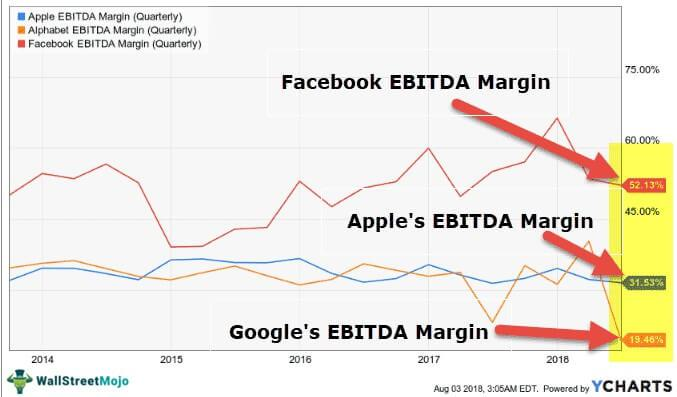

In today’s fast-paced financial markets, making informed investment decisions is more crucial than ever. Investors rely on financial metrics to evaluate the performance and potential growth of their investments effectively. One such crucial metric is the EBITDA margin, which serves as a key performance indicator by providing insights into a company's operating profitability. The EBITDA margin is calculated using the formula:

$$
\text{EBITDA Margin} = \left(\frac{\text{EBITDA}}{\text{Total Revenue}}\right) \times 100
$$



This metric allows investors to understand a company's operational efficiency by focusing solely on earnings generated from core business operations, excluding depreciation, interest, taxes, and other non-operating expenses. This focus eliminates the effects of various financial and accounting decisions, thereby enabling a more comparable assessment of profitability across different companies and industries.

Parallel to traditional analyses that leverage metrics like EBITDA margin, algorithmic trading has emerged as a powerful strategy in the financial industry. By utilizing advanced algorithms, this trading method executes trades at unprecedented speeds and volumes, analyzing vast amounts of data to identify optimal trading opportunities. Algorithmic trading systems can integrate signals from financial metrics like the EBITDA margin to make data-driven, strategic trading decisions that enhance investment outcomes.

This article explores how the integration of financial metric analysis, with a focus on the EBITDA margin, and algorithmic trading can enhance investment strategies. As technology continues to evolve, this synergy offers investors a robust framework for optimizing their trading approaches in increasingly competitive financial markets.

## Table of Contents

## Understanding EBITDA Margin

EBITDA margin is a financial metric used to evaluate a company's operating profitability as a percentage of its total revenue. EBITDA stands for Earnings Before Interest, Taxes, Depreciation, and Amortization. By focusing on earnings before these deductions, the EBITDA margin provides an insightful measure of core operational performance, independent of capital structure, tax environments, and accounting treatments.

The significance of the EBITDA margin lies in its ability to allow investors and analysts to compare the profitability of companies and industries on a consistent basis. This standardization comes from eliminating variations due to financing, tax policies, and accounting practices. As a result, it facilitates a more equitable comparison across entities with different capital structures and tax circumstances.

The calculation of the EBITDA margin is straightforward and can be expressed by the formula:

$$
\text{EBITDA Margin} = \left( \frac{\text{EBITDA}}{\text{Total Revenue}} \right) \times 100
$$

This calculation results in a percentage that reflects the proportion of revenue that remains as operating profit after operating expenses but before interest, taxes, depreciation, and amortization.

One of the main benefits of the EBITDA margin is that it offers a clearer picture of a company's operational efficiency and profitability, providing insights into its ability to generate cash flow from operations. This is particularly useful for investors looking to assess a company's potential for growth and financial stability.

However, the EBITDA margin has its limitations. It does not account for the cost of capital investments reflected through depreciation, nor does it consider expenses related to interest and taxes—elements that can substantially impact the net profitability and cash flows of a company. Additionally, by excluding non-operating expenses, it may overlook significant factors affecting the company's overall financial performance.

Therefore, while the EBITDA margin is a valuable tool for assessing a company’s operating profitability, it should be used in conjunction with other financial metrics and analyses to gain a comprehensive understanding of a company’s financial health.

## Importance of Financial Metrics in Investment Analysis

Financial metrics are fundamental to evaluating a company's health and potential, offering a quantitative foundation for making investment decisions and assessing risks. They serve as the bedrock for a robust financial analysis and help investors understand the economic soundness of businesses. Metrics such as EBITDA (Earnings Before Interest, Taxes, Depreciation, and Amortization), ROI (Return on Investment), ROE (Return on Equity), and profit margins are pivotal in providing critical insights into various facets of a company's performance.

EBITDA is particularly valuable in assessing a company's operational efficiency and profitability. By excluding interest, taxes, depreciation, and amortization, EBITDA offers a clearer view of the company's core profitability. It allows investors to compare the operating performance of companies within the same industry, accounting for differences in capital structure and tax environments.

Return on Investment (ROI) is another essential metric used to gauge the efficiency of an investment or compare the efficiencies of several different investments. The formula for ROI is:
$$

\text{ROI} = \left( \frac{\text{Net Profit}}{\text{Cost of Investment}} \right) \times 100
$$
This metric helps investors determine the profitability of their investments and make informed decisions on which projects or assets to pursue for maximum financial gain.

Return on Equity (ROE) measures a company's profitability in relation to shareholders' equity. It is expressed as:
$$

\text{ROE} = \left( \frac{\text{Net Income}}{\text{Shareholders' Equity}} \right) \times 100
$$
High ROE indicates effective management and profit generation relative to equity, providing investors with insight into how efficiently a company uses its equity base to generate profits.

Profit margins, including gross margin, operating margin, and net margin, reveal the degree to which a company can convert revenue into profit at various stages. These metrics guide investors in understanding cost structures and competitive positioning.

Employing a combination of these metrics allows for a comprehensive analysis enabling investors to balance their investment decisions more effectively. Financial metrics, aligned with specific investment goals, help tailor investment strategies according to desired financial outcomes, facilitating a more precise approach to achieving set objectives.

Incorporating diverse financial metrics ensures that investment strategies are not solely dependent on a single aspect of financial health but are well-rounded, considering multiple dimensions of business performance. This multifaceted approach allows investors to mitigate risks and exploit opportunities more efficiently, ultimately contributing to more successful investment outcomes.

## Algorithmic Trading: An Overview

Algorithmic trading represents a modern approach to executing financial transactions by employing automated computer algorithms. These algorithms analyze various financial metrics and respond to market conditions without the need for direct human intervention. The primary benefit of [algorithmic trading](/wiki/algorithmic-trading) is its ability to execute orders at speeds and frequencies impractical for human traders, allowing for enhanced accuracy and the efficient handling of complex data sets and market scenarios.

One of the major advantages of algorithmic trading is the speed at which it operates. Algorithms can process market data and execute trades in fractions of a second, thereby enabling traders to capitalize on fleeting market opportunities that would otherwise be missed. The accuracy of algorithmic trading is another significant advantage, as algorithms are designed to minimize human error by adhering strictly to predefined rules and parameters. Furthermore, algorithms can analyze and incorporate vast amounts of data from multiple sources, allowing for comprehensive assessments of market conditions.

Various strategies are utilized in algorithmic trading, each serving different trading goals and market conditions. Trend-following strategies, for instance, capitalize on market [momentum](/wiki/momentum) by buying securities experiencing upward movement and selling those on a downturn. Arbitrage strategies exploit price discrepancies between markets or instruments, buying low and selling high to gain a risk-free profit. Market making involves placing buy and sell orders to profit from the bid-ask spread, contributing [liquidity](/wiki/liquidity-risk-premium) to the market.

However, algorithmic trading is not without its challenges. Effective risk management is essential to mitigate potential losses arising from algorithm malfunctions or unexpected market events. A thorough understanding of algorithmic operations and their limitations is crucial for developing robust trading systems. Technical glitches, data discrepancies, and unforeseen market conditions can introduce risks that necessitate ongoing scrutiny and adjustment of algorithmic strategies.

The impact of algorithmic trading on global markets has been profound. It has significantly transformed trading landscapes by introducing both opportunities for heightened efficiency and challenges in market stability. High-frequency trading, a subset of algorithmic trading, has increased market liquidity but also raises concerns regarding market [volatility](/wiki/volatility-trading-strategies) and fairness. Consequently, algorithmic trading presents a dual-edged sword; it offers substantial benefits in trading precision and speed, while also requiring careful management and regulation to address its inherent risks. As such, investors and firms must remain vigilant and adaptive in leveraging algorithmic trading to harness its full potential.

## Incorporating EBITDA Margin in Algo Trading Strategies

Using the EBITDA margin in algorithmic trading strategies involves incorporating this financial metric into the decision-making processes that guide automated trading. This integration ensures that quantifiable insights into a company's operating profitability are factored into the trade execution processes.

### Targeted Analysis: Identifying Strong Companies

EBITDA margin proves instrumental in pinpointing companies with robust operational efficiency. By evaluating the EBITDA margin, traders can discern firms that exhibit sound financial health from a profitability standpoint, irrespective of their capital structure. This metric aids in filtering out companies that maintain higher operating efficiencies, aligning with the objective of forming a portfolio with entities demonstrating strong financial foundations.

### Strategy Development: Algorithm Design

Developing algorithms that focus on EBITDA margins involves assessing companies with high and improving margins. Algorithms can be programmed to rank and prioritize stocks based on their EBITDA margin relative to industry averages or historical trends. This prioritization ensures that the trading strategy consistently favors firms that are not only operationally efficient but also improving in profitability over time. Python offers libraries such as `pandas` and `numpy` to handle financial data and compute these metrics effectively:

```python
import pandas as pd

# Example pandas DataFrame containing company financial data
data = pd.DataFrame({
    'company': ['A', 'B', 'C'],
    'EBITDA': [500, 300, 450],
    'Revenue': [1000, 800, 900]
})

# Calculate EBITDA Margin
data['EBITDA_Margin'] = (data['EBITDA'] / data['Revenue']) * 100

# Prioritize companies with high EBITDA Margin
priority_companies = data[data['EBITDA_Margin'] > data['EBITDA_Margin'].mean()]
```

### Market Signals: Triggering Decisions

EBITDA trends serve as vital signals for initiating buy or sell decisions within trading algorithms. For instance, a rising EBITDA margin over sequential quarters may signal a buy opportunity due to improving operational efficiency, while a declining margin could trigger a sell decision. Algorithms can be configured to automatically make these decisions based on pre-defined thresholds and trends in EBITDA performance.

### Backtesting: Historical Data Integration

Incorporating historical EBITDA data into [backtesting](/wiki/backtesting) models is crucial for evaluating algorithm performance. By simulating trades using historical EBITDA margin data, traders can gauge how effectively their strategies have performed in the past, thereby refining their models to enhance future accuracy. This process involves comparing historical predictions with actual market movements and adjusting algorithms accordingly.

### Risk Management: Financial Stability Indicator

EBITDA serves as a reliable indicator of a company's financial stability, making it a valuable metric for adjusting market exposure and minimizing risk. In volatile market conditions, algorithms can be programmed to reduce exposure to companies with declining EBITDA margins, thus prioritizing stability and longevity. This adaptability in risk management underscores the importance of integrating robust financial metrics within trading strategies to safeguard investments. 

By weaving these facets together, investors and traders can harness the power of the EBITDA margin within algorithmic trading, creating a feedback loop that continuously reinforces their decision-making framework based on operating profitability.

## Case Studies and Real-world Applications

### Case Studies and Real-world Applications

**Case Study 1: Investment Fund's Success Using EBITDA-Integrated Algo Trading**

An investment fund successfully utilized an algorithmic trading strategy that integrated EBITDA margin analysis to enhance its returns. By focusing on companies with consistently high EBITDA margins, the fund was able to identify firms with strong operational efficiencies and profitability. The strategy involved employing algorithms that prioritized trades based on EBITDA margin trends, ensuring that capital was allocated to fundamentally robust entities. The fund's algorithm continuously scanned financial reports and updated its asset pool by selecting companies exhibiting both stability and growth in their EBITDA margins. This approach resulted in a higher risk-adjusted return compared to traditional trading strategies, demonstrating the efficacy of incorporating financial metrics like EBITDA into automated trading.

**Case Study 2: Challenges Faced by a Hedge Fund**

A [hedge fund](/wiki/hedge-fund-trading-strategies) encountered several obstacles when integrating financial metrics within its automated trading systems. The primary challenge was the accurate and timely extraction of EBITDA data from a diverse set of companies. The heterogeneity in financial reporting standards across industries made it difficult to develop a standardized approach for data analysis. Additionally, the complexity of real-time adjustments in trading algorithms to incorporate emerging EBITDA trends posed significant operational issues. The necessity for robust data validation processes and the optimization of algorithmic responses in volatile market environments were also major hurdles. Despite these challenges, the hedge fund's iterative testing and improvement cycles helped it slowly incorporate these metrics into its strategies, showing marginal gains in strategy precision and execution.

**Application Example: Tech Startup's Approach to Financial Metric Algorithms**

A tech startup focused on algorithmic trading developed cutting-edge algorithms that leveraged EBITDA and other financial metrics to enhance trading decisions. The startup employed [machine learning](/wiki/machine-learning) techniques to train its algorithms on historical financial data, emphasizing EBITDA trends as a critical [factor](/wiki/factor-investing) for decision-making. Advanced data analytics tools allowed the startup to perform complex simulations and backtests, validating the effectiveness of their strategies in historical and simulated market conditions. By continuously refining its algorithms with real-time market data and financial reports, the startup was able to deliver innovative solutions that catered to clients demanding high accuracy and profitability in their trading operations.

**Real-world Impact**

The integration of financial metrics, such as EBITDA margin, into algorithmic trading strategies has enabled companies to strengthen their market competitiveness. Firms that effectively harness these strategies can improve their investment accuracy and execution efficiency, consequently gaining a better vantage in the competitive financial markets. This approach not only refines investment strategies but also fosters a culture of innovation by encouraging continuous improvements and adaptation to market dynamics. As technology advances and financial data becomes increasingly accessible, this synergy between traditional financial analysis and modern computational techniques is expected to drive financial market innovations and opportunities.

## Conclusion

Integrating financial metrics such as EBITDA margin into algorithmic trading presents a robust framework for making informed investment decisions. This approach harmonizes the strengths of [fundamental analysis](/wiki/fundamental-analysis) with the precision and speed of automation. By leveraging these tools, investors can enhance their trading strategies to achieve greater efficiency and accuracy in decision-making.

The ongoing advancement of technology, particularly in machine learning and [artificial intelligence](/wiki/ai-artificial-intelligence), plays a critical role in refining these systems. These technologies enable the development of sophisticated models that can interpret vast amounts of financial data and recognize patterns that might be imperceptible to human analysts. For example, machine learning algorithms can be trained to identify portfolio-optimizing trends and actionable signals based on shifts in EBITDA margins.

However, the dynamic nature of financial markets demands continuous education and adaptation. Investors must stay abreast of technological advancements and market changes to maintain a competitive edge. This commitment to learning ensures that they can effectively integrate new tools and methodologies into their strategies.

A balanced approach that combines human insight with automated efficiency is pivotal for successful investment outcomes. While algorithms excel in rapidly processing data and executing trades, human judgment remains essential in interpreting nuanced financial information and adjusting strategies in response to broader economic and market conditions. This synergy between human insight and technological capability not only optimizes trading performance but also provides a comprehensive framework for navigating complex financial landscapes.

## References & Further Reading

[1]: ["EBITDA: A Clear Look at Financial Performance"](https://www.investopedia.com/terms/e/ebitda.asp) CFA Institute

[2]: Lopez de Prado, Marcos. ["Advances in Financial Machine Learning."](https://www.amazon.com/Advances-Financial-Machine-Learning-Marcos/dp/1119482089) Wiley, 2018.

[3]: Chan, Ernest P. ["Quantitative Trading: How to Build Your Own Algorithmic Trading Business."](https://github.com/ftvision/quant_trading_echan_book) Wiley, 2008.

[4]: Jansen, Stefan. ["Machine Learning for Algorithmic Trading."](https://github.com/stefan-jansen/machine-learning-for-trading) Packt Publishing, 2020.

[5]: Aronson, David. ["Evidence-Based Technical Analysis: Applying the Scientific Method and Statistical Inference to Trading Signals."](https://www.amazon.com/Evidence-Based-Technical-Analysis-Scientific-Statistical/dp/0470008741) Wiley, 2006.