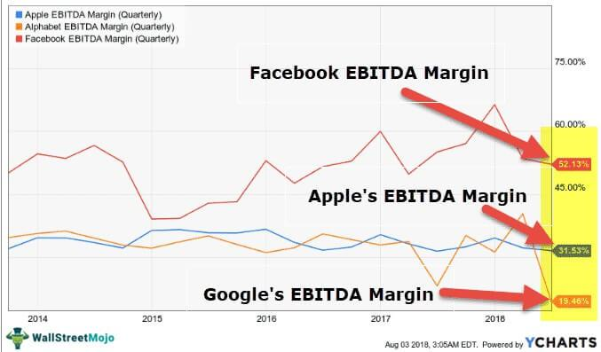

In today's fast-paced financial markets, understanding key financial metrics is crucial for making informed trading decisions. Among these metrics, profit margin and EBITDA margin stand out as essential indicators that offer insights into a company's profitability and operational efficiency. As algorithmic trading, commonly known as algo trading, continues to rise in prominence, these metrics grow even more significant due to their ability to influence trading strategies and outcomes.

Profit margin is typically expressed as a percentage, calculated by dividing net income by revenue. For example, a company with a net income of $20 million and revenues of $100 million would have a profit margin of 20%. This measure serves as a critical gauge of a company's financial health, revealing its capability to manage expenses and increase reservations.



EBITDA margin, which stands for Earnings Before Interest, Taxes, Depreciation, and Amortization margin, provides a perspective on operating efficiency by excluding non-cash expenses and the effects of financing and accounting decisions. It emphasizes core operational capabilities, offering algo traders a clearer view of a company's fundamental performance.

Algorithmic trading employs complex mathematical models and computations to execute trades at speeds and frequencies beyond human capacities. With its reliance on data-driven decisions, the integration of financial metrics like profit and EBITDA margins becomes integral in optimizing trading algorithms. These metrics not only aid in evaluating company fundamental strength but are also pivotal in identifying undervalued stocks and potential investment opportunities.

This article explores the importance of profit margin and EBITDA margin within the context of algo trading, discussing their roles and applications in enhancing trading algorithms. By thoroughly understanding these concepts, both novice traders and experienced financial professionals can optimize their trading strategies and achieve improved financial outcomes, ensuring long-term profitability and competitiveness in evolving market landscapes.

## Table of Contents

## Understanding Profit Margin

Profit margin is a fundamental financial metric that quantifies how much profit a company generates from its revenue. It is expressed as a percentage and is calculated using the formula:

$$
\text{Profit Margin} = \left( \frac{\text{Net Income}}{\text{Revenue}} \right) \times 100
$$

The profit margin serves as a vital indicator of a company's financial health, reflecting its ability to control expenses and increase earnings. By analyzing profit margins, traders and analysts gain insights into the financial dynamics and operational efficiency of a company.

There are three key types of profit margin to consider:

1. **Gross Profit Margin**: This margin evaluates how efficiently a company uses its resources to produce goods or services. It is calculated by dividing gross profit (revenue minus the cost of goods sold) by revenue. A higher gross profit margin indicates that a company is able to produce goods at a lower cost relative to its sales.

   \[ \text{Gross Profit Margin} = \left( \frac{\text{Gross Profit}}{\text{Revenue}} \right) \times 100
$$

2. **Operating Profit Margin**: Focuses on the profitability from regular business operations, excluding non-operating income and expenses. It is calculated by dividing operating income by revenue. This margin reflects the core business efficiency before accounting for interest and taxes.

   \[ \text{Operating Profit Margin} = \left( \frac{\text{Operating Income}}{\text{Revenue}} \right) \times 100
$$

3. **Net Profit Margin**: Represents the percentage of revenue that becomes profit after all expenses, taxes, and interest are deducted. This metric provides a comprehensive view of a company's overall profitability.

   \[ \text{Net Profit Margin} = \left( \frac{\text{Net Income}}{\text{Revenue}} \right) \times 100
$$

In algo trading, integrating profit margin metrics can significantly enhance the precision and effectiveness of trading algorithms. By understanding and utilizing different profit margin types, traders can develop algorithms that more accurately assess a company's profitability, both in the short and long term. Algorithms that incorporate profit margin data can identify companies with strong financial health, offering insights into potential investment opportunities. Such algorithms can also incorporate margin trends to predict future profitability, thereby optimizing trading strategies and improving financial outcomes.

## Exploring EBITDA Margin

EBITDA margin, short for Earnings Before Interest, Taxes, Depreciation, and Amortization margin, operates as a critical measure of a company's operating profitability relative to its total revenue. This metric evaluates a company's core operational performance by stripping away non-cash expenses and the impacts of financing and accounting choices. Consequently, it offers a clearer picture of operational efficiency and cost management, especially useful for comparisons across companies and industries.

To calculate the EBITDA margin, the following formula is utilized:

$$
\text{EBITDA Margin} = \left(\frac{\text{EBITDA}}{\text{Total Revenue}}\right) \times 100
$$

This calculation renders the EBITDA margin as a percentage, indicating the proportion of revenue that translates into earnings before considering interest, taxes, depreciation, and amortization. A higher EBITDA margin reflects more efficient management and cost control, suggesting that the company is better at converting revenue into actual profit from core operations.

For algorithmic traders, understanding and incorporating the EBITDA margin is crucial. It serves as a potent tool for assessing a company's fundamental operational strength, offering insights that can guide the refinement of trading strategies. By monitoring changes in EBITDA margin trends, traders can identify potential growth opportunities or detect warning signs indicating deteriorating operational capacity.

Algorithmically, traders can program algorithms to track and respond to these trends. For instance, a growing EBITDA margin might prompt algorithms to prioritize investment in a company, anticipating continued operational improvement. Conversely, a declining EBITDA margin could signal potential issues, advising caution.

Ultimately, the EBITDA margin's ability to provide a nuanced view of a company’s operational health makes it an indispensable metric for those developing data-driven, adaptable trading strategies in the dynamic field of algo trading.

## The Role of Financial Metrics in Algo Trading

Algo trading significantly depends on data-driven decisions, making financial metrics such as profit and EBITDA margins vital for developing effective trading strategies. These metrics can be integrated into trading algorithms to assist in identifying undervalued stocks or potential investment opportunities. By comprehensively analyzing these indicators, algorithms can fine-tune their strategies, aiding traders in capturing valuable market opportunities or mitigating risks.

Profit margins measure a company's profitability by indicating how much profit it generates as a percentage of its revenue. In contrast, EBITDA margins focus on operating efficiency, providing insights into a company's core profitability by excluding non-cash expenses like depreciation and amortization, as well as interest and tax impacts. Both metrics serve crucial roles by offering a quantitative basis for developing [algorithmic trading](/wiki/algorithmic-trading) rules, thereby enhancing the precision and consistency of trading models.

Incorporating financial metrics within algorithms allows for dynamic adaptability to market conditions. By continuously monitoring profit and EBITDA margin changes, trading algorithms can adjust their strategies accordingly. For example, an increase in EBITDA margin might indicate improved operational efficiency, prompting an algorithm to invest in that company due to enhanced growth potential. Conversely, a declining profit margin might act as a signal to reduce exposure to a particular stock, minimizing potential losses.

Traders can also backtest algorithms that incorporate these financial metrics to ensure optimal performance and adjust their parameters based on historical data. Backtesting allows traders to validate the effectiveness of their algorithms in various market scenarios and optimize them for real-world application. Here's an example of how a [backtesting](/wiki/backtesting) framework might be implemented in Python using historical financial data:

```python
import pandas as pd
import numpy as np

def calculate_profit_margin(revenue, net_income):
    return (net_income / revenue) * 100

def calculate_ebitda_margin(revenue, ebitda):
    return (ebitda / revenue) * 100

def backtest_algorithm(historical_data):
    # Assume historical_data is a DataFrame with columns: 'Date', 'Revenue', 'Net Income', 'EBITDA'
    historical_data['Profit Margin'] = calculate_profit_margin(historical_data['Revenue'], historical_data['Net Income'])
    historical_data['EBITDA Margin'] = calculate_ebitda_margin(historical_data['Revenue'], historical_data['EBITDA'])

    # Define trading rules based on margins
    buy_signals = historical_data[(historical_data['Profit Margin'] > 20) & (historical_data['EBITDA Margin'] > 15)]
    sell_signals = historical_data[(historical_data['Profit Margin'] < 10) | (historical_data['EBITDA Margin'] < 5)]

    return buy_signals, sell_signals

# Example usage:
# Assume we have a DataFrame `historical_data` with necessary financial data loaded
# buy_signals, sell_signals = backtest_algorithm(historical_data)
```

Utilizing financial metrics in algo trading not only provides a competitive edge but also aligns trading strategies with long-term profitability goals. By systematically integrating and analyzing these metrics, traders can ensure that their strategies remain robust, data-driven, and adaptable to the evolving financial landscape.

## Strategies for Combining Profit and EBITDA Margins in Algorithms

Developing a robust strategy that integrates both profit and EBITDA margins within algorithmic trading systems involves a multifaceted approach to enhance decision making and financial performance. By evaluating these two metrics in conjunction, traders can gain a comprehensive view of a company's financial health and operational efficiency, aiding in selecting high-performing investment candidates.

Algorithms can be programmed to prioritize companies exhibiting consistently high profit and EBITDA margins. Such consistency often signals operational excellence and effective management, making these firms attractive for investment. A Python snippet might look like this:

```python
def prioritize_high_margin_companies(data):
    threshold = 0.15  # Example threshold for high margins
    high_margin_companies = [company for company in data if company['profit_margin'] > threshold and company['ebitda_margin'] > threshold]
    return high_margin_companies
```

Another approach involves identifying firms with improving profit and EBITDA margins. An upward trend in these metrics might indicate potential for future growth and increased profitability. Algorithms can be designed to track margin improvements over time, thus spotting emerging investment opportunities.

To exploit short-term market inefficiencies, algorithms can be customized to react to fluctuations in profit and EBITDA margins. This can involve setting triggers for changes in margins that may suggest either buying or selling actions. Incorporating real-time data feeds ensures that these decisions are timely and based on the most current information.

Incorporating margin thresholds into algorithmic filters can assist in identifying companies likely to weather economic downturns. By setting minimum acceptable margins, traders can filter out weaker firms and focus on those with the resilience to maintain profitability during adverse conditions.

```python
def filter_resilient_companies(data, profit_margin_threshold, ebitda_margin_threshold):
    resilient_companies = [company for company in data if company['profit_margin'] > profit_margin_threshold and company['ebitda_margin'] > ebitda_margin_threshold]
    return resilient_companies
```

Finally, continuous optimization of algorithms is essential. By analyzing historical data and adjusting parameters, traders can ensure their algorithms remain in alignment with evolving market trends. This ongoing refinement process enhances both the precision and responsiveness of trading strategies.

Combining these strategies allows traders to build algorithms that are not only well-informed by a company’s past financial performance but are also agile in responding to new data. Ultimately, leveraging profit and EBITDA margins in algorithmic trading offers a pathway to improved accuracy and results, aligning with long-term investment goals.

## Conclusion

Profit margin and EBITDA margin are invaluable financial metrics that provide critical insights into a company's profitability and operational performance. For algorithmic traders, these metrics serve not just as standalone indicators but as fundamental components for enhancing algorithmic trading strategies. By integrating profit and EBITDA margins into trading algorithms, traders can achieve improved trading accuracy, capitalizing on a more comprehensive understanding of a company’s financial health.

Incorporating these financial metrics into algorithmic models allows traders to develop a balanced perspective of potential investments, considering both profitability and operational efficiency. This dual approach can lead to more informed decision-making processes, supporting strategies that are dynamically responsive to market changes. Algorithmic trading strategies that are informed by financial metrics like profit and EBITDA margins offer a quantitative foundation that supports consistency and precision in trading outcomes.

As financial markets continue to evolve rapidly with technological advancements, it is imperative for algorithmic traders to stay informed about key financial metrics and their broader implications. This evolving landscape necessitates a continuous evaluation and integration of relevant data within trading frameworks to maintain a competitive edge. By doing so, traders can ensure their strategies remain competitive, data-driven, and aligned with long-term investment goals.

Profit and EBITDA margins should thus be integral components of an advanced algorithmic trading framework. By systematically incorporating these metrics, traders can better navigate the complexities of modern financial markets, fostering strategies that are resilient to market [volatility](/wiki/volatility-trading-strategies) and conducive to sustained financial success.

## References & Further Reading

[1]: ["Advances in Financial Machine Learning"](https://www.amazon.com/Advances-Financial-Machine-Learning-Marcos/dp/1119482089) by Marcos Lopez de Prado

[2]: ["Evidence-Based Technical Analysis: Applying the Scientific Method and Statistical Inference to Trading Signals"](https://www.amazon.com/Evidence-Based-Technical-Analysis-Scientific-Statistical/dp/0470008741) by David Aronson

[3]: ["Machine Learning for Algorithmic Trading"](https://github.com/stefan-jansen/machine-learning-for-trading) by Stefan Jansen

[4]: ["Quantitative Trading: How to Build Your Own Algorithmic Trading Business"](https://www.amazon.com/Quantitative-Trading-Build-Algorithmic-Business/dp/1119800064) by Ernest P. Chan

[5]: Damodaran, A. ["Valuation Approaches and Metrics: A Survey of the Theory and Evidence"](https://people.stern.nyu.edu/adamodar/pdfiles/papers/valuesurvey.pdf). 

[6]: ["Financial Modeling"](https://www.investopedia.com/terms/f/financialmodeling.asp) by Simon Benninga