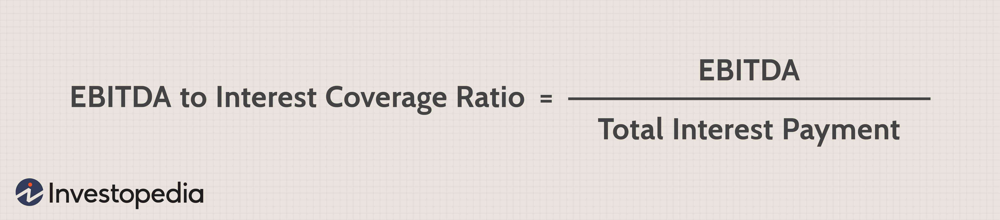

Understanding key financial ratios is crucial for evaluating a company's financial health. Among these, the EBITDA-to-interest coverage ratio is an essential metric for assessing a company’s ability to meet its debt obligations. It measures how comfortably a company can pay interest on its outstanding debt with its earnings before interest, taxes, depreciation, and amortization (EBITDA). A higher ratio suggests a robust financial position, indicating that the company is well-equipped to handle its debt payments, thereby offering more security to investors and creditors.

This article explores how this ratio is calculated and its significance in financial analysis, with a particular focus on algorithmic trading. As financial markets become increasingly complex and data-driven, employing sophisticated metrics like EBITDA-to-interest coverage has become more prevalent in trading models. These innovations help traders and analysts gauge the financial stability of potential investment opportunities, enhance predictive analytics, and refine trading performance. 



By integrating the EBITDA-to-interest coverage ratio into trading algorithms, investors can optimize their strategies, effectively prioritizing investments in financially stable companies. This not only aids in minimizing risk but also in maximizing potential returns. Consequently, understanding and applying this ratio is vital for anyone looking to develop robust investment strategies in today's competitive markets.

## Table of Contents

## What is the EBITDA-to-Interest Coverage Ratio?

The EBITDA-to-interest coverage ratio is a critical metric for understanding a company's ability to meet its debt obligations. This ratio evaluates whether a firm's earnings before interest, taxes, depreciation, and amortization (EBITDA) are sufficient to cover its interest expenses. A higher ratio is indicative of a company in solid financial health, with ample earnings to comfortably meet the costs associated with its debts.

### Formula for Calculating the EBITDA-to-Interest Coverage Ratio

The calculation of the EBITDA-to-interest coverage ratio involves a straightforward formula:

$$
\text{EBITDA-to-Interest Coverage Ratio} = \frac{\text{EBITDA}}{\text{Interest Expenses}}
$$

Where:
- **EBITDA** is the company's earnings before interest, taxes, depreciation, and amortization. It reflects the operational profitability of the company.
- **Interest Expenses** are the costs incurred from borrowed funds.

### Step-by-Step Calculation Example

Consider a company that reports an EBITDA of $500,000 and interest expenses amounting to $100,000 over a given period. The EBITDA-to-interest coverage ratio can be calculated as follows:

1. **Identify the EBITDA and interest expenses**: In this case, EBITDA is $500,000, and interest expenses total $100,000.
2. **Apply the formula**: Plug the identified values into the formula:
$$
   \text{EBITDA-to-Interest Coverage Ratio} = \frac{500,000}{100,000} = 5.0

$$

This ratio of 5.0 signifies that the company's EBITDA is five times its interest obligations, suggesting strong financial health and an ability to satisfy its interest liabilities with surplus.

In summary, the EBITDA-to-interest coverage ratio serves as a vital tool for assessing financial durability, offering insight into a company's capability to manage its debt obligations effectively.

## Importance of the EBITDA-to-Interest Coverage Ratio in Financial Analysis

The EBITDA-to-interest coverage ratio is a critical metric in financial analysis, helping evaluate a firm's ability to meet its debt obligations and providing insight into its financial stability. This ratio is calculated by dividing a company's earnings before interest, taxes, depreciation, and amortization (EBITDA) by its interest expenses. The formula is:

$$
\text{EBITDA-to-Interest Coverage Ratio} = \frac{\text{EBITDA}}{\text{Interest Expenses}}
$$

A higher EBITDA-to-interest coverage ratio signifies that a company has a robust capacity to cover its interest expenses, reflecting financial stability. Such companies are viewed as reliable by investors and creditors, ensuring they have a lower risk of default. A high ratio often results in favorable borrowing terms, as creditors recognize the company’s ability to manage additional debt without jeopardizing financial health. For investors, a higher ratio can signal a stable investment with potential for growth, often leading to a stronger stock market performance.

Conversely, a low EBITDA-to-interest coverage ratio can indicate vulnerability. Companies with lower ratios may be at risk of struggling to meet their interest obligations, which can lead to [liquidity](/wiki/liquidity-risk-premium) pressures or even insolvency. Investors might be wary, perceiving such companies as high-risk investments. Creditors may demand higher interest rates for loans to compensate for the increased perceived risk, potentially hampering the company's ability to pursue growth opportunities or refinancing options.

The ratio also plays a significant role in operational decision-making and long-term financial planning. By assessing this ratio, management can make informed decisions regarding capital allocation, debt management, and investment in new projects, ensuring sustainable growth. A focus on maintaining an optimal ratio supports strategic planning, enabling businesses to adapt to changing economic conditions while minimizing financial risks.

Ultimately, the EBITDA-to-interest coverage ratio serves as an indispensable tool, aiding in the comprehensive assessment of a company’s financial resilience. It not only informs investors and creditors about the company's current financial health but also guides management in aligning their strategic objectives with financial prudence.

## Role of the Ratio in Algorithmic Trading

The EBITDA-to-interest coverage ratio plays a crucial role in [algorithmic trading](/wiki/algorithmic-trading) by providing a reliable measure for assessing company risk and prioritizing investments. This ratio, which measures a company's ability to cover interest expenses with its earnings before interest, taxes, depreciation, and amortization (EBITDA), serves as a vital indicator in automated trading systems aiming to optimize portfolio performance.

Algorithmic trading strategies benefit from incorporating the EBITDA-to-interest coverage ratio by enhancing stock filtering and trading performance. By integrating this ratio into trading models, algorithms can effectively screen companies based on their financial durability and liquidity position. For instance, a higher EBITDA-to-interest coverage ratio suggests that a company is better equipped to handle its debt obligations, thus making it a more attractive investment opportunity. Algorithmically, this can be achieved through the implementation of filtering criteria such as:

```python
def filter_stocks_by_ebitda_interest_coverage(stocks, threshold):
    """
    Filters stocks based on EBITDA-to-interest coverage ratio.

    Parameters:
    stocks (list): A list of dictionaries containing stock information.
    threshold (float): The minimum acceptable EBITDA-to-interest coverage ratio.

    Returns:
    list: A list of stocks that meet the criteria.
    """
    eligible_stocks = []
    for stock in stocks:
        if stock['ebitda_interest_coverage'] > threshold:
            eligible_stocks.append(stock)
    return eligible_stocks
```

This example Python function filters and returns stocks that have an EBITDA-to-interest coverage ratio above a specified threshold, thereby aligning with the strategy of selecting financially robust entities.

Furthermore, predictive analytics and model development can leverage historical and projected ratios to forecast financial trends and investment opportunities. By analyzing historical data, algorithms can identify patterns that indicate future performance potential. These models can be enhanced with statistical techniques and [machine learning](/wiki/machine-learning) to predict EBITDA and interest coverage changes, providing traders with insights for making timely decisions.

The integration of projected EBITDA-to-interest coverage ratios into algorithmic trading models involves forecasting future financial conditions under various scenarios, thereby offering a proactive approach to investment. Algorithms can incorporate these projections to adjust their strategies dynamically, enhancing the adaptability and precision of trading decisions. Overall, harnessing the EBITDA-to-interest coverage ratio in automated trading models enables traders to systematically evaluate corporate financial health, mitigates investment risks, and optimizes trading outcomes through data-driven insights.

## Sectoral Variations and Comparisons

Different industries exhibit varying average EBITDA-to-interest coverage ratios due to differences in operational and financial structures. These variations reflect the distinct business models, capital intensity, and risk profiles inherent to each sector.

### Industries with Typically High Ratios

1. **Technology Sector**: Technology companies generally maintain high EBITDA-to-interest coverage ratios. This trend is primarily due to their lower capital requirements since a significant portion of their value is derived from intellectual property rather than physical assets. Consequently, they often generate high EBITDA relative to their interest obligations. Their business models typically allow for strong cash flow generation with lower leverage compared to capital-intensive industries. 

2. **Consumer Goods**: Companies within the consumer goods sector often exhibit higher ratios due to consistent demand for their products, leading to stable revenues and robust cash flows. This stability reduces the dependency on debt financing and results in higher coverage ratios.

3. **Healthcare**: The healthcare industry benefits from steady demand and frequent government subsidies or support, contributing to substantial EBITDA figures relative to interest expenses. As a result, this sector often showcases strong financial health. 

### Industries with Typically Low Ratios

1. **Utilities**: Utilities tend to have lower EBITDA-to-interest coverage ratios due to their high capital intensity and substantial debt levels necessary for infrastructure development. Regulatory environments also influence these ratios, as rate increases may require approval, potentially limiting revenue growth relative to increasing interest expenses.

2. **Real Estate**: The real estate sector typically shows lower ratios due to its reliance on significant debt financing to acquire and develop properties. The capital-intensive nature of real estate investments necessitates substantial borrowing, often resulting in higher interest expenses relative to earnings before interest, taxes, depreciation, and amortization.

3. **Transportation**: Transportation companies often operate within a highly competitive environment that demands continuous investment in infrastructure and fleet maintenance. These capital requirements frequently lead to increased debt and thus higher interest expenses, lowering the EBITDA-to-interest coverage ratio.

### Conclusion

Understanding the average EBITDA-to-interest coverage ratios across industries assists stakeholders in evaluating companies within the context of their sector-specific financial and operational characteristics. This awareness aids in making informed investment decisions and developing risk assessments tailored to each sector's dynamics. Adjusting expectations and strategies according to these variations is crucial for investors and creditors aiming for optimized financial analysis and lending practices.

## Enhancing Algotrading Models with EBITDA-to-Interest Coverage Ratio

Integrating the EBITDA-to-interest coverage ratio into algorithmic trading models involves strategies such as setting threshold criteria and applying dynamic weighting systems. These approaches help identify optimal entry and [exit](/wiki/exit-strategy) points in the market, assess company risk, and prioritize investments based on financial health.

**Setting Thresholds and Dynamic Weighting**

A common strategy is to establish predefined thresholds for the EBITDA-to-interest coverage ratio. For example, an algorithm can be programmed to filter companies with ratios above a certain level, indicating strong financial health and a lower risk of default. This threshold-based approach ensures that investments are made in companies capable of meeting their debt obligations.

Dynamic weighting involves adjusting the importance of the EBITDA-to-interest coverage ratio within the broader algorithm. Instead of applying a fixed weight, algorithms can adaptively modify the influence of the ratio based on market conditions and historical data analysis. By doing so, the trading model can respond more efficiently to market [volatility](/wiki/volatility-trading-strategies) and changes in economic conditions.

**Historical Analysis for Trend Forecasting**

Using historical data of the EBITDA-to-interest coverage ratio allows traders to identify patterns and forecast financial trends. By analyzing how this ratio has fluctuated over time for specific sectors or companies, algorithms can predict potential future movements. This historical analysis may involve understanding how macroeconomic factors, such as changes in interest rates or economic cycles, have previously impacted the ratio.

For example, in Python, one might employ libraries such as `pandas` for data manipulation and `numpy` for numerical operations to create time-series models:

```python
import pandas as pd
import numpy as np

# Assume df is a DataFrame with historical EBITDA-to-interest coverage ratio data
df['EBITDA_interest_coverage'] = calculate_ratio(df['EBITDA'], df['Interest_Expense'])

# Simple moving average
df['SMA'] = df['EBITDA_interest_coverage'].rolling(window=20).mean()

# Identify trends
df['Signal'] = np.where(df['EBITDA_interest_coverage'] > df['SMA'], 1, 0)
```

This code snippet demonstrates how to calculate a simple moving average to determine trends in the EBITDA-to-interest coverage ratio. By signaling when the ratio is above its average, the algorithm can guide trading decisions on whether to hold or sell stocks.

Incorporating the EBITDA-to-interest coverage ratio into trading models thus enhances decision-making by providing insights into the financial robustness of target companies. Whether through threshold settings, dynamic adjustments, or historical trend analysis, leveraging this ratio can optimize and refine algorithmic trading strategies.

## Limitations and Considerations

The EBITDA-to-interest coverage ratio, although a significant tool for assessing a company's ability to meet its debt obligations, has several limitations that deserve attention. One primary limitation is that it does not account for non-cash expenses. EBITDA, by its nature, excludes depreciation and amortization, which, while non-cash, are critical to understanding the full picture of a company's financial commitments, especially for capital-intensive industries where asset wear and tear is a material consideration. 

Another limitation is [interest rate](/wiki/interest-rate-trading-strategies) variability. The ratio assumes a static interest environment, but interest rates can fluctuate, impacting future debt servicing costs. A company might have a robust EBITDA-to-interest coverage ratio at present, but if interest rates rise significantly, it might face increased financial stress. This brings an element of uncertainty and potential risk to relying solely on this metric for financial analysis. 

To address these limitations, it is prudent to supplement the EBITDA-to-interest coverage ratio with additional metrics. One such metric is the Debt-to-Equity Ratio, which provides insight into the financial leverage and stability by comparing total debt to shareholders' equity. Another useful complement is the Cash Flow-to-Debt Ratio, measuring the firm’s ability to repay total debt with its operating cash flow, thereby factoring in liquidity considerations that EBITDA does not cover. 

Net Profit Margin is also a valuable complementary metric, offering a percentage measure of a company's profitability after all expenses, including taxes and interest, showcasing financial efficiency. This can give investors a clearer picture of financial health beyond the scope of non-cash adjustments and interest assumptions. 

In summary, while the EBITDA-to-interest coverage ratio is a valuable tool, it should be used in conjunction with other financial metrics to provide a more comprehensive assessment of a company's fiscal health and resilience against economic changes.

## Conclusion

The EBITDA-to-interest coverage ratio is an invaluable tool in both financial analysis and algorithmic trading. As a metric, it sheds light on a company’s ability to fulfill its debt obligations, providing insights into its overall financial health. From this standpoint, it plays a critical role in guiding investment decisions and financial strategy development. 

In the context of financial analysis, this ratio helps investors and creditors evaluate a company's operational efficiency and its capacity to manage and service debt. A robust EBITDA-to-interest coverage ratio suggests that the firm can comfortably cover its interest expenses, reflecting a stable financial situation with lower risk. Conversely, a lower ratio indicates potential financial distress and heightened risk, urging stakeholders to exercise caution.

Algorithmic trading models benefit significantly from incorporating the EBITDA-to-interest coverage ratio. By integrating this metric into trading algorithms, traders can enhance stock selection and risk assessment processes. Its use allows algorithms to filter companies effectively, emphasizing those with solid financial foundations and potentially higher returns on investment. Furthermore, predictive analytics can utilize historical and projected ratio data, enabling traders to anticipate financial trends and adjust strategies accordingly.

In conclusion, the EBITDA-to-interest coverage ratio is essential for a nuanced understanding of financial metrics and risk assessment. Investors and traders are encouraged to utilize this ratio, not only to refine their investment methodologies but also to craft more comprehensive trading strategies. By leveraging the insights provided by this ratio, stakeholders can make more informed, data-driven decisions, ultimately fostering robust trading outcomes and sound financial health.

## References & Further Reading

[1]: Damodaran, A. (2007). ["Corporate Finance: Theory and Practice"](https://www.amazon.com/Corporate-Finance-Practice-Aswath-Damodaran/dp/812651115X). John Wiley & Sons.

[2]: O'Hara, M. (2015). ["High-Frequency Trading: New Realities for Traders, Markets and Regulators."](https://www.semanticscholar.org/paper/High-frequency-trading-%3A-new-realities-for-traders%2C-Easley-Prado/e1b693a045a0554198a83b127f534f17592ebb08) Journal of Economic Perspectives, 25(2).

[3]: ["Financial Statement Analysis and Security Valuation"](https://www.amazon.com/Financial-Statement-Analysis-Security-Valuation/dp/0073379662) by Stephen H. Penman.

[4]: ["Principles of Corporate Finance"](https://www.amazon.com/Principles-Corporate-Finance-Richard-Brealey/dp/0077404890) by Richard A. Brealey, Stewart C. Myers, and Franklin Allen.

[5]: ["Algorithmic Trading: Winning Strategies and Their Rationale"](https://www.amazon.com/Algorithmic-Trading-Winning-Strategies-Rationale-ebook/dp/B00CY5HC0U) by Ernest P. Chan.