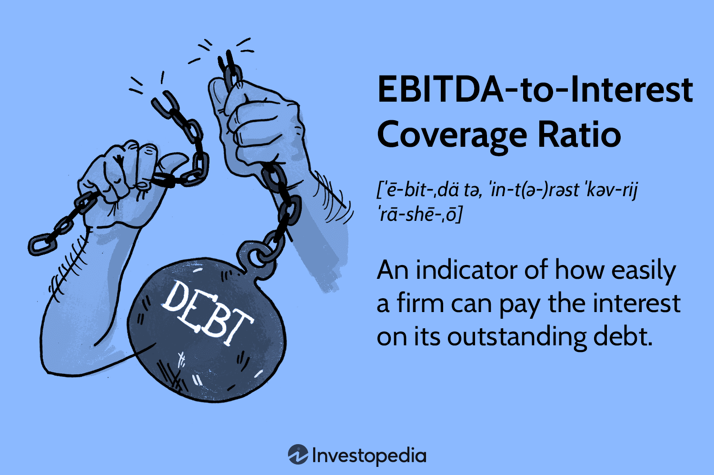

## Table of Contents

## What is the EBITDA to Interest Coverage Ratio?

The EBITDA to Interest Coverage Ratio is a financial metric that shows how well a company can pay its interest expenses on outstanding debt. It is calculated by dividing a company's earnings before interest, taxes, depreciation, and amortization (EBITDA) by its interest expenses. This ratio helps investors and creditors understand if a company is generating enough operating profit to cover its interest payments, which is crucial for assessing the company's financial health and stability.

A higher EBITDA to Interest Coverage Ratio indicates that a company has more earnings available to pay its interest, suggesting it is in a stronger financial position. For example, if a company has an EBITDA of $100,000 and interest expenses of $25,000, the ratio would be 4 ($100,000 / $25,000). This means the company's earnings are four times its interest expenses, which is generally seen as a healthy sign. Conversely, a lower ratio might signal potential financial trouble, as it shows the company may struggle to meet its interest obligations.

## Why is the EBITDA to Interest Coverage Ratio important for businesses?

The EBITDA to Interest Coverage Ratio is important for businesses because it helps them understand if they can pay the interest on their loans. This ratio shows how much money a business makes before paying interest, taxes, and other expenses, compared to how much interest they have to pay. If the ratio is high, it means the business is doing well and can easily cover its interest payments. This is good news for the business and for people who might lend them money, because it shows the business is financially healthy.

On the other hand, if the ratio is low, it means the business might have trouble paying its interest. This can be a warning sign that the business needs to be careful with its money or find ways to make more profit. Lenders and investors pay close attention to this ratio because it helps them decide if it's safe to lend money to the business or invest in it. A good EBITDA to Interest Coverage Ratio can make it easier for a business to get loans and grow, while a bad ratio can make things harder.

## How is the EBITDA to Interest Coverage Ratio calculated?

The EBITDA to Interest Coverage Ratio is calculated by dividing a company's earnings before interest, taxes, depreciation, and amortization (EBITDA) by its interest expenses. To find the EBITDA, you start with the company's net income, then add back the interest, taxes, depreciation, and amortization that were subtracted to get to that net income. The interest expense is the total amount of interest the company has to pay on its debts during the same period.

Once you have both numbers, you divide the EBITDA by the interest expense. For example, if a company has an EBITDA of $100,000 and interest expenses of $25,000, you would divide $100,000 by $25,000 to get a ratio of 4. This means the company's earnings are four times its interest expenses. A higher ratio shows that the company can easily cover its interest payments, which is a good sign for its financial health.

## What does a high EBITDA to Interest Coverage Ratio indicate?

A high EBITDA to Interest Coverage Ratio means that a company is making a lot more money than it needs to pay its interest on loans. This is a good sign because it shows the company is financially strong and can easily handle its debts. When a company has a high ratio, it means it can pay its interest many times over, which makes lenders and investors feel more confident about the company's future.

Having a high ratio can also help a company get more loans if it needs them. Lenders like to see that a company can pay back what it borrows, so a high ratio makes it easier for the company to borrow money at good rates. This can help the company grow and invest in new projects, making it even stronger over time.

## What does a low EBITDA to Interest Coverage Ratio suggest?

A low EBITDA to Interest Coverage Ratio means a company might have trouble paying the interest on its loans. It shows that the money the company makes before paying interest, taxes, and other expenses isn't enough to cover its interest payments easily. This can be a warning sign that the company is not doing well financially and might struggle to keep up with its debts.

When a company has a low ratio, lenders and investors might worry about lending them more money or investing in them. This can make it harder for the company to get new loans or grow. If the company can't find a way to make more money or lower its debts, it could face bigger financial problems in the future.

## How can the EBITDA to Interest Coverage Ratio be used by investors?

Investors use the EBITDA to Interest Coverage Ratio to see if a company can pay the interest on its loans. If the ratio is high, it means the company is making a lot more money than it needs to pay its interest. This is good news for investors because it shows the company is strong and can handle its debts well. A high ratio makes investors feel more confident about putting their money into the company.

On the other hand, if the ratio is low, it means the company might have trouble paying its interest. This can worry investors because it shows the company might not be doing well financially. A low ratio can make investors think twice about investing in the company, as it might be riskier. By looking at this ratio, investors can make better decisions about where to put their money.

## What are the limitations of using the EBITDA to Interest Coverage Ratio?

The EBITDA to Interest Coverage Ratio can be helpful, but it has some limits. One big problem is that it doesn't show how much money a company really has to spend after paying for things like taxes, equipment wear and tear, and other costs. These are important because they affect how much money the company actually has to pay its debts. If a company has a high EBITDA but also high taxes or needs to replace a lot of equipment, it might not be as financially strong as the ratio suggests.

Another limit is that the ratio can be different from one industry to another. What's a good ratio in one industry might not be good in another. So, investors need to know about the industry they are looking at to understand if the ratio is good or bad. Also, the ratio can be affected by how a company decides to report its earnings. If a company uses different ways to calculate its EBITDA, it can make it hard to compare it with other companies.

## How does the EBITDA to Interest Coverage Ratio differ from other coverage ratios?

The EBITDA to Interest Coverage Ratio is one way to see if a company can pay its interest on loans. It looks at how much money a company makes before paying interest, taxes, and other costs, compared to its interest payments. This ratio is useful because it focuses on the company's operating earnings and doesn't include some costs like depreciation and amortization. However, other coverage ratios might include these costs or use different measures of earnings, which can give a different view of the company's financial health.

For example, the EBIT to Interest Coverage Ratio is similar but includes depreciation and amortization in its calculation. This can make it a stricter measure because it shows how much money the company makes after accounting for the wear and tear of its assets. Another ratio is the Net Income to Interest Coverage Ratio, which looks at how much money a company has left after paying all its expenses, including taxes, interest, and depreciation. This ratio can be more conservative because it uses the final profit number, giving a clearer picture of what's left to pay interest after all other obligations are met. Each of these ratios gives investors and lenders a different perspective on a company's ability to handle its debt.

## Can you provide an example of how to interpret the EBITDA to Interest Coverage Ratio in a real company scenario?

Imagine a company called "GreenTech" that makes solar panels. Last year, GreenTech had an EBITDA of $2 million and interest expenses of $500,000. To find the EBITDA to Interest Coverage Ratio, you divide the EBITDA by the interest expenses, which gives you a ratio of 4 ($2,000,000 / $500,000). This means GreenTech's earnings are four times its interest expenses. A ratio of 4 is generally considered good because it shows that GreenTech can easily cover its interest payments, which is a sign of financial health.

Now, let's look at another company called "AutoParts" that makes car parts. Last year, AutoParts had an EBITDA of $1 million and interest expenses of $400,000. When you divide the EBITDA by the interest expenses, you get a ratio of 2.5 ($1,000,000 / $400,000). This means AutoParts' earnings are only 2.5 times its interest expenses. A ratio of 2.5 is lower than GreenTech's and might be a bit worrying because it shows that AutoParts doesn't have as much extra money to cover its interest payments. This could mean AutoParts needs to be more careful with its money or find ways to increase its earnings to stay financially healthy.

## How does industry affect the interpretation of the EBITDA to Interest Coverage Ratio?

The industry a company is in can change what a good or bad EBITDA to Interest Coverage Ratio looks like. Different industries have different normal levels of debt and earnings. For example, a tech company might have a high ratio because it makes a lot of money and doesn't need much money to run its business. But a company in the construction industry might have a lower ratio because it needs a lot of money to buy equipment and materials, which can make its debt higher.

So, when looking at a company's ratio, it's important to compare it to other companies in the same industry. A ratio that seems low in one industry might be normal or even good in another. This helps investors and lenders understand if a company is doing well compared to its competitors, and if it can handle its debt well within its own industry's standards.

## What are some strategies a company might use to improve its EBITDA to Interest Coverage Ratio?

A company can improve its EBITDA to Interest Coverage Ratio by increasing its earnings. One way to do this is by growing its sales, maybe by finding new customers or selling more to the ones it already has. Another way is to cut costs. This could mean finding cheaper suppliers, making the business run more smoothly, or even letting go of some workers if needed. By making more money or spending less, the company's EBITDA goes up, which can make the ratio better.

Another strategy is to manage its debt better. The company can try to pay off some of its loans, which would lower its interest expenses. It could also talk to its lenders about getting a lower interest rate on its loans. If the company can lower its interest payments, the ratio will go up because the same amount of earnings now covers a smaller amount of interest. Both increasing earnings and managing debt can help a company have a healthier EBITDA to Interest Coverage Ratio.

## How has the use of the EBITDA to Interest Coverage Ratio evolved in financial analysis over time?

The use of the EBITDA to Interest Coverage Ratio in financial analysis has changed a lot over time. When it first started being used, people saw it as a quick way to check if a company could pay its interest on loans. It was popular because it looked at a company's earnings before taking away interest, taxes, and other costs, which made it easier to compare companies with each other. But as time went on, people started to see that this ratio had some problems. It didn't show the full picture of a company's money situation because it left out important costs like taxes and the wear and tear of equipment.

These days, financial analysts use the EBITDA to Interest Coverage Ratio along with other ratios to get a better idea of a company's health. They know that while it can be helpful, it's not perfect. So, they also look at other measures like the EBIT to Interest Coverage Ratio, which includes costs like depreciation, or the Net Income to Interest Coverage Ratio, which looks at what's left after all expenses. By using a mix of ratios, analysts can get a more complete view of whether a company can handle its debt. This way, they can make smarter decisions about investing or lending money.

## What is the EBITDA-to-Interest Coverage Ratio?

The EBITDA-to-interest coverage ratio is a critical metric for understanding a company's ability to meet its debt obligations. This ratio evaluates whether a firm's earnings before interest, taxes, depreciation, and amortization (EBITDA) are sufficient to cover its interest expenses. A higher ratio is indicative of a company in solid financial health, with ample earnings to comfortably meet the costs associated with its debts.

### Formula for Calculating the EBITDA-to-Interest Coverage Ratio

The calculation of the EBITDA-to-interest coverage ratio involves a straightforward formula:

$$
\text{EBITDA-to-Interest Coverage Ratio} = \frac{\text{EBITDA}}{\text{Interest Expenses}}
$$

Where:
- **EBITDA** is the company's earnings before interest, taxes, depreciation, and amortization. It reflects the operational profitability of the company.
- **Interest Expenses** are the costs incurred from borrowed funds.

### Step-by-Step Calculation Example

Consider a company that reports an EBITDA of $500,000 and interest expenses amounting to $100,000 over a given period. The EBITDA-to-interest coverage ratio can be calculated as follows:

1. **Identify the EBITDA and interest expenses**: In this case, EBITDA is $500,000, and interest expenses total $100,000.
2. **Apply the formula**: Plug the identified values into the formula:
$$
   \text{EBITDA-to-Interest Coverage Ratio} = \frac{500,000}{100,000} = 5.0

$$

This ratio of 5.0 signifies that the company's EBITDA is five times its interest obligations, suggesting strong financial health and an ability to satisfy its interest liabilities with surplus.

In summary, the EBITDA-to-interest coverage ratio serves as a vital tool for assessing financial durability, offering insight into a company's capability to manage its debt obligations effectively.

## What is the importance of the EBITDA-to-Interest Coverage Ratio in financial analysis?

The EBITDA-to-interest coverage ratio is a critical metric in financial analysis, helping evaluate a firm's ability to meet its debt obligations and providing insight into its financial stability. This ratio is calculated by dividing a company's earnings before interest, taxes, depreciation, and amortization (EBITDA) by its interest expenses. The formula is:

$$
\text{EBITDA-to-Interest Coverage Ratio} = \frac{\text{EBITDA}}{\text{Interest Expenses}}
$$

A higher EBITDA-to-interest coverage ratio signifies that a company has a robust capacity to cover its interest expenses, reflecting financial stability. Such companies are viewed as reliable by investors and creditors, ensuring they have a lower risk of default. A high ratio often results in favorable borrowing terms, as creditors recognize the company’s ability to manage additional debt without jeopardizing financial health. For investors, a higher ratio can signal a stable investment with potential for growth, often leading to a stronger stock market performance.

Conversely, a low EBITDA-to-interest coverage ratio can indicate vulnerability. Companies with lower ratios may be at risk of struggling to meet their interest obligations, which can lead to [liquidity](/wiki/liquidity-risk-premium) pressures or even insolvency. Investors might be wary, perceiving such companies as high-risk investments. Creditors may demand higher interest rates for loans to compensate for the increased perceived risk, potentially hampering the company's ability to pursue growth opportunities or refinancing options.

The ratio also plays a significant role in operational decision-making and long-term financial planning. By assessing this ratio, management can make informed decisions regarding capital allocation, debt management, and investment in new projects, ensuring sustainable growth. A focus on maintaining an optimal ratio supports strategic planning, enabling businesses to adapt to changing economic conditions while minimizing financial risks.

Ultimately, the EBITDA-to-interest coverage ratio serves as an indispensable tool, aiding in the comprehensive assessment of a company’s financial resilience. It not only informs investors and creditors about the company's current financial health but also guides management in aligning their strategic objectives with financial prudence.

## References & Further Reading

[1]: Damodaran, A. (2007). ["Corporate Finance: Theory and Practice"](https://www.amazon.com/Corporate-Finance-Practice-Aswath-Damodaran/dp/812651115X). John Wiley & Sons.

[2]: O'Hara, M. (2015). ["High-Frequency Trading: New Realities for Traders, Markets and Regulators."](https://www.semanticscholar.org/paper/High-frequency-trading-%3A-new-realities-for-traders%2C-Easley-Prado/e1b693a045a0554198a83b127f534f17592ebb08) Journal of Economic Perspectives, 25(2).

[3]: ["Financial Statement Analysis and Security Valuation"](https://www.amazon.com/Financial-Statement-Analysis-Security-Valuation/dp/0073379662) by Stephen H. Penman.

[4]: ["Principles of Corporate Finance"](https://www.amazon.com/Principles-Corporate-Finance-Richard-Brealey/dp/0077404890) by Richard A. Brealey, Stewart C. Myers, and Franklin Allen.

[5]: ["Algorithmic Trading: Winning Strategies and Their Rationale"](https://www.amazon.com/Algorithmic-Trading-Winning-Strategies-Rationale-ebook/dp/B00CY5HC0U) by Ernest P. Chan.