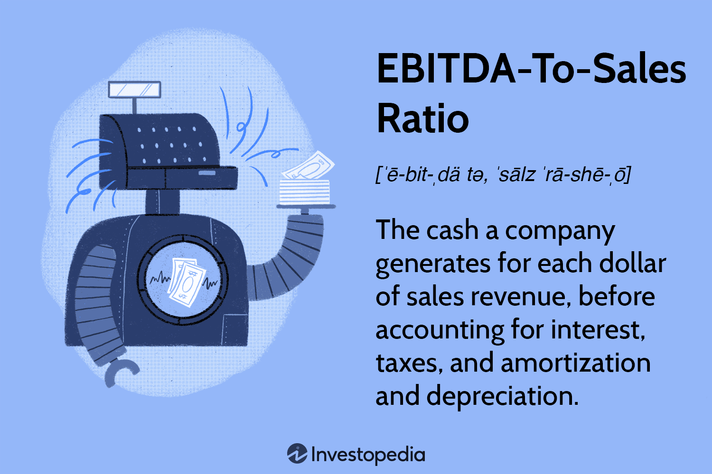

In today's data-driven financial landscape, understanding key financial metrics is crucial for making informed investment decisions. Among these metrics, the EBITDA-to-Sales ratio and its related measurements play an essential role. The EBITDA-to-Sales ratio, also known as the EBITDA margin, provides insight into a company's operational efficiency by comparing its gross revenue with earnings before interest, taxes, depreciation, and amortization (EBITDA). This ratio determines how effectively a company generates earnings while controlling its operational costs, making it a vital indicator of profitability. 

Financial metrics like the EBITDA-to-Sales ratio are instrumental in evaluating company performance, especially in the rapidly evolving field of algorithmic trading. Algorithmic trading employs advanced computational techniques to execute trades based on predefined criteria, allowing for large-scale data analysis and decision-making. By incorporating financial ratios like the EBITDA margin into trading algorithms, investors can achieve a more nuanced and informed assessment of market opportunities. These tools help identify undervalued stocks or companies with high operational efficiency, which can lead to more strategic investment decisions.



Moreover, the integration of financial metrics within trading algorithms offers the potential to enhance investment strategies. By leveraging real-time data, algorithms can quickly process and react to changes in financial metrics, improving the accuracy and timeliness of trades. This capability is particularly advantageous in competitive markets, where milliseconds can have significant financial implications.

Overall, mastering these financial metrics, including the EBITDA-to-Sales ratio, can unlock strategic market advantages, offering a competitive edge in the dynamic environment of algorithmic trading. Investors and analysts can use these ratios to make more accurate predictions and investment choices, improving their performance and ensuring long-term success in the financial markets.

## Table of Contents

## Understanding the EBITDA-to-Sales Ratio

The EBITDA-to-Sales ratio, commonly referred to as the EBITDA margin, is a vital metric in financial analysis, especially when assessing a company's profitability and operational efficiency. The formula for this ratio, $\frac{\text{EBITDA}}{\text{Net Sales}}$, measures a company's earnings before interest, taxes, depreciation, and amortization (EBITDA) relative to its total revenue. By focusing on EBITDA, this metric effectively removes the impacts of financial and accounting decisions, offering a purer view of the company's operating performance.

From an analytical perspective, a high EBITDA-to-Sales ratio signifies that a company is skillful in generating earnings while managing its operating costs efficiently. This efficiency is crucial in industries where competition is fierce, and margins are critical to maintaining a competitive edge. Conversely, a lower ratio might point to profitability challenges or high operating expenses, serving as a red flag for potential investors and analysts.

This metric is indispensable for understanding a company's financial health. It provides insights into the company's core profitability, offering a benchmark for comparing performance across different companies and industries. The EBITDA-to-Sales ratio aids analysts in identifying companies that might be undervalued due to their operational efficiency but otherwise might seem unattractive by other performance metrics. 

Investors often turn to this ratio when quick insights are needed, as it offers a straightforward method to gauge whether a company is adept at converting sales into actual earnings. However, while the EBITDA-to-Sales ratio is a powerful tool, it is most effective when used in conjunction with other financial metrics to deliver a comprehensive analysis of a company's financial performance.

## Algorithmic Trading and Financial Ratios

Algorithmic trading leverages sophisticated algorithms to execute trades at speeds and volumes impractical for human traders. At its core, this approach is driven by data and complex mathematical models designed to identify and exploit market inefficiencies. Incorporating financial ratios, such as the EBITDA-to-Sales ratio, into these algorithms provides a refined lens through which to evaluate and capture trading opportunities.

The EBITDA-to-Sales ratio, a measure of a company's operating profitability, offers significant insights for algorithmic traders. By supplementing price data with this ratio, algorithms can assess underlying business efficiency and predict future profitability trends more accurately. For instance, a high EBITDA-to-Sales ratio might suggest a company's capability to generate substantial earnings relative to its revenue, signaling operational efficiency and potential for sustained growth.

Integrating such financial ratios into trading algorithms can uncover undervalued stocks that traditional price models might overlook. Consider an algorithm searching for companies with strong operational performance—by focusing on a high EBITDA-to-Sales ratio, it can identify firms that maintain lower operational costs and demonstrate robustness even in challenging market conditions. This approach enhances the selection process by prioritizing firms based on both their market landscapes and intrinsic operational metrics.

Moreover, tailoring algorithms to account for these ratios allows traders to craft more sophisticated investment strategies. By quantifying operational efficiency, traders can calibrate their models to balance risk and reward more effectively, avoiding companies with potential cash flow issues, as indicated by a low EBITDA-to-Sales ratio. Through continuous ratio analysis, algorithms dynamically adjust to market conditions, simplifying decision-making and promoting agile trading strategies.

For practical implementation, algorithmic traders may employ programming languages like Python to automate such processes. For example, consider the following simple Python snippet utilizing the `pandas` library to calculate the EBITDA-to-Sales ratio for a dataset of financial statements:

```python
import pandas as pd

# Sample financial data
data = {'Company': ['A', 'B', 'C'],
        'EBITDA': [500000, 750000, 200000],
        'Net_Sales': [2500000, 3000000, 800000]}

df = pd.DataFrame(data)

# Calculate EBITDA-to-Sales ratio
df['EBITDA_to_Sales'] = df['EBITDA'] / df['Net_Sales']

print(df)
```

This code exemplifies how financial ratios can be effortlessly integrated into data pipelines to facilitate real-time analysis and trading execution.

In conclusion, adopting financial ratios like the EBITDA-to-Sales ratio in [algorithmic trading](/wiki/algorithmic-trading) enhances the decision-making framework by providing greater insight into a company's operational health. Such integration ensures more accurate, responsive, and ultimately profitable trading strategies, fortifying the role of data-driven methodologies in modern financial markets.

## Calculating and Interpreting the EBITDA-to-Sales Ratio

The EBITDA-to-Sales ratio is a vital metric for assessing a company's operational efficiency and profitability. Calculating this ratio involves taking the Earnings Before Interest, Taxes, Depreciation, and Amortization (EBITDA) and dividing it by the company's net sales. Mathematically, this can be expressed as:

$$
\text{EBITDA-to-Sales Ratio} = \frac{\text{EBITDA}}{\text{Net Sales}}
$$

### Calculation Example

Let's consider a practical example to understand this calculation better. Suppose Company X reports an EBITDA of \$5 million and total net sales of \$20 million for the fiscal year.

$$
\text{EBITDA-to-Sales Ratio} = \frac{\$5\, \text{million}}{\$20\, \text{million}} = 0.25 \, \text{or} \, 25\%
$$

This means Company X retains 25% of its sales as EBITDA, which is an indicator of its operational efficiency.

### Interpretation

A **low EBITDA-to-Sales ratio** might signal potential profitability or cash flow issues. It suggests that the company incurs high operational costs relative to its sales revenue. This could either be due to inefficiencies or industry-specific challenges that might require further analysis to understand fully.

On the other hand, a **high EBITDA-to-Sales ratio** usually indicates that a company efficiently converts sales into earnings, signifying robust business operations. Such a company is better positioned to invest in growth opportunities, pay off debts, or distribute dividends.

### Significance of Industry Standards

The interpretation of the EBITDA-to-Sales ratio must consider industry standards and company-specific contexts. Different sectors have varying average ratios due to inherent operational costs and capital structure differences. For example, technology companies might exhibit higher ratios due to lower production costs compared to manufacturing firms.

### Company-Specific Context

Understanding a company's positioning within its industry is crucial. A firm might have a high EBITDA-to-Sales ratio relative to its peers, indicating a competitive edge or better management, while a lower ratio might suggest the need for strategic operational improvements.

### Python Example

Here's a simple Python script to calculate the EBITDA-to-Sales ratio:

```python
def calculate_ebitda_to_sales_ratio(ebitda, net_sales):
    try:
        ratio = ebitda / net_sales
        return ratio
    except ZeroDivisionError:
        return "Net sales cannot be zero."

# Example usage
ebitda = 5000000  # in dollars
net_sales = 20000000  # in dollars
ratio = calculate_ebitda_to_sales_ratio(ebitda, net_sales)
print(f"EBITDA-to-Sales Ratio: {ratio:.2%}")
```

This code provides a straightforward way to compute the ratio, taking into account possible edge cases like zero net sales, which would make the ratio undefined.

## Case Studies and Applications in Algo Trading

Companies like Walmart and Target effectively utilize the EBITDA-to-Sales ratio as a strategic tool for decision-making, reflecting their operational efficiency and profitability. For instance, Walmart, as a leading retail corporation, employs this ratio to assess its cost management and operational efficiencies. By analyzing this metric, Walmart can make informed decisions about pricing strategies, cost structures, and market positioning. Similarly, Target uses the EBITDA-to-Sales ratio to gauge its financial health and competitive stance, helping the company to align its operational practices with financial goals.

### Sector-Specific Applications

In the retail industry, companies leverage the EBITDA-to-Sales ratio to ensure effective cost control and profitability. In contrast, the hospitality sector uses this metric to measure the efficiency of operations against sales performance, which is crucial in an industry with tight operating margins. Telecommunications companies gauge capital-intensive investments and operational efficiency through this ratio, aiming for a balance between infrastructure expenditure and revenue generation.

### Algorithmic Trading Strategies

Algorithmic traders utilize financial ratios, including the EBITDA-to-Sales ratio, to refine automated investment strategies. By integrating this ratio into their algorithms, traders can identify stocks of companies with high operational efficiency that are potentially undervalued. This practice enables scalability in trading operations and enhances the precision of market assessments, leading to more robust investment portfolios.

### Python Implementation

Incorporating the EBITDA-to-Sales ratio within algorithmic trading systems can be effectively achieved using Python. Below is a simple script to compute the EBITDA-to-Sales ratio for a company and integrate it into a trading strategy analysis:

```python
import pandas as pd

# Sample financial data
data = {
    'Company': ['Walmart', 'Target'],
    'EBITDA': [32000, 5000],  # in millions
    'Sales': [500000, 75000]  # in millions
}

# Create DataFrame
df = pd.DataFrame(data)

# Calculate EBITDA-to-Sales ratio
df['EBITDA_to_Sales_Ratio'] = df['EBITDA'] / df['Sales']

print(df)

# Simple algorithm to flag high operational efficiency
threshold_ratio = 0.08
df['Investment_Flag'] = df['EBITDA_to_Sales_Ratio'] > threshold_ratio

# Print results with investment decisions
print(df[['Company', 'EBITDA_to_Sales_Ratio', 'Investment_Flag']])
```

This code calculates the EBITDA-to-Sales ratio for each company and flags those exceeding a threshold, indicating high operational efficiency for potential investment opportunities. Such automated analysis allows investors to systematically integrate financial metrics into trading strategies, improving the financial decision-making process.

## Conclusion

The EBITDA-to-Sales ratio stands as an invaluable metric within financial analysis, offering insights into a company's operational efficiency and profitability. It effectively measures how much a company earns before interest, taxes, depreciation, and amortization for each unit of revenue. This metric not only serves as a reflection of the company’s core operational performance but also has broader applications in the competitive sphere of algorithmic trading.

Integrating the EBITDA-to-Sales ratio into algorithmic trading systems enriches the decision-making process by providing algorithms with crucial data about a company's financial health. Algorithms equipped with such financial metrics can evaluate market conditions with enhanced precision, allowing for timely investment decisions in fast-paced markets. By leveraging the ratio, trading systems can identify potentially lucrative investments in companies exhibiting high operational efficiency, hence reducing the risk of investments in financially troubled entities.

Mastery of this financial ratio, among others, offers significant strategic advantages for investors operating within the dynamic landscape of algorithmic trading. A profound understanding of how to apply and interpret these metrics allows traders and analysts to devise robust investment strategies that align with current financial landscapes. Given its role in assessing the viability of investments, it encourages a more comprehensive analysis of company performance when employed in conjunction with other financial metrics, thereby facilitating a well-rounded investment approach.

## References & Further Reading

1. **Books**:
   - **"Financial Statement Analysis and Security Valuation" by Stephen H. Penman**: This book provides a comprehensive overview of financial statement analysis, emphasizing both qualitative and quantitative techniques for valuing securities.
   - **"Algorithmic Trading: Winning Strategies and Their Rationale" by Ernest P. Chan**: A must-read for those interested in understanding how algorithmic trading works, including practical strategies and insights into financial metrics integration.

2. **Articles and Journals**:
   - **"Profitability Ratios as a Determinant of Stock Returns and Trading Volume: A Comparative Analysis" by J. R. Baker et al.**: This article explores the impact of profitability ratios, like EBITDA-to-Sales, on stock market behaviors, offering a comparative analysis across different sectors.
   - **"The Use and Misuse of EBITDA" by Patrick Conroy**: Found in the Journal of Financial Analysis, this article critically analyzes the EBITDA metric's application and common pitfalls in financial analysis.

3. **Educational Platforms**:
   - **Coursera's "Financial Markets" course by Yale University**: Offers a solid foundation in understanding financial markets, covering financial metrics and their implication in investments and trading.
   - **edX's "Algorithmic Trading and Finance Models with Python, R, and Stata Essential Training" by University at Buffalo**: This course provides a practical introduction to algorithmic trading, focusing on model building and financial metric analysis using Python.

4. **Case Studies**:
   - **"Walmart's Financial Strategies" by Harvard Business Review**: An in-depth case study examining how Walmart uses financial metrics, including EBITDA-to-Sales, to inform strategic decisions and operational efficiency.
   - **"The Role of Financial Ratios in Telecommunications Company Performance"**: This study looks at the application of financial ratios in the telecommunications industry, providing insights into sector-specific challenges and strategies.

5. **Financial Analysis Guides**:
   - **Investopedia's "Financial Ratio Analysis"**: A comprehensive guide that details various financial ratios, including the EBITDA-to-Sales ratio, and their application in evaluating company performance.
   - **"Python for Finance: Analyze Big Financial Data"**: This guide provides step-by-step tutorials on performing financial data analysis using Python, useful for both financial analysts and algorithmic traders.

These resources offer extensive knowledge for those interested in understanding the applications of financial metrics like the EBITDA-to-Sales ratio in both traditional and algorithmic trading contexts. Whether through in-depth [books](/wiki/algo-trading-books), academic articles, online courses, or practical case studies, these materials will enhance your comprehension of financial analysis and its strategic implementations.

