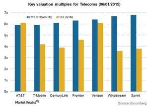

## Table of Contents

## What is EBITDA and how is it calculated?

EBITDA stands for Earnings Before Interest, Taxes, Depreciation, and Amortization. It's a way to measure how much money a company is making from its main business activities, without considering the costs of interest, taxes, and the gradual reduction in value of its assets over time. This helps people see the company's operational performance more clearly.

To calculate EBITDA, you start with the company's earnings, which is usually the net income found on the income statement. Then, you add back the expenses for interest, taxes, depreciation, and amortization. These amounts are also found on the income statement. By adding these back, you get a clearer picture of the company's operating profitability, which can be useful for comparing businesses in the same industry.

## Why is EBITDA used as a valuation metric?

EBITDA is used as a valuation metric because it helps investors and analysts see how well a company is doing with its main business activities, without the distraction of other financial factors like taxes or how the company is paying for its assets. By looking at EBITDA, people can compare companies in the same industry more easily. This is because it removes the effects of different financing methods, tax situations, and accounting decisions that can make companies look different even if their core businesses are doing similarly.

Another reason EBITDA is popular is that it gives a quick snapshot of a company's ability to generate cash from its operations. This is important because cash flow is crucial for a business to keep running, grow, and pay its debts. Even though EBITDA isn't the same as cash flow, it's a good starting point to understand how much cash a company might be making before other costs come into play. This makes it a handy tool for figuring out if a company is a good investment or how much it might be worth.

## How does EBITDA differ from net income?

EBITDA and net income are both ways to measure how much money a company makes, but they look at it differently. Net income is what's left after a company takes away all its costs from its total earnings. This includes everything from the cost of making products, paying employees, to interest on loans, taxes, and the wear and tear on equipment (depreciation and amortization). It's the final amount of profit a company has at the end of the day.

EBITDA, on the other hand, doesn't take away all these costs. It only looks at the earnings before interest, taxes, depreciation, and amortization are subtracted. This means it's a way to see how well a company's main business is doing without worrying about how it's financed or how old its equipment is. By not including these costs, EBITDA gives a clearer picture of the money a company makes from its core activities, which can be helpful when comparing different companies.

## What are the advantages of using EBITDA in the telecommunications industry?

In the telecommunications industry, using EBITDA has big advantages because it helps companies show how well they are doing with their main business, like providing phone and internet services, without getting mixed up with other costs. Telecom companies often have a lot of debt from building networks and buying equipment, which means they have to pay a lot of interest. By looking at EBITDA, investors can see past these interest payments and focus on how much money the company is making from its services.

Another advantage is that telecom companies have to replace and upgrade their equipment all the time, which leads to big depreciation costs. EBITDA ignores these costs, so it gives a clearer picture of the cash the company is making before it has to spend on new equipment. This is helpful for comparing different telecom companies, because even if one company has older equipment and higher depreciation costs, you can still see how well its main business is doing compared to others.

## What are the limitations and criticisms of using EBITDA as a valuation metric?

One big problem with using EBITDA as a way to figure out how much a company is worth is that it doesn't show the whole picture. It leaves out important costs like interest, taxes, depreciation, and amortization. These costs can be really important, especially for companies that have a lot of debt or need to keep buying new equipment. If you only look at EBITDA, you might think a company is doing better than it really is because you're not seeing the full cost of running the business.

Another criticism is that EBITDA can be used to make a company look more profitable than it really is. Since it doesn't count depreciation and amortization, which are real costs of doing business, it can make the company's earnings look bigger. This can be misleading, especially for investors who want to know the true financial health of a company. It's also not a standard measure, so different companies might calculate it differently, which makes it hard to compare them fairly.

## How do telecommunications companies report EBITDA in their financial statements?

Telecommunications companies report EBITDA in their financial statements as a way to show how much money they are making from their main business activities. They usually include it in a section called "Non-GAAP Financial Measures" or in the "Management's Discussion and Analysis" part of their reports. This is because EBITDA is not an official accounting measure, so companies have to explain why they are using it and how they calculate it. They start with their net income and then add back the costs for interest, taxes, depreciation, and amortization to get to the EBITDA number.

This way of reporting helps investors and analysts understand the company's operating performance without getting distracted by things like how much debt the company has or how old its equipment is. Since telecom companies often have a lot of debt and need to replace equipment regularly, showing EBITDA can make their financial performance look better. However, they also need to be clear about the limitations of using EBITDA, like not showing the full cost of running the business, to give a complete picture of their financial health.

## Can EBITDA be used to compare companies within the telecommunications industry?

Yes, EBITDA can be used to compare companies within the telecommunications industry because it focuses on the money made from the main business activities, like providing phone and internet services. By not including costs like interest, taxes, depreciation, and amortization, EBITDA shows how well a company is doing at its core. This is helpful in the telecom industry where companies often have big debts from building networks and buying equipment, and they need to replace that equipment regularly. So, by looking at EBITDA, you can see which telecom companies are making more money from their services, without the noise of other financial factors.

However, using EBITDA to compare telecom companies has its limits. It doesn't show the full cost of running the business because it leaves out important expenses like interest on loans and the cost of replacing old equipment. This can make a company look more profitable than it really is. Also, since EBITDA is not an official accounting measure, different companies might calculate it in slightly different ways, which can make comparisons tricky. So, while EBITDA can be a useful starting point for comparing telecom companies, it's important to look at other financial measures too to get a complete picture.

## How does EBITDA impact investment decisions in the telecommunications sector?

EBITDA is important for people making investment decisions in the telecommunications sector because it shows how much money a company is making from its main business, like providing phone and internet services. By not including costs like interest, taxes, depreciation, and amortization, EBITDA gives a clear picture of how well the company's core business is doing. This is really helpful in telecom because these companies often have a lot of debt from building networks and buying equipment, and they need to replace that equipment all the time. So, investors can use EBITDA to see which telecom companies are making more money from their services, without worrying about how much debt they have or how old their equipment is.

However, using EBITDA to make investment decisions has its limits. It doesn't show the full cost of running the business because it leaves out important expenses like interest on loans and the cost of replacing old equipment. This can make a company look more profitable than it really is. Also, since EBITDA is not an official accounting measure, different companies might calculate it in slightly different ways, which can make it hard to compare them fairly. So, while EBITDA can be a good starting point for investment decisions in the telecom sector, investors should also look at other financial measures to get a complete picture of a company's health.

## What role does EBITDA play in mergers and acquisitions within the telecommunications industry?

In the telecommunications industry, EBITDA is really important when companies are thinking about merging or being bought out. It helps them figure out how much a company is worth by looking at how much money it makes from its main business, like providing phone and internet services. Since telecom companies often have a lot of debt and need to keep buying new equipment, looking at EBITDA can show how well the company is doing without getting mixed up with those other costs. This makes it easier for companies to decide if a merger or acquisition makes sense and how much they should pay.

However, using EBITDA to decide on mergers and acquisitions has its limits. It doesn't show the full cost of running the business because it leaves out important expenses like interest on loans and the cost of replacing old equipment. This can make a company look more profitable than it really is. Also, since EBITDA is not an official accounting measure, different companies might calculate it in slightly different ways, which can make it hard to compare them fairly. So, while EBITDA can be a good starting point for these decisions, companies should also look at other financial measures to get a complete picture of a company's health before making a final decision.

## How can EBITDA be adjusted for more accurate valuations in the telecommunications industry?

To make EBITDA more useful for figuring out how much a telecom company is worth, you can make some changes to it. One way is to add back any one-time costs that don't happen every year, like the cost of closing a business or paying for a big lawsuit. These costs can make the company's earnings look worse than they really are, so taking them out can give a clearer picture of how the company is doing day to day. Another way is to adjust for any money the company makes or spends that isn't part of its main business, like selling off old equipment or investing in new projects. By making these changes, you can get a better idea of the company's true operating performance.

Also, it's important to think about the costs that EBITDA leaves out, like interest on loans and the cost of replacing old equipment. These costs are real and can affect how much money the company has left over. So, you might want to look at other measures like free cash flow, which shows how much cash the company has after paying for everything, including those costs. By using adjusted EBITDA along with other financial measures, you can get a fuller picture of the company's health and make a more accurate guess about how much it's worth.

## What are some case studies of EBITDA usage in major telecommunications deals?

When AT&T bought Time Warner in 2018, they used EBITDA to help figure out how much to pay. They looked at Time Warner's earnings before interest, taxes, depreciation, and amortization to see how well Time Warner's main business was doing. This helped them see past Time Warner's debts and the cost of their equipment, giving a clearer picture of their core business performance. By using EBITDA, AT&T could make a better guess about how much Time Warner was worth and if the deal made sense for them.

Another example is when T-Mobile and Sprint merged in 2020. They used EBITDA to compare their businesses and decide on the value of the merger. Since both companies had a lot of debt and needed to keep buying new equipment, looking at EBITDA helped them see how much money they were making from their phone and internet services. This was important for deciding how much T-Mobile should pay for Sprint and how the new combined company would look financially. By focusing on EBITDA, they could make a more informed decision about the merger.

## How do changes in technology and market conditions affect the relevance of EBITDA as a valuation metric in telecommunications?

Changes in technology and market conditions can make EBITDA less useful as a way to figure out how much a telecom company is worth. For example, as new technologies like 5G come out, telecom companies have to spend a lot of money on new equipment and networks. This can make their EBITDA look good because it doesn't count the cost of this new equipment right away. But, if these costs are high, the company might not have as much money left over as EBITDA suggests. Also, if the market changes and people start using different services or if new competitors come in, the money a company makes from its main business can go up or down. This means that EBITDA might not show the full picture of how well a company is doing in the new market.

Even though EBITDA can be affected by these changes, it's still a helpful starting point for understanding a telecom company's main business. It shows how much money the company is making from its phone and internet services before other costs come into play. But, because technology and market conditions can change so quickly, it's important to look at other financial measures too. Things like free cash flow, which shows how much cash the company has after paying for everything, can give a more complete picture. By using EBITDA along with these other measures, investors can get a better idea of a telecom company's true value and health in a changing world.

## What is EBITDA and how can it be understood?

EBITDA, or Earnings Before Interest, Taxes, Depreciation, and Amortization, is a key financial metric used to assess a company's operational performance. It eliminates the effects of financing and accounting decisions, providing a clearer focus on earnings derived purely from operations. This metric is particularly useful in comparing companies across different industries because it strips away the effects of differences in tax policies, capital structures, and asset base depreciation approaches.

The calculation of EBITDA involves starting with net income and adding back interest expenses, taxes, depreciation, and amortization. The formula can be expressed as:

$$
\text{EBITDA} = \text{Net Income} + \text{Interest} + \text{Taxes} + \text{Depreciation} + \text{Amortization}
$$

The exclusion of interest and taxes gives an insight into the operational earnings without the interfering impact of financing and taxation policies, which can vary significantly between countries and regions. Similarly, by not accounting for depreciation and amortization, EBITDA provides a perspective on earnings before any non-cash accounting items that can obscure the actual cash generated from operations.

EBITDA is particularly valuable for understanding a company's core profitability. It acts as a proxy for cash flow from operations, helping analysts and investors to measure performance against peers without being swayed by debt levels and tax rates, which can disproportionately affect net income comparisons.

In evaluating operational efficiency, EBITDA allows stakeholders to focus strictly on the cost structure and revenue efficiency, thus highlighting the financial soundness of the operational aspect of a business. This focus facilitates cross-industry comparisons, enabling more accurate assessments irrespective of differences in capital expenditure levels among industries.

Overall, understanding EBITDA equips stakeholders with key insights into a company's operational efficiency, making it an integral part of financial analysis and investment decision-making processes.

## What is the role of EBITDA in telecom business valuation?

The telecommunications industry is characterized by its capital-intensive nature, primarily due to substantial infrastructure costs for network deployment and maintenance. This structure results in high fixed costs and significant depreciation expenses. Consequently, financial metrics that accentuate operational performance without distortion from capital expenses are invaluable.

EBITDA (Earnings Before Interest, Taxes, Depreciation, and Amortization) emerges as a pivotal metric for appraising telecom companies. By excluding depreciation, EBITDA provides a clearer depiction of a company's core operating profitability. This is crucial as depreciation can artificially lower profitability in asset-heavy industries like telecommunications.

The formula for EBITDA is:

$$
\text{EBITDA} = \text{Net Income} + \text{Interest} + \text{Taxes} + \text{Depreciation} + \text{Amortization}
$$

This calculation focuses on earnings from operations, which helps in standardizing valuation comparisons across telecom enterprises. By factoring out non-cash depreciation charges, EBITDA allows analysts and investors to assess telecom entities based on actual performance. This insight drives investment decisions, highlighting companies that efficiently manage their operational resources and generate sustainable cash flows.

Standardization in EBITDA calculations facilitates cross-company and temporal comparisons, enhancing the ability to benchmark operational efficiency. Investors can thus prioritize opportunities based on underlying business performance metrics rather than varied accounting policies or capital structures.

In summary, EBITDA is indispensable in valuing telecom businesses, offering an undistorted view of operational profitability. It serves as a reliable measure to gauge a firm's efficiency in managing its core business operations beyond the influence of capital expenditures.

## References & Further Reading

Investopedia: "EBITDA: Understanding the Metric" provides a comprehensive understanding of the EBITDA metric, which is crucial for evaluating the operational performance of businesses, especially in capital-intensive industries.

Koller, T., Goedhart, M., & Wessels, D. "Valuation: Measuring and Managing the Value of Companies" is an essential resource for professionals seeking to understand various aspects of company valuation, including how EBITDA fits into broader financial analyses and comparisons.

Damodaran, A. "Investment Valuation: Tools and Techniques for Determining the Value of Any Asset" offers insights into valuation methodologies, reinforcing the importance of EBITDA and other financial metrics in assessing asset worth and investment potential.

Lopez de Prado, M. "Advances in Financial Machine Learning" explores the intersection of finance and technology, highlighting how [machine learning](/wiki/machine-learning) techniques can be applied to financial metrics like EBITDA to enhance data-driven decision-making processes.

Chan, E. "Quantitative Trading: How to Build Your Own Algorithmic Trading Business" provides a practical guide for implementing [quantitative trading](/wiki/quantitative-trading) strategies that integrate financial metrics such as EBITDA, utilizing programming tools and platforms for optimizing trading operations.

