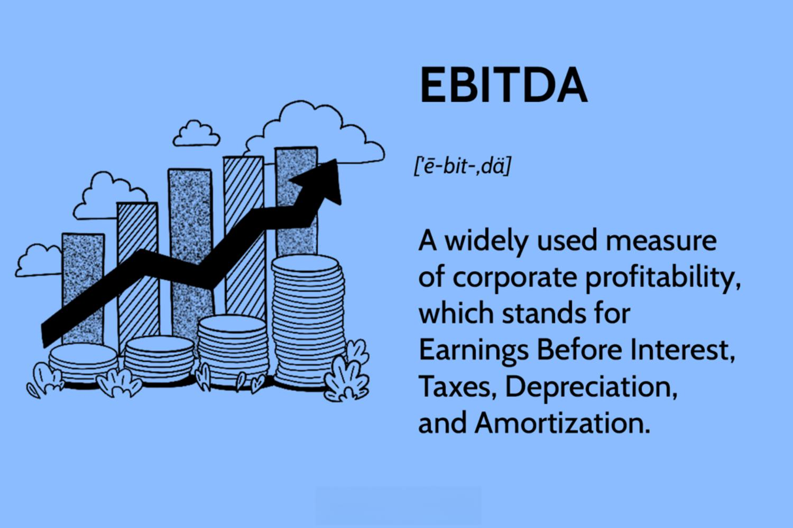

In today's competitive financial landscape, understanding key financial metrics is crucial for evaluating business performance. One such important metric is EBITDA (Earnings Before Interest, Taxes, Depreciation, and Amortization). EBITDA offers insight into a company's operational efficiency by focusing on earnings generated from core business activities, excluding non-operational expenses such as interest, taxes, depreciation, and amortization. This makes EBITDA a popular choice for analysts and investors seeking to compare companies across different sectors and capital structures.

EBITDA is often used alongside algorithmic trading, a sophisticated trading strategy that employs computer algorithms to automate the trading process. These algorithms facilitate data-driven decision-making by processing large volumes of financial data at speeds unattainable by human traders. Algorithmic trading can incorporate financial metrics like EBITDA to identify trading opportunities guided by a company’s underlying business performance rather than just market fluctuations.



This article explores the intersection of EBITDA and algorithmic trading, explaining how this financial metric can be employed to evaluate company performance and inform trading strategies. We will discuss the calculation, benefits, and limitations of EBITDA, illustrating how it becomes an integral tool in finance and trading. Furthermore, we will examine how algorithmic trading enhances business performance by leveraging financial metrics, including EBITDA, to drive more effective investment decisions. Through this examination, traders and investors can better understand the potential of integrating EBITDA within algorithmic frameworks to improve financial outcomes.

## Table of Contents

## Understanding EBITDA

EBITDA, which stands for Earnings Before Interest, Taxes, Depreciation, and Amortization, is a financial metric that seeks to provide a clear view of a company's operational performance. By omitting certain expenses such as interest, taxes, depreciation, and amortization, EBITDA presents a focus on the company's core profitability.

**Calculation of EBITDA:**

EBITDA is calculated by taking the net income and adding back interest, taxes, depreciation, and amortization. This can be represented by the formula:

$$

\text{EBITDA} = \text{Net Income} + \text{Interest} + \text{Taxes} + \text{Depreciation} + \text{Amortization} 
$$

This formula highlights the primary adjustments made to net income, aimed at offering an unadulterated glimpse into how the company's main operations are performing, devoid of the influence of financial and accounting policies.

**Functional Usefulness of EBITDA:**

One of the key advantages of EBITDA is its utility in comparing companies with varying financial structures. For instance, businesses in different geographical regions may have different tax treatments or levels of indebtedness. By stripping out these elements, EBITDA facilitates a fairer comparison of the operational efficiencies among such businesses. This metric is particularly valuable in industries where depreciation and amortization expenses are significant, such as manufacturing or utilities.

**EBITDA's Role in Financial Analysis:**

Despite not being recognized under generally accepted accounting principles (GAAP), EBITDA is widely employed in financial analysis. Analysts and investors use EBITDA to get insights into operating profitability and to conduct company valuations. It helps in understanding the performance drivers within an organization, allowing stakeholders to focus on how well a company utilizes its resources to generate earnings from its core business activities.

**Advantages and Criticisms:**

While EBITDA is lauded for providing a clearer picture of a company's operational performance by eliminating non-operational expenses, it is not without its criticisms. As a non-GAAP measure, it can be manipulated to present an overly favorable view of a company’s financial health. By excluding crucial expenses like interest costs and taxes, EBITDA can sometimes overstate a company's profitability and cash flow.

Furthermore, critics argue that completely ignoring depreciation and amortization may lead to misleading perceptions of the long-term economic sustainability of assets. Therefore, while it's a powerful tool in financial analysis, EBITDA should always be considered alongside other financial metrics to ensure a comprehensive view of a company’s performance is obtained.

In summary, EBITDA serves as a popular benchmarking tool in business analysis due to its ability to strip away the impacts of varying accounting treatments and, thus, illuminate the true operational profitability of businesses. However, its limitations necessitate careful application, ensuring its outputs are weighed against other financial data to draw well-rounded conclusions about a company's fiscal health.

## EBITDA: Pros and Cons

EBITDA, or Earnings Before Interest, Taxes, Depreciation, and Amortization, is a widely utilized financial metric that measures a company's operational performance by eliminating the effects of non-operational expenses. Its primary advantage lies in providing a clearer perspective on a company's core operating profitability, as it excludes costs associated with financing, accounting for capital expenditures, and tax structures.

One of the key benefits of using EBITDA is its utility in comparing companies within capital-intensive industries. Industries such as telecommunications, manufacturing, and utilities often have significant depreciation expenses due to substantial investments in fixed assets. By excluding depreciation and amortization, EBITDA allows for a more straightforward comparison of operating performance across firms with varying capital investments and depreciation policies.

However, EBITDA is not without its criticisms. One major drawback is the potential for 'window dressing' financial results, where companies may present an overly positive portrayal of their financial health. Since EBITDA does not account for interest, taxes, depreciation, and amortization, it can overstate profitability, leading investors and analysts to overly optimistic conclusions regarding a company's financial position. For instance, a company with substantial interest and tax obligations might appear more profitable when evaluated solely on the basis of EBITDA.

Critics also argue that EBITDA's exclusion of essential expenses can be misleading. By omitting significant costs associated with financing and capital expenditures, EBITDA may not provide a comprehensive picture of a company's financial health. Investors relying solely on EBITDA might overlook the impact of these expenses on cash flow and overall profitability. This limitation underscores the need to utilize EBITDA alongside other financial metrics, such as net income, free cash flow, and operating cash flow, to gain a complete understanding of a company's performance.

In summary, while EBITDA is a valuable tool for assessing core operational performance and facilitating cross-company comparisons, its limitations call for caution. Analysts and investors are advised to incorporate additional financial metrics to achieve a more balanced and accurate assessment of a company's true financial health.

## Algorithmic Trading and Business Performance

Algorithmic trading utilizes computer algorithms to automate trading decisions based on pre-defined criteria, significantly enhancing the trading process's efficiency and precision. These sophisticated algorithms can process vast amounts of financial data quickly, including crucial performance indicators like EBITDA (Earnings Before Interest, Taxes, Depreciation, and Amortization), to identify trading opportunities that might otherwise go unnoticed.

By using [algorithmic trading](/wiki/algorithmic-trading), the speed and accuracy of trading actions are greatly improved. The automation allows for near-instantaneous execution of trades, which is essential in today’s fast-paced financial markets. This reduces human error, as decisions are no longer reliant on human judgment and reaction times, and allows traders to exploit market inefficiencies that may only exist for brief moments.

Integrating financial metrics such as EBITDA into algorithmic trading strategies offers traders an improved foundation for making informed decisions. EBITDA serves as a measure of a company's operational performance, excluding the noise of taxes, interest, and non-cash expenses like depreciation and amortization. By incorporating EBITDA into their algorithms, traders can gain insights into a company's true performance conditions. This focus on intrinsic financial health allows traders to assess the economic strength of a company more accurately, leading to more strategic investment decisions.

Algorithmic trading systems use these financial insights to refine their strategies continuously. By analyzing historical and real-time data on EBITDA alongside other relevant financial metrics, algorithms can dynamically adjust trading strategies to reflect evolving market conditions and company performances. This analytical capability ensures that trading strategies are well-informed and aligned with current financial realities, potentially leading to superior financial outcomes for investors and traders.

## Integrating EBITDA into Algorithmic Trading Strategies

Traders can enhance the effectiveness of algorithmic trading strategies by integrating EBITDA into their algorithms. This approach allows for a more refined analysis of a company's economic strength and helps identify undervalued investment opportunities. EBITDA, as a financial metric, provides a lens through which the operational efficiency and profitability of a business can be examined, distinct from mere market trends.

A key advantage of using EBITDA in algorithmic trading is its role as a filter. By focusing on the core profitability, traders can make more informed investment decisions. Algorithms configured to monitor EBITDA can be programmed to analyze variations in this metric over time. This analysis highlights longer-term performance trends and triggers potential real-time investment opportunities. For instance, by tracking EBITDA growth or decline across several reporting periods, algorithms can flag companies that are consistently improving their operational performance, thereby signaling potential investment prospects.

Moreover, continuous monitoring of EBITDA alongside other financial indicators allows algorithmic trading systems to dynamically re-evaluate trading strategies. This ensures that the trading decisions are consistently aligned with the evolving financial landscape of the company. The adaptability offered by such a system is crucial for maintaining a competitive edge, as it mitigates the risks associated with outdated or static trading strategies.

A practical implementation could involve the following Python code snippet:

```python
import pandas as pd
import numpy as np

# Example dataframe with company financial data
# Assuming data has columns: 'Company', 'EBITDA', 'Time'
data = pd.DataFrame({
    'Company': ['A', 'B', 'C', 'A', 'B', 'C'],
    'EBITDA': [500, 300, 1200, 550, 320, 1250],
    'Time': ['2023-Q1', '2023-Q1', '2023-Q1', '2023-Q2', '2023-Q2', '2023-Q2']
})

# Calculate percent change in EBITDA over each period for each company
data['EBITDA_Change_Percent'] = data.groupby('Company')['EBITDA'].pct_change() * 100

# Flag companies with significant EBITDA growth
data['Flag'] = np.where(data['EBITDA_Change_Percent'] > 10, 'Potential Investment', 'Stable')

print(data)
```

This script evaluates EBITDA changes over time and flags companies showing significant growth, indicating them as potential investment targets. By leveraging such automated processes, algorithmic traders can focus their efforts on companies demonstrating consistent operational improvements. This approach not only refines the decision-making process but also enhances the potential for identifying robust investment candidates.

## Conclusion

EBITDA remains a significant metric for evaluating business performance, offering a lens through which the core profitability of a company can be assessed. By eliminating variables such as interest, taxes, depreciation, and amortization, EBITDA provides a clearer picture of operational efficiency.

Integrating EBITDA into algorithmic trading frameworks transforms the metric into a potent tool for identifying trading opportunities. Algorithmic trading can leverage EBITDA to discern the intrinsic value of companies, moving beyond mere surface-level market trends. This alignment of financial analysis with algorithmic efficiency enhances the trader's ability to spot undervalued investments and execute informed trading strategies.

Despite its utility, EBITDA should be used in conjunction with other financial metrics to ensure a comprehensive evaluation of a company's financial health. Relying solely on EBITDA may present an incomplete picture since it excludes essential financial elements that affect a company's long-term viability.

Algorithmic trading strategies embedding EBITDA insights can lead to more precise trading decisions and potentially improved financial outcomes. However, the nuanced nature of EBITDA, with its inherent limitations and strategic advantages, necessitates a balanced approach. Investors and traders should weigh these factors carefully when incorporating EBITDA into their algorithmic trading models. By doing so, they can enhance their ability to navigate complex financial landscapes and optimize investment returns.

## References & Further Reading

[1]: ["EBITDA."](https://www.bench.co/blog/accounting/ebitda-definition-and-formula) Investopedia.

[2]: ["Intelligent Trading Systems: Applying Artificial Intelligence to Financial Markets"](https://books.google.com/books/about/Intelligent_Trading_Systems.html?id=M3reAgAAQBAJ) by Rayner Alfred, Gama João, and Witold Pedrycz

[3]: ["Trading and Exchanges: Market Microstructure for Practitioners"](https://www.acsu.buffalo.edu/~keechung/MGF743/Readings/Trading-Exchanges-Market-Microstructure-Practitioners%20Draft%20Copy.pdf) by Larry Harris

[4]: ["Algorithmic Trading: Winning Strategies and Their Rationale"](https://onlinelibrary.wiley.com/doi/pdf/10.1002/9781118676998.fmatter) by Ernest P. Chan

[5]: ["High-Frequency Trading: A Practical Guide to Algorithmic Strategies and Trading Systems"](https://www.wiley.com/en-us/High+Frequency+Trading%3A+A+Practical+Guide+to+Algorithmic+Strategies+and+Trading+Systems-p-9780470579770) by Irene Aldridge