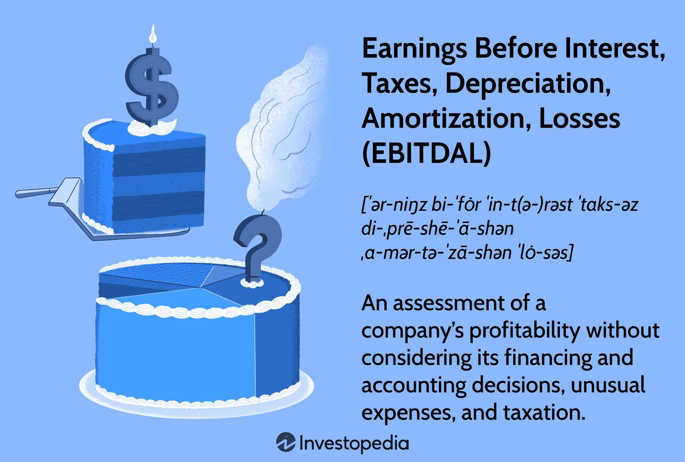

## Table of Contents

## What is EBITDAL and how does it differ from EBITDA?

EBITDAL stands for Earnings Before Interest, Taxes, Depreciation, Amortization, and Leases. It is a financial metric that businesses use to measure their operational performance by adding back the expenses related to leases to the EBITDA figure. This is particularly useful for companies that have significant lease expenses, such as those in the retail or airline industries, as it provides a clearer picture of their operating profitability without the impact of leasing costs.

EBITDA, on the other hand, stands for Earnings Before Interest, Taxes, Depreciation, and Amortization. It is a widely used metric to assess a company's operational efficiency and profitability by excluding non-operating expenses like interest and taxes, as well as non-cash charges such as depreciation and amortization. The main difference between EBITDAL and EBITDA is that EBITDAL includes lease expenses in its calculation, which can be significant for some businesses, while EBITDA does not. This makes EBITDAL a more comprehensive measure for companies with substantial leasing costs.

## Why is EBITDAL important for financial analysis?

EBITDAL is important for financial analysis because it gives a better picture of a company's operating performance, especially for businesses that spend a lot on leases. By adding back lease expenses to EBITDA, EBITDAL shows how well a company is doing without the impact of these costs. This is helpful for companies in industries like retail or airlines, where leasing properties or equipment is common. It helps investors and analysts see the true operational efficiency of the business, without the distortions caused by high lease payments.

Using EBITDAL can also make it easier to compare companies within the same industry. Since lease accounting can vary and affect financial statements differently, EBITDAL levels the playing field by removing lease costs from the equation. This way, analysts can better understand and compare the core operating performance of different companies, even if they have different leasing arrangements. This makes EBITDAL a valuable tool for making informed investment and business decisions.

## How is EBITDAL calculated?

To calculate EBITDAL, you start with the company's earnings before interest, taxes, depreciation, and amortization (EBITDA). You can find this number on the company's income statement or calculate it by adding back interest, taxes, depreciation, and amortization to the net income. Once you have the EBITDA, you then add back any lease expenses the company has. These lease expenses could be for things like office space, warehouses, or equipment. The final number you get is the EBITDAL.

EBITDAL is useful because it shows how much money a company makes from its main business activities, without the costs of leases getting in the way. This is especially helpful for companies that spend a lot on leases, like airlines or retail stores. By using EBITDAL, you can see a clearer picture of how well the company is doing at its core business, which helps when comparing it to other companies or making decisions about investments.

## Can you provide an example of EBITDAL calculation using a hypothetical company?

Let's say we have a company called "RetailCo" that runs a chain of clothing stores. RetailCo's net income for the year is $500,000. They also paid $100,000 in interest, $50,000 in taxes, had $200,000 in depreciation, and $50,000 in amortization. To find RetailCo's EBITDA, we add back the interest, taxes, depreciation, and amortization to the net income. So, $500,000 (net income) + $100,000 (interest) + $50,000 (taxes) + $200,000 (depreciation) + $50,000 (amortization) equals $900,000. That's RetailCo's EBITDA.

Now, to get the EBITDAL, we need to add back the lease expenses. RetailCo has lease expenses of $300,000 for their store locations. So, we take the EBITDA of $900,000 and add the lease expenses of $300,000. This gives us an EBITDAL of $1,200,000. This number shows how much money RetailCo makes from running their stores, without the costs of leasing the spaces affecting the figure. It's a clearer way to see how well RetailCo is doing at its core business.

## What are the typical uses of EBITDAL in business valuation?

EBITDAL is often used in business valuation to get a better idea of a company's true value, especially when the company has big lease expenses. When someone wants to buy or invest in a company, they look at different numbers to see how much the company is worth. EBITDAL helps them see how much money the company makes from its main business activities, without the costs of leases getting in the way. This is important because lease costs can be different for each company and can make it hard to compare them fairly.

For example, if you are looking at two retail companies, one might have higher lease costs because it's in a fancy shopping area. If you just look at their profits without considering leases, you might think one is doing better than the other. But with EBITDAL, you can see past these lease costs and compare the core business performance of both companies more fairly. This way, investors and buyers can make better decisions about which company is a good investment or what a fair price might be for buying the business.

## How does EBITDAL help in comparing companies within the same industry?

EBITDAL helps in comparing companies within the same industry by giving a clearer picture of their operational performance without the impact of lease costs. In industries like retail or airlines, where leasing properties or equipment is common, lease expenses can be very different from one company to another. By adding back these lease expenses to the EBITDA, EBITDAL shows how much money each company is making from its main business activities, making it easier to compare them fairly.

For example, if you are looking at two retail companies, one might have higher lease costs because it's in a fancy shopping area. If you just look at their profits without considering leases, you might think one is doing better than the other. But with EBITDAL, you can see past these lease costs and compare the core business performance of both companies more accurately. This way, investors and analysts can make better decisions about which company is a good investment or how to value these companies correctly.

## What are the limitations of using EBITDAL as a financial metric?

Using EBITDAL as a financial metric has some limitations. One big problem is that it can make a company look better than it really is. By adding back lease expenses, EBITDAL can make a company's earnings look higher. But leases are real costs that the company has to pay, so ignoring them might give a false picture of how well the company is doing. This can be a problem for investors who need to know the full story about a company's financial health.

Another issue is that EBITDAL might not be used the same way by everyone. Different companies might calculate it differently, which can make it hard to compare them. Also, not all companies use EBITDAL, so if you are looking at companies in different industries, you might not be able to use it to compare them. This can make it tricky to use EBITDAL as a standard measure for valuing or comparing businesses.

## How does the inclusion of 'Losses' in EBITDAL affect its interpretation compared to EBITDA?

The inclusion of 'Losses' in EBITDAL makes it different from EBITDA. 'Losses' usually means the costs of leases that a company has to pay. When you add these lease costs back into the earnings, you get EBITDAL. This helps show how much money a company makes from its main business without counting the lease payments. It's useful for companies that spend a lot on leases, like airlines or retail stores, because it gives a clearer picture of how well they are doing without those costs.

But adding back lease costs can also make a company look better than it really is. Leases are real expenses that the company has to pay, so ignoring them might give a false idea of how well the company is doing. This can be a problem for people who want to invest in the company because they need to know the full story about its finances. So while EBITDAL can be helpful, it's important to remember that it doesn't show the whole picture and should be used carefully when looking at a company's performance.

## In what scenarios might EBITDAL be more appropriate than other profitability metrics?

EBITDAL is more appropriate than other profitability metrics when looking at companies that spend a lot on leases. This is common in industries like retail, where stores need to rent space, or airlines, where they lease planes. By adding back lease costs to the earnings, EBITDAL shows how much money these companies make from their main business without the impact of lease payments. This helps investors see the true operational performance of the company, which can be hidden by high lease expenses.

For example, if you want to compare two retail companies, one might have higher lease costs because it's in a fancy shopping area. If you just look at their profits without considering leases, you might think one is doing better than the other. But with EBITDAL, you can see past these lease costs and compare the core business performance of both companies more fairly. This makes it easier to make good decisions about which company is a better investment or what a fair price might be for buying the business.

## How can EBITDAL be manipulated or misrepresented, and what are the ethical considerations?

Companies can manipulate or misrepresent EBITDAL by playing around with how they report their lease expenses. For example, they might not include all lease costs or might categorize some lease payments in a way that makes their EBITDAL look better. This can make the company seem more profitable than it really is, which can fool investors and other people looking at the company's financial health. It's like hiding some of the bills to make it look like you have more money than you do.

Ethically, it's not right to manipulate or misrepresent EBITDAL. Being honest and clear with financial information is really important. If a company messes with its EBITDAL numbers, it can hurt people who trust those numbers to make decisions about investing or buying the company. It's like lying on a job application; it might get you the job, but it's not fair to others and can cause big problems later. So, companies should always report their EBITDAL in a way that shows the true picture of their business, without trying to trick anyone.

## What are the regulatory perspectives on the use of EBITDAL in financial reporting?

Regulatory bodies like the Financial Accounting Standards Board (FASB) and the International Accounting Standards Board (IASB) set rules for how companies should report their finances. They have rules about how to show lease costs in financial statements, but they don't have specific rules about using EBITDAL. This means companies can choose to use EBITDAL to show how they are doing, but they need to explain clearly how they calculate it and what it means. If they don't do this, it can be hard for people to understand and trust the numbers.

Regulators want companies to be honest and clear with their financial information. If a company uses EBITDAL in a way that could trick people, like not showing all the lease costs, it could get in trouble. Regulators might look into it and make the company fix its reports. So, while there are no special rules for EBITDAL, companies need to use it in a way that follows the general rules about being honest and clear with financial information.

## How has the application of EBITDAL evolved in recent financial literature and practice?

In recent financial literature and practice, the use of EBITDAL has grown as more companies look for ways to show how well they are doing without the costs of leases getting in the way. This is especially true for companies in industries like retail or airlines, where leasing is a big part of their business. By using EBITDAL, these companies can show investors and analysts a clearer picture of their core business performance. This has made EBITDAL a popular tool for comparing companies in the same industry, as it helps level the playing field by removing the impact of different lease expenses.

However, there's also been more talk about the problems with using EBITDAL. Some people worry that it can make companies look better than they really are by not counting lease costs, which are real expenses that need to be paid. This has led to more focus on making sure companies explain clearly how they calculate EBITDAL and what it means. In financial literature, experts often stress the need to use EBITDAL along with other financial measures to get a full picture of a company's health. This way, investors can make better decisions without being tricked by numbers that might not tell the whole story.

## References & Further Reading

[1]: Bergstra, J., Bardenet, R., Bengio, Y., & Kégl, B. (2011). ["Algorithms for Hyper-Parameter Optimization."](https://dl.acm.org/doi/10.5555/2986459.2986743) Advances in Neural Information Processing Systems 24.

[2]: ["Advances in Financial Machine Learning"](https://www.amazon.com/Advances-Financial-Machine-Learning-Marcos/dp/1119482089) by Marcos Lopez de Prado

[3]: ["Evidence-Based Technical Analysis: Applying the Scientific Method and Statistical Inference to Trading Signals"](https://www.amazon.com/Evidence-Based-Technical-Analysis-Scientific-Statistical/dp/0470008741) by David Aronson

[4]: ["Machine Learning for Algorithmic Trading"](https://github.com/stefan-jansen/machine-learning-for-trading) by Stefan Jansen

[5]: ["Quantitative Trading: How to Build Your Own Algorithmic Trading Business"](https://www.amazon.com/Quantitative-Trading-Build-Algorithmic-Business/dp/1119800064) by Ernest P. Chan