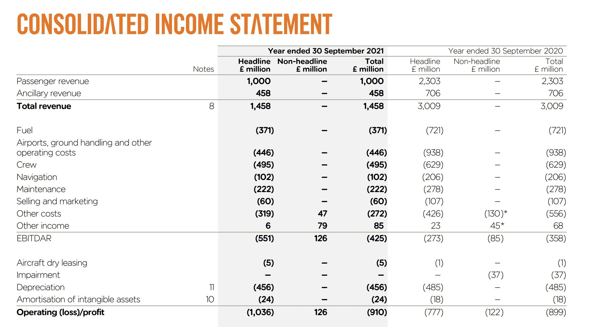

## Table of Contents

## What does EBITDAR stand for?

EBITDAR stands for Earnings Before Interest, Taxes, Depreciation, Amortization, and Restructuring or Rent Costs. It is a financial metric used to evaluate a company's operating performance by excluding certain expenses that can vary significantly between different companies or industries. This measure helps investors and analysts get a clearer picture of a company's core operational profitability without the influence of financing decisions, tax environments, or large non-cash charges like depreciation and amortization.

In industries like retail, hospitality, and airlines, where rent or restructuring costs can be substantial, EBITDAR is particularly useful. By removing these costs, it becomes easier to compare the performance of companies within these sectors. For example, two airlines might have different lease agreements for their aircraft, and EBITDAR allows analysts to see past these differences to focus on the underlying business performance. However, it's important to use EBITDAR alongside other financial metrics to get a comprehensive view of a company's financial health.

## How is EBITDAR calculated?

To calculate EBITDAR, you start with a company's earnings. First, you add back the interest the company paid on its debts, the taxes it paid to the government, and the depreciation and amortization expenses, which are costs related to the wear and tear of assets and the spreading out of intangible asset costs over time. Finally, you add back any restructuring or rent costs that the company had to pay. This gives you the EBITDAR, which shows how much money the company made before these specific costs were taken out.

EBITDAR is useful because it helps compare companies in industries where rent or restructuring costs can be very different. For example, two hotels might have different rent expenses, but by looking at their EBITDAR, you can see how well they are doing at running their business without worrying about their rent. However, remember that EBITDAR is just one way to look at a company's performance and should be used with other financial measures to get a full picture.

## Why is EBITDAR important for businesses?

EBITDAR is important for businesses because it helps them see how well they are doing at running their business without worrying about some big costs like rent or restructuring. It's like looking at how much money a business makes before it has to pay for these things. This can be really helpful for businesses in industries like hotels or airlines, where rent can be a big expense. By using EBITDAR, these businesses can compare themselves to others in their industry more easily, even if they have different rent costs.

Another reason EBITDAR is important is that it helps investors and people who study businesses understand how a company is doing without getting confused by things like taxes or how the company pays for its buildings or equipment. It gives a clearer picture of the money a business makes from its main activities. But, it's important to remember that EBITDAR is just one way to look at a business. It should be used with other ways of measuring how a business is doing to get the full picture.

## How does EBITDAR differ from EBITDA?

EBITDAR and EBITDA are both ways to look at how much money a business makes, but they are a little different. EBITDA stands for Earnings Before Interest, Taxes, Depreciation, and Amortization. It helps you see how much money a business makes before it has to pay for things like interest on loans, taxes, and the wear and tear of its equipment. On the other hand, EBITDAR adds one more thing to EBITDA: it also adds back rent or restructuring costs. This makes EBITDAR useful for businesses where rent can be a big expense, like in hotels or airlines.

The main difference between EBITDAR and EBITDA is that EBITDAR gives you a clearer picture of how a business is doing without worrying about rent or restructuring costs. For example, if two hotels have different rent expenses, looking at their EBITDAR helps you compare how well they are running their business without getting confused by their rent costs. However, both measures are important, and businesses often use them together with other financial measures to get a full picture of how they are doing.

## In which industries is EBITDAR most commonly used?

EBITDAR is most commonly used in industries where rent or leasing costs are a big part of doing business. This includes the hospitality industry, like hotels and restaurants, where businesses often lease their buildings. It also includes the airline industry, where companies lease their airplanes. By using EBITDAR, these businesses can see how well they are doing at running their business without worrying about how much they pay for rent or leases.

For example, two hotels might have different rent costs, but by looking at their EBITDAR, you can compare how well they are doing at running their hotel without getting confused by their rent expenses. The same goes for airlines; their lease costs for airplanes can be very different, but EBITDAR helps show how well they are doing at flying passengers and managing their business. This makes it easier for investors and business owners to understand and compare the performance of companies in these industries.

## Can you provide an example of how to calculate EBITDAR?

Let's say we have a hotel that made $1 million in earnings last year. But the hotel also had to pay $50,000 in interest on its loans, $100,000 in taxes, $30,000 in depreciation for its furniture and equipment, and $20,000 in amortization for its brand name. On top of that, the hotel paid $200,000 in rent for the building. To find the hotel's EBITDAR, we start with the earnings and add back all these costs.

So, we take the $1 million in earnings and add back the $50,000 in interest, the $100,000 in taxes, the $30,000 in depreciation, the $20,000 in amortization, and the $200,000 in rent. When we add all these together, we get $1 million + $50,000 + $100,000 + $30,000 + $20,000 + $200,000 = $1.4 million. This $1.4 million is the hotel's EBITDAR, which shows how much money the hotel made before it had to pay for interest, taxes, depreciation, amortization, and rent.

## What are the limitations of using EBITDAR as a financial metric?

Using EBITDAR to look at how a business is doing has some problems. One big problem is that it doesn't show you the whole picture. It leaves out important costs like rent or restructuring, which can be a big deal for some businesses. If a business has to pay a lot in rent, it might look like it's doing well when you look at its EBITDAR, but it might not have enough money left over after paying rent. So, you need to look at other numbers too to really understand how the business is doing.

Another problem with EBITDAR is that it can be used to make a business look better than it really is. Because it adds back rent and restructuring costs, a business might seem more profitable than it actually is. This can be confusing for people trying to understand how well a business is really doing. It's important to use EBITDAR along with other financial measures to get a full picture of a company's health.

## How can EBITDAR be used to compare companies within the same industry?

EBITDAR helps people compare companies in the same industry by taking away costs like rent or restructuring. This is really useful in industries like hotels or airlines where these costs can be very different from one company to another. For example, if two hotels have different rent costs, looking at their EBITDAR lets you see how well they are running their business without getting confused by how much they pay for rent. This makes it easier to see which hotel is doing a better job at making money from its main activities.

But, it's important to remember that EBITDAR is just one way to look at how companies are doing. It doesn't show you everything, like how much money a company has left after paying all its bills. So, when comparing companies, you should use EBITDAR along with other financial measures. This way, you get a fuller picture of how each company is doing and can make a better comparison.

## What adjustments are typically made to EBIT to arrive at EBITDAR?

To get from EBIT to EBITDAR, you add back some costs that were taken out of the earnings. EBIT stands for Earnings Before Interest and Taxes. So, you start with EBIT and then add back the money the company spent on depreciation, which is the cost of things like buildings and equipment wearing out over time. You also add back amortization, which is the cost of intangible things like patents or trademarks spreading out over time.

After adding back depreciation and amortization, you then add back any rent or restructuring costs the company had to pay. Rent is what a company pays to use a building or other property, and restructuring costs are expenses from big changes in the business, like closing a factory or laying off workers. By adding these costs back, you get EBITDAR, which shows how much money the company made before paying for interest, taxes, depreciation, amortization, and rent or restructuring.

## How does EBITDAR impact investment decisions?

EBITDAR helps investors make better choices by showing how well a business is doing without worrying about big costs like rent or restructuring. This is really useful in industries like hotels or airlines, where these costs can be very different from one company to another. By looking at EBITDAR, investors can see which companies are good at making money from their main activities, even if they have to pay a lot in rent. This helps investors decide which companies might be a good investment because they can compare them more easily.

But, investors need to remember that EBITDAR doesn't show the whole picture. It leaves out important costs that can affect how much money a business has left over. So, investors should use EBITDAR along with other financial measures to get a full understanding of a company's health. This way, they can make smarter investment decisions by seeing both how well a company is doing at its core business and how it handles all its costs.

## What are the potential pitfalls of relying solely on EBITDAR for financial analysis?

Relying only on EBITDAR for financial analysis can be risky because it doesn't show the whole picture of a company's financial health. EBITDAR leaves out important costs like rent or restructuring, which can be a big deal for some businesses. If a company has to pay a lot in rent, it might look like it's doing well when you look at its EBITDAR, but it might not have enough money left over after paying rent. This means that looking at EBITDAR alone could make you think a company is doing better than it really is.

Another problem with using just EBITDAR is that it can be used to make a company look more profitable than it actually is. Because it adds back rent and restructuring costs, a business might seem like it's making more money than it really is. This can be confusing for people trying to understand how well a business is doing. It's important to use EBITDAR along with other financial measures to get a full picture of a company's health, so you don't miss out on important details that could affect your analysis.

## How can EBITDAR be integrated into a broader financial analysis framework?

EBITDAR is a useful tool that can be part of a bigger financial analysis framework. It helps you see how well a business is doing without worrying about costs like rent or restructuring. By looking at EBITDAR, you can compare companies in the same industry more easily, especially in places like hotels or airlines where rent costs can be very different. But, EBITDAR is just one piece of the puzzle. To get a full picture of how a business is doing, you need to use it along with other financial measures.

Other financial measures like net income, cash flow, and debt levels can help you understand the whole story. Net income shows how much money a business has left after paying all its bills, including rent and taxes. Cash flow tells you how much money is coming in and going out, which is important for knowing if a business can pay its bills on time. Debt levels let you see how much money a business owes, which can affect its future. By using EBITDAR with these other measures, you can make smarter decisions about a company's financial health and performance.

## What is EBITDAR and how can it be understood?

EBITDAR, an acronym for 'earnings before interest, taxes, depreciation, amortization, and restructuring or rent costs', is a vital financial metric that provides a comprehensive view of a company's operational performance. This metric is particularly advantageous for businesses with substantial restructuring or rent expenses, as it offers a clearer picture of financial health by isolating the impact of these non-operational costs.

The standard calculation of EBITDAR builds on EBITDA—Earnings Before Interest, Taxes, Depreciation, and Amortization—by further adding back restructuring or rent costs. The formula can be expressed as:

$$
\text{EBITDAR} = \text{EBITDA} + \text{Rent Costs} + \text{Restructuring Costs}
$$

By incorporating rent and restructuring costs, EBITDAR allows analysts to evaluate a company's core earnings capacity without the distorting effects of these fixed or occasional expenses. This is especially crucial in industries such as retail, hospitality, and aviation, where lease or rent obligations can represent a significant portion of operating expenses.

For instance, a retail company operating under extensive lease agreements may have a distorted EBITDA, as it does not account for the substantial rent costs. By using EBITDAR, analysts can gain insights into how well the business generates earnings before the effect of leasing contracts, thereby facilitating more accurate comparisons with other companies that might own their premises instead of leasing them.

In contexts where restructuring is frequent—such as during mergers or acquisitions—understanding EBITDAR becomes crucial. It allows stakeholders to assess how changes related to restructuring impact operational efficiency over time, providing insights that are more stable and comparable.

Thus, EBITDAR proves to be a reliable measure of financial performance for businesses where restructuring or rent costs are integral to their operating model. By factoring these costs back into operational earnings, it ensures a more precise analysis of profitability and efficiency, free from the noise of variable financial commitments, and guides analysts in making informed strategic decisions.

## What is the role of EBITDAR in business valuation?

Business valuation often employs standardized metrics to facilitate the comparison of financial performance across companies. Among these metrics, EBITDAR—Earnings Before Interest, Taxes, Depreciation, Amortization, and Restructuring or Rent Costs—stands out for its ability to provide a nuanced view of a company's financial health, especially in contexts where rent or restructuring costs are substantial.

EBITDAR expands on the traditional EBITDA by incorporating additional costs that can heavily influence a company's financial landscape. Traditional EBITDA, which excludes non-operational aspects like interest and taxes, as well as non-cash items like depreciation and amortization, offers a view of operational profitability. However, it does not account for significant recurring expenses such as rent or restructuring costs, which can distort assessments of a company’s true operational performance.

$$
\text{EBITDAR} = \text{EBITDA} + \text{Rent Costs} + \text{Restructuring Costs}
$$

By adding rent or restructuring expenses back into earnings, EBITDAR offers a clearer representation of operational earnings, especially in industries like hospitality or retail where these costs are an integral part of business operations. This adjusted metric enables more accurate comparisons between companies that might have differing capital structures or rental obligations, thereby enhancing the clarity of financial analysis.

For investors and analysts, EBITDAR is invaluable in assessing a company’s ongoing profitability and potential for future growth, key considerations in valuations for mergers and acquisitions (M&A). Companies undergoing restructuring often face distorted EBITDA figures that do not accurately depict operational success—EBITDAR counters this by providing a refreshed analysis scope that factors in normalizing adjustments for extraordinary costs.

In strategic investments, reliance on EBITDAR allows a holistic evaluation of companies. It aids in understanding whether an investment is viable by stripping away non-operational factors that could obscure an investor's view. This understanding is crucial not only for identifying profitable investments but also for mitigating risks associated with hidden costs.

In conclusion, EBITDAR's role in business valuation is pivotal. By accommodating crucial expenses that other metrics might overlook, it offers a refined tool for evaluating a company's fiscal health and strategic potential. Its application provides stakeholders with a deeper comprehension of financial realities, promoting informed decision-making in investment ventures and corporate strategies.

## References & Further Reading

[1]: ["Valuation: Measuring and Managing the Value of Companies, University Edition"](https://books.google.com/books/about/Valuation.html?id=fGXjDwAAQBAJ) by McKinsey & Company Inc., Tim Koller, Marc Goedhart, and David Wessels

[2]: ["Financial Statement Analysis and Security Valuation"](https://www.mheducation.com/highered/product/financial-statement-analysis-security-valuation-penman/M9780078025310.html) by Stephen H. Penman

[3]: Damodaran, A. (2007). ["Valuation Approaches and Metrics: A Survey of the Theory and Evidence."](https://people.stern.nyu.edu/adamodar/pdfiles/papers/valuesurvey.pdf) Foundations and Trends® in Finance

[4]: ["The Little Book That Still Beats the Market"](https://www.amazon.com/Little-Book-Still-Beats-Market/dp/0470624159) by Joel Greenblatt

[5]: ["Investment Valuation: Tools and Techniques for Determining the Value of Any Asset, University Edition"](https://books.google.com/books/about/Investment_Valuation.html?id=5SRHAAAAQBAJ) by Aswath Damodaran