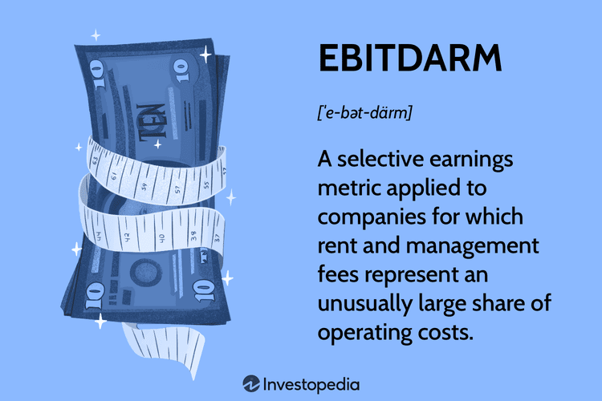

## Table of Contents

## What is EBITDARM and what does it stand for?

EBITDARM stands for Earnings Before Interest, Taxes, Depreciation, Amortization, Rent, and Management Fees. It is a financial metric used to measure a company's operational performance by excluding certain expenses that can vary significantly between different businesses or industries.

This measure is particularly useful in industries like healthcare and hospitality, where rent and management fees can be substantial. By removing these costs, EBITDARM provides a clearer picture of a company's core operating profitability, making it easier to compare the performance of different companies within the same sector.

## How is EBITDARM calculated?

To calculate EBITDARM, you start with the company's total revenue and then subtract the cost of goods sold and operating expenses. These operating expenses include things like salaries, utilities, and supplies, but you do not subtract interest, taxes, depreciation, amortization, rent, or management fees. So, you are left with the earnings before these specific costs are taken out.

This calculation helps to show how well a business is doing at its core operations, without the influence of how it is financed or structured. For example, in industries like healthcare or hospitality, where rent and management fees can be big, EBITDARM gives a clearer picture of how the business is performing day-to-day. It's a useful tool for comparing companies in the same industry, because it focuses on what they earn from their main activities.

## In which industries is EBITDARM most commonly used?

EBITDARM is most commonly used in the healthcare and hospitality industries. In healthcare, this includes hospitals, nursing homes, and other medical facilities. These places often have high rent and management fees, so EBITDARM helps show how well they are doing without counting those costs.

In the hospitality industry, hotels and restaurants also use EBITDARM a lot. These businesses can have big expenses for rent and management, which can make it hard to see how well they are doing at their main job of serving customers. By using EBITDARM, it's easier to compare how different hotels or restaurants are performing, focusing just on their day-to-day operations.

## What are the key differences between EBITDARM and EBITDA?

EBITDARM and EBITDA are both ways to measure how well a business is doing, but they look at slightly different things. EBITDA stands for Earnings Before Interest, Taxes, Depreciation, and Amortization. It helps show how much money a company makes from its main work without counting things like loans, taxes, and the cost of equipment wearing out. On the other hand, EBITDARM adds two more things that it doesn't count: Rent and Management Fees. This makes it useful for businesses that have big expenses for rent and management, like hospitals and hotels.

The main difference is that EBITDARM gives a clearer picture for businesses in industries where rent and management fees are a big deal. For example, a hotel might pay a lot of money for its location and to a management company, so using EBITDARM helps show how well the hotel is doing at serving guests without counting those big costs. EBITDA, on the other hand, is more general and can be used to compare companies across different industries, because it doesn't include rent and management fees, which can be very different from one business to another.

## What are the advantages of using EBITDARM for financial analysis?

Using EBITDARM for financial analysis helps to see how well a business is doing at its core work without counting big costs like rent and management fees. This is really helpful for businesses in industries like healthcare and hospitality, where these costs can be very high. For example, a hospital might spend a lot on rent for its building and fees to a management company. By using EBITDARM, we can see how good the hospital is at taking care of patients without worrying about those big costs.

Another advantage is that EBITDARM makes it easier to compare different companies in the same industry. Since it leaves out rent and management fees, which can be different for each business, it gives a clearer picture of how well each company is doing at its main job. This way, investors and managers can make better decisions by looking at the true performance of the business, without the influence of how it is financed or structured.

## Can EBITDARM be manipulated and if so, how?

Yes, EBITDARM can be manipulated, just like other financial metrics. One way this can happen is by changing how costs are reported. For example, a company might move some expenses from operating costs to rent or management fees, which are not included in EBITDARM. By doing this, the company can make its EBITDARM look better than it really is, even though its overall profits haven't changed.

Another way to manipulate EBITDARM is by changing how revenue is recognized. A company might recognize revenue earlier than it should, making it seem like they are [earning](/wiki/earning-announcement) more from their main work. This can boost EBITDARM in the short term, but it's not a true reflection of how well the business is doing. It's important for people looking at these numbers to be careful and check other financial information to make sure the EBITDARM is showing a real picture of the business's performance.

## How does EBITDARM help in assessing the operational efficiency of a business?

EBITDARM helps in assessing the operational efficiency of a business by showing how much money it makes from its main work before counting big costs like rent and management fees. This is especially useful for businesses in industries like healthcare and hospitality, where these costs can be very high. By looking at EBITDARM, you can see how well a hospital is at taking care of patients or how good a hotel is at serving guests, without the distraction of how much they pay for their building or to a management company.

This measure makes it easier to compare different companies in the same industry. Since EBITDARM leaves out rent and management fees, which can be different for each business, it gives a clearer picture of how well each company is doing at its core work. For example, if two hospitals have similar EBITDARM numbers, it means they are doing about the same job at taking care of patients, even if one pays more rent than the other. This helps investors and managers make better decisions by focusing on the true performance of the business.

## What are the limitations and criticisms of using EBITDARM?

One big problem with using EBITDARM is that it can be changed or manipulated by the people running the business. They might move some costs around to make EBITDARM look better. For example, they might call some expenses "rent" or "management fees" instead of "operating costs," which makes EBITDARM higher but doesn't change how much money the business is really making. This can trick people into thinking the business is doing better than it is. Also, EBITDARM doesn't include important costs like interest, taxes, and the wear and tear on equipment, which are real expenses that affect how much money a business has left at the end of the day.

Another criticism is that EBITDARM can make different businesses look more similar than they really are. While it's good for comparing companies in the same industry, it might not show the whole picture. For example, two hospitals might have the same EBITDARM, but one might be paying a lot more in rent or management fees. This means one hospital might actually be making less money overall, even if their main work looks the same. So, while EBITDARM can be helpful, it's important to look at other financial numbers too to get a full understanding of a business's health.

## How does EBITDARM affect investment decisions?

EBITDARM can help investors make better choices by showing how well a business is doing at its main work, without counting big costs like rent and management fees. For example, if an investor is looking at two hospitals, EBITDARM can show which one is better at taking care of patients, even if one pays more for its building or to a management company. This makes it easier for investors to compare different companies in the same industry and decide where to put their money.

However, investors need to be careful because EBITDARM can be changed or manipulated by the people running the business. They might move some costs around to make EBITDARM look better, which can trick investors into thinking the business is doing better than it really is. Also, EBITDARM doesn't include important costs like interest, taxes, and the wear and tear on equipment, which are real expenses that affect how much money a business has left at the end of the day. So, while EBITDARM can be a helpful tool, investors should also look at other financial numbers to get a full picture of a business's health.

## What role does EBITDARM play in credit analysis and lending?

In credit analysis and lending, EBITDARM helps banks and lenders see how well a business can pay back its loans. It shows how much money a business makes from its main work before counting big costs like rent and management fees. This is really helpful for businesses in industries like healthcare and hospitality, where these costs can be very high. By looking at EBITDARM, a lender can decide if a hospital or a hotel has enough money coming in to cover its loan payments, even if it pays a lot for its building or to a management company.

However, lenders need to be careful because EBITDARM can be changed or manipulated by the people running the business. They might move some costs around to make EBITDARM look better, which can trick lenders into thinking the business is doing better than it really is. Also, EBITDARM doesn't include important costs like interest, taxes, and the wear and tear on equipment, which are real expenses that affect how much money a business has left at the end of the day. So, while EBITDARM can be a useful tool for credit analysis and lending, it's important for lenders to look at other financial numbers too to get a full picture of a business's ability to repay its loans.

## How can EBITDARM be used in conjunction with other financial metrics?

EBITDARM is a helpful tool, but it works best when used with other financial metrics. For example, looking at EBITDARM alongside EBITDA can give a fuller picture of a business's performance. EBITDA shows earnings before interest, taxes, depreciation, and amortization, but it doesn't count rent and management fees like EBITDARM does. By comparing these two, investors and lenders can see how much those extra costs affect a business's profitability. They can also use net income to see the final profit after all costs, including the ones left out of EBITDARM, are taken into account.

Another useful metric to use with EBITDARM is the debt-to-EBITDARM ratio. This helps lenders understand how much debt a business has compared to its earnings before those big costs like rent and management fees. A lower ratio might mean the business can handle its debt better, even with high rent or management fees. By looking at EBITDARM with other metrics like cash flow and operating margins, a more complete view of the business's financial health and ability to pay back loans or invest in growth can be achieved.

## What are some real-world examples where EBITDARM significantly impacted financial decisions?

In the healthcare industry, a hospital chain used EBITDARM to make a big decision about buying another hospital. The hospital they wanted to buy had high rent costs because it was in a busy city. By looking at EBITDARM, the hospital chain could see that the new hospital was doing well at taking care of patients, even with those high rent costs. This made them feel good about the purchase because they knew the hospital could still make money. Without looking at EBITDARM, they might have thought the hospital wasn't doing well because of the high rent, and they might have missed out on a good opportunity.

In the hospitality industry, a hotel company used EBITDARM to decide whether to give a loan to one of its hotels. The hotel had high management fees because it was part of a big brand. By looking at EBITDARM, the company could see that the hotel was doing a good job at serving guests and making money, even with those high fees. This made them feel confident about giving the loan because they knew the hotel could pay it back. If they had only looked at other financial numbers that included the management fees, they might have thought the hotel was not doing well and decided not to give the loan.

## What is EBITDARM and how is it understood?

EBITDARM stands for Earnings Before Interest, Taxes, Depreciation, Amortization, Rent, and Management fees. It is an expansion of the EBITDA metric, offering further insight into a company's operational profitability by excluding additional expenses related to rent and management fees, which are considered non-operational. This metric is especially valuable for sectors with significant rental and management expenses, such as healthcare and real estate, where these costs can heavily influence financial outcomes.

The calculation of EBITDARM involves adding back several non-operational expenses to the net income. Mathematically, this can be expressed as follows:

$$
\text{EBITDARM} = \text{Net Income} + \text{Interest} + \text{Taxes} + \text{Depreciation} + \text{Amortization} + \text{Rent} + \text{Management Fees}
$$

By focusing on these adjustments, EBITDARM offers a clearer depiction of a company's core operational efficiency. This clarity is particularly beneficial for comparing companies within industries where operational structures can vary significantly based on rental and management expenses.

Given its ability to neutralize the impact of diverse cost structures, EBITDARM serves as a valuable tool for analysts and investors looking to compare businesses on a more consistent basis without the distortions caused by varying capital structures, lease obligations, or management fee arrangements. This comparative capability enables a more precise evaluation of a company's financial health and operational performance, independent of external financial obligations.

## References & Further Reading

"Financial Statement Analysis and Security Valuation" by Stephen H. Penman provides foundational insights into financial metrics. This comprehensive guide covers methods for evaluating a company's financial health and value, using a variety of metrics beyond EBITDARM to create a holistic view of performance. Penman's work is valuable for understanding the theory and application of financial analysis tools in diverse business contexts.

"Algorithmic Trading: Winning Strategies and Their Rationale" by Ernest P. Chan offers a detailed examination of algorithmic trading strategies. The book elucidates how automation and quantitative methods enhance trading efficacy. It covers multiple strategies and highlights the importance of metrics like EBITDARM in building a robust trading algorithm. Chan's insights are essential for anyone looking to understand algorithm-driven investment dynamics.

"Python for Finance: Analyze Big Financial Data" by Yves Hilpisch includes practical examples of integrating financial metrics into trading algorithms. This book is an excellent resource for those seeking to apply Python programming in financial contexts, particularly for implementing sophisticated data analysis and algorithmic trading models. With a focus on libraries like NumPy and pandas, Hilpisch effectively bridges the gap between financial theory and computational practice.

Additional resources explore the practical applications of EBITDARM in business and data-driven decision-making. These materials further demonstrate the utility of EBITDARM in various industries, such as healthcare and real estate. They also discuss how integrating EBITDARM into [algorithmic trading](/wiki/algorithmic-trading) can provide nuanced insights into operational profitability and strategic investment decisions. These resources are pivotal for both academic study and real-world financial analysis.

