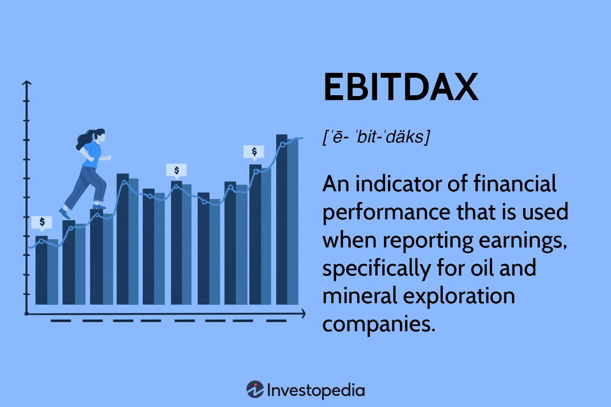

## Table of Contents

## What is EBITDA?

EBITDA stands for Earnings Before Interest, Taxes, Depreciation, and Amortization. It is a way to measure how much money a company is making before taking away some costs like interest on loans, taxes, and the gradual reduction in value of things like buildings and equipment. It's like looking at the money a company makes from its main business activities without worrying about how it's financed or how old its equipment is.

People use EBITDA to compare the performance of different companies more easily. Since it doesn't include interest, taxes, depreciation, and amortization, it gives a clearer picture of a company's operating performance. However, it's important to remember that EBITDA is not the same as profit because it doesn't account for all the costs a company has to pay. So, while it's a useful tool, it should be used along with other financial measures to get a full understanding of a company's financial health.

## What is EBITDAX?

EBITDAX stands for Earnings Before Interest, Taxes, Depreciation, Amortization, and Exploration expenses. It's a way to measure a company's performance, especially in the oil and gas industry, by looking at how much money the company makes before taking away some costs like interest on loans, taxes, and the costs of exploring for new oil or gas.

This measure is useful because it gives a clearer picture of a company's operating performance by not including exploration costs, which can be very high and vary a lot from year to year. By leaving out these costs, EBITDAX helps investors and analysts see how well the company is doing in its main business activities, without the ups and downs of exploration expenses affecting the numbers. However, like EBITDA, it's not a complete measure of profit because it doesn't account for all the costs a company has to pay.

## How is EBITDA calculated?

EBITDA is calculated by starting with a company's net income, which is the money left after all expenses are paid. Then, you add back the costs of interest, taxes, depreciation, and amortization. Interest is what the company pays on its loans, taxes are what it pays to the government, depreciation is the gradual reduction in value of things like buildings and equipment, and amortization is similar but for intangible assets like patents.

To make it simple, imagine you have the company's profit after everything is paid, and then you put back in the money taken out for interest, taxes, depreciation, and amortization. This gives you EBITDA, which shows how much money the company is making from its main business activities before these specific costs are taken out. It's a useful way to see how well a company is doing without worrying about how it's financed or how old its equipment is.

## How is EBITDAX calculated?

EBITDAX is calculated by starting with a company's net income, which is the money left after all expenses are paid. Then, you add back the costs of interest, taxes, depreciation, amortization, and exploration expenses. Interest is what the company pays on its loans, taxes are what it pays to the government, depreciation is the gradual reduction in value of things like buildings and equipment, amortization is similar but for intangible assets like patents, and exploration expenses are costs related to looking for new oil or gas.

This measure is particularly useful in the oil and gas industry because it gives a clearer picture of a company's operating performance by not including exploration costs, which can be very high and vary a lot from year to year. By leaving out these costs, EBITDAX helps investors and analysts see how well the company is doing in its main business activities, without the ups and downs of exploration expenses affecting the numbers.

## What does EBITDA represent in a company's financials?

EBITDA represents the money a company makes from its main business activities before taking away costs like interest, taxes, depreciation, and amortization. It's like looking at how much money the company is making from selling its products or services without worrying about how it's financed or how old its equipment is. This can be helpful because it shows how well the company is doing at its core business, without those other costs getting in the way.

People use EBITDA to compare how different companies are doing, especially when the companies are in the same industry. Since it doesn't include interest, taxes, depreciation, and amortization, it gives a clearer picture of a company's operating performance. But remember, EBITDA isn't the same as profit because it doesn't account for all the costs a company has to pay. So, while it's a useful tool, it should be used along with other financial measures to get a full understanding of a company's financial health.

## What additional expenses does EBITDAX include that EBITDA does not?

EBITDAX includes all the expenses that EBITDA does, like interest, taxes, depreciation, and amortization. But it also adds back exploration expenses, which are costs related to looking for new oil or gas. This is why EBITDAX is especially useful in the oil and gas industry, where exploration costs can be very high and can change a lot from year to year.

By including exploration expenses, EBITDAX gives a clearer picture of how well a company is doing in its main business activities, without the ups and downs of exploration costs affecting the numbers. This helps investors and analysts see how the company is performing at its core, without those extra costs getting in the way.

## Why might a company use EBITDAX instead of EBITDA?

A company might use EBITDAX instead of EBITDA because it gives a better picture of how well the company is doing in its main business, especially in the oil and gas industry. Exploration expenses can be very high and can change a lot from year to year. By adding back these costs, EBITDAX shows how much money the company is making from selling oil or gas, without the ups and downs of exploration costs getting in the way.

Using EBITDAX helps investors and analysts see how the company is doing at its core business, without those extra costs making the numbers look different. This can be really helpful for comparing how different companies in the oil and gas industry are doing, because it takes out the effect of exploration expenses, which can be different for each company. But remember, EBITDAX is not the same as profit because it doesn't include all the costs a company has to pay.

## In which industries is EBITDAX more commonly used?

EBITDAX is more commonly used in the oil and gas industry. This is because companies in this industry spend a lot of money looking for new oil or gas. These costs, called exploration expenses, can change a lot from year to year and can make it hard to see how well the company is doing in its main business. By using EBITDAX, which adds back these exploration costs, people can get a clearer picture of how much money the company is making from selling oil or gas.

This measure helps investors and analysts compare different oil and gas companies more easily. Since exploration expenses can be very different for each company, using EBITDAX takes out this difference and shows how well the companies are doing at their core business. But remember, EBITDAX is not the same as profit because it doesn't include all the costs a company has to pay.

## How do investors and analysts typically use EBITDA and EBITDAX in financial analysis?

Investors and analysts use EBITDA to get a clear picture of how much money a company is making from its main business activities. They add back costs like interest, taxes, depreciation, and amortization to the company's net income. This helps them see how well the company is doing without worrying about how it's financed or how old its equipment is. By using EBITDA, they can compare different companies more easily, especially if the companies are in the same industry. It's like looking at the money a company makes from selling its products or services, without the other costs getting in the way.

In the oil and gas industry, investors and analysts often use EBITDAX instead of EBITDA. EBITDAX adds back exploration expenses on top of the costs that EBITDA includes. Exploration expenses can be very high and can change a lot from year to year, so by using EBITDAX, they can see how much money the company is making from selling oil or gas without these costs affecting the numbers. This helps them compare different oil and gas companies more easily, because it takes out the effect of exploration expenses, which can be different for each company. But they remember that both EBITDA and EBITDAX are not the same as profit, because they don't include all the costs a company has to pay.

## What are the limitations of using EBITDA and EBITDAX as financial metrics?

Using EBITDA and EBITDAX as financial metrics can be helpful, but they have some limitations. One big problem is that they don't show the whole picture of a company's money situation. They don't include all the costs a company has to pay, like interest on loans, taxes, and the costs of wearing out equipment over time. So, while they can show how much money a company makes from its main business, they don't tell you if the company is actually making a profit after paying all its bills.

Another issue is that EBITDA and EBITDAX can be used in a way that makes a company look better than it really is. Since they don't include some big costs, a company might look like it's doing well even if it's not. This can trick investors and analysts into thinking the company is healthier than it really is. It's important to use these metrics along with other financial measures to get a full understanding of a company's financial health.

## How do EBITDA and EBITDAX affect company valuation?

EBITDA and EBITDAX can affect how much a company is worth by showing how much money it makes from its main business. When investors and analysts look at a company, they often use EBITDA to see how well the company is doing without worrying about things like how it's financed or how old its equipment is. This can make the company look more valuable if it's making a lot of money from selling its products or services. But, because EBITDA doesn't include all the costs a company has to pay, like interest and taxes, it can also make the company look better than it really is.

In the oil and gas industry, people use EBITDAX instead of EBITDA. EBITDAX adds back the costs of looking for new oil or gas, which can be very high and change a lot from year to year. By using EBITDAX, investors and analysts can see how much money the company is making from selling oil or gas without these costs getting in the way. This can help them figure out how valuable the company is at its core business. But, like EBITDA, EBITDAX doesn't show the whole picture because it doesn't include all the costs a company has to pay. So, while both metrics can be helpful, they should be used along with other financial measures to get a full understanding of a company's value.

## Can you provide a case study where the use of EBITDAX significantly impacted a company's financial reporting or decision-making?

In 2014, Chesapeake Energy, a major player in the oil and gas industry, faced a significant challenge due to falling oil prices. The company had been using EBITDAX to report its financial performance, which helped it show a more stable picture of its earnings by excluding exploration costs. These costs can be very high and can change a lot from year to year, so by using EBITDAX, Chesapeake could focus on how much money it was making from selling oil and gas, not on the ups and downs of finding new resources. This made the company look healthier than it might have if it had just used traditional profit measures.

However, as oil prices kept falling, investors and analysts started to question the use of EBITDAX. They realized that while it helped show the company's core business performance, it didn't account for all the costs Chesapeake had to pay, like interest on its big debts. This led to a lot of worry about whether the company could keep paying its bills. In the end, Chesapeake had to make tough decisions, like selling off some of its assets and cutting back on exploration, to try to stay afloat. The use of EBITDAX had given a clearer picture of the company's main business, but it also hid some of the bigger financial problems until they became too big to ignore.

## What are EBIT and EBITDA and how do they help in understanding financial metrics?

EBIT (Earnings Before Interest and Taxes) and EBITDA (Earnings Before Interest, Taxes, Depreciation, and Amortization) are both crucial financial metrics that serve to evaluate a company's operational performance and financial health. 

EBIT is a measure of a company's profitability derived from its core business operations, excluding the costs associated with capital structure and taxation. This metric is calculated as follows:

$$
\text{EBIT} = \text{Revenue} - \text{Operating Expenses}
$$

By focusing on earnings before interest and taxes, EBIT allows investors to assess how effectively a company is utilizing its operational assets. It helps in making comparisons across companies by eliminating the impact of different capital structures.

On the other hand, EBITDA goes a step further by excluding non-cash expenses such as depreciation and amortization from EBIT. The exclusion of these expenses provides a clearer picture of a company's cash flow potential. The formula for EBITDA is:

$$
\text{EBITDA} = \text{EBIT} + \text{Depreciation} + \text{Amortization}
$$

This metric is particularly useful in industries where companies are asset-intensive, as it highlights operational efficiency without the distortions caused by how companies finance or depreciate their assets. By focusing on actual cash flows, EBITDA assists investors in evaluating the operating performance independent of the company’s financing and accounting decisions.

Understanding both EBIT and EBITDA is vital for assessing a company's potential to generate cash from its operations. These metrics provide insights into a company's ability to sustain itself and grow without relying on external financing. Investors use them to gain a comprehensive understanding of a company's operational capabilities and cash flow generation, making them integral to fundamental financial analysis.

## References & Further Reading

[1]: Bergstra, J., Bardenet, R., Bengio, Y., & Kégl, B. (2011). ["Algorithms for Hyper-Parameter Optimization."](https://dl.acm.org/doi/10.5555/2986459.2986743) Advances in Neural Information Processing Systems 24.

[2]: ["Advances in Financial Machine Learning"](https://www.amazon.com/Advances-Financial-Machine-Learning-Marcos/dp/1119482089) by Marcos Lopez de Prado.

[3]: Damodaran, A. (2002). ["Investment Valuation: Tools and Techniques for Determining the Value of Any Asset"](https://archive.org/details/investmentvaluat0000damo_n6k9) (2nd ed.). Wiley.

[4]: ["Machine Learning for Algorithmic Trading"](https://github.com/stefan-jansen/machine-learning-for-trading) by Stefan Jansen.

[5]: ["Evidence-Based Technical Analysis: Applying the Scientific Method and Statistical Inference to Trading Signals"](https://www.amazon.com/Evidence-Based-Technical-Analysis-Scientific-Statistical/dp/0470008741) by David Aronson.

[6]: ["Quantitative Trading: How to Build Your Own Algorithmic Trading Business"](https://github.com/LucindaYa/quant-resources/blob/master/Quantitative%20Trading%20How%20to%20Build%20Your%20Own%20Algorithmic%20Trading%20Business.pdf) by Ernest P. Chan.

[7]: Lev, B. (2004). ["Sharpening the Intangibles Edge."](https://hbr.org/2004/06/sharpening-the-intangibles-edge) Harvard Business Review.