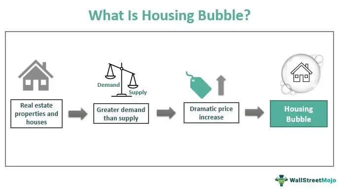

The concept of economic bubbles is a complex subject in financial markets, where asset prices rise rapidly and reach unsustainable levels before sharply declining. This phenomenon captures the interest of investors and policymakers alike due to its potential impact on financial stability. Economic bubbles are not merely historical anomalies; they are recurrent events with significant implications.

This article will explore the dynamics of economic bubbles with a focus on echo bubbles. Echo bubbles, which occur following an initial bubble's collapse, represent a compelling area of study as they often arise due to residual effects from the original bubble and attempts to reinflate markets. Understanding these phenomena is essential for market participants, as echo bubbles can magnify financial instability by creating false optimism and subsequently, deeper market corrections.

Algorithmic trading has added another dimension to bubble dynamics. Its ability to execute trades at high frequencies based on market sentiment and price movements can amplify both the rise and fall of asset prices, contributing to the rapid expansion and contraction that characterizes bubble markets. Given its prevalence in modern markets, algorithmic trading is a factor that cannot be ignored in any analysis of bubble formations.

The prevalence of market bubbles throughout financial history underscores the importance of understanding their mechanics. By examining the lifecycle of bubbles and the elements that contribute to their formation and collapse, investors and policymakers can gain crucial insights. Such comprehension is vital for developing strategies to navigate these volatile landscapes, ultimately aiming to mitigate the economic fallout associated with bubble bursts. Through an exploration of historical precedents and the modern role of algorithmic trading, this article seeks to equip readers with the necessary tools to better understand and navigate the complexities of financial bubbles.

## Table of Contents

## Understanding Economic Bubbles

Economic bubbles constitute significant phenomena within financial markets, marked by a sudden and often irrational escalation in asset prices, followed by a sharp contraction. The initial phase of an economic bubble begins when the prices of assets rise rapidly beyond their intrinsic value. This escalation frequently stems from a combination of speculative fervor, investor hype, and excessive optimism regarding future prospects. Market participants, driven by the fear of missing out (FOMO), continue to invest in these overvalued assets, further inflating their prices.

Historically, several noteworthy bubbles illustrate these dynamics. The dotcom bubble of the late 1990s provides a prime example. Prompted by advancements in internet technology and a belief in the limitless potential of online businesses, investors aggressively poured capital into tech stocks. Valuations soared despite many of these companies lacking a viable business model or actual profits. When reality set in and the market recognized the disparity between price and true value, the bubble burst, leading to significant financial losses and market turmoil.

Similarly, the housing bubble of the mid-2000s was characterized by an unprecedented rise in real estate prices fueled by easy credit, speculative borrowing, and the belief that housing prices would continue to climb indefinitely. This belief was shattered when mortgage defaults surged, leading to a collapse in housing prices and triggering the 2008 financial crisis.

The lifecycle of an economic bubble typically involves several stages. Initially, a displacement occurs, often due to technological innovation or a change in economic policy, which attracts investor interest. This is followed by a boom phase, where prices rise rapidly, attracting widespread media attention and further investor participation. The euphoria phase ensues, characterized by frenzied buying and disregard for risk. Eventually, insiders begin to cash out, leading to a peak in prices. The final stage is the bust, where prices plummet as panic sets in and investors rush to [exit](/wiki/exit-strategy) their positions.

Recognizing these stages is crucial for market participants and policymakers as they seek to anticipate and mitigate the impacts of bubble formations. While predicting the precise moment a bubble will burst remains challenging, understanding the underlying signals—such as exponential price increases divorced from fundamentals, increased leverage, and a surge in speculative trading—can provide valuable foresight for managing exposure and reducing potential economic fallout.

## What is an Echo Bubble?

An echo bubble represents a subsequent, smaller inflation of asset prices that follows the collapse of a larger, primary bubble. These phenomena often manifest in the same sector affected by the initial bubble, such as technology or real estate, but with less intensity. Echo bubbles are driven by lingering speculative fervor or interventionist policies designed to stabilize or stimulate the market.

The occurrence of an echo bubble typically results from residual speculation — the lingering market euphoria and speculative behavior that persists even after significant losses have been realized. Market participants, influenced by cognitive biases like overconfidence and the bandwagon effect, may prematurely anticipate a market recovery, leading to renewed but restrained asset price inflations.

Policy measures intended to reinflate markets can also contribute to echo bubbles. Following the bursting of a major bubble, central banks and governments might introduce accommodative monetary policies, such as lowering interest rates or implementing quantitative easing. While these measures aim to prevent economic stagnation, they can inadvertently encourage asset price escalation in certain sectors, fostering conditions ripe for an echo bubble.

An important consideration for echo bubbles is their capacity to exacerbate market pessimism upon bursting. The collapse of an echo bubble often masks deeper systemic issues that were either disregarded or inadequately addressed following the initial crash. This second wave of decline can lead to diminished investor confidence and further economic instability, underscoring the need for comprehensive market reforms and vigilance in monitoring speculative behaviors and policy impacts. Understanding these dynamics is crucial for investors and policymakers alike as they navigate the complexities of financial markets and work towards sustaining economic health.

## Historical Context and Examples

Notable historical examples of echo bubbles can be observed in the aftermath of the 1929 stock market crash. Following this financial catastrophe, characterized by plummeting stock prices and widespread economic turmoil, the U.S. market experienced a temporary resurgence in 1930. This brief rally, often referred to as an echo bubble, was initially marked by optimism and speculative buying as investors sought to capitalize on perceived buying opportunities at what seemed to be the bottom of the market.

However, this optimism was short-lived, as the resurgence proved to be unsustainable, leading to further declines that ushered in the depths of the Great Depression. The 1930 rally exemplifies the cyclical nature of economic bubbles and their echoes, where initial bursts of speculative enthusiasm are often followed by corrections that reveal underlying structural weaknesses in the market.

Analyzing such historical patterns provides valuable insights into market psychology and investor behavior. During an echo bubble, residual optimism and attempts to reclaim previous market highs can drive asset prices beyond the levels justified by fundamentals. This behavior often leads to another painful adjustment as reality sets in, exposing the fragility of the recovery. Recognizing these patterns helps economists and investors understand that echo bubbles, while presenting lucrative opportunities, also mask deeper systemic issues that need addressing for a stable economic future.

These occurrences emphasize the importance of historical context in financial market analysis. Past market cycles, with their characteristic echoes, highlight how investor sentiment, often swayed by psychological factors like fear and greed, can perpetuate the [volatility](/wiki/volatility-trading-strategies) that accompanies speculative bubbles. Understanding this dynamic is crucial for investors aiming to navigate the complexities of financial markets effectively.

## Algorithmic Trading and Bubble Dynamics

Algorithmic trading has fundamentally transformed financial markets, introducing significant changes in the dynamics of how bubbles form and evolve. These advanced trading systems utilize algorithms to execute trades at speeds and volumes beyond human capability, often relying on high-frequency trading ([HFT](/wiki/high-frequency-trading-strategies)) strategies. Such strategies can amplify the speed and amplitude of market movements, potentially accelerating bubble dynamics.

High-frequency trading strategies contribute to the acceleration of bubble dynamics due to their inherent nature of operating at microsecond intervals and executing large volumes of trades. By analyzing market data and executing trades based on perceived opportunities, HFT can magnify trends by contributing to rapid price increases during bullish sentiments. This effect often exacerbates speculative bubbles, as automated systems might continue buying into a rising market without gauging the fundamental value of the assets being traded.

Moreover, algorithmic systems perpetuate speculative trends by capitalizing on market sentiment analysis. Sentiment algorithms assess the overall mood or tone of the market, often using data from social media, news, and other sources. By doing so, they can quickly identify trends and execute trades that align with the prevailing sentiment. Such actions can reinforce upward price movements in overvalued markets, thus contributing to bubble formation.

The influence of algorithms on market behavior necessitates their consideration in any analysis of bubble formations. Unlike traditional trading, [algorithmic trading](/wiki/algorithmic-trading) can react almost instantaneously to market signals, creating feedback loops that may intensify both bullish and bearish trends. This responsiveness can sometimes lead to a disconnect between asset prices and their underlying economic fundamentals, a hallmark of bubble conditions.

To exemplify, the 2010 Flash Crash demonstrated how algorithmic trading could lead to rapid price swings. In that event, the Dow Jones Industrial Average dropped nearly 1,000 points within minutes, primarily driven by algorithmic trading activities. Such events underscore the importance of integrating algorithmic influence into market analyses, especially when considering the potential formation and bursting of bubbles.

Incorporating these dynamics into financial models and risk assessment frameworks is critical for accurately understanding and predicting bubble behavior. Stakeholders, ranging from regulatory bodies to private investors, must recognize the dual-edge nature of algorithmic trading; it offers enhanced efficiency and [liquidity](/wiki/liquidity-risk-premium) to markets but also introduces complex risks that could precipitate or exacerbate market bubbles.

## Identifying and Mitigating Echo Bubbles

Identification of echo bubbles requires a comprehensive understanding of market signals and investor behavior. This involves an analysis of price trends, trading volumes, and other relevant market data that can indicate irrational exuberance or unwarranted pessimism.

Market participants can utilize several tools to spot potential bubbles. Technical analysis, including chart patterns and [momentum](/wiki/momentum) indicators, plays a crucial role in identifying price anomalies. For instance, patterns such as "head and shoulders" or "double tops" might suggest impending reversals. Momentum indicators like the Relative Strength Index (RSI) can also highlight overbought or oversold conditions, potentially signaling bubble peaks or troughs.

Sentiment indicators, which gauge the general mood of investors, are equally vital. Surveys like the Consumer Confidence Index (CCI) or the Volatility Index (VIX) can provide insights into prevailing sentiment. Extreme readings often reflect irrational behavior that could signal bubble conditions. For example, unusually high consumer confidence might correspond with high asset valuations exceeding intrinsic values, suggesting bubble inflation.

Preventative measures to handle echo bubbles involve regulatory reforms and monetary policies aimed at reducing speculative behaviors. Regulatory bodies could impose stricter capital requirements or trading limits to deter excessive speculation. Monetary policy tools, such as adjusting interest rates, can influence borrowing costs and investor propensity to engage in speculative activities. An increase in interest rates typically disincentivizes borrowing, thereby reducing speculative leverage playing a part in bubble formations.

Educating investors about bubbles and associated risks is another crucial step. Financial literacy programs can empower investors with knowledge on identifying speculative environments and the dangers of participating without proper analysis. Understanding concepts like intrinsic value and diversification helps investors make more informed decisions, which can mitigate the adverse impacts of bubble bursts.

In summary, identifying and mitigating echo bubbles is a multifaceted process that involves thorough market analysis, regulatory interventions, and investor education. By employing these strategies, market participants and policymakers can better address the challenges posed by these economic phenomena.

## Conclusion

Economic bubbles and their echo counterparts are recurrent features of financial markets, consistently reshaping the investment landscape. These phenomena, characterized by rapid price inflations followed by abrupt contractions, can have significant repercussions for economies worldwide. While bubbles and echo bubbles are inherently challenging to forecast due to their complex interplay of market forces and investor psychology, identifying and understanding these events is key to minimizing potential economic fallout.

Algorithmic trading further complicates the dynamics of bubble formations, playing a dual role in both propagating and possibly mitigating these phenomena. Through high-frequency trading and quantitative strategies, algorithmic systems can amplify market trends, sometimes intensifying speculative trades that drive bubble formations. The rapid execution of trades based on market sentiment can lead to increased volatility, underscoring the need for cautious integration of algorithm-driven strategies in financial markets.

Despite these challenges, stakeholders are not without resources. Historical precedents provide valuable insights into the cyclical nature of bubbles, allowing investors, policymakers, and regulatory bodies to recognize patterns and develop strategies to counteract adverse effects. Additionally, advancements in technology provide new tools for monitoring market conditions and executing informed decisions.

The integration of technological insights with lessons from historical bubbles equips stakeholders with a comprehensive framework to navigate the inherently volatile waters of financial markets. By leveraging data analytics, sentiment analysis, and regulatory oversight, market participants can better anticipate potential bubbles and mitigate their impacts. This proactive approach not only aids in preserving economic stability but also fosters a more resilient financial ecosystem.

## References & Further Reading

[1]: Malkiel, B. G., & Shiller, R. J. (2004). ["Bubbles and Market Crashes"](https://www.princeton.edu/~ceps/workingpapers/91malkiel.pdf) in The Journal of Economic Perspectives.

[2]: Reinhart, C. M., & Rogoff, K. S. (2009). ["This Time is Different: Eight Centuries of Financial Folly"](https://www.nber.org/system/files/working_papers/w13882/w13882.pdf). Princeton University Press.

[3]: Mackay, C. (1841). ["Extraordinary Popular Delusions and the Madness of Crowds"](https://en.wikipedia.org/wiki/Extraordinary_Popular_Delusions_and_the_Madness_of_Crowds). Richard Bentley.

[4]: Shiller, R. J. (2000). ["Irrational Exuberance"](https://www.amazon.com/Irrational-Exuberance-Robert-J-Shiller/dp/0767923634). Princeton University Press.

[5]: Kirilenko, A. A., et al. (2011). ["The Flash Crash: The Impact of High Frequency Trading on an Electronic Market"](https://www.cftc.gov/sites/default/files/idc/groups/public/@economicanalysis/documents/file/oce_flashcrash0314.pdf). Social Science Research Network.