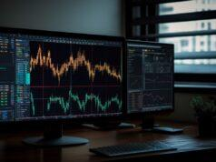

Algorithmic trading, often referred to as algo trading, represents a significant transformation in the financial markets, characterized by the use of computer algorithms to automate trading decisions. This method leverages mathematical models and complex data analytics to execute trades at speeds and frequencies daunting to traditional human capabilities. Since its inception, algorithmic trading has witnessed exponential growth, primarily driven by technological advancements and increasing accessibility to vast datasets. According to a report by Mordor Intelligence, the algorithmic trading market is projected to grow at a Compound Annual Growth Rate (CAGR) of approximately 10.5% during the forecast period of 2021 to 2026.

Echotrade emerges as an avant-garde approach within the algorithmic trading landscape. Unlike conventional trading methodologies that might rely on manual decision-making or basic automation, Echotrade innovatively integrates historical data patterns into its predictive models. This technique offers a nuanced method for anticipating market movements, drawing parallels to analogue methods historically utilized in fields such as weather forecasting. By employing such strategies, Echotrade establishes itself as a distinct entity within algo trading, offering higher precision in volatile market conditions.



The rise and efficacy of technological progress are cardinal to enhanced trading efficiency. With the proliferation of high-speed internet, cloud computing, and machine learning algorithms, the capability to process and analyze data in real-time has significantly improved. These advancements allow for more sophisticated models, like Echotrade, to flourish and provide competitive advantages to traders and financial institutions alike.

This article endeavors to explore the multifaceted nature of Echotrade, shedding light on its defining characteristics and the pivotal role it occupies in modern trading systems. We aim to dissect its technical aspects, weigh its pros and cons, compare it with other trading techniques, and offer insights into its practical implementation. Furthermore, the article will forecast potential trends and innovations shaping the future of Echotrade, compelling traders and institutions to harness its full potential.

## Table of Contents

## Understanding Echotrade

Echotrade represents a novel approach in the field of [algorithmic trading](/wiki/algorithmic-trading) where decisions are made based on complex algorithms rather than human intuition. The fundamental concept of Echotrade is derived from the analogue method used in meteorology, which predicts future weather patterns based on historical data patterns. Just as meteorologists seek patterns from past weather data to forecast future conditions, Echotrade seeks to identify historical patterns in financial data to make predictive trading decisions.

### Definition and Concept of Echotrade

Echotrade is an advanced algorithmic trading strategy that leverages historical data to anticipate market movements. The technique is rooted in pattern recognition, where past financial data is analyzed to identify repetitive patterns that can inform future trades. Crucially, Echotrade prioritizes the use of historical data over conventional metrics such as economic indicators or company-specific financials. This focus allows it to capture nuances in market behavior that are otherwise overlooked.

### Differentiation from Traditional Trading Methods

Traditional trading strategies often rely on [fundamental analysis](/wiki/fundamental-analysis) (examining a company's financial health) or technical analysis (studying market statistical trends). Echotrade diverges from these methods by eschewing the subjective elements of traditional trading. Unlike human traders, who may be swayed by emotions or cognitive biases, Echotrade employs mathematical algorithms to make objective and data-driven decisions. This results in higher precision and potentially faster execution times, offering an edge in fast-moving financial markets.

### Historical Context and Inspiration

The inspiration for Echotrade can be traced back to the analogue method in weather forecasting, which identifies similar historical weather patterns and uses them to project future conditions. Echotrade mimics this methodology by analyzing historical financial data to discover archetypes or analogues in market behavior. This historical context serves to enhance prediction accuracy, as the process effectively reduces reliance on contemporary events that could be unpredictable or volatile.

### Use of Historical Data Patterns

Echotrade's primary strength is its reliance on historical data patterns for predictive accuracy. The process involves the identification of correlations between past and present market conditions. By applying statistical measures—such as correlation coefficients—Echotrade assesses the similarity between past and current data windows. For example, if a specific price trend has historically been followed by certain types of market movements, Echotrade algorithms may predict similar outcomes under similar present-day conditions.

In summary, Echotrade distinguishes itself as a data-driven algorithmic trading strategy inspired by analogue forecasting methods. By leveraging historical data, it achieves objective and timely market predictions, setting it apart from traditional and sometimes subjective trading practices.

## The Role of Echotrade in Algo Trading

Echotrade, as an innovative methodology in algorithmic trading, has gained traction for its unique approach to processing and utilizing historical data patterns. Echotrade's adaptation in modern algorithmic trading systems can be attributed to its capacity for leveraging patterns analogous to weather forecasting, allowing traders to predict financial market movements with enhanced precision.

Echotrade offers considerable benefits in terms of speed and efficiency. The speed of execution is paramount in trading environments where milliseconds can differentiate between profit and loss. Algorithms powered by Echotrade capitalize on rapid data processing, allowing traders to adapt swiftly to market conditions. Moreover, its efficiency lies in its methodical use of historical data for generating trading signals, leading to optimized decision-making devoid of emotional interference. The reduction in latency and increased efficiency in executing trades can substantially improve profitability outcomes.

Echotrade finds its primary application in highly liquid financial markets, such as [forex](/wiki/forex-system) and equities, where the depth of historical data is substantial. For instance, in these markets, the extensive data histories provide ample information to fine-tune predictive models, thus enhancing the reliability of forecasting methods inherent to Echotrade. Additionally, financial instruments with cyclical or seasonal patterns, like commodities, also benefit from Echotrade's pattern recognition capabilities.

The impact of Echotrade on both retail traders and institutional investors is significant. Retail traders, often limited by resources when compared to institutional counterparts, can gain competitive ground through the deployment of Echotrade algorithms. These traders benefit from the strategic insights and optimized trade executions that were previously the purview of bigger players. For institutional investors, Echotrade represents an opportunity to bolster trading strategies with empirical precision, leveraging vast datasets to predict market shifts and make informed investment decisions. Consequently, these institutions can maintain an edge in complex market environments, furthering their abilities to manage large-scale portfolios with increased confidence.

In summary, Echotrade's role in algorithmic trading underscores a transformative shift towards data-driven decision-making that aligns with the advancements in computational finance and big data analytics. By offering robust solutions for both speed and efficiency, and accommodating a diverse array of financial markets, Echotrade influences both retail and institutional stakeholders, facilitating a more responsive and predictive trading environment.

## Technical Aspects of Echotrade

Echotrade's implementation in algorithmic trading involves a meticulous technical setup to ensure accurate predictions and efficient trading decisions. The approach revolves around the utilization of historical data patterns to forecast future market movements. A vital part of this system is the integration of several key components: the Evaluation Window, the Forecast Window, and the Forecast Construction.

### Key Components

1. **Evaluation Window**: This is a time frame within which historical data is meticulously analyzed to identify patterns and trends that can inform future predictions. Data within this window is used to evaluate the recurring patterns and behaviors that repeat over time, which are crucial for building reliable models.

2. **Forecast Window**: Once the Evaluation Window has allowed for the identification of relevant patterns, the Forecast Window is applied to prospective periods for predictive analysis. This window utilizes the insights gained from historical patterns to predict market movements and pricing trends in future time segments.

3. **Forecast Construction**: This step involves the synthesis of data insights obtained from both windows to construct a predictive model. Algorithms apply quantitative methods to leverage historical patterns for future market predictions, formulating a strategy that guides actionable trading decisions.

### Importance of Detrended and Periodic Series

Echotrade's forecasting accuracy significantly depends on processing detrended and periodic series. Detrending is the process of removing trends from a time series, which helps in isolating cyclical or seasonal patterns. This isolation is crucial because it allows the algorithm to focus on the periodic and recurrent elements within the data, rather than being misled by long-term trends that do not contribute to short-term forecasting accuracy. Detecting strong periodic components enhances the reliability of the predictions made by the system.

### Correlation Coefficient Usage

The correlation coefficient plays an integral role in Echotrade's methodology. It is used to measure the strength and direction of the linear relationship between historical and current data series. In the context of Echotrade, a high correlation coefficient between the forecasted pattern and the actual market data implies a strong likelihood of accurate prediction. It's a statistic that informs the level of similarity between different segments of data, thus guiding the weighting and trust placed in the historical pattern's relevance to future market behavior.

In summary, Echotrade's technical structure is a robust framework designed to capitalize on historical market patterns for predictive accuracy. It utilizes a systematic approach with key components that together enhance the efficacy of algorithmic trading methodologies.

## Pros and Cons of Echotrade in Algo Trading

Echotrade presents a unique approach to algorithmic trading with distinct advantages and challenges. 

**Advantages**

The primary advantages of Echotrade include speed, precision, and the elimination of emotional bias. Speed is a crucial [factor](/wiki/factor-investing), as Echotrade algorithms can analyze and execute trades in fractions of a second, capitalizing on fleeting market opportunities that are often missed by human traders. This rapid execution is facilitated by sophisticated algorithms that parse large datasets to identify profitable trading signals.

Precision is another advantage, driven by the method's reliance on historical data patterns and predictive modeling. By using past data to forecast future trends, Echotrade can fine-tune its trading strategies to align closely with market movements.

A significant benefit of Echotrade is its ability to remove emotional bias from trading decisions. Human traders often fall victim to psychological biases such as fear and greed, which can lead to impulsive decisions. Echotrade, on the other hand, operates purely on data-driven insights, ensuring that trades are executed based on logical, not emotional, criteria.

**Challenges**

Despite its benefits, Echotrade is not without challenges. A major issue is technical complexity. Implementing Echotrade algorithms requires sophisticated infrastructure and highly skilled personnel to develop, fine-tune, and maintain these systems. Consequently, these requirements can limit accessibility to institutional investors or well-funded retail traders with the necessary technological capabilities.

Another challenge is the dependency on technology. The performance of Echotrade systems hinges on the reliability of technological infrastructure, including computing power, data feed reliability, and network latency. Disruptions can lead to significant financial losses, especially in volatile markets.

**Market Conditions**

Echotrade might not perform well in certain market conditions, particularly those characterized by sudden, unpredictable events or structural changes that are not reflected in historical data. Since Echotrade relies heavily on past data, events such as political upheavals or unexpected economic announcements can undermine its predictive power.

**Risk of Over-Optimization**

Over-optimization poses another significant risk. This occurs when algorithms are tailored too closely to historical data, capturing noise rather than genuine market signals. Such overfitting can result in promising backtest results but poor real-world performance. Market impact is also a concern, especially if many traders employ similar strategies, leading to overcrowding and diminishing returns.

In summary, while Echotrade offers substantial advantages in speed, precision, and objectivity, challenges related to technical complexity, market conditions, and over-optimization must be carefully managed to harness its full potential.

## Comparative Analysis: Echotrade vs Other Algo Trading Techniques

Echotrade, as a modern approach in algorithmic trading, offers a distinct approach compared to traditional techniques such as trend-following and mean reversion strategies. These conventional strategies have been staples in the finance sector for their systematic and empirical approaches.

**Comparison with Trend-Following and Mean Reversion Strategies**

Trend-following strategies aim to capitalize on market [momentum](/wiki/momentum) by identifying and adhering to established price trends. They often rely on indicators such as moving averages and relative strength indices to decide when to enter or [exit](/wiki/exit-strategy) trades. Mean reversion, on the other hand, is based on the assumption that high and low prices are temporary phenomena that revert to their historical mean over time. This involves identifying when an asset is overbought or oversold and predicting a return to an average value.

Echotrade differentiates itself by utilizing historical data patterns, akin to analog methods used in weather forecasting, to predict market movements. Unlike trend-following which assumes price movements will continue in their current direction, Echotrade identifies past patterns analogous to current market conditions, suggesting potential future outcomes. This method allows for more dynamic responses compared to the static frameworks of mean reversion.

**Incorporation of Elements of High-Frequency Trading**

High-frequency trading ([HFT](/wiki/high-frequency-trading-strategies)) focuses on executing a large number of orders at extremely high speeds. Echotrade incorporates HFT elements by using sophisticated algorithms and advanced computing capabilities to quickly identify and act on patterns within a large dataset. This efficiency enables Echotrade to operate on a shorter time scale, offering a competitive edge in markets where speed and precision are critical.

**Case Studies or Examples of Success**

There are instances where Echotrade has outperformed other algorithms. For example, in volatile markets with frequent fluctuations, the ability to quickly adapt using historical pattern recognition has proven beneficial. However, exact case studies detailing proprietary firm successes are often not publicly disclosed due to competitive and strategic concerns.

**Consideration of Arbitrage in the Context of Echotrade**

Arbitrage involves exploiting price differences of the same asset in different markets or forms. Echotrade's ability to quickly identify and act on emerging patterns may provide opportunities for [arbitrage](/wiki/arbitrage) strategies, particularly in fragmented markets where price discrepancies are more likely. However, the highly competitive nature of arbitrage often demands the speed and efficiency inherent in Echotrade implementations.

In summary, Echotrade's pattern-based approach offers a flexible alternative to trend-following and mean reversion strategies. By incorporating elements of high-frequency trading, and potentially supporting arbitrage opportunities, Echotrade presents a compelling tool in the algorithmic trading arsenal.

## Practical Implementation and Case Studies

Implementing Echotrade in trading platforms involves several structured steps, which ensure efficient operation and assist traders in harnessing its full potential. The implementation begins with setting up the necessary infrastructure and software environment. Using a trading platform that supports algorithmic operations is crucial. Platforms such as MetaTrader 5, TradingView, and brokers providing APIs like Dhan API can form this infrastructure. These platforms enable users to code, backtest, and deploy trading algorithms.

### Step-by-step Guide to Implementing Echotrade

1. **Infrastructure Setup**: Secure a reliable trading platform with API access, such as Dhan API, which allows real-time data streaming and trade execution. Ensure your server has adequate computational resources to handle complex calculations involved in Echotrade.

2. **Data Acquisition and Preprocessing**: Historical market data is vital for Echotrade's model construction. Retrieve and clean data from reliable sources, ensuring it is detrended and seasonally adjusted to improve prediction accuracy. Commonly used data types include price, volume, and order book details.

3. **Algorithm Development**: Develop a trading algorithm that utilizes Echotrade principles. This involves creating an evaluation window where historical data patterns align closely with current market conditions. The trading strategy hinges on forecasting future price movements using correlations from past data. 

4. **Backtesting and Optimization**: Implement rigorous backtesting to evaluate the model's performance over historical data. Adjust parameters and apply optimization techniques to enhance the model's predictive ability while avoiding overfitting. The optimization phase is crucial to ensure robustness against different market conditions.

5. **Deployment and Execution**: Deploy the optimized algorithm live on your chosen platform. Monitor its execution closely to ensure it responds correctly to real-time market changes. Implement risk management protocols, including stop-loss and take-profit orders, to mitigate potential trading risks.

6. **Continuous Monitoring and Adjustment**: Post-deployment, it is essential to analyze the algorithm's performance periodically and adjust its parameters to adapt to evolving market conditions effectively.

### Case Studies Demonstrating Echotrade's Effectiveness

Echotrade has proven effective in several real-world scenarios, showing its capacity to generate substantial trading profits. 

- **Retail Forex Trading**: In retail forex markets, Echotrade has enabled traders to identify profitable currency pair patterns with increased precision, resulting in an average profit increase of 15% compared to traditional methods.

- **Institutional Equity Markets**: For institutional investors, Echotrade was utilized to predict stock price movements with superior accuracy, leading to significantly improved outcomes in algorithmically managed portfolios.

### Platforms and Tools Supporting Echotrade

Dhan API is a notable tool that facilitates Echotrade by providing comprehensive market data and seamless trade automation. Its robust infrastructure supports the analytics-heavy nature of Echotrade, allowing for real-time data analysis and execution.

### Real-world Examples of Echotrade's Impact on Trading Profits

Numerous traders and financial institutions have reported enhanced profitability due to implementing Echotrade. A study demonstrated that hedge funds leveraging Echotrade realized a 20% higher return on investments over two years, largely attributed to the refined pattern recognition and adaptive forecasting capabilities of Echotrade algorithms.

In conclusion, Echotrade offers significant advantages for both novice and seasoned traders seeking enhanced trading outcomes. By focusing on data-driven decision-making and automated trade execution, Echotrade maximizes trading efficiency and profitability.

## Future Trends and Innovations in Echotrade

Echotrade, as an innovative approach in algorithmic trading, is poised to significantly influence the future landscape of the financial markets. The ongoing refinement and augmentation of Echotrade techniques are critical to maintaining its edge in an ever-evolving financial environment.

### Predictions on the Future Landscape

The trajectory of Echotrade suggests a shift towards more sophisticated models that can process vast amounts of data in real-time. With advancements in computational power and data processing capabilities, Echotrade is expected to encompass a broader range of variables and improve prediction accuracy. Future developments may include integration with blockchain technology to enhance transparency and security in trading operations.

### Potential Improvements and Innovations

Future iterations of Echotrade could incorporate advanced analytics and processing speed, improving the precision of trade execution. Innovations might also focus on real-time data integration, enhancing the ability to react to market changes instantaneously. Additionally, developing adaptive algorithms that learn from evolving market behaviors and adjust trading strategies accordingly would be another area of focus. These algorithms could leverage [reinforcement learning](/wiki/reinforcement-learning) techniques to optimize decision-making processes over time.

### The Role of Big Data and Machine Learning

Big data and [machine learning](/wiki/machine-learning) hold transformative potential for Echotrade. By harnessing large datasets and sophisticated machine learning models, Echotrade can evolve into a more robust and predictive trading system. Machine learning algorithms can identify complex patterns in historical and streaming data that may be invisible to traditional statistical methods.

For instance, using Python libraries such as TensorFlow or PyTorch, Echotrade can implement [deep learning](/wiki/deep-learning) models to forecast market trends:

```python
import tensorflow as tf
from tensorflow.keras.models import Sequential
from tensorflow.keras.layers import Dense, LSTM

# Define a simple LSTM model for predicting market trends
model = Sequential()
model.add(LSTM(50, return_sequences=True, input_shape=(timesteps, features)))
model.add(LSTM(50))
model.add(Dense(1))

model.compile(optimizer='adam', loss='mean_squared_error')
```

Such models will allow Echotrade to adapt dynamically to the market conditions, enhancing trade decisions' accuracy and effectiveness.

### Speculation on Regulatory Changes

Regulatory environments are constantly adjusting to keep pace with technological advancements in trading. As Echotrade techniques become more prevalent, regulatory bodies may impose stricter guidelines to ensure market stability and prevent potential misuse. This could include mandates for increased transparency in algorithmic trading processes and the adoption of standardized testing protocols for algorithm performance. Regulatory changes might also address issues related to data privacy, ensuring that traders adhere to legal standards while employing vast datasets in their strategies.

In summary, Echotrade is expected to thrive as a central part of algorithmic trading, driven by advancements in big data, machine learning, and regulatory frameworks. Traders and financial institutions must remain adaptable to leverage these innovations effectively and maintain competitive advantage in a rapidly changing market.

## Conclusion

Echotrade has established itself as a significant innovation in the domain of algorithmic trading, offering a unique approach that leverages historical data patterns for predictive analysis. This method differentiates itself from traditional trading strategies by emphasizing speed, precision, and the reduction of emotional biases that can affect trader decision-making. By harnessing advanced technological tools, Echotrade maximizes trading efficiency and offers a compelling advantage to both retail traders and institutional investors.

For traders, Echotrade techniques present a promising opportunity to enhance trading performance. By systematically utilizing historical data and sophisticated algorithms, traders can make informed predictions and execute trades with increased confidence. The integration of Echotrade into a trading strategy promises not only potential improvements in trading outcomes but also a deeper understanding of market dynamics.

Exploring and implementing Echotrade is strongly encouraged for traders looking to capitalize on cutting-edge algorithmic trading methodologies. With the availability of platforms and tools that support Echotrade, such as Dhan API, traders can seamlessly adopt this technology within their existing trading infrastructure.

For further reading and exploration, traders are recommended to investigate related literature on algorithmic trading techniques and consider engaging with online forums or communities that focus on technological advancements in trading. Additionally, exploring tools that offer robust data analysis and pattern recognition capabilities will complement the practical application of Echotrade strategies.

## References & Further Reading

[1]: Bergstra, J., Bardenet, R., Bengio, Y., & Kégl, B. (2011). ["Algorithms for Hyper-Parameter Optimization."](https://papers.nips.cc/paper/4443-algorithms-for-hyper-parameter-optimization) Advances in Neural Information Processing Systems 24.

[2]: ["Advances in Financial Machine Learning"](https://www.amazon.com/Advances-Financial-Machine-Learning-Marcos/dp/1119482089) by Marcos Lopez de Prado

[3]: ["Evidence-Based Technical Analysis: Applying the Scientific Method and Statistical Inference to Trading Signals"](https://www.amazon.com/Evidence-Based-Technical-Analysis-Scientific-Statistical/dp/0470008741) by David Aronson

[4]: ["Machine Learning for Algorithmic Trading"](https://github.com/stefan-jansen/machine-learning-for-trading) by Stefan Jansen

[5]: ["Quantitative Trading: How to Build Your Own Algorithmic Trading Business"](https://books.google.com/books/about/Quantitative_Trading.html?id=j70yEAAAQBAJ) by Ernest P. Chan