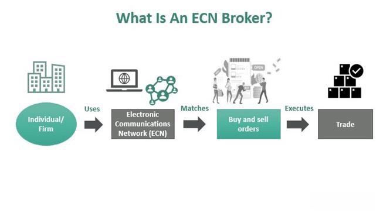

An Electronic Communication Network (ECN) in forex trading is a type of computerized system that facilitates the trading of foreign currencies by allowing investors to directly connect with one another. Unlike traditional trading settings where brokers act as intermediaries between market participants, ECNs serve as a bridge between buyers and sellers, automatically matching orders based on given criteria. This system operates on a networked platform, providing an arena for traders to engage with minimal interference or oversight.

ECN brokers are pivotal within this arrangement, acting as facilitators rather than intermediaries. They provide their clients with direct access to the foreign exchange markets, presenting a vast array of executable quotes from various market participants such as banks and other financial institutions. This direct access often results in tighter spreads and increased transparency, as traders can view and act upon real-time market data. In this way, ECN brokers contribute significantly to more efficient and effective trade executions.



Algorithmic trading, or algo trading, has seen an upsurge in popularity within the forex market. This method employs computer algorithms to trade on behalf of investors by following pre-programmed strategies. The major advantage of algo trading is its ability to execute orders at optimal speeds and prices, while minimizing human error. As algorithms can process a vast array of market data instantaneously, they provide traders with speed, accuracy, and efficiency that far surpass traditional trading methods.

The convergence of ECN brokers and algo trading is noteworthy. ECN platforms are particularly well-suited for algorithmic strategies due to their transparency, speed, and direct market access. This pairing allows for seamless execution of complex trading strategies, making it an attractive option for individuals and institutions aiming to capitalize on forex market opportunities. For example, an algorithm can automatically execute trades based on real-time data provided by ECN brokers, thus reducing latency and slippage.

This intersection is driving a transformative change in the forex market landscape, encouraging more traders to utilize algorithmic strategies facilitated by ECN brokers. This article will further explore the dynamics between ECN broker forex trading and algo trading, delving into their individual characteristics and the synergistic benefits they present when combined. As the forex market continues to evolve, understanding the implications and opportunities of ECN-algo integration is essential for traders looking to enhance their trading approaches and outcomes.

## Table of Contents

## Understanding ECN Brokers

### Understanding ECN Brokers

In the [forex](/wiki/forex-system) market, traditional trading models typically involve a broker acting as a market maker. In this setup, the broker provides bid and ask prices, essentially creating a simulated market where they can trade against their clients. This model, while convenient, can lead to conflicts of interest as the broker may have a vested interest in the trades made by their clients.

ECN (Electronic Communication Network) brokers, however, represent a shift from this conventional model by providing a decentralized trading platform that connects participants directly with each other. This allows for the matching of buy and sell orders within the network, which removes the broker's discretion about trade prices and mitigates direct conflicts of interest.

One of the key advantages of ECN brokers is the enhanced transparency they offer. Since ECN brokers provide direct access to the interbank market, they display actual market prices from various participants. This transparency typically results in tighter spreads, as prices are largely determined by market supply and demand rather than a broker's pricing policy. Tighter spreads benefit traders by reducing the cost incurred on each trade.

Moreover, the neutrality of ECN brokers stems from the fact that they do not hold positions against their clients, eliminating potential conflicts of interest. This neutrality reassures traders that their broker's profits are not dependent on clients losing money, which is a prevalent concern with market-making brokers.

ECN brokers are also favored for their ability to facilitate faster and more accurate execution of trades. By offering real-time market data and direct access to the trading book, they enable quicker execution, which is crucial for capitalizing on short-term market movements. This direct access also often results in better pricing, as traders are exposed to a broader pool of [liquidity](/wiki/liquidity-risk-premium) providers.

However, ECN brokers are not without misconceptions and challenges. One common misconception is that they are suitable for all types of traders. In reality, the cost structure of ECN brokers, which usually involves commission fees on top of spreads, might be more advantageous for high-[volume](/wiki/volume-trading-strategy) or institutional traders rather than small retail investors. Additionally, the advanced trading environment may require a steeper learning curve for those unfamiliar with the forex market dynamics.

Another challenge is the variable nature of spreads. While typically tight, spreads can widen significantly during periods of low liquidity or high [volatility](/wiki/volatility-trading-strategies), such as during major news events. Traders relying solely on the assumption of consistently low spreads might face unexpected costs if not adequately prepared.

Overall, ECN brokers offer a robust alternative to traditional market-making models by embracing transparency, neutrality, and faster trade execution, albeit with certain complexities that traders should consider.

## Role of Algo Trading in Forex Markets

Algorithmic trading, commonly referred to as algo trading, involves the use of computer programs and systems to execute trades automatically based on predefined criteria. These criteria can be mathematical models, statistical analysis, or other rules that determine the timing, price, and quantity of orders. In the forex markets, [algorithmic trading](/wiki/algorithmic-trading) has transformed the way currencies are traded by automating the process, which enhances efficiency and reduces human error.

One of the primary advantages of using algorithms in forex trading is the speed of execution. Computers can process multiple market conditions and execute trades in fractions of a second, which is considerably faster than any human trader. This speed is crucial in forex markets, which operate 24 hours a day and are highly sensitive to geopolitical events, economic data releases, and other market-moving news. 

Another significant advantage is accuracy. Algorithms follow exact instructions without deviation, ensuring that trading strategies are executed precisely as intended. Additionally, efficiency is improved as algorithms can handle large volumes of trades simultaneously without pausing, making them ideal for high-frequency trading ([HFT](/wiki/high-frequency-trading-strategies)) strategies. HFT involves executing a large number of orders at extremely high speeds and is typically used to exploit small price discrepancies that may exist for only milliseconds.

Several types of algorithms are commonly utilized in forex trading. High-frequency trading algorithms capitalize on short-term market inefficiencies, executing thousands of trades per second. Trend-following algorithms, on the other hand, aim to capture gains through the analysis of an asset's [momentum](/wiki/momentum) in a particular direction. These algorithms often rely on historical data and technical indicators to identify entry and [exit](/wiki/exit-strategy) points in the market.

The impact of algorithmic trading on market liquidity and volatility is nuanced. On one hand, algo trading can enhance market liquidity by ensuring that buy and sell orders are matched efficiently, reducing spreads and potentially lowering transaction costs. On the other hand, the rapid execution capabilities of algorithms can contribute to increased volatility, especially in the event of systemic errors or unexpected market conditions that trigger mass order executions simultaneously.

Success in algorithmic trading requires a combination of skills and technologies. Traders must have strong programming skills to develop, test, and optimize algorithms. Knowledge of statistical analysis, financial markets, and mathematical modeling is also essential. Technologies such as high-speed internet connections, powerful computing systems, and access to real-time market data are critical to support the functioning of these systems.

For beginners interested in algo trading, there are various platforms and languages to explore, such as Python, which is renowned for its robust libraries like NumPy and pandas for numerical and data analysis, and packages like PyAlgoTrade and Backtrader for algorithmic trading. Here's an example of a simple moving average crossover strategy in Python using Backtrader:

```python
import backtrader as bt

class MAStrategy(bt.Strategy):
    params = (
        ('short_period', 10),
        ('long_period', 30),
    )

    def __init__(self):
        self.short_ma = bt.indicators.SimpleMovingAverage(self.data.close, period=self.params.short_period)
        self.long_ma = bt.indicators.SimpleMovingAverage(self.data.close, period=self.params.long_period)

    def next(self):
        if self.short_ma > self.long_ma:
            self.buy()
        elif self.short_ma < self.long_ma:
            self.sell()

cerebro = bt.Cerebro()
cerebro.addstrategy(MAStrategy)
data = bt.feeds.YahooFinanceData(dataname='EURUSD=X', fromdate=datetime(2020, 1, 1), todate=datetime(2021, 1, 1))
cerebro.adddata(data)
cerebro.run()
cerebro.plot()
```

This script sets up a basic moving average crossover strategy where a short-term moving average is compared to a long-term one to generate buy and sell signals. While simplistic, such strategies form the basis for more complex algorithms tailored to various trading objectives.

## Synergy Between ECN Brokers and Algo Trading

Electronic Communication Networks (ECN) and algorithmic trading form a synergistic relationship that enhances the efficiency of forex trading. ECN trading platforms are inherently compatible with algo trading systems, providing an optimal environment for executing algorithmic strategies.

ECN brokers offer direct market access (DMA), allowing traders to interact with multiple liquidity providers on equal terms. This direct access is particularly beneficial for algo trading, as it enables the execution of trades based on precise algorithmic parameters without intermediary interference. Algorithms can execute orders based on real-time market conditions, ensuring that strategies are executed as intended.

Access to real-time data is another crucial component of successful algo trading. ECN brokers provide comprehensive market data, which is essential for the algorithms to function effectively. The immediacy and accuracy of this data allow algorithms to assess market conditions and execute trades with precision. Furthermore, real-time data feeds enable [backtesting](/wiki/backtesting) and fine-tuning of trading strategies, enhancing their effectiveness.

Latency and slippage are significant concerns in algorithmic trading, as they can substantially impact the profitability of trades. ECN brokers help mitigate these issues by offering low-latency connections and minimal slippage. The direct market access and efficient data transmission systems of ECN brokers reduce the time it takes for trades to be executed. This speed is crucial for high-frequency trading algorithms, which rely on executing a large number of trades in a short period. Reduced slippage ensures that orders are executed at expected prices, maintaining the integrity of algorithmic strategies.

Successful strategies leveraging the synergy between ECN brokers and algo trading have been documented. For instance, trend-following algorithms that capitalize on market momentum benefit from the real-time data and rapid execution capabilities provided by ECN platforms. These strategies can quickly identify and act on emerging trends, maximizing profits while minimizing risks.

In conclusion, the compatibility of ECN trading platforms with algorithmic systems, along with the benefits of direct market access, real-time data, and reduced latency and slippage, create an ideal framework for executing algorithmic strategies. This synergy enhances the potential for success in the forex market.

## Selecting the Right ECN Broker for Algo Trading

Choosing the right Electronic Communication Network (ECN) broker for algorithmic trading requires careful consideration of several key factors that can influence the efficiency and success of your trading strategies.

### Robust Trading Platform and API Support

A critical [factor](/wiki/factor-investing) in selecting an ECN broker is the robustness of the trading platform and the availability of comprehensive API (Application Programming Interface) support. A robust trading platform should provide seamless integration with various algo trading systems. Traders often seek brokers offering platforms such as MetaTrader 4 or 5, or proprietary platforms that support scripting languages like MQL4 or MQL5. An effective API ensures algorithms can execute trades seamlessly in response to market conditions. 

For instance, a RESTful API or WebSocket API can allow your algorithm to retrieve real-time data for analysis and decision-making, as shown in the following Python snippet using a hypothetical API endpoint:

```python
import requests

def get_market_data(api_key, symbol):
    url = f"https://api.broker.com/v1/marketdata/{symbol}"
    headers = {"Authorization": f"Bearer {api_key}"}
    response = requests.get(url, headers=headers)
    return response.json()

market_data = get_market_data(api_key="your_api_key", symbol="EURUSD")
```

### Fees, Commissions, and Spreads

Another important consideration is the fee structure, which includes commissions and spreads. ECN brokers typically charge a commission per trade instead of marking up the spread, which can result in lower overall trading costs, especially beneficial for high-frequency trading strategies. Calculating the total trading cost, including both commissions and any potential hidden fees, is crucial for evaluating broker profitability.

### Security, Regulation, and Reputation

Security and regulation are paramount when selecting an ECN broker. Traders should verify that the broker is regulated by recognized financial regulatory bodies such as the U.S. Commodity Futures Trading Commission (CFTC), the Financial Conduct Authority (FCA) in the UK, or the Australian Securities and Investments Commission (ASIC). Regulation ensures that brokers adhere to industry standards and provide a secure trading environment. Additionally, a broker's reputation, reflected through user reviews and industry awards, can offer insights into their reliability and customer service standards.

### Customer Support and Educational Resources

Effective customer support can greatly enhance the trading experience. Traders should evaluate brokers based on the accessibility and quality of customer service. Look for brokers providing 24/7 support through multiple channels such as phone, email, and live chat. Additionally, brokers that offer rich educational resources—covering topics from basic trading concepts to advanced algorithmic strategies—can help traders improve their skills and adapt to market changes.

In conclusion, selecting the right ECN broker for algo trading involves assessing the trading platform and API capabilities, understanding the fee structure, ensuring adequate regulation and security, and considering the quality of customer support and educational offerings. Each of these factors contributes to the creation of a conducive environment for the successful implementation of algorithmic trading strategies.

## Future Trends and Considerations

As technology continues to advance, the future of Electronic Communication Network (ECN) brokers and algorithmic trading in the forex market is poised for significant evolution. One major development anticipated in this domain is the integration of Artificial Intelligence (AI) and Machine Learning (ML) algorithms. These technologies promise to enhance the predictive accuracy and efficiency of trading strategies. In forex algo trading, AI and ML can analyze vast datasets more quickly and with greater precision than traditional methods, enabling more informed decision-making. For instance, [machine learning](/wiki/machine-learning) models can identify patterns and correlations within market data that may not be immediately apparent to human traders, potentially leading to the development of highly sophisticated trading algorithms. This shift is expected to result in improved trading outcomes, such as higher returns and reduced risks.

Regulatory changes are also crucial in shaping the future of ECN brokers. With increasing global scrutiny of financial markets, regulatory bodies continually update policies to maintain market integrity and protect investors. These regulations can have varied implications for ECN brokers, potentially affecting their operational procedures, data reporting requirements, and the technologies they employ. As such, brokers will need to adapt swiftly to comply with new regulations, which could involve investing in advanced compliance technologies and strategies. Forex traders engaged in algorithmic trading should therefore remain vigilant and informed about regulatory developments to ensure their strategies remain compliant and effective.

While the advancement of technology presents numerous opportunities, it also brings about challenges in the forex trading landscape. One significant challenge is the risk associated with cybersecurity. As trading systems become more interconnected and reliant on technology, they become vulnerable to cyber threats. ECN brokers and traders must implement robust security measures to safeguard sensitive data and trading infrastructure. Furthermore, the increasingly competitive market environment demands continuous innovation in trading strategies and technology, posing a challenge for traders to stay ahead.

In conclusion, the future of ECN brokers and algo trading is promising, driven by technological advancements and the need for regulatory compliance. As AI and machine learning technologies become more prevalent, they are expected to revolutionize trading strategies, contributing to more effective and efficient trading outcomes. Traders looking to capitalize on these developments should focus on innovation, continual learning, and strategic adaptation. Engaging with ECN brokers who are proactive in adopting cutting-edge technologies and maintaining regulatory compliance will be vital for traders aiming to maximize their success in the dynamic forex market.

## Conclusion

In this article, we have explored the integration of Electronic Communication Network (ECN) brokers and algorithmic trading in the forex market. ECN brokers offer a transparent trading environment with tighter spreads, faster execution, and better pricing by providing direct market access. This transparency and efficiency align seamlessly with the principles of algorithmic trading, which relies on speed, accuracy, and efficiency to optimize trade execution.

Combining ECN brokers with algorithmic strategies presents significant advantages for forex traders. ECN brokers eliminate conflicts of interest, as they do not trade against their clients, which is crucial for executing unbiased algorithmic strategies. Traders benefit from reduced latency and slippage, enhancing the performance of high-frequency trading and other algorithmic strategies.

Traders are encouraged to consider ECN brokers when implementing algorithmic trading strategies due to the enhanced data access, reduced costs, and improved execution capabilities they provide. The interaction between ECN brokers and algorithmic trading technologies requires continuous learning and adaptation. As the forex market and related technologies evolve, traders must remain informed and agile in leveraging these tools effectively.

In conclusion, traders should explore and implement ECN-algo trading strategies to capitalize on the synergistic benefits offered by this combination. Doing so can provide a competitive edge in the dynamic and fast-paced forex trading landscape, ultimately leading to more informed and profitable trading decisions.

## References & Further Reading

[1]: Bergstra, J., Bardenet, R., Bengio, Y., & Kégl, B. (2011). ["Algorithms for Hyper-Parameter Optimization."](https://dl.acm.org/doi/10.5555/2986459.2986743) Advances in Neural Information Processing Systems 24.

[2]: ["Advances in Financial Machine Learning"](https://www.amazon.com/Advances-Financial-Machine-Learning-Marcos/dp/1119482089) by Marcos Lopez de Prado

[3]: ["Evidence-Based Technical Analysis: Applying the Scientific Method and Statistical Inference to Trading Signals"](https://www.amazon.com/Evidence-Based-Technical-Analysis-Scientific-Statistical/dp/0470008741) by David Aronson

[4]: ["Machine Learning for Algorithmic Trading"](https://github.com/PacktPublishing/Machine-Learning-for-Algorithmic-Trading-Second-Edition) by Stefan Jansen

[5]: ["Quantitative Trading: How to Build Your Own Algorithmic Trading Business"](https://books.google.com/books/about/Quantitative_Trading.html?id=j70yEAAAQBAJ) by Ernest P. Chan