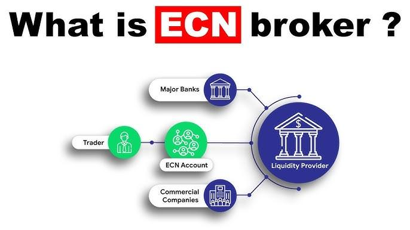

## Table of Contents

## What is an ECN broker?

An ECN broker, or Electronic Communication Network broker, is a type of forex broker that uses an electronic system to match buy and sell orders from different traders. This means that when you trade with an ECN broker, your orders are matched directly with other traders in the market, instead of going through a middleman like a traditional broker. This can lead to better pricing and faster execution of trades because you're dealing directly with the market.

ECN brokers are popular among experienced traders because they offer more transparency and lower trading costs. Since there's no dealing desk involved, there's no risk of the broker trading against you or manipulating prices. However, ECN brokers often charge a small commission on each trade, which can add up if you're trading frequently. Overall, ECN brokers are a good choice for those looking for a more direct and efficient way to trade in the forex market.

## How does an ECN broker differ from a traditional broker?

An ECN broker and a traditional broker work differently. An ECN broker uses a computer system to match people who want to buy with people who want to sell. This means you trade directly with other traders in the market, not through a middleman. This can give you better prices and faster trades because you're dealing straight with the market. On the other hand, a traditional broker acts as a middleman. When you want to trade, the traditional broker might take the other side of your trade or send it to a bigger market. This can sometimes mean slower trades and possibly higher costs because the broker might charge more.

ECN brokers are often chosen by people who know a lot about trading. They like the clear and open way ECN brokers work. There's no dealing desk, so the broker can't play tricks with the prices. But, ECN brokers usually charge a small fee for each trade. This can add up if you trade a lot. Traditional brokers might not charge this fee, but they might make money in other ways, like by adding a bit to the price you pay or by taking the other side of your trade. So, if you want a more direct and possibly cheaper way to trade, an ECN broker might be good for you.

## What are the benefits of using an ECN broker for trading?

Using an ECN broker for trading has several benefits. One big advantage is that you get better prices. Since an ECN broker matches your trades directly with other traders in the market, you avoid the extra costs that a traditional broker might add. This means you can buy and sell at prices that are closer to what's really happening in the market. Another benefit is faster trade execution. Because your orders go straight to the market, there's less delay. This can be really important if you're trading quickly and need to act fast.

Another good thing about ECN brokers is the transparency they offer. With no dealing desk, there's no chance for the broker to play games with your trades or prices. You can see exactly what's happening, which builds trust. ECN brokers also work well for traders who like to use automated trading systems. These systems need quick and reliable access to the market, and ECN brokers provide that. However, keep in mind that ECN brokers charge a small fee for each trade, so if you trade a lot, these fees can add up. But for many traders, the benefits of using an ECN broker outweigh the costs.

## What are the potential drawbacks of using an ECN broker?

One of the main drawbacks of using an ECN broker is the cost. ECN brokers charge a small fee for each trade you make. If you trade a lot, these fees can add up and make trading more expensive than with a traditional broker. Also, because ECN brokers match your trades directly with other traders, there might not always be someone on the other side of your trade. This can make it harder to get your trades done, especially if you're trading in less popular markets or at times when fewer people are trading.

Another potential issue is the complexity. ECN brokers are often used by more experienced traders because they can be a bit harder to understand and use than traditional brokers. You need to know how to handle the direct access to the market and be comfortable with the technology. If you're new to trading, this might be a bit overwhelming. Also, because ECN brokers don't have a dealing desk, you won't get as much help or guidance from the broker. So, if you're someone who likes a lot of support, an ECN broker might not be the best choice for you.

## How does an ECN broker make money?

An ECN broker makes money mainly by charging a small fee for each trade you make. This fee is usually a fixed amount or a small percentage of the trade size. Because they match your trades directly with other traders in the market, they don't make money by adding extra costs to the price like some traditional brokers do. This means they rely on the trading fees to earn their income.

Another way ECN brokers can make money is through the spread, which is the difference between the buy and sell price of a currency pair. While the spreads with ECN brokers are often smaller than with traditional brokers, they can still add up over many trades. So, even though the main way they earn money is through trading fees, the spread can also contribute to their income.

## What is the role of liquidity providers in an ECN broker's system?

Liquidity providers are very important for ECN brokers. They are the ones who make sure there's enough money moving around in the market so that trades can happen smoothly. When you want to buy or sell something, [liquidity](/wiki/liquidity-risk-premium) providers help by being on the other side of your trade. This means if you want to buy, they might be the ones selling to you, and if you want to sell, they might be the ones buying from you. They help make sure there's always someone ready to trade with you.

Because of liquidity providers, ECN brokers can offer better prices and faster trades. Without them, it would be harder for the broker to match your trades with other traders. Liquidity providers come from big banks, financial institutions, and other traders. They add a lot of money to the market, which makes it easier for everyone to trade. So, they play a big role in keeping the trading system running smoothly for ECN brokers.

## What are the typical commission and fee structures for ECN brokers?

ECN brokers usually charge a small fee for each trade you make. This fee is often called a commission, and it can be a fixed amount, like $2.50 per trade, or a small percentage of the trade size. For example, if you're trading a lot of money, you might pay a commission of 0.005% of the trade value. This commission helps the broker make money because they don't add extra costs to the price like some traditional brokers do.

Besides the commission, ECN brokers might also make money from the spread, which is the difference between the buy and sell price of a currency pair. The spreads with ECN brokers are usually smaller than with traditional brokers, but they can still add up over many trades. So, you might pay a bit more if the spread is wider, but overall, the fees with ECN brokers are often lower than with other types of brokers.

## How can a trader verify if a broker is a true ECN broker?

To verify if a broker is a true ECN broker, a trader should first check if the broker charges a commission on each trade. True ECN brokers make money by charging a small fee for each trade, usually a fixed amount or a percentage of the trade size. If the broker doesn't charge a commission and only makes money from the spread, it might not be a real ECN broker.

Another way to check is to see if the broker offers direct market access and if they work with liquidity providers. True ECN brokers connect traders directly to the market and use liquidity providers to make sure there's always someone to trade with. You can ask the broker about their liquidity providers and check if they are big banks or financial institutions. If they can't give you clear information, they might not be a true ECN broker.

## What trading platforms are commonly used by ECN brokers?

ECN brokers often use trading platforms that are fast and can handle a lot of trades at once. Some of the most common platforms they use are MetaTrader 4 (MT4) and MetaTrader 5 (MT5). These platforms are popular because they are easy to use and have a lot of tools that help traders make decisions. They also work well with the technology that ECN brokers need to match trades quickly and directly with other traders in the market.

Another platform that ECN brokers might use is cTrader. This platform is known for its fast execution and clear pricing, which are important for ECN trading. cTrader also has a lot of features that help traders see what's happening in the market and make trades quickly. Some ECN brokers might also use their own custom platforms, which they design to fit their specific needs and offer the best trading experience for their clients.

## What are the minimum deposit requirements for opening an account with an ECN broker?

The minimum deposit required to open an account with an ECN broker can vary a lot. Some ECN brokers might ask for as little as $100 to start trading, while others might need a bigger amount, like $1,000 or even more. It depends on the broker and the type of account you want to open. If you're just starting out, you might want to look for a broker with a lower minimum deposit so you can begin trading without spending too much money.

Different ECN brokers have different rules about minimum deposits. Some might offer different account types, like a basic account with a low minimum deposit or a premium account that needs more money to start. It's a good idea to check the broker's website or talk to their customer service to find out what the minimum deposit is for the account you're interested in. This way, you can choose a broker that fits your budget and trading goals.

## How do ECN brokers handle order execution and what is the impact on slippage?

ECN brokers handle order execution by matching your trades directly with other traders in the market. They use a computer system to connect you with buyers and sellers, which means your orders can be filled faster and at better prices. Because there's no middleman, your trades go straight to the market, and this direct access helps to make sure your orders are executed quickly.

The impact on slippage with ECN brokers can be less compared to traditional brokers. Slippage happens when the price you want to trade at changes before your order is filled. With ECN brokers, because your orders go straight to the market, there's less chance for big price changes before your trade is done. But, slippage can still happen if the market is moving a lot or if there aren't enough traders to match your order. Overall, ECN brokers usually offer less slippage, which can be good for traders who want to get the best possible prices.

## What advanced features do ECN brokers offer to expert traders?

ECN brokers offer some cool tools for expert traders. One big thing is that they let you use automated trading systems, also called expert advisors. These are computer programs that can trade for you based on rules you set up. Because ECN brokers connect you straight to the market, these programs can work fast and well. Another useful feature is the ability to see what's happening in the market in real time. You can see the prices other traders are willing to buy and sell at, which helps you make better trading choices.

Also, ECN brokers often let you trade with very small price changes, called micro lots. This can be good if you want to try out new trading ideas without risking a lot of money. They also give you access to a lot of different markets, like [forex](/wiki/forex-system), stocks, and commodities. This means you can trade in many different places from one account. Overall, these advanced features help expert traders do their best work and make smart trading decisions.

## References & Further Reading

[1]: Bergstra, J., Bardenet, R., Bengio, Y., & Kégl, B. (2011). ["Algorithms for Hyper-Parameter Optimization."](https://dl.acm.org/doi/10.5555/2986459.2986743) Advances in Neural Information Processing Systems 24.

[2]: ["Advances in Financial Machine Learning"](https://www.amazon.com/Advances-Financial-Machine-Learning-Marcos/dp/1119482089) by Marcos Lopez de Prado

[3]: ["Evidence-Based Technical Analysis: Applying the Scientific Method and Statistical Inference to Trading Signals"](https://www.amazon.com/Evidence-Based-Technical-Analysis-Scientific-Statistical/dp/0470008741) by David Aronson

[4]: ["Machine Learning for Algorithmic Trading"](https://github.com/PacktPublishing/Machine-Learning-for-Algorithmic-Trading-Second-Edition) by Stefan Jansen

[5]: ["Quantitative Trading: How to Build Your Own Algorithmic Trading Business"](https://books.google.com/books/about/Quantitative_Trading.html?id=j70yEAAAQBAJ) by Ernest P. Chan