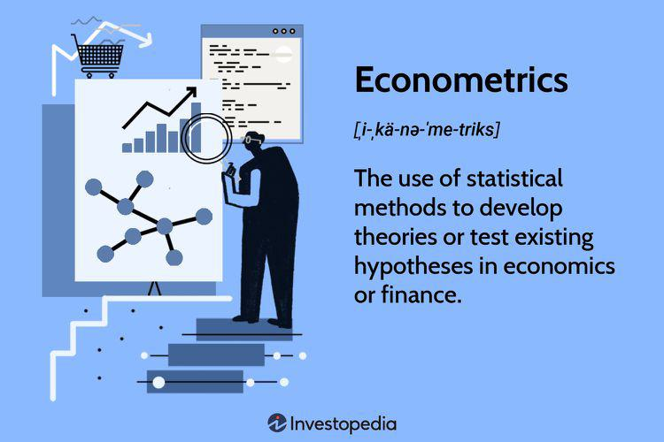

## Table of Contents

## What is an econometrician?

An econometrician is someone who uses math and statistics to study the economy. They look at numbers and data to understand how the economy works and to make predictions about it. Econometricians use special computer programs to help them analyze this data and create models of economic behavior.

Econometricians work in many different places, like universities, banks, and government agencies. They help businesses and governments make decisions by giving them information about the economy. For example, they might predict how a new law will affect the economy or how prices might change in the future.

## What education is required to become an econometrician?

To become an econometrician, you usually need to go to college and study for a long time. Most econometricians have at least a bachelor's degree in economics, statistics, or a related field. In college, you will learn about math, statistics, and how the economy works. This will help you understand the basics of econometrics.

After getting a bachelor's degree, many econometricians go on to get a master's degree or even a Ph.D. These higher degrees help you learn more advanced math and [statistics](/wiki/bayesian-statistics), and how to use them to study the economy in detail. With a master's or Ph.D., you can do more complex research and get better jobs in places like universities, big companies, or government agencies.

So, to sum it up, becoming an econometrician takes a lot of education. You start with a bachelor's degree and then often continue with a master's or Ph.D. This education helps you learn the skills you need to analyze economic data and make predictions about the economy.

## What are the primary responsibilities of an econometrician?

An econometrician's main job is to use math and statistics to study the economy. They look at a lot of data, like numbers about how much people earn, how much things cost, and how many people are working. They use this data to understand what is happening in the economy and why. Econometricians use special computer programs to help them analyze this data. They create models that show how different parts of the economy are connected and how they might change in the future.

Another important part of an econometrician's job is to help others make decisions. They work with businesses, governments, and other organizations to give them information about the economy. For example, they might predict how a new law will affect prices or how many jobs might be created in the future. Econometricians write reports and give presentations to explain their findings. This helps leaders make smart choices about things like taxes, spending, and investments.

## How do econometricians use statistical methods in their work?

Econometricians use statistical methods to understand and predict how the economy works. They collect a lot of data, like numbers about how much people earn, how much things cost, and how many people are working. They use this data to find patterns and relationships. For example, they might look at how changes in interest rates affect how much people spend. They use special computer programs to help them analyze this data. These programs help them do things like regression analysis, which shows how one thing in the economy affects another.

After analyzing the data, econometricians create models of the economy. These models are like maps that show how different parts of the economy are connected. They use these models to make predictions about what might happen in the future. For example, they might predict how a new law will change prices or how many jobs will be created. Econometricians also use statistical methods to test their models and see if they are accurate. This helps them make sure their predictions are as good as possible.

## What tools and software do econometricians commonly use?

Econometricians use a lot of different tools and software to help them study the economy. One of the most common tools they use is statistical software like Stata, R, and SAS. These programs help them analyze big sets of data and do things like regression analysis, which shows how one thing in the economy affects another. Econometricians also use spreadsheet software like Microsoft Excel to organize and look at their data.

Another important tool for econometricians is programming languages like Python and MATLAB. These languages let them write their own code to do special kinds of analysis that the other software might not be able to do. They can use these languages to build and test their economic models. Econometricians also use databases like SQL to store and manage their data, making it easier to find and use the information they need.

In addition to these technical tools, econometricians often use specialized software for creating charts and graphs, like Tableau or ggplot2 in R. These tools help them show their findings in a way that is easy for others to understand. By using all these tools together, econometricians can do their research, make predictions about the economy, and share their results with others.

## What industries employ econometricians?

Econometricians work in many different industries. One of the main places they work is in universities and research institutions. Here, they study the economy and teach students about econometrics. They also write papers and share their findings with other researchers. Another big industry that hires econometricians is finance. Banks, investment firms, and insurance companies use econometricians to predict how the economy will change and how it will affect their business. They help these companies make smart decisions about things like loans, investments, and insurance policies.

Government agencies also employ a lot of econometricians. They work for departments like the Treasury, the Federal Reserve, and other economic policy groups. In these jobs, econometricians help the government understand the economy and make decisions about taxes, spending, and other policies. They use their skills to predict how new laws and policies will affect the economy. Some econometricians also work for big companies in industries like manufacturing, retail, and technology. These companies use econometricians to help them understand the market and make plans for the future.

## How does an econometrician contribute to economic policy making?

An econometrician helps make economic policy by using math and statistics to study the economy. They look at a lot of data, like how much people earn, how much things cost, and how many people are working. They use this data to find patterns and understand how the economy works. Econometricians create models that show how different parts of the economy are connected. These models help them predict what might happen if the government changes a policy, like raising taxes or changing interest rates.

When the government is thinking about a new policy, econometricians can use their models to see how it might affect the economy. For example, they might predict how a new tax will change how much people spend or how many jobs will be created. They write reports and give presentations to explain their findings to policymakers. This helps the government make smart choices about things like taxes, spending, and investments. By giving clear information about what might happen, econometricians help the government create policies that are good for the economy.

## What is the difference between an econometrician and an economist?

An econometrician and an economist both study the economy, but they do it in different ways. An econometrician uses math and statistics to look at numbers and data about the economy. They use special computer programs to analyze this data and create models that show how different parts of the economy are connected. Econometricians often focus on making predictions about what might happen in the economy in the future. They help businesses and governments make decisions by giving them information based on their data analysis.

An economist, on the other hand, studies the economy more broadly. They look at how people, businesses, and governments make choices about things like spending, saving, and investing. Economists often focus on understanding why the economy works the way it does and how different policies might affect it. While econometricians use a lot of math and statistics, economists might use a wider range of methods, including theory and historical analysis. Both econometricians and economists are important for understanding the economy, but they approach their work in different ways.

## How do econometricians forecast economic trends?

Econometricians forecast economic trends by using math and statistics to look at a lot of data about the economy. They collect numbers on things like how much people earn, how much things cost, and how many people are working. Then, they use special computer programs to analyze this data. These programs help them find patterns and see how different parts of the economy are connected. For example, they might look at how changes in interest rates affect how much people spend. By studying these patterns, econometricians can make models that show what might happen in the economy in the future.

Once they have their models, econometricians use them to make predictions about economic trends. They can predict things like how a new law might change prices or how many jobs might be created in the future. They test their models to make sure they are accurate. If a new policy is being considered, econometricians can use their models to see how it might affect the economy. They write reports and give presentations to share their predictions with businesses and governments. This helps leaders make smart choices about things like taxes, spending, and investments.

## What are some advanced econometric techniques used by experts?

Econometricians use advanced techniques like time series analysis to understand how the economy changes over time. They look at data from the past to see patterns and predict what might happen in the future. For example, they might use something called ARIMA models to forecast things like inflation rates or stock prices. Another technique is panel data analysis, which lets them study data from different groups, like different countries or companies, over time. This helps them understand how changes in one group might affect others. These methods help econometricians make more accurate predictions about the economy.

Another advanced technique is instrumental variables (IV) analysis, which helps econometricians deal with problems like reverse causality. This means they can figure out if one thing really causes another, even if it's hard to tell from the data. For example, they might use IV analysis to see if education really leads to higher earnings, or if it's the other way around. Econometricians also use techniques like vector autoregression (VAR) to study how different parts of the economy affect each other. These advanced methods help econometricians get a better understanding of the economy and make more reliable predictions.

## How do econometricians handle data quality and reliability issues?

Econometricians handle data quality and reliability issues by first checking where their data comes from. They make sure the data is from good sources, like official government reports or trusted research groups. If the data seems off, they might look for other sources to compare it with. They also clean the data, which means they fix any mistakes or missing parts. This helps make sure the numbers they use are as correct as possible.

Another way econometricians deal with data quality is by using special methods to test how reliable their data is. They might use something called robustness checks to see if their results stay the same even when they change parts of their analysis. If the results are still the same, they can feel more sure about their findings. Econometricians also use sensitivity analysis to see how small changes in the data might affect their predictions. By doing all these things, they can make better and more trustworthy predictions about the economy.

## What are the current challenges and future directions in the field of econometrics?

Econometricians face many challenges today. One big challenge is dealing with big data. There is so much information out there now, and it can be hard to sort through it all and make sense of it. Another challenge is making sure their models are good enough to predict things accurately. Sometimes, the economy can change in ways that are hard to predict, and this can make their models less useful. Also, econometricians need to keep up with new technology and methods, which can be tough because things change so quickly.

In the future, econometricians will need to find new ways to handle these challenges. They might use [machine learning](/wiki/machine-learning) and [artificial intelligence](/wiki/ai-artificial-intelligence) to help them analyze big data better. These new tools could make their predictions more accurate. Econometricians will also need to work on making their models more flexible, so they can adapt to unexpected changes in the economy. By doing these things, econometricians can keep improving their understanding of the economy and help make better decisions about things like taxes, spending, and investments.

## What is the relationship between Economic Analysis and Econometrics?

Economic analysis systematically uses quantitative data to comprehend economic phenomena, with econometrics providing essential tools to achieve this. Econometric methods, particularly regression analysis and time-series models, empower economists to decipher complex data and make predictions about economic outcomes.

Regression analysis serves as a fundamental econometric technique, facilitating the exploration of relationships between variables. By modeling the relationship between a dependent variable and one or more independent variables, economists can delineate trends and measure the impact of changes in explanatory variables on the outcome of interest. The basic linear regression model is expressed as:

$$
Y = \beta_0 + \beta_1X_1 + \beta_2X_2 + \ldots + \beta_nX_n + \epsilon
$$

Where:
- $Y$ is the dependent variable,
- $\beta_0, \beta_1, \ldots, \beta_n$ are the coefficients of the model,
- $X_1, X_2, \ldots, X_n$ are the independent variables,
- $\epsilon$ is the error term.

This methodology is instrumental in understanding consumer behavior, assessing policy impacts, and forecasting market trends. For instance, by analyzing consumption data against variables such as income and prices, econometricians can predict consumer spending patterns and their potential responses to fiscal policy changes.

Time-series models, another cornerstone of econometrics, analyze data collected over time to identify underlying trends and patterns. These models are crucial for predicting future economic indicators based on historical data. The Autoregressive Integrated Moving Average (ARIMA) model is commonly used, which is generally represented as ARIMA(p, d, q), where:
- $p$ is the number of lag observations included in the model (autoregressive part),
- $d$ is the number of times that the raw observations are differenced (integrated part),
- $q$ is the size of the moving average window.

Time-series analysis is pivotal for understanding market dynamics and improving economic forecasts, thereby assisting in strategic decision-making across various sectors. For example, stock prices, interest rates, and GDP growth rates are often modeled using time-series techniques to predict their future movements.

The application of econometric methods enriches economic analysis by enhancing the interpretation of data and ensuring more informed decision-making. These tools allow economists to provide insights into market trends, consumer behavior, and the effects of economic policy, which are crucial for shaping strategy in diverse economic sectors. By employing these rigorous mathematical and statistical techniques, econometrics substantially contributes to the explanatory and predictive capabilities of economic analysis.

## What role does econometrics play in algorithmic trading?

Algorithmic trading relies heavily on econometrics, a crucial component in the automation and optimization of trading strategies through quantitative data analysis. Econometric models, such as linear regression and time-series analysis, are indispensable tools for identifying market patterns and predicting price movements.

Linear regression models are used to understand the relationship between different variables, such as the price of a security and various economic indicators. The standard linear regression model can be represented mathematically as:

$$
Y = \beta_0 + \beta_1X_1 + \beta_2X_2 + \cdots + \beta_nX_n + \epsilon
$$

where $Y$ is the dependent variable (e.g., stock price), $X_1, X_2, \ldots, X_n$ are independent variables (e.g., economic indicators), $\beta_0, \beta_1, \ldots, \beta_n$ are the coefficients, and $\epsilon$ is the error term.

Time-series analysis, another pivotal econometric tool, is employed to model and forecast future values based on previously observed data points. Techniques such as ARIMA (AutoRegressive Integrated Moving Average) are commonly used. The general form of an ARIMA model is given by:

$$
ARIMA(p, d, q)
$$

where $p$ is the number of lag observations included in the model (autoregressive part), $d$ is the number of times that the raw observations are differenced (integrated part), and $q$ is the size of the moving average window.

These econometric models form the foundation of trading algorithms that adapt to market fluctuations and optimize trade execution. By employing sophisticated algorithms based on these models, traders can refine their decision-making processes, thereby enhancing strategy effectiveness.

The application of econometrics in trading has evolved significantly, offering competitive advantages to traders and firms. As technology and data analytics advance, econometric models are becoming more precise and adaptable, allowing for more nuanced insights into market behavior. This evolution empowers traders to execute more strategic trades with greater accuracy and efficiency, supporting sustained competitive success in fast-paced financial markets.

## References & Further Reading

- Hyndman, R. J., & Athanasopoulos, G. (2018). *Forecasting: Principles and Practice*. OTexts. This book provides a comprehensive introduction to forecasting methods and their practical applications. It's valuable for econometricians seeking to understand the principles behind accurate prediction models, often utilized in economic and financial data analysis.

- Tsay, R. S. (2010). *Analysis of Financial Time Series*. Wiley. Tsay's work is a crucial resource for understanding financial econometrics, offering insights into various time-series models and their use in analyzing financial data. It covers topics pertinent to econometricians involved in developing trading algorithms and risk management strategies.

- Hamilton, J. D. (1994). *Time Series Analysis*. Princeton University Press. A fundamental text on time series analysis, Hamilton’s book is essential for those engaged in econometrics. It investigates extensively into statistical methods for analyzing economic time series, which form the bedrock of many algorithmic trading models.

- Engle, R. F., & Granger, C. W. J. (1987). "Co-Integration and Error Correction: Representation, Estimation, and Testing." Econometrica, 55(2), 251–276. Engle and Granger's groundbreaking paper introduced concepts of co-integration and error correction, vital for ensuring model robustness in economic time series analysis, a critical factor in econometrics and trading strategies.

- Box, G. E., Jenkins, G. M., & Reinsel, G. C. (2008). *Time Series Analysis: Forecasting and Control*. Wiley. This text is foundational for understanding the Box-Jenkins methodology, pivotal for econometricians in modeling and forecasting economic data. It provides techniques essential for constructing reliable predictive algorithms in trading.

- Chan, E. (2009). *Quantitative Trading: How to Build Your Own Algorithmic Trading Business*. Wiley. Chan’s book serves as a practical guide for those aiming to develop algorithmic trading systems. It combines insights from econometrics and quantitative finance, offering strategies that econometricians can employ to transform statistical models into profitable trading actions.

