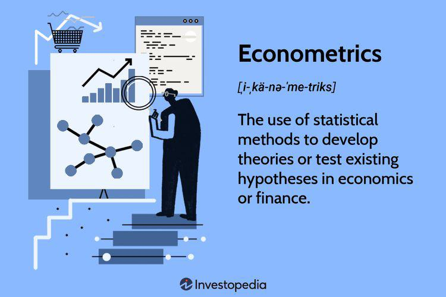

Econometric models are mathematical representations used to describe the relationships between economic variables. These models are essential tools in the field of econometrics, where they facilitate the understanding and quantification of economic phenomena. They employ statistical techniques to test hypotheses and forecast future trends, making them invaluable in both economic research and practical applications such as algorithmic trading.

The integration of econometric methods in algorithmic trading has revolutionized the decision-making process by providing a robust framework for analyzing vast amounts of financial data. These methods enhance the ability to make informed trading decisions by identifying patterns, assessing risk factors, and predicting market movements. By employing techniques such as linear regression, time-series analysis, and others, traders can optimize strategies and improve the predictive accuracy of their trading models.



This article explores the dynamic integration of econometric models with algorithmic trading systems. Focusing on this intersection, it provides insights into how econometrics can be utilized to develop sophisticated trading strategies and the ways it contributes to advanced market analysis. The exploration begins with an understanding of fundamental econometric methods and progresses into their specific applications within trading algorithms. Key concepts such as statistical arbitrage, high-frequency trading, and model backtesting are discussed in detail, highlighting their relevance and practicality in today's financial markets.

The article delves into several critical areas, including a detailed look at econometric methods used in trading, examples of these methodologies in action, and how algorithmic trading leverages these models to gain a competitive edge. Additionally, the article examines challenges associated with econometric modeling, such as data limitations, model risks, and the need for careful statistical validation. As the financial landscape continues to evolve, the role of econometrics in trading innovations remains vital, promising continued advancements in strategy development and market efficiency.

## Table of Contents

## Understanding Econometric Models

Econometric models are essential tools used in economic and financial analysis to quantify relationships between economic variables, test hypotheses, and forecast future trends. The primary goal is to bridge the gap between economic theory and real-world data, providing a quantitative foundation for understanding how different variables interact.

### Definition and Purpose

Econometric models are built on the integration of statistical techniques with economic theory. They serve multiple purposes, including estimating economic relationships, testing economic theories, and making forecasts. By modeling complex systems, econometricians can interpret how variables such as consumer spending, interest rates, and inflation interact, allowing for more informed decision-making in economics and finance.

### Key Concepts

1. **Statistical Techniques**: Econometric analysis relies heavily on statistical methods. Techniques such as linear regression are used to estimate the relationships between variables. Linear regression, for example, assumes a linear relationship between the dependent variable $Y$ and one or more independent variables $X$, expressed as $Y = \beta_0 + \beta_1X + \epsilon$, where $\epsilon$ is the error term.

2. **Hypothesis Testing**: Econometricians use hypothesis testing to evaluate economic theories. This involves formulating a null hypothesis, typically representing no effect or a baseline scenario, and an alternative hypothesis. The aim is to determine whether the evidence suggests rejecting the null hypothesis, based on statistical significance.

3. **Forecasting**: Econometric models are pivotal in forecasting future economic conditions. Time-series analysis, a key component, involves examining data points collected over time to model and predict future trends. Techniques such as ARIMA (AutoRegressive Integrated Moving Average) are frequently applied in this context.

### Historical Development

The field of econometrics has evolved significantly since its inception. Key pioneers such as Ragnar Frisch and Jan Tinbergen laid the groundwork in the early 20th century by formalizing the integration of statistical techniques with economic theory. They are also among the first recipients of the Nobel Prize in Economic Sciences for their work in this field. Over time, advancements in computing and statistical methods have expanded the frontier of econometric analysis, enabling more complex models and larger datasets.

### Applications in Real-World Scenarios

Econometric models are widely used across various sectors. In finance, they assist in asset pricing and risk management. For instance, the Capital Asset Pricing Model (CAPM) uses econometric methods to determine a theoretically appropriate required rate of return of an asset, helping investors make better financial decisions.

In policy-making, econometric models facilitate economic forecasting and policy evaluation. Governments and international organizations, like the IMF and World Bank, utilize these models to assess the potential impact of policy changes on economic indicators such as GDP, unemployment, and inflation.

Moreover, businesses use econometric models to optimize operations and forecast demand. For example, retailers analyze historical sales data to predict future product demand, informing inventory management and marketing strategies.

By quantifying relationships and enabling predictions with empirical data, econometric models provide a powerful framework for both understanding economic phenomena and informing strategic decisions.

## Econometric Methods in Trading

Econometric methods have become indispensable tools in modern trading, thanks to their ability to model and quantify financial markets' complexities. Linear regression, time-series analysis, Vector Autoregression (VAR), and Generalized Autoregressive Conditional Heteroskedasticity (GARCH) models are at the forefront of these methodologies, each offering unique insights and applications.

### Linear Regression

Linear regression is a foundational econometric technique used to model the relationship between a dependent variable and one or more independent variables. It assumes that the relationship between variables is linear, allowing traders to predict or explain a financial metric based on other related factors. For example, in trading, linear regression can be applied to construct predictive models for asset prices based on economic indicators or historical price data.

The linear regression model can be expressed as:
$$
Y = \beta_0 + \beta_1X_1 + \beta_2X_2 + ... + \beta_nX_n + \epsilon
$$
where $Y$ is the dependent variable, $\beta$ are the coefficients, $X$ are the independent variables, and $\epsilon$ is the error term.

### Time-Series Analysis

Time-series analysis is a statistical method that analyzes time-ordered data points, particularly useful in trading where the sequence of data matters. Common models used in time-series analysis include Autoregressive Integrated Moving Average (ARIMA) models, which capture autocorrelations in the data. These models forecast future values by using past values in the series, making them vital for anticipating market trends and price movements.

### Vector Autoregression (VAR)

VAR models are multivariate time-series models that capture the linear interdependencies among multiple time series. These are particularly useful in trading when examining the joint dynamics of several financial variables. For instance, VAR models can help assess the impact of changes in macroeconomic indicators on the stock market. A VAR model can be represented as:
$$
Y_t = A_1Y_{t-1} + A_2Y_{t-2} + ... + A_pY_{t-p} + \epsilon_t
$$
where $Y_t$ is a vector of time series variables, $A$ are matrices of coefficients, and $\epsilon_t$ is the vector of error terms.

### Generalized Autoregressive Conditional Heteroskedasticity (GARCH)

GARCH models are designed to address the [volatility](/wiki/volatility-trading-strategies) clustering observed in financial markets, where periods of high volatility are followed by periods of low volatility. These models are crucial for estimating and forecasting the changing volatility over time, which is essential for risk management and option pricing. A basic GARCH(1,1) model can be expressed as:
$$
\sigma_t^2 = \alpha_0 + \alpha_1\epsilon_{t-1}^2 + \beta_1\sigma_{t-1}^2
$$
where $\sigma^2$ is the variance of the error term at time $t$, and $\alpha$ and $\beta$ are parameters to be estimated.

### Case Studies and Examples

1. **Linear Regression in Portfolio Construction**: Traders use linear regression to evaluate factors that impact stock returns and construct optimized portfolios based on historical performance. For instance, the Capital Asset Pricing Model (CAPM), a form of linear regression, is used extensively to assess the risk versus return of an asset.

2. **Time-Series Analysis for Economic Indicators**: Traders apply ARIMA models to predict currency exchange rates by analyzing historical price data, enabling informed decisions in foreign exchange markets.

3. **VAR Models in Macroeconomic Analysis**: VAR models have been applied to study the effect of interest rate changes on equity markets. These models help in understanding how macroeconomic shocks propagate across different assets.

4. **GARCH Models for Volatility Forecasting**: In high-frequency trading, GARCH models are instrumental in predicting volatility spikes, thus allowing traders to devise strategies that capitalize on anticipated market movements.

These econometric methods form the backbone of [quantitative trading](/wiki/quantitative-trading) strategies, enabling traders to extract actionable insights from complex and dynamic financial data. Their application across various domains of trading underscores their vital role in advancing [algorithmic trading](/wiki/algorithmic-trading) techniques.

## Algorithmic Trading and Econometrics

Algorithmic trading refers to the use of computer algorithms to automate trading activities, replacing or supplementing human decision-making. Key components of algorithmic trading include data acquisition, signal generation, risk management, and execution mechanisms. These components work together to analyze market data, identify trading opportunities, execute trades, and manage risk effectively in a fast-paced trading environment.

Econometric models play a critical role in enhancing predictive accuracy within algorithmic trading. Econometric models leverage statistical and mathematical techniques to identify relationships between financial variables, assess their significance, and utilize these insights for prediction. For instance, linear regression models can be employed to predict asset prices based on various economic indicators, while time-series models can forecast future price movements based on historical data. Such predictive capabilities are invaluable for algorithmic systems that rely on timely and accurate forecasts to execute trades profitably.

The integration of econometric models into strategy development and [backtesting](/wiki/backtesting) is crucial in designing robust algorithmic trading strategies. By employing econometric models during the strategy development phase, traders can quantify relationships between market factors and refine their strategies accordingly. Backtesting, an essential component of strategy evaluation, benefits from econometric models as they offer statistical rigor in assessing the past performance of trading strategies under different market conditions. This facilitates the identification of strategies that are not only theoretically viable but also historically profitable and resilient to various market dynamics.

High-frequency trading ([HFT](/wiki/high-frequency-trading-strategies)) and statistical [arbitrage](/wiki/arbitrage) represent advanced forms of algorithmic trading where econometric models are particularly significant. HFT involves executing a large number of trades at extremely high speeds, often capitalizing on minute price discrepancies. Due to the speed and frequency of trades, econometric models are employed to generate rapid and reliable predictions that guide trading decisions in real-time. Statistical arbitrage, on the other hand, involves simultaneously entering into long and short positions in correlated financial instruments to exploit pricing inefficiencies. Econometric techniques like cointegration analysis help in determining these relationships and identifying profitable arbitrage opportunities.

In conclusion, the synergy between algorithmic trading and econometric models forms the backbone of modern quantitative trading practices. The integration of econometric techniques not only enhances predictive accuracy but also contributes to the development and validation of sophisticated trading strategies. With the evolution of financial markets and technology, econometric models will continue to be central to achieving trading efficiency and profitability.

## Applications of Econometric Models in Algo Trading

Econometric models hold significant promise in enhancing prediction and risk management within algorithmic trading. By leveraging statistical and mathematical techniques, these models can process a large range of data to predict market movements, price trends, and potential risks with higher accuracy than traditional methods. This leads to better-informed strategy development and execution, enabling traders to respond swiftly to market changes.

Incorporating econometric models reduces costs and facilitates high-speed execution, crucial in today’s fast-paced trading environments. Econometric analysis aids in optimizing algorithms to execute trades more efficiently, minimizing transaction costs, and improving asset [liquidity](/wiki/liquidity-risk-premium). The automation provided by econometrics allows traders to focus more on strategy refinement and monitoring, rather than manual calculations and data analysis.

**Case Studies**

1. **High-Frequency Trading (HFT):** Econometric models are pivotal in HFT, wherein large volumes of transactions are executed in fractions of a second. Models such as Autoregressive Integrated Moving Average (ARIMA) are used to forecast short-term price movements. For instance, ARIMA can model a time series of price data to predict future prices, allowing HFT algorithms to place orders ahead of the competition. 

   ```python
   import pandas as pd
   from statsmodels.tsa.arima.model import ARIMA

   # Example data: historical stock prices
   data = pd.read_csv('stock_prices.csv', parse_dates=True, index_col='Date')
   model = ARIMA(data['Close'], order=(5, 1, 0))
   model_fit = model.fit()
   forecast = model_fit.forecast(steps=5)
   ```

   In this Python code, we use the ARIMA model to fit historical stock prices and forecast the next five data points, demonstrating its role in anticipating market movements.

2. **Portfolio Optimization:** In portfolio optimization, econometric models like the Vector Autoregression (VAR) model are used for analyzing interdependencies among multiple financial time series. VAR can predict the impact of macroeconomic variables on a portfolio's components, aiding in constructing portfolios that maximize returns while minimizing risks.

   Econometric-based optimization often involves Markowitz's mean-variance optimization, which balances expected return against the variance of portfolio returns. The efficient frontier can be calculated and visualized to aid investment decisions. 

   ```python
   import numpy as np
   import matplotlib.pyplot as plt
   from pypfopt import EfficientFrontier, risk_models, expected_returns

   # Example data: historical asset prices
   prices = pd.read_csv('asset_prices.csv', parse_dates=True, index_col='Date')
   mu = expected_returns.mean_historical_return(prices)
   S = risk_models.sample_cov(prices)
   ef = EfficientFrontier(mu, S)
   weights = ef.max_sharpe()
   cleaned_weights = ef.clean_weights()
   ef.portfolio_performance(verbose=True)
   ```

   Here, we apply the PyPortfolioOpt library to determine the efficient frontier, guiding the allocation of assets in a portfolio for optimal risk-return trade-offs.

In summary, econometric models significantly enhance algorithmic trading through precise predictions and efficient execution, while also offering frameworks for sophisticated risk management and portfolio optimization strategies. By integrating these models, traders can achieve cost-effective and data-driven trading insights, essential in today's highly competitive financial markets.

## Challenges and Limitations

Econometric models, while powerful tools in algorithmic trading, present several challenges and limitations that practitioners must navigate to effectively apply them. 

Data quality and availability constitute primary hurdles. Algorithmic trading relies on vast amounts of historical and real-time data to develop and validate econometric models. Inaccurate or incomplete data can lead to misleading results and potentially costly trading decisions. Financial markets produce various types of data, including tick-by-tick price movements, trading volumes, and macroeconomic indicators, which vary in frequency and quality. Data cleaning and preprocessing are critical steps to ensure consistency and reliability before utilizing such data in econometric models. Moreover, access to high-quality, high-frequency data can often be expensive, posing a barrier for smaller firms or individual traders.

Model risk and overfitting are significant concerns when employing econometric models. Overfitting occurs when a model is excessively complex, capturing noise rather than the underlying market patterns, thus leading to poor out-of-sample performance. To mitigate this risk, practitioners must balance model complexity with predictive accuracy. Techniques such as cross-validation, regularization methods (e.g., Lasso, Ridge regression), and Bayesian model selection can help reduce overfitting by penalizing excessive complexity or selecting the most robust model from multiple candidates. It is also crucial to conduct thorough out-of-sample testing to assess model performance under unseen data conditions.

Non-stationarity and market dynamics further complicate the deployment of econometric models in trading. Financial time series often exhibit non-stationary behavior, meaning their statistical properties, such as mean and variance, change over time in response to economic events, policy changes, or market sentiment. This non-stationarity can undermine model assumptions and affect the stability and reliability of econometric estimates. Techniques such as differencing, transformation to logarithmic scales, or cointegration methods in vector autoregression (VAR) models may help address non-stationarity. Market dynamics, characterized by sudden shifts in volatility, liquidity, or correlations among assets, necessitate continuous model recalibration and adaptation to ensure that models remain relevant and effective. 

In summary, while econometric models offer substantial benefits in algorithmic trading through enhanced predictive capabilities and improved decision-making, it is essential to address these challenges systematically. Reliable data sourcing, model validation, and adaptability to market conditions are crucial to harness the power of econometrics effectively.

## Conclusion

The integration of econometric models into algorithmic trading offers numerous advantages, significantly enhancing trading strategies' precision and efficacy. Econometric techniques enable greater predictive accuracy, allowing traders to analyze financial data and respond to market movements with increased confidence. This methodology supports the design of robust trading algorithms by employing statistical models that capture and quantify complex relationships within financial markets.

A crucial benefit of using econometric models in trading is the ability to test hypotheses and validate trading strategies through rigorous data analysis. Model validation demands careful consideration, employing historical data to verify model performance and ensure reliability. This process helps identify and mitigate risks such as overfitting, where a model performs well on historical data but fails to generalize to unseen market environments.

Despite the clear benefits, a significant effort must be devoted to careful analysis to handle challenges like non-stationary data and model risk. Incorporating techniques like cross-validation and regularization can enhance model robustness, allowing for adaptive strategies that adjust to evolving market conditions. This leads to achieving a balance between model complexity and predictive accuracy.

The future of econometrics in trading innovations promises further advancements in [machine learning](/wiki/machine-learning) and data analytics, which could lead to more sophisticated models capable of handling large datasets and complex market dynamics. As technology progresses, econometric models' integration with algorithmic trading systems is likely to expand, facilitating more informed decision-making and automated trading processes.

In summary, while econometric models have established a formidable presence in algorithmic trading, continual innovation and validation techniques promise to refine and expand their applications, driving new frontiers in trading strategy development.

## References & Further Reading

[1]: Christoffersen, P. F. (2003). ["Elements of Financial Risk Management."](https://www.sciencedirect.com/book/9780123744487/elements-of-financial-risk-management) Academic Press.

[2]: Engle, R. F., & Granger, C. W. J. (1987). ["Co-integration and error correction: Representation, estimation, and testing."](https://www.jstor.org/stable/1913236) Econometrica, 55(2), 251-276.

[3]: Hamilton, J. D. (1994). ["Time Series Analysis."](https://press.princeton.edu/books/hardcover/9780691042893/time-series-analysis) Princeton University Press.

[4]: Tsay, R. S. (2010). ["Analysis of Financial Time Series."](https://onlinelibrary.wiley.com/doi/book/10.1002/9780470644560) John Wiley & Sons.

[5]: Campbell, J. Y., Lo, A. W., & MacKinlay, A. C. (1997). ["The Econometrics of Financial Markets."](https://press.princeton.edu/books/hardcover/9780691043012/the-econometrics-of-financial-markets) Princeton University Press.

[6]: Tsay, R. S. (2005). ["Multivariate Time Series Analysis: With R and Financial Applications."](https://faculty.chicagobooth.edu/ruey-s-tsay/research/multivariate-time-series-analysis-with-r-and-financial-applications) John Wiley & Sons. 

[7]: Lopez de Prado, M. (2018). ["Advances in Financial Machine Learning."](https://www.amazon.com/Advances-Financial-Machine-Learning-Marcos/dp/1119482089) Wiley.