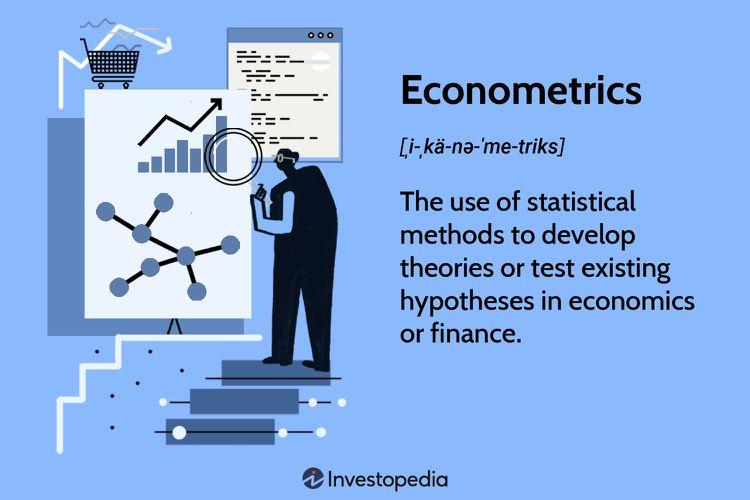

Econometrics provides a critical toolkit for algorithmic trading, offering quantitative methods to dissect complex financial data and predict market behaviors. This discipline combines statistical techniques with economic theories to construct models that help traders make informed decisions in a dynamic market environment. Algorithmic trading benefits significantly from econometrics as it allows for the formulation of data-driven strategies and helps in discovering patterns that are not readily apparent.

In this article, we will explore the powerful econometrics toolbox and its vital role in enhancing the efficacy of algorithmic trading strategies. We will discuss key econometric models, such as those used in time-series analysis and regression, and their crucial applications in the trading context. Econometrics not only aids in strategy formulation but also in understanding and quantifying market behaviors, making it indispensable for traders seeking to optimize their algorithms and improve performance.



Furthermore, we will highlight the capabilities of MATLAB and WFAToolbox, two pivotal platforms that support the application of econometrics in trading. These tools provide an integrated environment for developing, testing, and refining trading algorithms, offering comprehensive functions for model specification, estimation, and hypothesis testing. As we dive into this discussion, our focus will be on illustrating how these platforms enhance traders' ability to implement econometric approaches effectively, ultimately driving better decision-making processes in trading.

## Table of Contents

## Understanding Econometrics in Algo Trading

Econometrics applies statistical methods to economic data, providing a quantitative framework crucial for [algorithmic trading](/wiki/algorithmic-trading). This field equips traders with tools to interpret market behaviors and develop data-driven trading strategies. By integrating economic theory with statistical processes, econometrics offers a systematic approach for analyzing financial data, thus facilitating informed decision-making.

One of the fundamental concepts in econometrics is time-series analysis. This technique examines historical market data to predict future price movements and [volatility](/wiki/volatility-trading-strategies), allowing traders to capitalize on trends. Time-series models, such as the Autoregressive Integrated Moving Average (ARIMA) and Generalized Autoregressive Conditional Heteroskedasticity (GARCH), are extensively used to model the dynamic nature of financial markets. These models help in understanding the temporal dependencies and volatility clustering in asset prices.

Regression models are another critical component, as they identify relationships between different market variables. By estimating the parameters of these models, traders can infer causality and test hypotheses regarding market behaviors. For instance, a simple linear regression model can be represented as:

$$
Y = \beta_0 + \beta_1X + \epsilon
$$

where $Y$ is the dependent variable, $X$ is the independent variable, $\beta_0$ and $\beta_1$ are the coefficients, and $\epsilon$ is the error term. This regression line helps in predicting future outcomes and establishing a baseline for strategic decisions.

Volatility modeling is also pivotal in econometric analysis, as it measures the degree of variation in market prices. Understanding volatility is essential for risk assessment and the formulation of hedging strategies. Models like GARCH provide insights into the volatility structure, enabling more accurate predictions of future price fluctuations and aiding in optimal trading executions.

Econometrics enhances decision-making by offering evidence-based insights, reducing uncertainty, and potentially increasing profitability. By quantifying market patterns and relationships, traders can construct strategies that align more closely with their risk tolerance and investment goals. This evidence-based approach leads to more confident and structured trading strategies, ultimately contributing to a higher likelihood of success in the challenging landscape of financial markets.

## Core Econometric Models Used in Algo Trading

Econometric models are integral to algorithmic trading, providing essential tools for analyzing market data and developing predictive models. Key among these models are time-series analysis, regression models, and cointegration analysis, each serving distinct functions in the trading landscape.

### Time-Series Analysis

Time-series analysis plays a crucial role in algorithmic trading by utilizing historical data to forecast future price movements and volatility. It helps traders understand patterns and trends over time, improving decision-making. Two prominent models used in this category are the ARIMA (AutoRegressive Integrated Moving Average) and GARCH (Generalized Autoregressive Conditional Heteroskedasticity) models.

#### ARIMA Model

The ARIMA model is fundamental for understanding and predicting future market behavior. It combines autoregression, integration, and moving average components to capture different aspects of time-series data. The general form of an ARIMA model is denoted as ARIMA(p, d, q), where:

- **p**: Number of lag observations in the model (lag order).
- **d**: Number of times that the raw observations are differenced (degree of differencing).
- **q**: Size of the moving average window.

The model equation can be expressed as:

$$

Y_t = c + \phi_1 Y_{t-1} + \phi_2 Y_{t-2} + \ldots + \phi_p Y_{t-p} + \epsilon_t + \theta_1 \epsilon_{t-1} + \theta_2 \epsilon_{t-2} + \ldots + \theta_q \epsilon_{t-q} 
$$

where $Y_t$ is the forecasted variable, $c$ is a constant, $\phi$ represents the autoregressive parameters, and $\theta$ represents the moving average parameters.

#### GARCH Model

The GARCH model is particularly useful for modeling financial time series that exhibit volatility clustering, where periods of swings are succeeded by periods of relative calm. The GARCH(p, q) model extends the autoregressive conditional heteroskedasticity (ARCH) model by including lagged terms of variance:

$$

\sigma_t^2 = \alpha_0 + \alpha_1 \epsilon_{t-1}^2 + \ldots + \alpha_q \epsilon_{t-q}^2 + \beta_1 \sigma_{t-1}^2 + \ldots + \beta_p \sigma_{t-p}^2 
$$

where $\sigma_t^2$ is the conditional variance, and $\alpha,$ $\beta$ are the coefficients.

### Regression Models

Regression models are indispensable for unveiling relationships between market variables. By examining how one variable affects another, these models aid traders in understanding and predicting market dynamics. Linear regression, for instance, fits a line through data points to best predict a dependent variable $Y$ based on one or more independent variables $X$:

$$

Y = \beta_0 + \beta_1 X_1 + \beta_2 X_2 + \ldots + \epsilon 
$$

Here, $\beta_0$ is the intercept, $\beta_1, \beta_2,$ etc., are the coefficients representing the relationship strength between $X$ variables and $Y$, and $\epsilon$ is the error term.

### Cointegration Analysis

Cointegration analysis is crucial for detecting long-term equilibrium relationships between two or more market variables, which may individually be non-stationary. This technique is vital in trading strategies based on pairs trading, where two securities are traded simultaneously to exploit the mean-reverting behavior of their price spread.

By employing the Johansen test or the Engle-Granger two-step method, traders can identify and evaluate these cointegrated relationships, crafting strategies that capitalize on temporary divergences in price.

In summary, these core econometric models provide algorithmic traders with powerful tools to dissect market dynamics, enabling the development of predictive and profitable trading strategies.

## Leveraging MATLAB for Econometrics in Trading

MATLAB provides a comprehensive environment for developing and implementing complex econometric models essential for algorithmic trading. It offers a robust suite of tools that streamline the process of quantitative analysis, model development, and strategy testing.

### WFAToolbox and Walk-forward Analysis

WFAToolbox integrates seamlessly with MATLAB, serving as a powerful utility for walk-forward analysis and [backtesting](/wiki/backtesting) of trading strategies. Walk-forward analysis is an iterative process of optimizing a trading strategy on historical data and testing it on a forward period, which helps identify robust strategies that perform well under different market conditions. This method is crucial for validating the effectiveness of econometric models in real market scenarios.

### Econometrics Toolbox

The Econometrics Toolbox in MATLAB provides an extensive array of functions designed to facilitate model specification, estimation, and hypothesis testing, which are fundamental to econometric analysis. It supports various advanced econometric methods, including:

- **Time-series Analysis**: Functions such as `arima` for Autoregressive Integrated Moving Average models and `garch` for Generalized Autoregressive Conditional Heteroskedasticity models allow traders to model and forecast market behavior effectively.

- **Regression Analysis**: MATLAB offers tools for both linear and non-linear regression, enabling a thorough exploration of relationships between market variables. This includes methods like Ordinary Least Squares (OLS) and Weighted Least Squares (WLS) for estimating the parameters of regression models.

- **Volatility Modeling**: With functions specifically designed for Arch/Garch and stochastic volatility models, traders can model and forecast market risk and volatility accurately.

### Utilization of Machine Learning and Neural Networks

MATLAB also supports a broad spectrum of [machine learning](/wiki/machine-learning) and [neural network](/wiki/neural-network) capabilities, which can be leveraged to enhance econometric models in algorithmic trading. By utilizing functions from its Machine Learning and Deep Learning Toolboxes, traders can develop models that learn from historical data and adapt to new information.

For example, MATLAB provides functions for supervised learning, such as classification and regression trees (via `classregtree` or `fitctree`), and unsupervised learning methods like clustering. These tools are pivotal for identifying patterns and making predictions based on complex datasets.

Neural networks can be applied to understand non-linear relationships in market data better. MATLAB simplifies the creation and training of artificial neural networks through its Neural Network Toolbox, which supports [deep learning](/wiki/deep-learning) frameworks for developing sophisticated trading algorithms.

Overall, MATLAB equips traders with the advanced tools needed to build, test, and refine algorithmic trading strategies, integrating the latest econometric and machine learning techniques to optimize decision-making processes.

## Case Studies and Applications

Practical applications of econometric models in real-world trading scenarios demonstrate their effectiveness and versatility. A prominent example is the use of walk-forward analysis, which provides a strategic framework for backtesting and refining trading strategies over time. This iterative process tests a trading model on out-of-sample data and continuously recalibrates it, thereby improving its predictive capabilities.

Walk-forward analysis with MATLAB allows traders to test a strategy's robustness by dividing the data into multiple sub-samples or "walks." Each walk consists of an in-sample period for parameter estimation and an out-of-sample period for validation. MATLAB's computational efficiency and sophisticated econometric functions make it particularly suited for implementing walk-forward analysis. For instance, a trader might use MATLAB to develop an ARIMA (AutoRegressive Integrated Moving Average) model on historical data, adjusting parameters with each iteration to optimize performance.

The success of econometric models in trading is further supported by documented trader experiences. Many traders have reported significant improvements in strategy performance after adopting econometrics-based models. For example, regression analysis can identify causal relationships between market variables, allowing traders to hedge risks more effectively. Cointegration analysis is another technique that traders utilize to exploit long-term equilibrium relationships among securities, enhancing portfolio diversification and stability.

Moreover, the application of GARCH (Generalized Autoregressive Conditional Heteroskedasticity) models helps traders to model and forecast volatility, a critical [factor](/wiki/factor-investing) in managing financial uncertainty. By accurately predicting periods of high volatility, traders can adjust their positions to minimize potential losses while maximizing gains.

Overall, the integration of econometric models like ARIMA, GARCH, and cointegration analysis into algorithmic trading platforms such as MATLAB equips traders with powerful tools for strategy testing and refinement. Documented cases of trader successes underscore the practical utility of these models, confirming the value of econometrics in enhancing trading performance.

## Challenges and Considerations

Econometric models are an essential tool in algorithmic trading, yet they are not without their challenges and considerations. One significant limitation is their sensitivity to market volatility and external factors. Financial markets are influenced by a myriad of unpredictable elements such as geopolitical events, economic policy changes, and sudden market sentiment shifts, all of which can lead to volatile price swings. These factors can reduce the predictive power of econometric models, which typically rely on historical data under relatively stable conditions to generate forecasts.

Another critical aspect is the necessity for continuous model tuning and data quality assessment. Maintaining the efficacy of econometric models requires regular updates and adjustments, which involves re-estimating model parameters as new data becomes available. Moreover, the quality of input data plays a crucial role; improper or outdated data can lead to inaccurate forecasts and suboptimal trading decisions. Ensuring the integrity and timeliness of the data feeds into these models is paramount for sustaining their relevance and accuracy.

Backtesting is vital for assessing the robustness of econometric models. It involves simulating a model's performance on historical data to evaluate its predictive capacity before deploying it in real-world trading. This practice helps identify potential weaknesses and biases inherent in the model, such as overfitting—where the model fits historical data too closely and fails to generalize to unseen data. By thoroughly backtesting, traders can better understand how their models might behave under different market conditions and refine them to improve performance.

## Future Trends in Econometrics and Algo Trading

The landscape of econometrics in algorithmic trading is rapidly evolving, primarily due to the integration of machine learning (ML) and [artificial intelligence](/wiki/ai-artificial-intelligence) (AI). These technologies are enhancing econometric models by adding layers of complexity and adaptability that were previously unattainable. Machine learning algorithms, such as decision trees, support vector machines, and neural networks, are particularly useful for capturing non-linear patterns and anomalies in financial markets, which traditional econometric models might overlook.

One key trend is the adoption of hybrid models that blend econometric techniques with machine learning algorithms. For instance, an econometric model might first identify general market trends, which are then refined using machine learning to account for more nuanced and complex patterns. This approach not only improves the accuracy of predictions but also enhances model robustness. 

Big data is another transformative factor in this domain. Financial markets generate vast amounts of data every second, including prices, trading volumes, and news. The capability to process and analyze these data streams in real time is crucial for effective algorithmic trading. Enhanced computational power and advanced storage solutions like distributed databases enable the handling of large datasets, facilitating more comprehensive analyses. Leveraging big data with econometric models allows for the consideration of a broader range of variables and more granular insights into market dynamics.

Python libraries such as Pandas, NumPy, and scikit-learn are extensively used for data manipulation and machine learning tasks, providing traders with powerful tools to transform raw data into actionable insights. A simple example demonstrating the use of Python for a linear regression model might look like this:

```python
import pandas as pd
import numpy as np
from sklearn.linear_model import LinearRegression

# Sample data
data = {'price': [100, 102, 104, 108, 110],
        'volume': [200, 220, 210, 230, 240]}
df = pd.DataFrame(data)

# Defining independent and dependent variables
X = df['[volume](/wiki/volume-trading-strategy)'].values.reshape(-1, 1)
y = df['price']

# Linear regression model
model = LinearRegression()
model.fit(X, y)

# Predicting future prices
future_volume = np.array([[250]])
predicted_price = model.predict(future_volume)
print(predicted_price)
```

The future of econometrics in trading is also being shaped by increasing computational power. Modern processors, GPUs, and cloud computing services have dramatically reduced the computational time required for complex model simulations and optimizations. These advances allow traders to execute real-time strategies and perform backtests over extensive historical datasets more efficiently.

Expectations for future advancements include the ongoing refinement of econometric models through integration with AI technologies, enabling more sophisticated risk management and strategy development. As algorithms become more adept at self-learning from vast datasets, the boundary between econometrics and machine learning will continue to blur, ushering in a new era for algorithmic trading. Furthermore, the integration of these technologies into automated trading systems promises to enhance their adaptability and efficiency, setting new standards for trading success. Expect significant improvements in predictive accuracy and the ability to respond swiftly to market changes, making the combined use of econometrics and AI indispensable in the financial trading industry.

## Conclusion

Econometrics provides the essential framework for developing robust algorithmic trading strategies by equipping traders with the tools necessary to analyze complex financial data quantitatively. The statistical and mathematical models inherent in econometrics, such as time-series analysis, regression models, and volatility modeling, offer powerful means to interpret market dynamics and forecast future trends. This predictive capability is crucial for constructing data-driven strategies that can respond effectively to the volatile nature of financial markets.

As technology continues to advance, the integration of econometrics with machine learning is anticipated to play an increasingly significant role in trading. Machine learning enhances econometric models by offering sophisticated techniques for pattern recognition, anomaly detection, and prediction in large datasets, thereby improving the accuracy and reliability of trading strategies. This synergy between econometrics and machine learning allows for more adaptive and intelligent trading systems that can efficiently process vast amounts of financial data.

MATLAB, combined with tools such as WFAToolbox, provides traders with a powerful environment for implementing and testing econometric models. MATLAB's Econometrics Toolbox offers a comprehensive suite of functions for model specification, estimation, and hypothesis testing, thus streamlining the development process. WFAToolbox complements this by allowing for walk-forward analysis and backtesting, essential for strategy refinement and validation. By leveraging these tools, traders can harness the full potential of econometric models, ensuring informed decision-making and enhanced strategy performance in algorithmic trading.

## References & Further Reading

[1]: Bergstra, J., Bardenet, R., Bengio, Y., & Kégl, B. (2011). ["Algorithms for Hyper-Parameter Optimization."](https://papers.nips.cc/paper/4443-algorithms-for-hyper-parameter-optimization) Advances in Neural Information Processing Systems 24.

[2]: ["Advances in Financial Machine Learning"](https://www.amazon.com/Advances-Financial-Machine-Learning-Marcos/dp/1119482089) by Marcos Lopez de Prado

[3]: ["Evidence-Based Technical Analysis: Applying the Scientific Method and Statistical Inference to Trading Signals"](https://www.amazon.com/Evidence-Based-Technical-Analysis-Scientific-Statistical/dp/0470008741) by David Aronson

[4]: ["Machine Learning for Algorithmic Trading"](https://github.com/stefan-jansen/machine-learning-for-trading) by Stefan Jansen

[5]: ["Quantitative Trading: How to Build Your Own Algorithmic Trading Business"](https://books.google.com/books/about/Quantitative_Trading.html?id=j70yEAAAQBAJ) by Ernest P. Chan