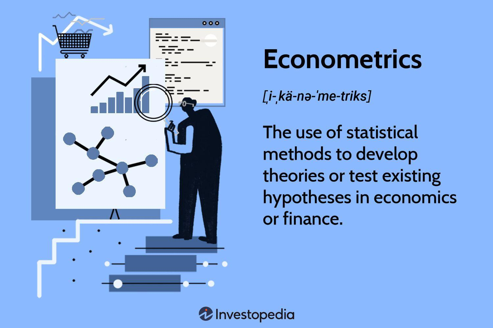

Algorithmic trading, the use of computer algorithms to automate trading processes, has become a dominant force in modern financial markets. This transformation is significantly driven by the integration of econometric methods, which allow traders to develop sophisticated strategies based on quantitative data analysis. Econometrics, the application of statistical and mathematical tools to economic data, plays a pivotal role in identifying market patterns and predicting future price movements.

In the context of algorithmic trading, econometrics offers robust frameworks for pattern recognition, trend forecasting, and risk management. By leveraging these techniques, traders can enhance their decision-making processes, utilizing insights gleaned from statistical models. This integration allows for the creation of trading algorithms that are not only adaptive to market fluctuations but also capable of optimizing trade execution.



This article aims to explain the synergy between econometrics and algorithmic trading by providing insights into how various econometric models are applied to develop and refine trading strategies. Linear regression, time-series analysis, and cointegration are some of the core econometric models explored in this discussion, each contributing uniquely to the development of algorithms that navigate complex market dynamics.

By understanding and utilizing these econometric techniques, traders and investors can gain a competitive edge, optimizing their trades through informed decision-making. The forthcoming sections of this article will provide a comprehensive overview of these models and tools, highlighting their significance and application in the fast-evolving field of algorithmic trading. Our goal is to equip traders with the knowledge needed to effectively incorporate econometric tools into their trading strategies, thus enhancing their market performance.

## Table of Contents

## Understanding Econometrics in Algorithmic Trading

Econometrics applies statistical and mathematical theories to analyze and interpret economic data, making it an essential tool for understanding financial phenomena. Within [algorithmic trading](/wiki/algorithmic-trading), econometrics is pivotal in pattern recognition, trend prediction, and risk management. By leveraging these techniques, trading algorithms can be more robust and adaptive, enhancing their ability to respond to market changes effectively.

Key econometric models, such as linear regression, time-series analysis, and cointegration, play significant roles in crafting trading strategies. Linear regression is foundational in econometrics for identifying relationships between variables. In trading, it helps predict future price movements by examining the dependencies between various financial indicators. The basic linear regression model is expressed as:

$$
y = \beta_0 + \beta_1x_1 + \beta_2x_2 + \ldots + \beta_nx_n + \epsilon
$$

where $y$ is the dependent variable (e.g., stock price), $x_1, x_2, \ldots, x_n$ are independent variables, $\beta_0$ is the intercept, $\beta_1, \beta_2, \ldots, \beta_n$ are coefficients, and $\epsilon$ is the error term.

Time-series analysis is another vital tool, allowing traders to model and predict future financial data based on historical trends. Techniques such as autoregressive integrated moving average (ARIMA) models are commonly used to forecast future price dynamics:

$$
y_t = \text{ARIMA}(p, d, q)
$$

where $p$ denotes the number of lag observations included in the model, $d$ is the degree of differencing, and $q$ represents the size of the moving average window.

Cointegration is used to identify pairs of securities that maintain a long-term equilibrium. This is particularly useful for pairs trading strategies, where statistical [arbitrage](/wiki/arbitrage) opportunities are sought by exploiting the stable relationship between cointegrated securities. The concept relies on the idea that while individual securities may be non-stationary, their linear combination is stationary:

$$
y_t = \alpha + \beta x_t + \varepsilon_t
$$

where $\varepsilon_t$ is a stationary series, indicating a cointegrated relationship between $y_t$ and $x_t$.

These econometric tools are instrumental in algorithmic trading, facilitating more informed decision-making by providing quantitative insights into market behaviors. By using such models, traders can better anticipate market shifts, manage risks, and ultimately optimize their trading strategies.

## Application of Econometric Models in Trading Strategies

Linear regression is a fundamental tool in econometrics that provides insights into the relationships between variables, instrumental in influencing trading decisions. In algorithmic trading, linear regression can model the relationship between a dependent variable, such as a stock price, and one or more independent variables, such as economic indicators. The general form of the linear regression model is:

$$

Y = \beta_0 + \beta_1X_1 + \beta_2X_2 + ... + \beta_nX_n + \epsilon 
$$

Where $Y$ is the dependent variable, $X_1, X_2, ..., X_n$ are independent variables, $\beta_0$ is the intercept, $\beta_1, \beta_2, ..., \beta_n$ are coefficients, and $\epsilon$ is the error term. Applying linear regression, traders can assess how various factors contribute to price movements and strategize accordingly.

Time-series analysis serves as another crucial econometric model to enhance algorithmic trading precision. This method deals with sequences of data points, typically collected at successive times, and is useful in predicting future price movements. Common techniques in time-series analysis include Autoregressive Integrated Moving Average (ARIMA), Exponential Smoothing State Space Model (ETS), and the use of moving averages. These models account for trends, seasonality, and cyclic patterns, providing traders with the ability to forecast prices more accurately.

Python code example for ARIMA model:

```python
from statsmodels.tsa.arima.model import ARIMA
import numpy as np

# Example: Fitting ARIMA model to a time series data
data = np.random.randn(100)  # Replace with actual time-series data
model = ARIMA(data, order=(1, 1, 1))
model_fit = model.fit()

# Summary of the ARIMA model
print(model_fit.summary())
```

Cointegration, another significant econometric model, identifies pairs of securities whose prices move together over the long term. This characteristic is essential for pairs trading strategies, which exploit the pricing relationship between two co-integrated assets. The idea is to take a long position in the underperforming security while taking a short position in the outperforming one, betting on the reversion to their historical equilibrium.

The cointegration equation can be expressed as:

$$

Y_t - \beta X_t = \epsilon_t 
$$

Where $Y_t$ and $X_t$ are the prices of the two assets, $\beta$ is the co-integrating [factor](/wiki/factor-investing), and $\epsilon_t$ is the stationary error term. The Johansen Test and Engle-Granger two-step method are generally used to identify such relationships.

Real-world applications of these models illustrate their impact on trading strategies. For example, achieving precise market entry and [exit](/wiki/exit-strategy) points through time-series analysis has been pivotal for many [quantitative trading](/wiki/quantitative-trading) firms. Additionally, successful pairs trading by employing cointegration strategies has enabled traders to profit from market inefficiencies, even during volatile periods.

By integrating these econometric models, traders can significantly optimize their algorithmic trading strategies, ensuring adaptability and robustness in the dynamic financial markets.

## Challenges in Using Econometrics for Algorithmic Trading

Econometrics, while a potent tool in algorithmic trading, presents several challenges that can impact the effectiveness of trading strategies. A primary concern is data quality. The accuracy of econometric models heavily depends on the integrity and reliability of the data used. In financial markets, data can be noisy or subject to reporting errors, which can lead to skewed results. Ensuring data cleanliness and consistency is therefore crucial in creating robust econometric models.

The reliance on historical data poses another significant challenge. Econometric models typically utilize past data to forecast future market behaviors; however, financial markets are inherently dynamic and influenced by myriad unpredictable factors. Changes in market conditions, such as shifts in economic policy, geopolitical events, or sudden market [volatility](/wiki/volatility-trading-strategies), can render historical data less predictive. This dependency raises the risk of inaccurate predictions, making it necessary for traders to continuously update and validate their models with the latest data.

Overfitting is another challenge associated with complex econometric models. Overfitting occurs when a model is excessively complicated, capturing noise rather than the underlying market patterns. An overfit model might perform exceptionally well on historical datasets but fail to generalize to new, unseen data, leading to poor performance in live trading environments. It is essential to balance model complexity with generalizability, often achieved through techniques such as cross-validation, penalization (e.g., Lasso or Ridge regression), and pruning in the modeling process.

To address these challenges, regular model validation and updates are imperative. Employing techniques like rolling window analysis can help test the model's predictive power over time, allowing for adjustments as market conditions evolve. Furthermore, incorporating real-time data inputs can enhance the responsiveness and adaptability of trading models. This approach can be facilitated by utilizing high-frequency data sources and real-time data feeds, ensuring models remain relevant and reflect current market dynamics accurately.

Overall, while econometrics offers significant advantages for developing sophisticated trading strategies, the aforementioned challenges highlight the necessity for meticulous data management and adaptive modeling techniques to ensure sustained trading success.

## Future of Econometrics in Algorithmic Trading

Econometrics is anticipated to be increasingly pivotal in shaping adaptive and intelligent trading systems. This expectation stems from the rapid advancements in computational power and data analytics, enabling the deployment of more sophisticated econometric models in real-time trading environments. These advancements allow for the handling of massive datasets with greater accuracy and speed, facilitating a more nuanced analysis of market dynamics.

The synergy between [machine learning](/wiki/machine-learning) techniques and traditional econometric models holds significant promise for addressing existing challenges in algorithmic trading. Machine learning can enhance econometric models by providing superior pattern recognition capabilities and improving the adaptability of trading strategies to fluctuating market conditions. For instance, machine learning algorithms such as neural networks or support vector machines can augment econometrics by identifying nonlinear relationships and patterns within financial data that may not be captured by conventional econometric techniques.

Future developments in econometrics are poised to lead to more precise market predictions and proactive risk management strategies. Employing advanced econometric techniques alongside machine learning innovations can enhance the accuracy of predictive models. This enhancement will aid in developing algorithms capable of anticipating market shifts with greater precision, thereby optimizing trade execution and minimizing loss. Additionally, the integration of real-time data inputs could revolutionize risk management practices, offering enhanced tools for preemptively addressing potential market volatilities and mitigating associated risks.

For example, consider a model that uses time-series econometric methods combined with a machine learning algorithm to forecast asset prices. The use of Python, a popular language in data science for implementing such models, allows practitioners to harness libraries like `statsmodels` for econometric analysis and `scikit-learn` for machine learning. This integration streamlines the process of developing complex, multidimensional models that are vital for the future of algorithmic trading.

In summary, as econometrics evolves, its integration with machine learning and enhanced computational resources is likely to drive significant advancements in algorithmic trading, leading to more dynamic and insightful trading strategies. These innovations promise improved market predictions and risk management, aligning trading practices more closely with the ever-changing landscape of global financial markets.

## Conclusion

Econometrics provides essential tools for enhancing the efficacy of algorithmic trading strategies. These tools, which include statistical models and quantitative analysis techniques, offer traders the ability to interpret and predict complex market behaviors with greater precision. By leveraging econometric models, such as linear regression and time-series analysis, traders can extract significant insights from historical and real-time data, ultimately leading to more informed trading decisions and potentially higher returns.

The continuous evolution of econometric methodologies is poised to further align algorithmic trading with financial market demands. Innovations in computational power and data analytics are expanding the capabilities of econometric models, allowing them to process vast amounts of data at unprecedented speeds. As a result, traders can implement strategies that are not only adaptive but also highly responsive to ever-changing market conditions.

Understanding and applying econometrics is crucial for those looking to stay competitive in the algorithmic trading space. Mastery of these techniques enables traders to develop robust strategies that account for market volatility and mitigate risks associated with unpredictable financial environments. Moreover, as econometric methodologies integrate with machine learning algorithms, the future of trading looks toward even more sophisticated and accurate models that could revolutionize decision-making processes in financial markets.

As econometrics continues to shape the landscape of algorithmic trading, the ability to harness its power will determine the success of traders and investors in navigating the complexities of financial markets.

## References & Further Reading

[1]: Hyndman, R. J., & Athanasopoulos, G. (2018). ["Forecasting: principles and practice."](https://otexts.com/fpp2/) OTexts.

[2]: Tsay, R. S. (2010). ["Analysis of Financial Time Series."](https://onlinelibrary.wiley.com/doi/book/10.1002/9780470644560) Wiley.

[3]: Hamilton, J. D. (1994). ["Time Series Analysis."](https://press.princeton.edu/books/hardcover/9780691042893/time-series-analysis) Princeton University Press.

[4]: Engle, R. F., & Granger, C. W. J. (1987). ["Co-Integration and Error Correction: Representation, Estimation, and Testing."](https://www.jstor.org/stable/1913236?read-now=1) Econometrica, 55(2), 251–276.

[5]: Box, G. E., Jenkins, G. M., & Reinsel, G. C. (2008). ["Time Series Analysis: Forecasting and Control."](https://onlinelibrary.wiley.com/doi/book/10.1002/9781118619193) Wiley.

[6]: Tsay, R. S. (2014). ["Multivariate Time Series Analysis: With R and Financial Applications."](https://faculty.chicagobooth.edu/ruey-s-tsay/research/multivariate-time-series-analysis-with-r-and-financial-applications) Wiley.

[7]: Chan, E. (2009). ["Quantitative Trading: How to Build Your Own Algorithmic Trading Business."](https://github.com/ftvision/quant_trading_echan_book) Wiley.