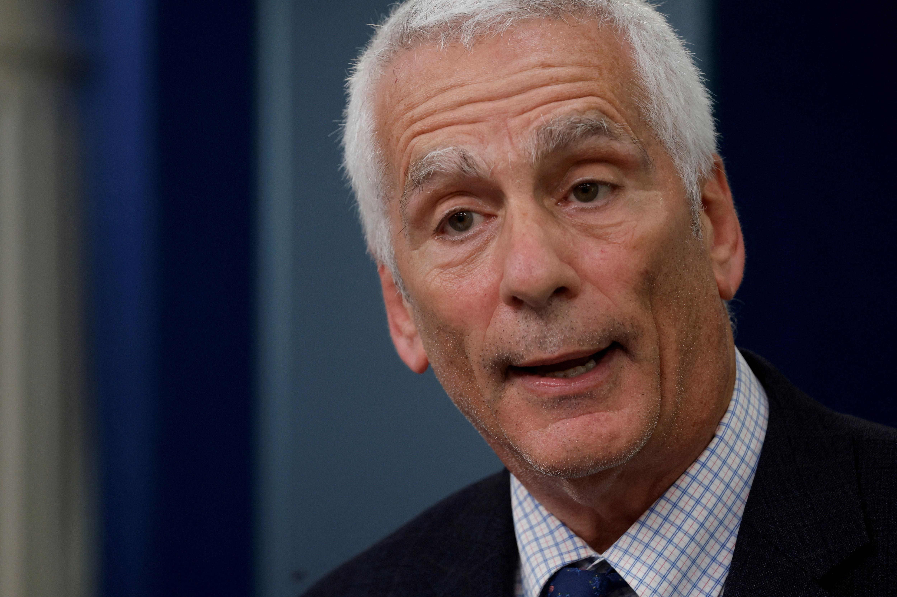

## Table of Contents

## Who are the key economic advisers in the Biden administration?

The key economic advisers in the Biden administration are led by Janet Yellen, who serves as the Secretary of the Treasury. She is a well-known economist and was previously the Chair of the Federal Reserve. Another important adviser is Cecilia Rouse, who is the Chair of the Council of Economic Advisers. She is an expert in labor economics and has worked at Princeton University. Jared Bernstein also plays a big role as a member of the Council of Economic Advisers. He has a long history of working on economic policy and has been an advisor to Vice President Kamala Harris.

Another key figure is Lael Brainard, who serves as the Vice Chair of the Federal Reserve. She has a strong background in international economics and has worked at the Treasury Department before. Wally Adeyemo is the Deputy Secretary of the Treasury and helps Janet Yellen with her work. He has experience in both the public and private sectors. Together, these advisers help President Biden make decisions about the economy, including jobs, taxes, and spending.

## What are the main economic goals of the Biden administration?

The Biden administration wants to make the economy better for everyone. One big goal is to create more jobs, especially good-paying jobs in areas like manufacturing and clean energy. They want to help people who lost their jobs during the pandemic get back to work. Another important goal is to make sure everyone has a fair chance to succeed. This means helping people who have been left behind, like those in poor communities or people of color, by making sure they have access to good jobs, education, and health care.

Another key goal is to fix the country's infrastructure, like roads, bridges, and internet. This will help the economy grow and make life easier for people. The administration also wants to make the tax system fairer. They believe that big corporations and wealthy people should pay more taxes, so there's more money to help everyone else. By focusing on these goals, the Biden administration hopes to build a stronger, more equal economy that works for all Americans.

## How do the economic advisers influence policy decisions?

The economic advisers in the Biden administration help shape policy by giving the President and other leaders good advice based on their knowledge and experience. For example, Janet Yellen, as the Treasury Secretary, talks to the President about how to manage the country's money, including taxes and spending. She uses her understanding of the economy to suggest ways to help people and businesses. Cecilia Rouse, who leads the Council of Economic Advisers, gives the President detailed reports and advice on how the economy is doing and what can be done to make it better. She focuses on issues like jobs and wages.

Jared Bernstein and other members of the Council of Economic Advisers also play a big role. They study the economy closely and give the President ideas on how to create more jobs and help people who are struggling. Lael Brainard, as the Vice Chair of the Federal Reserve, influences policies related to interest rates and money supply, which can affect how easy or hard it is for people and businesses to borrow money. Wally Adeyemo, as the Deputy Secretary of the Treasury, works closely with Janet Yellen to make sure their plans are carried out effectively. Together, these advisers help the President make smart decisions that can lead to a stronger economy.

## What is the background and expertise of each economic adviser?

Janet Yellen, the Secretary of the Treasury, has a lot of experience with the economy. She used to be the head of the Federal Reserve, which is a big job that involves making decisions about money and interest rates. Before that, she taught economics at the University of California, Berkeley. She knows a lot about how to help the economy grow and create jobs. Cecilia Rouse, who is the Chair of the Council of Economic Advisers, is an expert in labor economics. She worked at Princeton University and has studied how to help people find good jobs and earn more money. She gives the President advice on how to make the economy work better for everyone.

Jared Bernstein, another member of the Council of Economic Advisers, has been working on economic policy for a long time. He has advised Vice President Kamala Harris and knows a lot about how to help people who are struggling. He focuses on making sure everyone has a fair chance to succeed. Lael Brainard, the Vice Chair of the Federal Reserve, has a strong background in international economics. She used to work at the Treasury Department and understands how to manage the country's money on a global scale. Wally Adeyemo, the Deputy Secretary of the Treasury, has experience in both the public and private sectors. He helps Janet Yellen with her work and makes sure their plans are carried out well. Together, these advisers use their knowledge to help the President make good decisions about the economy.

## What major economic policies have been implemented under their guidance?

Under the guidance of the Biden administration's economic advisers, several big economic policies have been put into action. One of the most important is the American Rescue Plan, which was passed early in the administration. This plan helped people who lost their jobs during the pandemic by giving them money and support. It also helped states and cities keep their services running and helped businesses stay open. The advisers, like Janet Yellen and Cecilia Rouse, played a big role in making sure this plan was strong and effective.

Another key policy is the Infrastructure Investment and Jobs Act. This law is all about fixing and building things like roads, bridges, and the internet. It will create a lot of jobs and make life easier for people. The advisers, including Lael Brainard and Wally Adeyemo, helped shape this plan to make sure it would help the economy grow. They also worked on the Inflation Reduction Act, which aims to lower costs for families and fight climate change by investing in clean energy. These policies show how the advisers use their knowledge to help the President make the economy better for everyone.

## How do the economic advisers address issues like inflation and employment?

The economic advisers in the Biden administration work hard to deal with inflation and help people find jobs. For inflation, they focus on keeping prices stable so that things don't get too expensive for families. Janet Yellen and Lael Brainard, who are involved with the Federal Reserve, look at things like interest rates and money supply to help control inflation. They also work on policies like the Inflation Reduction Act, which aims to lower costs for things like health care and energy. By doing these things, they try to keep prices from going up too fast and make sure people can afford what they need.

When it comes to employment, the advisers want to make sure everyone who wants a job can find one. They helped create the American Rescue Plan, which gave money to people who lost their jobs during the pandemic and helped businesses stay open. They also pushed for the Infrastructure Investment and Jobs Act, which will create a lot of new jobs by fixing roads, bridges, and the internet. Cecilia Rouse and Jared Bernstein focus on making sure these jobs are good ones that pay well and are available to everyone, including people in poor communities and people of color. By working on these policies, the advisers help the President make the economy stronger and more fair for everyone.

## What role do economic advisers play in international economic relations?

Economic advisers in the Biden administration help the President with international economic relations. They work on making trade deals and agreements with other countries. Janet Yellen, as the Treasury Secretary, talks to leaders from other countries about money and trade. She helps make sure that the United States can work well with other countries to grow the economy. Lael Brainard, who is the Vice Chair of the Federal Reserve, also plays a big role. She uses her knowledge of international economics to help the President understand how global issues can affect the U.S. economy.

Wally Adeyemo, the Deputy Secretary of the Treasury, helps Janet Yellen with these international talks. He makes sure that the plans they come up with are carried out well. Together, these advisers help the President make smart decisions about how to work with other countries. They focus on creating strong relationships that can help the U.S. economy grow and stay stable. By doing this, they help make sure that the United States can benefit from global trade and cooperation.

## How do the economic advisers handle economic crises and unexpected challenges?

When there's an economic crisis or something unexpected happens, the economic advisers in the Biden administration work quickly to help. They use their knowledge to understand the problem and come up with plans to fix it. For example, during the COVID-19 pandemic, they helped create the American Rescue Plan to give money to people who lost their jobs and to keep businesses open. They also talk to other countries and leaders to make sure the U.S. can get help if it needs it. By working together and using their expertise, they try to make the economy stable and help people through tough times.

The advisers also keep an eye on things that could cause problems in the future. They look at data and reports to see if there are any warning signs. If they see something that might be a problem, they tell the President and suggest ways to stop it from becoming a bigger issue. This helps the administration be ready for anything that might come up. By being proactive and always thinking ahead, the economic advisers help make sure the U.S. economy can handle whatever challenges come its way.

## What are the differing economic philosophies among the advisers?

The economic advisers in the Biden administration have different ways of thinking about the economy, but they all want to make it better for everyone. Janet Yellen believes in using government money to help the economy grow and create jobs. She thinks it's important to spend on things like infrastructure and help people who are struggling. Cecilia Rouse focuses on making sure everyone has a fair chance to succeed. She thinks about how to help people find good jobs and earn more money, especially those who have been left behind.

Jared Bernstein also wants to help people who are struggling, but he often looks at how to make sure the benefits of economic growth are shared fairly. He believes in policies that support workers and reduce inequality. Lael Brainard, with her background in international economics, thinks about how global issues can affect the U.S. economy. She wants to make sure the U.S. can work well with other countries to grow the economy. Wally Adeyemo helps make sure these plans work well and are carried out effectively. Even though their ideas are different, they all work together to help the President make good decisions for the economy.

## How do the economic advisers coordinate with other government departments?

The economic advisers in the Biden administration work closely with other government departments to make sure their plans work well. They talk to people in the Department of Labor about creating jobs and helping workers. They also work with the Department of Transportation to fix roads and bridges, which is part of the infrastructure plan. By working together, they make sure that the money and resources are used in the best way to help the economy grow.

They also coordinate with the Department of Energy to focus on clean energy projects, which can create jobs and fight climate change. The advisers meet regularly with these departments to share information and make plans. This teamwork helps the President make good decisions that can help everyone in the country. By working together, the economic advisers and other departments can tackle big challenges and make the economy stronger.

## What impact have the economic advisers had on long-term economic planning?

The economic advisers in the Biden administration have helped shape long-term economic planning by focusing on big goals like creating jobs and fixing infrastructure. They worked on plans like the American Rescue Plan and the Infrastructure Investment and Jobs Act, which will help the economy grow for many years. These plans are about making sure people have good jobs and that the country's roads, bridges, and internet are strong. By thinking ahead, the advisers help the President make choices that will keep the economy healthy in the future.

The advisers also think about how to make the economy fair for everyone. They want to help people who have been left behind, like those in poor communities or people of color. They focus on policies that can reduce inequality and make sure everyone has a chance to succeed. By working on these long-term goals, the economic advisers help build a stronger, more equal economy that will benefit everyone in the country for years to come.

## How are the economic advisers evaluated and held accountable for their recommendations?

The economic advisers in the Biden administration are evaluated by looking at how well their ideas help the economy. People watch to see if their plans create jobs, keep prices stable, and help everyone have a fair chance to succeed. If the economy gets better and people's lives improve, it shows that the advisers are doing a good job. Congress and other government leaders also ask questions and check the advisers' work to make sure they are making smart choices.

If something goes wrong or if the economy doesn't do well, the advisers have to explain what happened and what they can do to fix it. They might need to change their plans or come up with new ideas. The President and other leaders hold them accountable by asking for regular reports and updates. This way, everyone can see if the advisers are doing what they said they would do and if their recommendations are helping the country.

## References & Further Reading

[1]: Adrian, T., & Mancini-Griffoli, T. (2019). ["The Rise of Digital Money."](https://www.imf.org/en/Publications/fintech-notes/Issues/2019/07/12/The-Rise-of-Digital-Money-47097) International Monetary Fund.

[2]: Stiglitz, J. E. (2009). ["The Anatomy of a Murder: Who Killed America's Economy?"](https://academiccommons.columbia.edu/doi/10.7916/D8SB4GKJ) W. W. Norton & Company.

[3]: U.S. Department of the Treasury. (2021). ["Statement by Secretary of the Treasury Janet L. Yellen on President Biden’s American Jobs Plan."](https://en.wikipedia.org/wiki/United_States_Department_of_the_Treasury)

[4]: U.S. Securities and Exchange Commission. (2021). ["SEC Proposes Rules to Improve Risk Management in the Clearance and Settlement of Securities Transactions."](https://www.sec.gov/Archives/edgar/data/1315098/000131509824000273/xslF345X05/wk-form4_1732317487.xml)

[5]: Krugman, P. R. (2009). ["The Return of Depression Economics and the Crisis of 2008."](https://archive.org/details/returnofdepressi0000krug) W. W. Norton & Company.