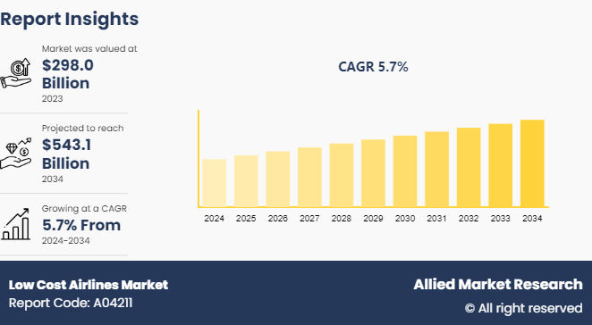

The aviation industry's competitive landscape has undergone a significant transformation with the rise of low-cost and budget airlines. Emerging as pivotal players, these carriers have democratized air travel by offering affordable options to a broader audience. The business models of low-cost airlines, characterized by cost efficiency and high aircraft utilization, have challenged traditional carriers and reshaped industry dynamics.

This article aims to examine the economic factors influencing low-cost airlines, with a specific focus on the integration of algorithmic trading in their financial strategies. Understanding these elements is crucial for passengers seeking economical travel options and investors assessing the profitability of these airlines. By leveraging technological advancements, low-cost carriers can maintain competitive pricing while achieving sustainable profitability.



Technological innovations have further amplified the competitive edge of budget airlines. The interplay between advanced algorithms and economic strategies is a determining factor in their ability to navigate fluctuating market conditions and consumer demands efficiently. Algorithmic trading, for instance, plays a pivotal role in optimizing inventory and pricing models, enabling airlines to manage resources more effectively.

To fully appreciate the impact and potential of low-cost carriers, it's important to define key concepts pertinent to our analysis. These terms and concepts form the foundation of understanding how budget airlines operate within the larger aviation ecosystem. By doing so, we'll uncover the intricate mechanisms that allow these airlines to thrive in a highly competitive environment, ensuring they meet consumer expectations while adapting to ongoing industry challenges.

## Table of Contents

## Overview of Low-Cost and Budget Airlines

Low-cost and budget airlines have become pivotal entities in the aviation industry, redefining air travel with their value propositions that cater to cost-conscious consumers. These carriers have developed business models centered around cost-efficiency, maximizing the use of their aircraft, and providing a basic service devoid of unnecessary amenities often referred to as no-frills service. This section examines the historical emergence, evolution, and present status of low-cost carriers (LCCs).

The genesis of low-cost airlines can be traced back to the 1970s with the establishment of Southwest Airlines in the United States. Southwest's pioneering business model emphasized point-to-point transit, rapid turnaround times, and homogeneous fleets to ensure operational simplicity and cost savings. These principles became the blueprint for modern LCCs, driving their global proliferation. 

The expansion of LCCs during the 1990s and early 2000s marked a period of significant growth for the sector, courtesy of market deregulation, particularly in Europe with the inception of the European Union's Open Skies policy. This deregulation facilitated the entry of new players, such as Ryanair and easyJet, transforming the European air travel landscape. These airlines adopted aggressive pricing strategies, unbundling various service components, and charging additional fees for modifiable features like seat selection and baggage. This approach helped in keeping base ticket prices low, attracting a wider customer base. 

Operational efficiency remains a cornerstone of the low-cost airline model. By maintaining high aircraft utilization rates, often with short ground turnaround times, LCCs optimize their fleet productivity. Furthermore, the utilization of a single model of aircraft reduces maintenance costs and training complexities. These efficiencies contribute significantly to their ability to offer lower fares than traditional full-service airlines.

Currently, low-cost airlines have carved out a substantial share of the aviation market, both regionally and internationally. They have expanded their networks from short-haul to include long-haul routes, leveraging advancements in aircraft technology that allow for longer range and lower operating costs. This strategic shift has enabled LCCs to stimulate demand in less-serviced markets and cater to a growing segment of budget-conscious long-haul travelers.

In summary, low-cost and budget airlines have revolutionized the aviation market by adhering to disciplined cost-saving strategies and innovative operational efficiencies. Their evolution continues to influence global travel patterns, democratizing air travel access across various economic segments. Understanding their history and business practices provides insights into their sustained economic viability and future growth trajectories.

## Economic Analysis of Low-Cost Airlines

The economic dynamics surrounding low-cost airlines are intricately tied to their ability to maintain lower operational costs compared to traditional carriers. This efficiency is achieved through a combination of unique strategies that focus on minimizing expenses across various facets of their operations.

**Labor Costs**

Labor costs constitute a significant portion of an airline's expenses. Low-cost carriers (LCCs) address this by streamlining workforce requirements and focusing on high productivity. Typically, these airlines employ fewer staff members per aircraft and enforce versatile roles, where employees may perform multiple duties. Further, LCCs strategically avoid labor unions or negotiate more flexible labor agreements than traditional carriers, resulting in reduced payment structures and increased operational flexibility.

**Fuel Efficiency**

Fuel costs are another substantial area of expense for airlines, heavily influenced by volatile oil prices. Low-cost airlines typically operate a single aircraft type across their fleets, such as the Boeing 737 or Airbus A320 families. This standardization results in better fuel management and consistency in pilot training, maintenance, and scheduling. Newer aircraft models are also incorporated quickly, allowing these airlines to benefit from improved fuel efficiency due to technological advancements. For example, the use of lighter materials and more efficient engines contributes significantly to reducing fuel consumption.

To further mitigate fuel costs, low-cost airlines often engage in hedging strategies that lock in fuel prices, providing predictable expense patterns. Algorithmic trading tools, as discussed in other sections, are increasingly used to optimize these hedging strategies, providing LCCs with an economic advantage over those relying on traditional market predictions.

**Ancillary Revenue Streams**

LCCs heavily rely on ancillary revenue to boost profitability. This revenue comes from a variety of sources beyond basic ticket sales, including fees for checked baggage, in-flight sales, seat selection, and priority boarding. The ancillary services model allows airlines to keep base fares low while simultaneously enhancing their profitability margins.

For example, data from airline bookings is analyzed to tailor ancillary offerings dynamically, capitalizing on customer preferences and increasing the likelihood of additional purchases. This strategy not only adds revenue but also improves customer satisfaction by providing a customizable travel experience.

**Economic Trends and Consumer Demand**

The pricing strategies and route decisions of low-cost airlines are sensitive to broader economic trends and consumer demand. These airlines leverage advanced pricing algorithms that dynamically adjust ticket prices based on demand fluctuations, seasonality, and competitor pricing. This kind of revenue management revolves around maximizing load factors (percentage of seats filled), ensuring that flights meet profit targets even with disciplined pricing tactics.

Low-cost airlines also continuously adapt their route networks based on emerging travel trends and regional demands. By operating point-to-point services over the traditional hub-and-spoke model, these airlines minimize layovers and reduce airport fees, passing savings directly to consumers.

In summary, the success of low-cost airlines in maintaining lower operational costs compared to traditional carriers is largely due to their innovative approaches in labor management, fuel efficiency, ancillary revenue generation, and adaptive pricing and routing strategies. These elements collectively form a sustainable economic framework that allows for affordable travel while ensuring profitability.

## The Role of Algorithmic Trading in Budget Airlines

Algorithmic trading, commonly referred to as algo trading, is a sophisticated method that employs computer algorithms to automatically execute trades based on predetermined criteria. This approach allows transactions to occur at speeds and prices beyond human capabilities, offering significant strategic advantages in various sectors, including the aviation industry. For budget airlines, algo trading is particularly pivotal in optimizing several financial operations, with fuel hedging strategies being one of the most crucial.

Fuel costs constitute a substantial portion of the operational expenditure for airlines. Therefore, effectively managing fuel price [volatility](/wiki/volatility-trading-strategies) is essential for maintaining profitability. By leveraging algo trading, budget airlines can anticipate market movements and secure fuel at optimal prices. These algorithms can process vast datasets to forecast price trends, enabling airlines to hedge their fuel more efficiently. The formula commonly used to calculate the hedge ratio, which determines the proportion of exposure that can be hedged, is:

$$
\text{Hedge Ratio} = \frac{\text{Covariance (asset, hedging instrument)}}{\text{Variance (hedging instrument)}}
$$

This statistical approach allows airlines to minimize risks associated with price fluctuations, thus stabilizing their cost base over time.

In addition to fuel hedging, algo trading plays a crucial role in inventory and pricing models for budget airlines. Automated pricing strategies facilitated by algorithms enable these airlines to adjust fares in real-time based on demand fluctuations, competitor pricing, and various other market variables. Such dynamic pricing ensures that airlines remain competitive while maximizing revenue from seat sales. Algorithms can compare historical data and current booking patterns to set optimal price points for different flights, ensuring a balance between high occupancy rates and profitability.

Moreover, inventory management benefits significantly from algo trading. Efficient inventory control is critical in an industry where unsold seats represent a loss, and overbooking can lead to customer dissatisfaction. By using algorithms, airlines can predict booking trends, manage overbooking strategies, and ensure higher load factors while minimizing cost liabilities related to bumping passengers or offering flexibility for changes.

The integration of algo trading aligns with the broader trend of technological infusion in financial strategies within the aviation sector. Algorithms enhance decision-making processes, reduce human error, and provide robust data analytics, allowing budget airlines to operate with heightened precision and reduced operational costs. This blend of advanced technology and strategic financial management represents a transformative approach for budget airlines, setting new standards in cost efficiency and financial agility in a highly competitive industry. 

In conclusion, the utilization of [algorithmic trading](/wiki/algorithmic-trading) by budget airlines exemplifies the synergy between technology and finance, providing a powerful toolkit for improving operational efficiency and financial sustainability. As algorithmic methods continue to evolve, their role in the aviation industry's economic framework is likely to expand, further enabling budget carriers to maintain their competitive edge.

## Integration and Benefits of Advanced Technologies

The integration of advanced technologies such as [artificial intelligence](/wiki/ai-artificial-intelligence) (AI) and [machine learning](/wiki/machine-learning) is significantly impacting the operational processes of budget airlines. By incorporating these technologies, low-cost carriers (LCCs) are able to optimize several aspects of their operations, enhancing both efficiency and customer experience.

One of the primary applications of AI and machine learning in budget airlines is in the area of scheduling. Traditional scheduling methods can be time-consuming and susceptible to human error, leading to inefficiencies and increased operational costs. Machine learning algorithms, however, can process vast amounts of data to predict optimal schedules, thereby minimizing delays and maximizing aircraft utilization. These algorithms analyze variables such as historical flight data, weather patterns, and passenger demand to make more accurate scheduling decisions.

Predictive maintenance is another area where AI-driven technologies prove beneficial. By utilizing sensors and data analytics, budget airlines can transition from reactive to proactive maintenance strategies. AI systems continuously monitor aircraft performance and detect patterns indicating potential failures before they occur. This predictive maintenance reduces unexpected downtimes and extends the lifespan of aircraft components, ultimately leading to cost savings. An example code snippet for implementing a basic predictive maintenance model using Python is as follows:

```python
import pandas as pd
from sklearn.ensemble import RandomForestRegressor
from sklearn.model_selection import train_test_split

# Example dataset loading
data = pd.read_csv('aircraft_maintenance_data.csv')

# Features and labels
features = data.drop('component_failure', axis=1)
labels = data['component_failure']

# Splitting the dataset
X_train, X_test, y_train, y_test = train_test_split(features, labels, test_size=0.2, random_state=42)

# Model training
model = RandomForestRegressor()
model.fit(X_train, y_train)

# Predictive maintenance
predictions = model.predict(X_test)
```

Customer service is also enhanced through technology integration. AI-powered chatbots and virtual assistants handle routine inquiries, booking modifications, and real-time communication, freeing up human [agents](/wiki/agents) to address more complex issues. Additionally, machine learning algorithms personalize customer experience by analyzing previous interactions and preferences. For instance, offering tailored travel recommendations or dynamic pricing models based on individual traveler behavior.

Through the adoption of these technologies, LCCs not only streamline their operations but also foster a culture of innovation, allowing them to remain competitive. The infusion of technology spearheads a new wave of capabilities that empower airlines to anticipate challenges and exceed customer expectations. As these advancements continue to evolve, they will undoubtedly contribute to the sustained growth and resilience of the budget airline sector.

## Challenges and Future Outlook

Budget airlines have witnessed remarkable growth over the past decades, yet they face a multitude of challenges that threaten to impact their future strategies and sustainability. A primary concern is market saturation as the proliferation of low-cost carriers (LCCs) intensifies competition. In regions with numerous budget airlines, the struggle to maintain profitable routes while ensuring high load factors becomes increasingly difficult. Excessive competition can lead to price wars, diminishing the already thin profit margins that characterize budget airlines.

Regulatory hurdles also pose significant challenges. Airlines must navigate complex laws related to safety, labor, and environmental standards, which can vary significantly across different countries. Compliance often incurs substantial costs that can erode the cost advantages typically enjoyed by budget airlines. Recent regulatory trends suggest increasing scrutiny over environmental impacts, particularly carbon emissions, which is likely to impose additional operational constraints and lead to increased costs.

Environmental concerns present another formidable challenge. The aviation industry accounts for a sizable portion of global greenhouse gas emissions, and budget airlines are under escalating pressure to adopt more sustainable practices. This includes investing in fuel-efficient aircraft, exploring alternative fuels, and implementing carbon offset programs. However, such initiatives require substantial capital investment, which could strain airlines operating on low margins.

Emerging technologies hold the potential for both disruption and opportunity. Innovation in electric and hybrid aircraft, for instance, offers the promise of reducing fuel dependency and emissions. However, the adoption of these technologies may be slow and costly, requiring airlines to strike a balance between innovation and economic viability. Additionally, the rise of artificial intelligence and machine learning can revolutionize customer service, dynamic pricing, and route optimization, creating avenues for enhanced efficiency and cost savings. Nevertheless, integrating these technologies requires upfront investment and technical expertise, which may be challenging for some carriers to acquire.

Changing consumer expectations also impact budget airlines. Passengers increasingly demand personalized experiences, seamless digital interactions, and enhanced comfort even on budget fares. Airlines must invest in technology and service improvements to meet these expectations, again challenging their low-cost model.

Looking forward, the sustainability and evolution of budget airlines will largely depend on their ability to adapt to these challenges while capitalizing on opportunities presented by technological advancements. Collaboration with governments and industry stakeholders will be crucial in addressing regulatory and environmental challenges. Budget airlines that can effectively integrate new technologies and adapt to changing consumer demands are better positioned to thrive in this competitive landscape. As a result, the future of low-cost carriers rests on their capacity for innovation and strategic adaptation in an ever-evolving marketplace.

## Conclusion

Low-cost airlines utilize distinct economic and technological strategies to solidify their standing in the aviation industry. By focusing on cost-efficiency and leveraging advanced technologies, these airlines maintain competitive fares while ensuring profitability. One such technology, algorithmic trading, plays a crucial role in their financial strategy. This approach allows for the optimization of fuel hedging, inventory, and pricing models, thereby enhancing cost management and process efficiency. 

Adopting algorithmic trading and other modern technologies like AI and machine learning has allowed these carriers to streamline operations, improve customer service, and elevate the overall travel experience. These advancements have positioned low-cost airlines as adaptable players in the evolving global aviation landscape.

As low-cost airlines navigate various industry challenges, including regulatory pressures and environmental concerns, their commitment to innovation remains a crucial [factor](/wiki/factor-investing) in their growth strategy. The continuous integration of new technologies and strategic economic planning empowers passengers, investors, and industry stakeholders to make well-informed decisions, given the airlines' resilience and adaptability.

The progress of budget airlines is a testament to the effectiveness of economic innovation and technological advancement. Their journey exemplifies the capacity for these elements to sustain and enhance competitiveness in the aviation industry. As the sector progresses, low-cost carriers are expected to continue leveraging these dynamics, reinforcing their pivotal role in global air travel.

## References & Further Reading

[1]: Blyton, P., & Turnbull, P. (2004). ["The Dynamics of Low-Cost Airlines in the European Aviation Market."](https://www.semanticscholar.org/paper/The-dynamics-of-employee-relations.-3rd-ed.-Blyton-Turnbull/11fa407c520d0c789a507e6a020dabf081560fe9) In The Globalization of Air Transport (pp. 205-222). Palgrave Macmillan UK.

[2]: Doganis, R. (2001). ["The Airline Business in the 21st Century."](https://www.taylorfrancis.com/books/mono/10.4324/9780203991916/airline-business-21st-century-rigas-doganis) Routledge.

[3]: Vowles, T. M. (2000). ["The Effect of Low-Fare Airline Entry on Airfares at Nonsuited Airports."](https://www.scirp.org/reference/referencespapers?referenceid=789855) Transportation Research Part E: Logistics and Transportation Review, 36(4), 273-282.

[4]: Jenkins, D., & Patel, K. (2011). ["Algorithmic Trading in a Low-Volatility Environment."](https://www.stern.nyu.edu/sites/default/files/assets/documents/Banerjee%20Banerjee%20-%20Algorithmic%20Traders%20and%20Volatility%20Information%20Trading.pdf) The Journal of Trading, 6(3), 30-38.

[5]: Gillen, D., & Hazledine, T. (2005). ["The Economics of the Low Cost Carrier: Quick Returns to Inventors?"](https://www.emerald.com/insight/content/doi/10.1108/s2212-1609(2011)0000003005/full/html) Academy of Management Executive, 19(4), 37-52.