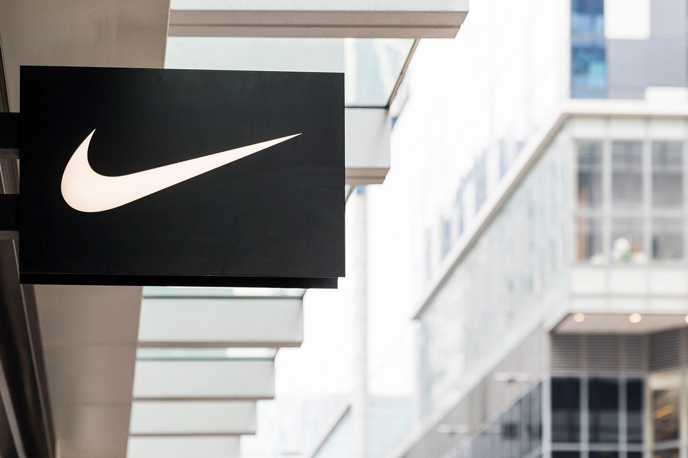

The sneaker industry has experienced a remarkable transformation from a niche market to a global economic force, signifying its evolution into a multi-billion dollar sector. What was once seen merely as athletic footwear has grown into a cultural and economic phenomenon, with annual revenues in the sneaker market projected to reach $102 billion by 2025 (Statista, 2021). This staggering growth is fueled by a complex interplay of supply, demand, and trading patterns, collectively referred to as sneaker economics. These factors have turned sneakers into coveted assets, influencing consumer behavior, market dynamics, and production strategies.

Sneaker economics involves understanding how factors like consumer preference, branding, and scarcity impact market viability. The cultural significance attached to sneakers, bolstered by celebrity endorsements and popular culture, plays a vital role in driving demand. Brands leverage limited edition releases and collaborations, creating artificial scarcity to maintain hype and elevate the desirability of their products.



Beyond traditional market principles, technological advancements are revolutionizing sneaker economics. One of the most intriguing developments is the application of algorithmic trading to this market. Originally rooted in financial markets, algorithmic trading uses complex algorithms to automate and optimize trading decisions based on quantitative data. By harnessing such technologies, sneaker traders can efficiently navigate the cyclical nature of drops, releases, and resale opportunities. Algorithms expedite buying and selling, offering a competitive edge through enhanced speed and data analysis.

As financial technology integrates deeper into sneaker commerce, it's essential to grasp its transformative impact on consumer experiences and market accessibility. This article will explore how algorithmic trading is reshaping sneaker buy-ins and sales, providing insights into both traditional market dynamics and modern trading methods. Understanding these elements is crucial for engaging intelligently with an industry that continuously pushes the boundaries of fashion and commerce.

## Table of Contents

## The Growth of the Sneaker Industry

The sneaker industry has undergone significant transformation since the first canvas shoes with rubber soles, known as plimsolls, were created in the late 1800s. A pivotal moment came with the invention of the vulcanization process by Charles Goodyear in 1839, which allowed sneakers to be mass-produced. However, it wasn't until the 20th century that sneakers began to assume their current cultural and economic significance.

A major milestone in the growth of the sneaker industry occurred in the 1920s with the introduction of the Converse All-Star sneaker, which gained popularity through its association with basketball player Chuck Taylor. The 1980s saw another turning point with Nike's release of the Air Jordan line, endorsed by basketball legend Michael Jordan. This partnership highlighted the role of celebrity endorsements in fueling the sneaker market, transforming sneakers from mere athletic gear to lifestyle and status symbols.

Cultural trends have similarly played a crucial role in the sneaker industry's growth. The rise of hip-hop culture in the 1980s and 1990s, for example, significantly bolstered the industry's expansion, establishing sneakers as a staple of streetwear fashion. Such cultural ties have magnified demand, leading to thriving secondary markets where sneakers often trade at prices well above their retail values.

Sneaker collaborations and limited edition releases have become instrumental in driving consumer interest and sales. Brands frequently collaborate with celebrities, designers, or other companies to create unique products, often released in limited quantities, amplifying their exclusivity and desirability. Notable collaborations, such as Adidas's partnership with Kanye West for the Yeezy line, have attracted widespread consumer attention, often leading to immediate sellouts and high resell prices. This strategy not only generates substantial revenue but also accentuates brand prestige and consumer loyalty.

The globalization of sneaker brands is another key [factor](/wiki/factor-investing) in the industry's growth. As companies expanded their operations and marketing into international markets, they tapped into diverse consumer bases and cultural influences. Companies like Nike, Adidas, and Puma have established a global presence, with targeted marketing strategies that resonate with different demographics. This worldwide reach has contributed significantly to the sneaker industry’s expansion, with the global sneaker market valued at approximately USD 79 billion in 2020 and projected to grow to over USD 120 billion by 2026, according to market research from Statista and Grand View Research.

In summary, the historical evolution of the sneaker industry is characterized by significant breakthroughs in production, strategic cultural integration, and effective marketing tactics such as celebrity endorsements and collaborative releases. The industry's globalization further underscores its dynamic nature, shaped continuously by cultural and consumer trends, unlocking substantial economic potential on a global scale.

## Sneaker Economics: Supply and Demand

The sneaker market, similar to any other commodity market, is influenced significantly by the principles of supply and demand. These fundamental economic concepts dictate the production numbers, availability, and pricing of sneakers, translating consumer interest into tangible financial metrics. 

Key elements like hype, rarity, and collector culture substantially drive sneaker demand. Hype is often cultivated through strategic marketing campaigns, celebrity and influencer endorsements, and social media buzz, creating a perceived value that can far exceed the intrinsic value of the product. This phenomenon is often observed during new sneaker releases, where brands intentionally limit supply to generate excitement and exclusivity. 

Rarity is another critical factor influencing demand. Limited edition releases or sneakers produced in small quantities heighten desirability, as owning these sneakers becomes a status symbol. This aspect ties closely with collector culture, where enthusiasts seek unique and rare pieces to enhance their collections, driving up demand and often resulting in significant price premiums.

The impact of sneaker drops and scarcity on prices can be profound. During these events, brands release new styles with limited availability, triggering a surge in consumer interest and willingness to pay higher prices. This scenario aligns with the economic principle where the supply $(S)$ remains constant or decreases, resulting in a higher equilibrium price $(P_e)$ as the demand $(D)$ increases. Formally, this can be depicted as:

$$
Q_d = f(P, T, I)
$$
$$
Q_s = g(P, W, N)
$$

Where $Q_d$ and $Q_s$ are the quantity demanded and supplied respectively, $P$ is the price, $T$ is trends or hype, $I$ represents income levels affecting buying power, $W$ is the production cost, and $N$ represents external environmental conditions, including scarcity.

Market dynamics are not static and tend to shift based on changing consumer preferences. For instance, an increased focus on environmentally sustainable fashion might sway consumers towards brands that prioritize ethical manufacturing processes. Similarly, the growing influence of digital experiences might alter how consumers perceive value, potentially reducing the emphasis on physical exclusivity in favor of unique digital designs.

Resellers and secondary markets play a pivotal role in shaping sneaker prices. These actors often acquire sneakers at retail prices during initial drops and subsequently exploit their scarcity to sell them at marked-up prices. This resale market creates an entire ecosystem where prices can surge due to demand from consumers who missed out on the primary sale. Platforms like StockX and GOAT provide structured environments where the resale of sneakers becomes a competitive, financially-driven activity akin to stock trading, adding another layer of complexity to sneaker economics.

In summary, the sneaker market's supply and demand mechanics are nuanced, driven by a confluence of hype, rarity, and collector culture. The interplay between these forces and market dynamics, catalyzed by resellers and secondary platforms, continues to transform sneakers from mere footwear into coveted investment assets, demonstrating profound implications for both consumers and the wider economic framework.

## The Impact of Technology on the Sneaker Market

The integration of technology into the sneaker market has profoundly altered the ways in which consumers interact with brands, shop for shoes, and keep up with trends. Digital platforms have redefined the sneaker shopping experience, offering convenience, expanded access, and new ways to engage with the sneaker culture.

E-commerce has played a pivotal role in broadening market access, enabling consumers from all corners of the globe to purchase sneakers with ease. Online retailers and dedicated sneaker marketplaces have emerged as major players, allowing for a wider distribution of products beyond physical stores. This digital shift has not only democratized access to limited releases but also intensified competition among buyers, leading to rapid sell-outs and heightened demand for sought-after models.

Social media platforms have become powerful tools in shaping sneaker trends and marketing strategies. Brands can now directly engage with consumers, leveraging platforms like Instagram, Twitter, and TikTok to create buzz around new releases and collaborations. Influencers and celebrities often drive trends by showcasing their sneaker collections, affecting the purchasing decisions of their followers. User-generated content and viral challenges further contribute to the dynamic interplay between social media and sneaker culture.

The rise of mobile applications specifically designed for sneaker aficionados has streamlined the process of buying, selling, and trading. Apps such as SNKRS by Nike and Confirmed by Adidas provide users with instant notifications on upcoming releases and allow them to participate in exclusive draws. These platforms often incorporate features like push notifications and countdown timers, enhancing user engagement and maximizing the chances of securing a pair of desired sneakers.

Virtual 'try-on' technologies and augmented reality (AR) have introduced innovative experiences for consumers. Through AR, users can visualize how different sneakers will look on their feet without needing to visit a store, thus simplifying decision-making and enhancing the shopping experience. These tools also reduce the frequency of returns, as consumers can make more informed choices about fit and style.

In summary, technological advancements have revolutionized the sneaker market, making it more accessible, interactive, and consumer-centric. As brands continue to innovate, these digital tools will likely evolve, further transforming how sneakers are marketed, bought, and experienced.

## Algorithmic Trading in the Sneaker Market

Algorithmic trading is an advanced method of executing orders using automated pre-programmed trading instructions that account for variables such as time, price, and [volume](/wiki/volume-trading-strategy). Originally developed within the financial markets to enhance efficiency, [algorithmic trading](/wiki/algorithmic-trading) leverages computational algorithms to make rapid trading decisions, allowing for the swift buying and selling of securities. Its significance in finance lies in its ability to minimize costs while maximizing investment opportunities through high-frequency trading and intricate data analysis.

In recent years, the sneaker market has adopted algorithmic trading to optimize the buying and reselling processes. Similar to its application in financial markets, algorithmic trading in the sneaker market uses automated procedures to analyze trends and execute trades. This approach streamlines transactions and provides resellers with the capability to quickly purchase limited edition releases or high-demand sneakers the moment they become available, giving them a significant advantage over conventional buyers.

The advantages of algorithmic trading in the sneaker market are profound. Speed is a key factor; algorithms can place orders faster than any human, ensuring participation in sneaker releases where milliseconds can make a difference. Additionally, sophisticated data analysis allows traders to identify potential high-value sneakers based on trends, social media signals, and market demand data. This data-driven approach reduces the risk of manual error and enables resellers to optimize their operations for better financial returns.

Despite its benefits, algorithmic trading in the sneaker market introduces ethical concerns and risks. The automation of purchasing can lead to unfair advantages for individuals or groups with better access to resources and technology, potentially leading to market manipulation. This can exacerbate the scarcity of popular sneaker models for average consumers. Furthermore, the reliance on algorithms can at times result in massive purchasing errors if the system's parameters are incorrectly set, causing unintended market fluctuations.

To support the integration of algorithmic trading in the sneaker market, several platforms have emerged. These platforms provide tools and services that facilitate the use of algorithms for sneaker purchases. They offer users the ability to customize parameters according to their trading goals and integrate real-time market analysis, enhancing the precision and effectiveness of trades.

In summary, algorithmic trading is transforming the sneaker industry by emulating its success in financial markets. While offering significant operational efficiencies and financial advantages, this technological application presents ethical challenges that demand thoughtful regulation and consideration. As the sneaker market continues to innovate, it must also address these complexities to ensure equitable access and market health.

## Case Studies and Real-World Examples

Successful case studies in the sneaker industry illustrate how brands and resellers harness technology to drive sales and optimize market strategies. One prominent example is Nike, which extensively utilizes digital tools and platforms to boost its sales. Nike's SNKRS app is a successful case study offering lotteries, exclusive releases, and personalized shopping experiences, significantly enhancing customer engagement and driving sales. The app also provides a streamlined method for managing supply and demand by controlling product releases, contributing to the artificially increased scarcity that fuels consumer desire and resale value.

Algorithmic trading in sneaker reselling is an evolving phenomenon that parallels innovations in financial markets. Platforms like StockX and GOAT employ algorithmic systems to facilitate buying and selling, where automated trading bots execute orders based on pre-set market conditions. Such systems offer benefits like speed and efficiency, ensuring users secure pairs at optimal prices, considering real-time market fluctuations. The implementation of [machine learning](/wiki/machine-learning) techniques and data analytics aids in predicting trends and valuations, thus enabling resellers to strategize based on empirical data rather than speculation.

An illustrative case study is the release of Kanye West's Yeezy sneakers, which highlighted market dynamics such as hype and scarcity. The limited availability created a heightened perception of value, rapidly inflating prices on secondary markets. This phenomenon was compounded by strategic drops and teasers on social media, which stirred consumer anticipation. However, lessons from this case indicate that oversaturation of similar releases eventually diluted exclusivity, leading to a decline in both hype and resale prices. Brands must balance between scarcity and availability to maintain product allure.

Not all strategies have triumphed. For instance, the Adidas Futurecraft 4D line, despite innovative technology, suffered from limited commercial success. The high production cost and complexity meant the shoes were produced in small batches, leading to insufficient market penetration. Additionally, without the same level of cultural backing as other Adidas lines or collaborations, the sneakers failed to generate significant resale interest.

From these examples, several lessons emerge. Firstly, effective use of technology, such as apps and digital platforms, can drive engagement and manage supply chain complexity. Algorithms, when aligned with consumer psychology, can optimize trading in secondary markets. However, brands must exercise caution — an over-reliance on technology or misjudging the cultural climate can lead to diminished returns. Balancing innovation with consumer expectations and exclusivity is crucial for sustained success in the competitive sneaker market.

## Future Trends in Sneaker Economics and Algorithmic Trading

As the sneaker market continues to evolve, it is poised for significant shifts driven by advancements in technology and changing consumer behaviors. Current data trends suggest a growing preference for innovation and sustainability, shaping the future landscape of sneaker economics and algorithmic trading.

Emerging technologies are set to further revolutionize the industry. Augmented Reality (AR) and Virtual Reality (VR) are becoming increasingly integral in enhancing consumer experiences. AR applications allow users to virtually try on shoes, thereby reducing the friction of online shopping and improving conversion rates. This technology not only enhances the purchasing process but also reduces the rate of returns, which is a significant challenge for online retailers.

Blockchain technology is proving transformative in ensuring authenticity and transparency in sneaker trade. Given the prevalence of counterfeiting in this lucrative market, blockchain offers a way to authenticate sneakers through unique digital tokens. Each token, or Non-Fungible Token (NFT), is tied to a specific pair of sneakers, providing a verifiable record of ownership and authenticity. This ensures that consumers can confidently purchase high-value items with a verified history. Furthermore, NFTs can facilitate fractional ownership of rare sneakers, allowing more consumers to partake in high-value trades without the full capital requirement.

Sustainability is becoming a fundamental consideration in sneaker production and economics. Consumers are increasingly opting for brands that prioritize eco-friendly practices. This trend is likely to drive innovation in material science, encouraging the use of sustainable materials and manufacturing processes. Economic models may shift as companies assess the lifecycle costs of sneakers, incorporating environmental impact into their pricing strategies.

The potential of algorithmic trading extends beyond the sneaker market into the broader apparel sector. With the help of machine learning and [artificial intelligence](/wiki/ai-artificial-intelligence), algorithmic trading systems can rapidly analyze market trends, predict consumer behavior, and optimize inventory management. These systems can dynamically adjust prices based on real-time demand, enhancing profitability and efficiency. In Python, a simple predictive algorithm could be implemented as:

```python
import numpy as np
from sklearn.linear_model import LinearRegression

# Dummy data for example purposes
historical_prices = np.array([[1], [2], [3], [4], [5]])
demand = np.array([10, 15, 20, 25, 30])

model = LinearRegression()
model.fit(historical_prices, demand)

# Predicting future demand based on price
future_price = np.array([[6]])  # Example future price point
predicted_demand = model.predict(future_price)
```

This example demonstrates how historical data can be used to predict future trends, aiding in strategic decision-making. As algorithmic trading becomes more sophisticated, it may enable fully automated systems that manage everything from manufacturing to point-of-sale activities, streamlining the entire value chain.

In conclusion, the sneaker industry's future is closely tied to technological advancements and evolving consumer expectations. As brands navigate these changes, they must remain agile, adopting innovations that drive both profitability and sustainability. Understanding these trends is crucial for stakeholders aiming to stay competitive in this dynamic market.

## Conclusion

The sneaker industry has transformed from being a niche market centered on athletic performance to a global economic powerhouse intertwined with fashion, technology, and culture. This article has discussed the multifaceted nature of sneaker economics, highlighting how it transcends traditional footwear commerce through the integration of modern technologies like algorithmic trading. Staying informed about these dynamics is essential for anyone involved in this fast-evolving market.

Understanding both traditional supply and demand principles and modern trading methods is invaluable. Traditional methods have been impacted by collector culture and the strategic scarcity of limited editions, while modern technologies, such as algorithmic trading, have introduced unprecedented speed and efficiency in transactions. These innovations not only reshape consumer experiences but also pose ethical considerations that warrant careful evaluation.

As technology continues to influence consumerism, readers are encouraged to recognize its broader implications. Digital platforms, social media, and e-commerce have redefined marketing and shopping experiences, indicating a shift towards an increasingly tech-driven industry. Sneaker enthusiasts and investors alike should engage with this market intelligently, leveraging insights from both traditional economic theories and contemporary technological advancements.

In conclusion, as the sneaker market continues to innovate and expand, staying informed and adaptable will be key to successfully navigating its complexities. Engaging with the market thoughtfully and understanding the implications of technology will enable individuals to participate in this dynamic space effectively.

## References & Further Reading

[1]: Statista. (2021). [Projected size of the global sneaker market from 2020 to 2025](https://www.statista.com/outlook/cmo/footwear/sneakers/worldwide). 

[2]: Grand View Research. (2021). [Footwear Market Size, Share & Trends Analysis Report By Product (Non-athletic, Athletic), By End User (Children, Women, Men), By Region, And Segment Forecasts, 2021 - 2028](https://www.grandviewresearch.com/industry-analysis/footwear-market).

[3]: Lopez de Prado, M. (2018). ["Advances in Financial Machine Learning"](https://www.amazon.com/Advances-Financial-Machine-Learning-Marcos/dp/1119482089). Wiley.

[4]: Chan, E. P. (2009). ["Quantitative Trading: How to Build Your Own Algorithmic Trading Business"](https://github.com/ftvision/quant_trading_echan_book). Wiley.

[5]: Jansen, S. (2018). ["Machine Learning for Algorithmic Trading"](https://github.com/stefan-jansen/machine-learning-for-trading). Packt Publishing.

[6]: Bergstra, J., & Bengio, Y. (2012). ["Random Search for Hyper-Parameter Optimization."](https://dl.acm.org/doi/10.5555/2188385.2188395) Journal of Machine Learning Research, 13, 281-305.

[7]: Aronson, D. R. (2006). ["Evidence-Based Technical Analysis: Applying the Scientific Method and Statistical Inference to Trading Signals"](https://www.amazon.com/Evidence-Based-Technical-Analysis-Scientific-Statistical/dp/0470008741). Wiley.

[8]: Sneakerheads. (n.d.). [The Role of Hype and Scarcity in Sneaker Culture](https://www.researchgate.net/publication/371936344_Exploring_the_Sneakerhead_Culture_Expression_Buying_Behavior_and_a_Billion-Dollar_Industry_A_Theoretical_Literature_Review). Sneakerheads.com.

[9]: GOAT Group. (n.d.). [GOAT: Buy and Sell Authentic Sneakers](https://www.goat.com/).