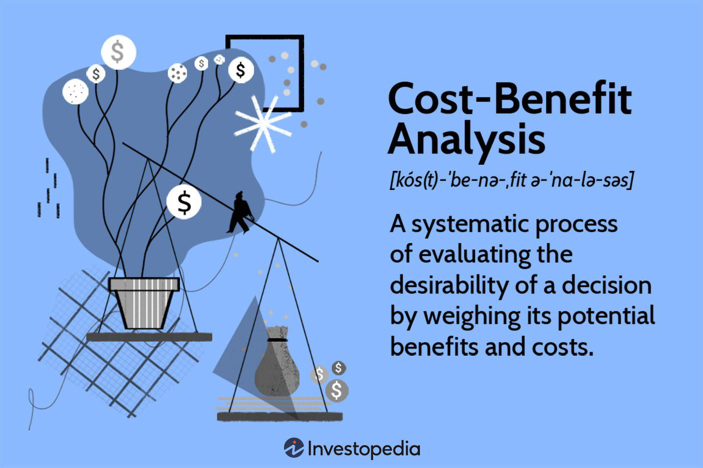

In today's fast-paced financial world, individuals and institutions constantly seek effective strategies to manage their investments and make informed economic decisions. This article explores various financial strategies, their economic implications, and affordable options, with a focus on algorithmic trading—an increasingly popular method in modern finance.

With the advent of new technologies and financial instruments, market participants must adapt to changing conditions to optimize profitability and mitigate risks. Understanding the nuances of these strategies is crucial for anyone looking to navigate the complexities of today's financial landscape.



We explore the diverse range of financial strategies, analyze their economic backdrop, and investigate cost-effective options available to traders and investors. Simultaneously, we uncover the potential of algorithmic trading in enhancing financial outcomes by leveraging technology to automate and refine trading processes.

This comprehensive guide aims to equip readers with the knowledge needed to make prudent financial decisions, regardless of their level of expertise. We also explore the intersections of finance and technology that are actively shaping the future of trading and investing.

## Table of Contents

## Understanding Financial Strategies

Financial strategies are essential tools used by both individuals and businesses to attain specific financial objectives effectively. These strategies are diverse and range from basic budgeting techniques to more advanced practices like leveraging and investment diversification. 

A foundational element of any financial strategy is budgeting, which involves the meticulous planning and allocation of financial resources to meet both immediate and future financial goals. Budgeting not only aids in controlling expenditures but also in planning for unforeseen financial challenges, ensuring a sustainable economic lifestyle.

Investment diversification is another critical strategy, vital for optimizing returns while minimizing risks. The concept revolves around spreading investments across various asset classes to reduce exposure to any single risk. Traditional asset classes include stocks and bonds, but modern investment landscapes have expanded to embrace exchange-traded funds (ETFs) and cryptocurrencies. ETFs allow investors to diversify risk across multiple securities, while cryptocurrencies offer high potential returns albeit with increased [volatility](/wiki/volatility-trading-strategies).

Deciding on the right asset allocation is central to diversification. This involves an in-depth analysis of an investor’s risk tolerance, financial goals, and investment horizon. Asset allocation models often follow a formulaic approach to determine optimal distribution across various asset classes. For instance, a common strategy is the use of the Modern Portfolio Theory (MPT), which mathematically optimizes the balance between risk and return in a portfolio.

Leveraging is a powerful strategy that entails using borrowed capital for investment purposes, with the intent to increase potential returns. While leveraging can amplify gains significantly, it also escalates the risk exposure. Thus, understanding how to effectively employ leverage—especially in volatile markets—is crucial. Key to leveraging is maintaining a balance to avoid excessive risk, which can be achieved through disciplined financial management and regular market analysis.

Retirement planning and savings strategies form another pillar of financial strategy, emphasized for their role in providing long-term financial stability. Instruments like Individual Retirement Accounts (IRAs), 401(k) plans, and annuities serve as structured mechanisms to secure an individual’s future financial well-being. These options come with varied tax advantages, contribution limits, and payout structures. Therefore, selecting the right mix—balancing between tax benefits and future [liquidity](/wiki/liquidity-risk-premium) needs—is essential for effective retirement planning.

In summary, understanding and implementing a variety of financial strategies is crucial in today's complex financial environment. From the basic discipline of budgeting to leveraging sophisticated tools like asset allocation models, each strategy plays a fundamental role in achieving financial goals and ensuring economic resilience.

## Economic Context of Financial Strategies

The economic context significantly influences financial strategies by dictating how individuals and institutions make investment decisions. Key macroeconomic indicators such as Gross Domestic Product (GDP) growth, inflation rates, and monetary policies are fundamental in understanding market behavior and shaping investment strategies. GDP growth, for instance, signals the health of an economy—an expanding GDP often indicates a robust economy, suggesting greater investment opportunities.

Inflation rates directly affect purchasing power and investment returns. When inflation is high, the real value of returns diminishes, necessitating strategies that either counteract inflation's erosive effects—such as investing in assets with inflation-indexed returns—or capitalize on its dynamics, like commodities, which often rise with inflation. Central banks use monetary policies, including [interest rate](/wiki/interest-rate-trading-strategies) adjustments and open market operations, to steer inflation towards a target rate, thus influencing borrowing costs and economic activity.

Fiscal policies, government regulations, and political events further impact financial markets. Fiscal policies, through taxation and government spending, alter disposable income levels and influence consumer and business spending. Regulatory changes can affect market dynamics by altering the cost of compliance or opening new investment avenues. Political events, such as elections or geopolitical tensions, create uncertainties impacting investor confidence and market valuations. These factors require investors to develop flexible strategies that can adapt to policy shifts and regulatory landscapes.

Economic cycles, characterized by phases of recession and expansion, play a crucial role in financial planning. During expansions, investors might focus on [growth stocks](/wiki/growth-stocks) and sectors poised for outperformance, while recessions might prompt a shift toward defensive stocks and assets like bonds. Recognizing indicators such as unemployment rates, consumer confidence, and manufacturing output can help in anticipating these cycles and adjusting investment portfolios accordingly.

Global economic trends are also integral to strategic planning. International trade relationships and financial policies dictate capital flows and market access, affecting currencies and investment returns in different regions. For example, trade agreements or tariffs can alter competitive dynamics across industries and regions. Similarly, the monetary policies of major economies, such as the United States or the European Union, have far-reaching impacts on global capital markets, influencing investor behavior worldwide. Understanding these global dynamics allows investors to diversify their portfolios internationally, assess foreign exchange risks, and identify global opportunities, thereby enhancing their strategic approaches to financial planning.

## Affordable Options for Investors

Investors often seek affordable options that offer substantial returns without necessitating significant capital commitments. This section explores low-cost investment vehicles such as index funds, mutual funds, and low-priced options, providing access to a diversified portfolio.

Index funds and mutual funds are popular among investors due to their cost-effectiveness and diversified nature. Index funds aim to replicate the performance of a specific index, such as the S&P 500, by holding the same securities in similar proportions. The passive management style leads to lower fees compared to actively managed funds, making it a budget-friendly choice for investors. Mutual funds, although sometimes more expensive due to active management, offer the benefit of pooling resources from multiple investors to access a diversified set of assets, which can reduce risk.

Exchange-Traded Funds (ETFs) provide another avenue for cost-effective diversification. Unlike mutual funds, ETFs are traded on stock exchanges, allowing investors to buy and sell shares throughout the trading day at market prices. This liquidity, combined with typically lower expense ratios, makes ETFs an attractive option for both novice and experienced investors. Moreover, ETFs often cover a wide range of asset classes—from equities to commodities—enabling investors to achieve broad diversification with minimal transaction costs.

Options trading is another strategy worth considering. It offers high-reward potential with strategic uses such as hedging against market volatility or speculating on stock price movements. Investors can purchase options at a fraction of the cost of the underlying asset, making it a potentially lucrative method with a limited initial investment. However, options are inherently riskier and require a solid understanding of market dynamics.

Robo-advisors and automated investing platforms have transformed the investment landscape by democratizing access to sophisticated investment strategies. These platforms use algorithms to create and manage diversified portfolios tailored to an investor's risk tolerance and goals. The fees associated with robo-advisors are typically lower than those of traditional financial advisors, as automation reduces the need for direct human involvement. This affordability, combined with tech-driven efficiency, allows investors to access expert-level portfolio management without significant capital.

Overall, these affordable investment options provide investors with tools to build a diversified portfolio while keeping costs manageable. By understanding each option's structure and benefits, investors can craft a strategy that aligns with their financial goals and risk tolerance.

## Algorithmic Trading: A Modern Approach

Algorithmic trading, or algo trading, employs computer algorithms to automate trading decisions, enhancing both speed and accuracy while minimizing human error. This approach allows traders to execute orders at the most opportune moments, exploiting even minor market inefficiencies for profit maximization. At its core, [algorithmic trading](/wiki/algorithmic-trading) utilizes pre-programmed instructions to [carry](/wiki/carry-trading) out tasks like orders, timings, and quantities, unburdened by human emotional biases.

One of the most prevalent algorithmic trading strategies is trend-following, which involves identifying patterns in price movement and capitalizing on them. For instance, moving averages, [momentum](/wiki/momentum) strategies, and channels help identify price direction over time. Trend-following does not predict market movements; instead, it reacts to established price trends. Python, with libraries like Pandas and NumPy, can facilitate the development of such strategies:

```python
import pandas as pd
df['moving_avg'] = df['price'].rolling(window=50).mean()
df['signal'] = 0
df.loc[df['price'] > df['moving_avg'], 'signal'] = 1
df.loc[df['price'] < df['moving_avg'], 'signal'] = -1
```

Arbitrage strategies exploit price discrepancies in different markets or forms. By simultaneously buying and selling an asset in different marketplaces, traders can benefit from temporary price differentials. Such trades require rapid execution, often facilitated by algorithmic systems to capitalize on brief opportunities.

Market-making algorithms place both buy and sell limit orders to profit from the bid-ask spread. These algorithms need to quickly adjust orders based on market dynamics, providing liquidity and conforming to market conditions.

As [machine learning](/wiki/machine-learning) and [artificial intelligence](/wiki/ai-artificial-intelligence) technologies advance, their role in algorithmic trading is expanding. These technologies enable predictive analytics and adaptive strategies that evolve with market conditions. By training models on historical data, trading systems can anticipate market movements and adjust strategies real-time. For example, a simple machine learning model for predicting price movements could be implemented using Scikit-learn:

```python
from sklearn.model_selection import train_test_split
from sklearn.ensemble import RandomForestClassifier

X = df[['feature1', 'feature2', 'feature3']]
y = df['target']

X_train, X_test, y_train, y_test = train_test_split(X, y, test_size=0.2)
model = RandomForestClassifier()
model.fit(X_train, y_train)
predictions = model.predict(X_test)
```

Despite the potential benefits, algorithmic trading necessitates robust risk management frameworks to address inherent challenges such as algorithmic biases and market volatility. Algorithms must be diligently tested against out-of-sample data to ensure their robustness and minimize systemic risks. 

Selecting an appropriate trading platform is critical to deploying successful algorithmic strategies. It should align with individual trading goals and technical requirements, offering necessary features like API access, data feeds, execution speed, and ease of strategy development and [backtesting](/wiki/backtesting).

In summary, algorithmic trading represents a sophisticated and efficient method of trading that, when properly implemented, can greatly enhance market outcomes. By utilizing appropriate strategies and technologies, traders can gain a significant edge in today’s fast-paced financial markets.

## Practical Considerations

Implementing financial strategies, particularly those involving algorithmic trading, requires a deep understanding of several practical elements. Among these, the role of data stands out as a cornerstone. Data collection, analysis, and interpretation are fundamental to developing effective trading algorithms. Successful strategies hinge on comprehensive backtesting and validation, ensuring that they are both robust and reliable under various market conditions. This process involves historical data analysis, which allows traders to simulate how their strategies would have performed in past market situations and helps identify potential weaknesses.

To illustrate, consider a Python-based backtesting approach using a popular library like `[backtrader](/wiki/backtrader)`. Here's a simple example of how a moving average crossover strategy might be backtested:

```python
import backtrader as bt

class MovingAverageCrossover(bt.SignalStrategy):
    def __init__(self):
        self.signal_add(bt.SIGNAL_LONG, bt.ind.SMA(period=20) - bt.ind.SMA(period=50))

cerebro = bt.Cerebro()
cerebro.addstrategy(MovingAverageCrossover)
data = bt.feeds.YahooFinanceData(dataname='AAPL', fromdate=datetime(2020, 1, 1), todate=datetime(2021, 1, 1))
cerebro.adddata(data)
cerebro.run()
cerebro.plot()
```

In the above example, we define a strategy based on a simple moving average crossover. The strategy is backtested on Apple stock data, allowing traders to analyze the results through backtesting software.

Regulatory compliance and ethical considerations are also paramount in algorithmic trading. Maintaining strict adherence to financial regulations not only ensures legal compliance but also fosters market integrity. This can involve understanding specific regulations pertinent to algorithmic trading in different jurisdictions, such as the Markets in Financial Instruments Directive (MiFID) in the European Union or the Securities and Exchange Commission (SEC) rules in the United States.

Moreover, incorporating ethical considerations means developing strategies that do not manipulate the market or take undue advantage of other participants. Ensuring that algorithms are designed to act fairly can prevent questionable practices like spoofing or front running.

Continuous monitoring and strategy refinement form another essential aspect of successful algorithmic trading. As markets are dynamic, strategies that once worked may become obsolete as market conditions change. Traders need to conduct regular reviews of their systems, incorporating real-time performance data to adapt and refine trading models. This might include modifying algorithms based on recent economic data releases or market sentiment indicators.

Advanced tools and techniques in data science and machine learning can assist in this ongoing assessment process. For example, using a framework such as `scikit-learn` in Python allows traders to employ machine learning techniques to adapt their trading strategies in response to evolving market patterns.

```python
from sklearn.ensemble import RandomForestClassifier
import numpy as np

# Hypothetical features and labels for a trading strategy
features = np.array([[...]])
labels = np.array([...])

clf = RandomForestClassifier(n_estimators=100)
clf.fit(features, labels)
predicted = clf.predict(new_market_data)
```

In this snippet, a Random Forest Classifier is trained on historical market data to predict future trends, which can be used to adjust trading strategies on the fly.

In summary, the successful implementation of financial strategies in algorithmic trading relies heavily on data-driven decisions, regulatory and ethical considerations, and continuous adaptation of strategies to fit the ever-changing market dynamics. Through careful attention to these practical aspects, traders and investors can enhance their trading practices and potentially achieve greater financial success.

## Conclusion

Financial strategies are integral to successfully navigating the intricate landscape of modern economies and markets. By employing a range of approaches from basic budgeting to sophisticated algorithmic trading, individuals and institutions can significantly improve their financial outcomes. These strategies enable market participants to make informed decisions, optimize returns, and effectively manage risks in an environment characterized by rapid changes and complexities.

This article highlighted the critical role of understanding economic influences and opting for affordable investment options. It discussed how various investment vehicles, such as index funds, ETFs, and mutual funds, provide cost-effective diversification opportunities. Recognizing the impact of macroeconomic indicators, fiscal policies, and global trends is vital for tailoring investment strategies to current economic conditions. Additionally, embracing technological advancements like algorithmic trading enhances decision-making processes and operational efficiencies. Algorithmic trading leverages sophisticated algorithms to automate trade actions, enabling faster and more precise trading while mitigating human errors.

As the financial landscape continues to evolve, staying informed and adaptable remains key to achieving sustained success. The convergence of traditional financial principles with cutting-edge trading technologies offers substantial potential for market participants, both now and in the future. By integrating these tools, traders and investors can better position themselves to seize opportunities and respond to challenges in dynamic markets.

Readers are encouraged to actively implement these strategies, leveraging their knowledge of economics and technology to meet financial objectives. By doing so, they can navigate the complexities of the financial world more effectively, aligning their investment actions with broader economic shifts and technological advancements.

## References & Further Reading

[1]: Bergstra, J., Bardenet, R., Bengio, Y., & Kégl, B. (2011). ["Algorithms for Hyper-Parameter Optimization."](https://dl.acm.org/doi/10.5555/2986459.2986743) Advances in Neural Information Processing Systems 24.

[2]: ["Advances in Financial Machine Learning"](https://www.amazon.com/Advances-Financial-Machine-Learning-Marcos/dp/1119482089) by Marcos Lopez de Prado

[3]: ["Evidence-Based Technical Analysis: Applying the Scientific Method and Statistical Inference to Trading Signals"](https://www.amazon.com/Evidence-Based-Technical-Analysis-Scientific-Statistical/dp/0470008741) by David Aronson

[4]: ["Machine Learning for Algorithmic Trading"](https://github.com/stefan-jansen/machine-learning-for-trading) by Stefan Jansen

[5]: ["Quantitative Trading: How to Build Your Own Algorithmic Trading Business"](https://www.amazon.com/Quantitative-Trading-Build-Algorithmic-Business/dp/1119800064) by Ernest P. Chan