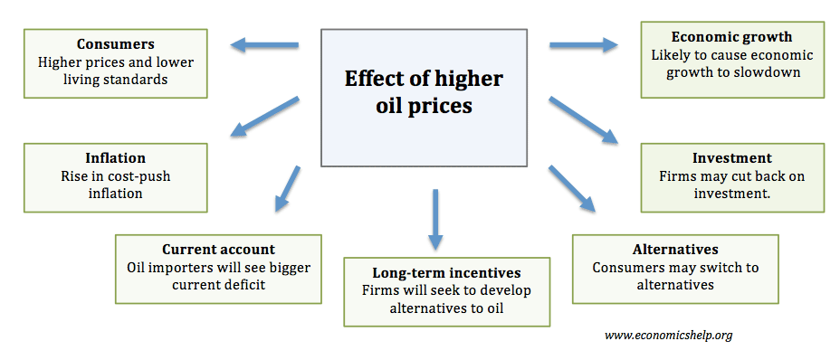

The dynamic fluctuations in oil prices significantly influence the global economy and energy market. As one of the world's most crucial commodities, oil serves as a vital energy source and an economic barometer, affecting everything from transportation and manufacturing to geopolitics and environmental policies. Elevated oil prices often present challenges, such as increased production costs and inflationary pressures. However, these price surges can also unlock economic opportunities across various sectors. For instance, they can stimulate investment in oil exploration and production activities and catalyze the development of alternative energy sources, driving innovation and diversification within the energy sector.

Algorithmic trading has revolutionized the energy markets, introducing advanced technological solutions and efficiencies. This trading approach relies on computer algorithms to analyze market data and execute trades, thus transforming traditional trading methods. By efficiently processing vast amounts of information, algorithmic trading can enhance decision-making and market predictions, providing stakeholders with valuable insights and competitive advantages.

This article examines the economic benefits associated with rising oil prices and investigates the transformative impact of algorithmic trading within the energy market. The interplay between these two elements is crucial for understanding current market dynamics and future trends in the energy sector.

## Table of Contents

## Economic Benefits of Rising Oil Prices

Rising oil prices are often perceived as a challenge, particularly due to their potential to increase costs for consumers and businesses. However, they also present numerous economic benefits, particularly within the energy sector. When oil prices rise, they stimulate a surge of activity and investment that can lead to significant economic growth and innovation.

Firstly, increased oil prices lead to substantial investments in oil exploration and production. Companies in the energy sector are incentivized to allocate more resources to uncover new oil reserves and enhance extraction technologies. This increases the capacity and efficiency of oil production. Such investments can have a multiplier effect, as they often lead to the development of related industries, such as drilling equipment manufacturing and oilfield services.

Moreover, higher oil prices provide a compelling economic case for the development and adoption of alternative energy technologies. As traditional fossil fuel options become more expensive, renewable energy sources like wind, solar, and biofuels become more cost-competitive. This encourages investment in research, development, and deployment of clean energy technologies, which can lead to energy diversification and a reduction in greenhouse gas emissions.

The economic benefits of rising oil prices also manifest in job creation and the opening of new market opportunities within the renewable sector. As energy companies expand operations and explore new technologies, they require skilled labor in engineering, manufacturing, and research. This growth in employment can improve household incomes and stimulate regional economies, particularly in areas rich in natural resources.

Furthermore, there is a ripple effect on consumer spending as increased wages and energy sector growth trickle through the economy. Workers who benefit from new jobs and higher salaries can increase their spending on goods and services, which benefits other sectors such as retail and hospitality. This effect can boost overall economic activity and contribute to a virtuous cycle of growth.

In summary, while higher oil prices can initially present challenges, they also drive significant economic benefits by promoting investment, innovation, and job creation within and beyond the energy sector.

## Impact of Oil Prices on Behavioral Change

Higher oil prices can significantly influence consumer behavior, driving a shift towards increased efficiency and reduced consumption of energy resources. The economic principle behind this change is rooted in the price elasticity of demand, which measures how sensitive the quantity demanded is to a change in price. When oil prices rise, the cost of products and services dependant on oil also increases, encouraging consumers to modify their behavior to mitigate these higher costs.

One observable adjustment is the tendency for consumers to prioritize energy efficiency. This can manifest in several ways, such as opting for fuel-efficient vehicles, investing in home insulation, or adopting more efficient appliances. By reducing overall energy consumption, consumers can achieve long-term savings, thus creating an incentive structure for more efficient practices. This shift can stimulate technological advancements and innovations, leading to an overall reduction in energy use.

Moreover, businesses also respond to rising oil prices by innovating and reducing their dependence on oil. This often involves the adoption of alternative energy sources and the implementation of energy-saving technologies. Companies might redesign their logistics and supply chains to minimize transportation costs or invest in on-site renewable energy solutions like solar panels. The net effect of these strategies can culminate in a more dynamic and adaptive economic environment, fostering competitive markets that prioritize sustainable practices.

The broader impact of these changes is a step towards a more sustainable energy consumption pattern. As more entities, both consumers and businesses, strive to reduce their reliance on oil, there is a gradual shift toward cleaner energy sources. This behavioral change is not only an adaptive response to rising costs but also aligns with global initiatives to combat climate change and reduce carbon emissions.

In conclusion, the increase in oil prices serves as a catalyst for behavioral change among consumers and businesses. By prompting a shift towards efficiency and innovation, higher oil prices can inadvertently drive the transition to a more sustainable energy landscape, enhancing environmental quality while sustaining economic growth.

 to Algorithmic Trading in Energy Markets

Algorithmic trading, often referred to as algo trading, employs sophisticated computer algorithms to facilitate trading and generate strategic signals. This approach has increasingly permeated the power and gas markets due to its remarkable ability to handle extensive datasets and perform rapid analysis. At its core, [algorithmic trading](/wiki/algorithmic-trading) automates the trade execution process, minimizing human intervention and exploiting the computational speed and efficiency of modern computing systems.

The fundamental mechanics of algorithmic trading involve three primary components: data analysis, signal generation, and trade execution. Algorithms analyze a multitude of data sources, including historical prices, market indicators, and even external factors such as weather patterns, which are particularly relevant in energy markets. Based on this analysis, the algorithms generate signals to decide whether to buy or sell a particular commodity, and subsequently execute trades, often within fractions of a second.

One significant advantage of algorithmic trading in the power and gas markets lies in its ability to process and interpret large volumes of data at unrivaled speeds. Energy markets are characterized by their complexity and the need for real-time decision-making. Algorithms can continuously monitor market conditions, detect patterns, and respond to fluctuations almost instantaneously, providing traders with a competitive edge. This real-time processing capability is critical, given the [volatility](/wiki/volatility-trading-strategies) and fast-paced nature of energy trading.

The rapid growth of algorithmic trading in these sectors is driven by technological advancements and increasing market complexity. As energy markets globalize and integrate, the sheer [volume](/wiki/volume-trading-strategy) of data and the speed at which market conditions change require more sophisticated tools to manage risks and identify opportunities. Advances in [machine learning](/wiki/machine-learning) and [artificial intelligence](/wiki/ai-artificial-intelligence) further enhance the capability of algo trading systems, allowing them to learn from new data and improve their predictive abilities over time.

Algorithmic trading also introduces enhanced transparency and consistency in trade execution. By eliminating human bias and error, algorithms ensure that trades are executed based on pre-defined strategies, thus maintaining a level of consistency that is difficult to achieve through manual trading. This consistency is particularly beneficial in maintaining optimal trading strategies in the highly dynamic energy market environment.

Overall, the integration of algorithmic trading into power and gas markets represents a significant shift towards increased efficiency and data-driven strategies in the energy sector, substantially improving the ability to navigate complex trading landscapes.

## Uses and Benefits of Algorithmic Trading

Algorithmic trading, commonly referred to as algo trading, is a transformative force in the energy markets due to its ability to handle vast datasets and execute trades at unprecedented speeds. One of the primary benefits of algorithmic trading is its contribution to price forecasting and optimization. By analyzing historical data and market signals, algorithms can predict future price movements with a high degree of accuracy. This allows for efficient market monitoring and enables traders to make informed decisions rapidly. For instance, machine learning models such as linear regression, decision trees, and neural networks are employed to identify patterns and correlations in energy prices, enhancing forecasting capabilities.

Algo trading also facilitates the identification and exploitation of [arbitrage](/wiki/arbitrage) opportunities. Arbitrage involves the simultaneous purchase and sale of an asset to profit from a difference in price across different markets or products. Algorithms scan multiple markets to detect these discrepancies, executing trades in fractions of a second to secure profits before the market adjusts. This action enhances market efficiency by reducing price mismatches and ensuring [liquidity](/wiki/liquidity-risk-premium).

Moreover, algorithmic trading provides robust real-time risk management and strategy implementation. The integration of advanced artificial intelligence (AI) tools allows for the continuous assessment of market conditions and the rebalancing of trading portfolios. Algorithms can automatically adjust strategies based on market volatility, thus minimizing potential losses and optimizing returns. For example, the use of [reinforcement learning](/wiki/reinforcement-learning), a type of AI where models learn optimal decision-making through trial and error, can dynamically alter trading strategies in response to real-time data.

The real-time processing capabilities of algorithmic trading systems ensure that traders can manage risk more effectively. By assessing market positions and exposure instantaneously, these systems can trigger pre-programmed responses to mitigate potential risks. For instance, if a market position reaches a certain threshold of risk, the algorithm can instantly execute trades to hedge against unfavorable movements.

In summary, algorithmic trading enhances energy market operations by improving price forecasting, optimizing trades, creating arbitrage opportunities, and facilitating sophisticated risk management strategies. Its use of AI and machine learning continues to evolve, promising further innovations and efficiencies. This technological advancement offers significant potential for market participants aiming to navigate the complexities of the modern energy trading environment effectively.

## Challenges and Risks in Algorithmic Trading

Algorithmic trading, while offering numerous benefits, also presents a set of challenges and risks that can impact market dynamics. A significant concern associated with algorithmic trading is the potential for increased market volatility. The rapid execution of trades by algorithms can lead to erratic price movements, especially during periods of low liquidity or heightened uncertainty. For instance, algorithmic trading can contribute to "flash crashes," where prices plummet briefly before rebounding, creating temporary disarray in the market.

Market manipulation poses another risk, where traders might use algorithms to execute strategies like "spoofing." Spoofing involves placing large orders with the intent to cancel them before execution, thus misleading other market participants about supply and demand conditions. This can distort market prices and erode confidence in the fairness of trading systems.

To address these challenges, regulatory frameworks such as MiFID II (Markets in Financial Instruments Directive) in the European Union and REMIT (Regulation on Wholesale Energy Market Integrity and Transparency) have been implemented to provide oversight of algorithmic trading activities. MiFID II seeks to enhance transparency and reduce systemic risks by introducing requirements for algorithmic trading firms to test their algorithms and maintain rigorous risk controls. REMIT aims to detect and deter market manipulation and insider trading within the energy markets, ensuring that trading remains honest and transparent.

Market participants employ various strategies to manage these risks, including the implementation of advanced algorithm testing procedures and real-time monitoring systems. These systems are capable of detecting unusual trading patterns or anomalies that may indicate manipulation or potential algotrading-induced disruptions, enabling rapid intervention.

Moreover, the development of ethical guidelines and principles for algorithmic trading is ongoing, emphasizing the responsibility of trading firms to ensure that their algorithms behave fairly and transparently. As algorithmic trading continues to evolve and integrate with emerging technologies like artificial intelligence, balancing innovation with effective regulatory oversight remains a critical focus for the industry.

## Regulatory Overview and Future Prospects

Regulatory bodies in the European Union (EU), United Kingdom (UK), and the United States (USA) are actively developing and refining guidelines to oversee the ethical and effective use of algorithmic trading in energy markets. These regulations are designed to ensure transparency, market integrity, and to minimize potential risks such as market manipulation or excessive volatility induced by automated trading systems.

In the EU, the Markets in Financial Instruments Directive II (MiFID II) and Regulation on Wholesale Energy Market Integrity and Transparency (REMIT) are foundational frameworks that address algorithmic trading. MiFID II emphasizes requirements for high-frequency trading transparency, including obligations for reporting and risk controls. REMIT targets the wholesale energy market, mandating market participants to report potentially manipulative behaviors and ensuring transparency in trade activities. Together, these regulations create an environment designed to promote fair competition and safeguard market stability.

The UK, post-Brexit, is aligning its regulatory framework with the EU while also exploring tailored strategies. The Financial Conduct Authority (FCA) in the UK is enhancing oversight through robust monitoring and reporting standards tailored to domestic markets, while also incorporating international best practices.

In the USA, the Securities and Exchange Commission (SEC) and the Commodity Futures Trading Commission (CFTC) are the primary regulatory bodies. Their focus includes ensuring that algorithmic trading practices adhere to fair trade principles and do not compromise market integrity. Regulatory measures such as the Consolidated Audit Trail (CAT) are implemented for comprehensive tracking of trading activities, thus providing necessary oversight and transparency.

The integration of Artificial Intelligence (AI) in trading algorithms offers both significant opportunities and regulatory challenges. AI enables enhanced predictive analytics and adaptive algorithms, leading to efficient trading strategies. However, it also introduces complexities such as the "black-box" nature of some AI systems, which can obscure decision-making processes. Regulators are thus tasked with balancing innovation with accountability, ensuring that AI-driven trading systems remain transparent and understandable.

Future prospects for regulatory frameworks will likely involve more stringent guidelines to address the growing complexities of AI and algorithmic trading. Possible developments include standardized ethical guidelines for AI use, enhanced data protection measures, and improved international cooperation to manage cross-border trading activities. As technology evolves, regulatory frameworks must adapt to mitigate emerging risks while fostering an innovative and competitive energy market landscape.

## Conclusion

The interplay between oil prices and algorithmic trading presents substantial economic advantages and enhances market efficiencies. As oil prices rise, they often catalyze increased capital flow into the energy sector, encouraging exploration, production, and innovation. These investments lead to ripple effects across the global economy, fostering advancements not only within fossil fuels but also in alternative energy technologies. Concurrently, algorithmic trading is transforming how market participants respond to these price dynamics. By employing sophisticated computer algorithms, stakeholders can process large datasets to optimize trading strategies and improve predictive accuracy. This capability leads to enhanced decision-making processes and can generate substantial monetary benefits.

Despite its advantages, algorithmic trading faces challenges, including the potential for increased market volatility and the risk of market manipulation. Nevertheless, market participants are continually refining their strategies to mitigate these risks, supported by emerging regulatory frameworks designed to ensure ethical trading practices. Institutions such as the MiFID II and REMIT are integral in providing oversight and structure, guiding the evolution of trading activities.

Strategic utilization of algorithmic trading holds the potential to bolster the resilience and innovation within energy markets. As artificial intelligence and machine learning technologies evolve, they provide new opportunities for advancements in trading algorithms. The progression of these technologies promises to deliver greater precision and efficiency, facilitating more dynamic market interactions and fostering robust economic growth within the energy sector. Ultimately, this progression highlights a promising trajectory toward more efficient and adaptive energy markets, driven by the powerful fusion of innovative trading solutions and strategic economic investment.

## References & Further Reading

[1]: Yergin, D. (2011). ["The Quest: Energy, Security, and the Remaking of the Modern World."](https://archive.org/details/questenergysecur0000yerg) Penguin Books. 

[2]: Merkley, M. J., & Levin, E. I. (2014). ["Impact of Algorithmic Trading in Financial Markets."](https://www.sciencedirect.com/science/article/pii/S0957417422006479) Finance Research Letters.

[3]: Geman, H. (2005). ["Commodities and Commodity Derivatives: Modeling and Pricing for Agriculturals, Metals and Energy."](https://download.e-bookshelf.de/download/0000/5675/90/L-G-0000567590-0015270354.pdf) John Wiley & Sons.

[4]: Dargay, J. M., & Gately, D. (1997). ["The Demand for Transportation Fuels: Imperfect Price-Reversibility?"](https://www.sciencedirect.com/science/article/pii/S0191261596000148) Energy Policy.

[5]: Wooldridge, J. M. (2015). ["Introductory Econometrics: A Modern Approach."](https://faculty.cengage.com/titles/9781337558860) South-Western College Pub.

[6]: Fleming, M. J., & Kirby, C. L. (2011). ["Long Memory in Volatility and Trading Volume."](http://www.ruf.rice.edu/~jfleming/pub/jbf2011.pdf) Journal of Banking & Finance.

[7]: Hasbrouck, J., & Saar, G. (2013). ["Low Latency Trading."](https://www.sciencedirect.com/science/article/abs/pii/S1386418113000165) The Review of Financial Studies.