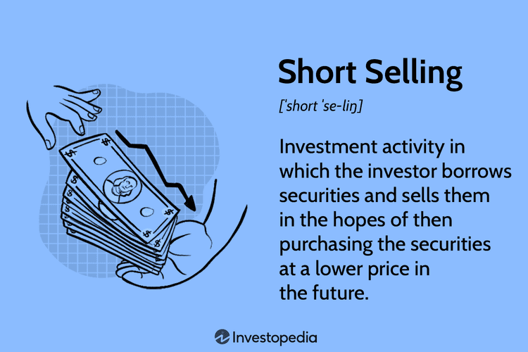

Financial markets are pivotal structures in the global economy, serving as arenas for the exchange of capital and financial assets. They underpin economic growth by providing businesses and governments with access to capital, which facilitates investment, innovation, and ultimately, economic expansion. These markets enable the efficient allocation of resources, ensuring that funds are directed toward the most promising enterprises and projects. 

Among the myriad operations taking place within financial markets, lending shares, short selling, and algorithmic trading stand out due to their intricate roles and significant impact. Share lending involves the temporary transfer of securities to a borrower, typically a trader or an investment entity, with the understanding that these will be returned later. This practice is crucial as it supports short selling, where traders sell borrowed shares with the hope of buying them back at a lower price, anticipating a decline in the stock's value. Short selling provides liquidity and can enhance price discovery by allowing traders to express negative views on stock prices.



Algorithmic trading, or algo trading, employs computer algorithms to execute large volumes of trades at speeds unattainable by human traders. It leverages mathematical models and historical data to devise strategies that can capitalize on tiny market inefficiencies faster and more accurately than manual trading. This innovation has dramatically transformed modern markets by increasing the speed of transactions, improving liquidity, and reducing transaction costs.

Understanding these components is vital for investors and market participants because they contribute to market dynamics crucially affecting investment decisions and risk management. Their interplay influences not only individual investment outcomes but also the broader market environment, impacting factors like volatility, liquidity, and market efficiency.

This article aims to explore how these elements—lending shares, short selling, and algorithmic trading—not only operate independently but also interact within financial markets. It examines their roles, benefits, risks, and interconnections, offering insights into their collective influence on market behavior and investor strategies. Such an examination is essential for comprehending the complexities of today's financial markets and the prospects for their future development.

## Table of Contents

## Understanding Financial Markets

Financial markets are integral systems that facilitate the exchange of capital between individuals, institutions, and governments. These markets enable the efficient allocation of resources by matching those with capital to lend or invest with those in need of capital for various purposes, such as business expansion, infrastructure development, or consumer spending. By doing so, they play a crucial role in the overall economy by supporting growth, innovation, and financial stability.

There are several types of financial markets, each serving distinct purposes:

1. **Stock Markets**: These markets provide a platform for buying and selling equity shares of public companies. They enable companies to raise capital by issuing shares to the public in exchange for ownership stakes. Major stock markets include the New York Stock Exchange (NYSE), Nasdaq, and the London Stock Exchange.

2. **Bond Markets**: Also known as debt markets, these markets involve the issuance and trading of debt securities, such as government and corporate bonds. Bond markets allow entities to borrow capital from investors with the promise of repaying with interest. Examples include treasuries issued by governments and corporate bonds issued by companies.

3. **Derivatives Markets**: These markets involve financial instruments derived from underlying assets, such as stocks, bonds, commodities, or currencies. Common derivatives include futures, options, and swaps. Derivatives are used for hedging risks, speculating on price movements, and enhancing portfolio returns.

Each of these markets involves various participants playing critical roles:

- **Investors**: Both retail and institutional investors participate in buying and selling securities, seeking returns on their investments.
- **Brokers and Dealers**: These intermediaries facilitate transactions between buyers and sellers, often providing liquidity to markets.
- **Issuers**: Companies and governments that issue stocks, bonds, or other securities to raise capital.
- **Regulators**: Governmental bodies and institutions oversee the functioning of financial markets to ensure fairness, transparency, and stability.

Technological advancements have significantly transformed financial markets, enhancing their efficiency and accessibility. Innovations like electronic trading platforms, fintech solutions, and [algorithmic trading](/wiki/algorithmic-trading) have streamlined market operations, reducing transaction times and costs. High-frequency trading, powered by sophisticated algorithms and computer systems, exploits price discrepancies and [liquidity](/wiki/liquidity-risk-premium) imbalances, contributing to greater market efficiency but also raising concerns about [volatility](/wiki/volatility-trading-strategies) and systemic risk[1].

Moreover, the integration of blockchain technology and cryptocurrencies is progressively reshaping traditional financial markets. These technologies promise faster transactions, lower fees, and enhanced security, although they also introduce new regulatory and operational challenges.

In conclusion, financial markets are fundamental to the functioning of the global economy by facilitating capital flow, offering investment opportunities, and supporting economic growth. The continuous evolution of these markets, driven by technological progress, presents both opportunities and challenges for participants and regulators alike.

---

[1] Aldridge, I. (2013). _High-Frequency Trading: A Practical Guide to Algorithmic Strategies and Trading Systems_. Wiley.

## Lending Shares: How It Works

Share lending is a crucial component of the financial ecosystem, facilitating various market activities, including short selling and enhancing liquidity. This practice involves the temporary transfer of securities from a lender to a borrower, typically facilitated by intermediaries like brokerage firms or custodial banks.

### The Process: Lending and Borrowing Shares

The share lending process begins with the lender, often institutional investors such as pension funds or mutual funds, offering their securities to borrowers. This is usually facilitated through a lending agent or financial intermediary that identifies borrowers in need of shares. Borrowers, typically hedge funds or individual traders, seek to borrow shares mainly to sell short, aiming to profit from a decline in the stock's price.

The lending transaction is governed by a securities lending agreement, which specifies the terms, including the duration of the loan, the collateral required, and the lending fee. The borrower provides collateral, usually in the form of cash or other securities, with a value slightly greater than the loaned shares to protect the lender. Lenders earn a fee for their securities, which is negotiated based on demand, supply, and market conditions. Simultaneously, the borrower gets the ability to execute strategies that involve the short sale of the borrowed securities.

Here's a basic Python code snippet that illustrates how collateral might be calculated:

```python
def calculate_collateral(loaned_shares_value, collateral_rate=0.02):
    # Assuming a default collateral rate of 2%
    collateral = loaned_shares_value * (1 + collateral_rate)
    return collateral

loaned_shares_value = 100000  # Example value in USD
collateral = calculate_collateral(loaned_shares_value)
print("Required Collateral: ${}".format(collateral))
```

### Benefits for Lenders and Borrowers

For lenders, the primary benefit of lending shares is [earning](/wiki/earning-announcement) additional income through the fees charged for the securities loaned. This provides an opportunity to generate returns on otherwise idle assets.

Borrowers benefit by gaining access to shares they do not own, enabling strategies such as short selling, hedging, or [arbitrage](/wiki/arbitrage). This flexibility can lead to profit opportunities in fluctuating markets.

### Risks and Considerations

While share lending offers benefits, it also involves risks. For lenders, these include counterparty risk—the possibility that the borrower may default and fail to return the shares. This risk is mitigated by over-collateralization and daily mark-to-market adjustments, ensuring the collateral reflects the current market value of the securities.

Borrowers face the risk of a short squeeze, where rapidly rising stock prices force them to cover their short positions at higher prices, potentially resulting in significant losses. Additionally, regulatory changes or corporate actions affecting the borrowed securities can also pose challenges.

In conclusion, while share lending is integral to modern financial markets, involving benefits like improved liquidity and additional income, participants must carefully navigate the associated risks.

## Short Selling Explained

Short selling is a trading strategy employed in financial markets that involves selling securities, such as stocks, that the seller does not currently own, with the intention of repurchasing them later at a lower price. This practice allows investors to profit from a decline in the security's price. Essentially, an investor borrows shares from another party, usually through a broker, and sells them on the open market. The investor later buys back the shares to return to the lender, ideally at a reduced price, thereby earning a profit from the difference.

The primary motivations behind short selling include profiting from anticipated declines in security prices and hedging against potential losses in other investments. Investors may short sell a stock if they believe it is overvalued or if they expect negative news to affect its price. Additionally, short selling can serve as a hedge against potential losses in long positions or the overall market downturn.

Short selling is subject to a regulatory framework designed to maintain market stability and protect investors. Regulations often require short sellers to adhere to certain rules, such as the uptick rule, which mandates that a short sale can only be executed at a price higher than the last traded price. This aims to prevent short sellers from driving stock prices down in a declining market. Moreover, short sellers are typically required to meet margin requirements, ensuring they have sufficient collateral to cover potential losses.

However, short selling is surrounded by controversies and often faces negative public perception. Critics argue that short selling can exacerbate market declines and contribute to volatility, as it involves betting against the success of companies. It has been particularly controversial during periods of financial instability, with some blaming it for amplifying market downturns. Proponents, however, assert that short selling provides valuable market functions, such as improving liquidity and aiding in price discovery by reflecting negative information more quickly in stock prices.

Despite the controversies, short selling remains an integral part of financial markets, facilitating risk management and investment strategies for a wide range of market participants. As financial markets continue to evolve, so too may the practices and regulations surrounding short selling, adapting to ensure a balance between beneficial market activities and investor protection.

## The Rise of Algorithmic Trading

Algorithmic trading refers to the use of computer algorithms to manage the trading process, from generating orders to executing them. This practice has revolutionized financial markets by increasing the speed, efficiency, and accuracy of transactions. Algorithms can process vast amounts of data more effectively than humans, making them indispensable in modern trading environments.

The roots of algorithmic trading trace back to the 1970s when Richard Donchian pioneered the use of computerized rules for futures trading, laying the groundwork for future developments. The rise of electronic communication networks (ECNs) in the 1990s facilitated more widespread adoption, allowing for high-frequency trading and other sophisticated strategies. Today, algorithmic trading accounts for a significant portion of stock market transactions, with estimates suggesting that it represents at least 60% to 70% of trading in the United States.

Several algorithmic strategies are prevalent in financial markets:

1. **Market Making**: Market-making algorithms provide liquidity by continuously quoting buy and sell prices. They profit from the bid-ask spread, enhancing market depth and efficiency.

2. **Arbitrage**: Arbitrage strategies exploit price discrepancies between different markets or instruments. Algorithms can detect and act on these opportunities with high precision and speed, promoting price convergence and market equilibrium.

3. **Trend Following**: These algorithms identify and exploit price trends in assets. Using technical indicators, they generate buy or sell signals based on the direction of the market, often employing strategies like moving average crossings.

Algorithmic trading offers several advantages for market efficiency. It reduces transaction costs by minimizing manual errors and slippage—the difference between expected and actual transaction costs. It also enhances liquidity and contributes to tighter bid-ask spreads. However, algorithmic trading is not without its challenges. The reliance on speed can increase market volatility, particularly during periods of stress, as evidenced by events like the 2010 Flash Crash. Furthermore, the complexity of algorithms can lead to unintended consequences or exacerbate systemic risks.

Overall, algorithmic trading is a double-edged sword. While it brings substantial benefits in terms of market liquidity and efficiency, it also poses challenges that require diligent regulatory oversight and robust risk management practices. As technology advances, the role of algorithms in trading will likely continue to grow, shaping the future landscape of financial markets.

## Interconnections: Lending Shares, Short Selling, and Algo Trading

Lending shares, short selling, and algorithmic trading are interrelated components of modern financial markets, each playing a crucial role in liquidity, efficiency, and price discovery.

Lending shares is a fundamental process that enables short selling. In a typical short sale, an investor borrows shares of a security from another investor, sells them on the open market, and aims to repurchase them later at a lower price to return to the lender, thus profiting from the price difference. Share lending is essential because it provides the securities required for short selling, allowing market participants to speculate on price declines and contribute to a more accurate reflection of a security's true value through price discovery.

Algorithmic trading, particularly its role in executing large short selling orders, enhances the efficiency of these transactions. Algorithms are designed to handle significant trade volumes while minimizing market impact and reducing transaction costs. They can analyze vast datasets rapidly, executing trades when favorable conditions are identified, often breaking large orders into smaller ones to avoid sudden market disturbances. This capability is critical in short selling, where large orders could otherwise lead to abrupt price movements that erode profitability.

The interaction between algorithmic trading and share lending significantly impacts the dynamics of short interest in financial markets. High-frequency traders and quantitative hedge funds often utilize complex algorithms that depend on real-time data from share lending markets. Algorithmic strategies can identify stocks with high short interest, often considered indicators of negative market sentiment, potentially signaling further share price declines. By exploiting inefficiencies in the pricing of these securities, algorithms can generate substantial returns.

Case studies provide insight into how these elements synergize within financial markets. For example, during periods of market stress or volatility, the increased demand for borrowed shares may lead to higher lending fees, which can, in turn, affect short selling profitability. In these scenarios, algorithmic trading solutions can optimize short selling strategies, dynamically adjusting to shifting borrowing costs and availability. The 2008 financial crisis highlighted the risks and rewards of these interconnected practices when numerous financial institutions found themselves overexposed to short positions.

Notable case studies include the GameStop short squeeze of 2021, where retail investors, in large numbers, bought shares heavily shorted by institutional investors, leading to significant losses for those short sellers. High-speed algorithms played a part in both the execution of short selling and the rapid evaluation and execution of trades as the situation evolved. 

The interplay among lending shares, short selling, and algorithmic trading thus contributes significantly to market functions, influencing liquidity, volatility, and the overall financial ecosystem. Understanding these dynamics is vital for market participants who must navigate the complexities and opportunities within modern stock exchanges.

## Potential Risks and Challenges

Financial markets exhibit a complex interplay between lending shares, short selling, and algorithmic trading. This combination can introduce significant systemic risks. Share lending acts as a facilitator for short selling, allowing investors to borrow shares and sell them in anticipation of a decline in price. While this can enhance market liquidity and contribute to price discovery, it also creates potential vulnerabilities. If a large number of borrowed shares are sold short simultaneously, it can lead to severe downward pressure on stock prices, potentially destabilizing the market.

Moreover, the integration of algorithmic trading introduces additional layers of complexity. High-frequency trading ([HFT](/wiki/high-frequency-trading-strategies)) strategies, often employed in algorithmic trading, can exacerbate market volatility. Algorithms can rapidly amplify selling pressure by initiating massive sell orders within milliseconds, potentially triggering a cascade of downward pricing adjustments. This raises concerns about flash crashes and extreme price swings, which can undermine market confidence.

The potential for market manipulation is another key concern. With the advanced technology accompanying algorithmic trading, sophisticated strategies like "spoofing"—where traders place large orders they have no intention of executing to deceive other market participants—can be executed with relative ease. This manipulative behavior disrupts fair market functioning, prompting regulatory bodies to enhance surveillance mechanisms and impose stricter regulations.

Technological challenges further compound these risks. Algorithmic trading systems require robust infrastructure capable of handling vast amounts of data in real-time. Any technical glitches or malfunctions can lead to erroneous trades, contributing to unintended market disruptions. The need for comprehensive risk management systems cannot be overstated; these systems must be capable of monitoring and controlling algorithmic trades to prevent systemic failures.

Regulators play a critical role in mitigating these risks while ensuring market stability. They face the challenge of balancing innovation and regulation. On one hand, they must encourage technological advancements and the efficiencies brought by algorithmic trading. On the other hand, they are tasked with implementing measures to prevent exploitation and protect market integrity. This includes setting position limits, requiring transparency in algorithms, and monitoring short-selling activities to prevent excessive risk accumulation.

In conclusion, while the confluence of share lending, short selling, and algorithmic trading presents opportunities for enhanced market liquidity and efficiency, it also necessitates a vigilant approach to risk management. Collaborative efforts between market participants and regulators are essential in achieving a stable and resilient financial market ecosystem.

## Conclusion

The conclusion draws together the key insights from the analysis of lending shares, short selling, and algorithmic trading within financial markets. These three elements serve crucial roles in enhancing market liquidity and efficiency. Lending shares allows for the borrowing required for short selling, which in turn contributes to price discovery and market liquidity. This interplay provides flexibility and dynamism to markets, enabling participants to express bearish sentiments and hedge positions efficiently.

Short selling, while sometimes controversial, remains an integral mechanism for correcting overpriced assets. By allowing traders to profit from falling prices, it introduces a counterbalance against excessive optimism in markets. Additionally, short selling aids in reflecting accurate asset values, contributing to market efficiency. However, the practice requires careful regulation to mitigate risks of market manipulation and excessive volatility.

Algorithmic trading has revolutionized market operations by executing trades at speeds and efficiencies unattainable by humans. Through various strategies like arbitrage and [market making](/wiki/market-making), this form of trading enhances market depth and liquidity. Nevertheless, its rise necessitates advanced risk management frameworks to address potential systemic risks, as the rapid pace of trades can exacerbate market movements during periods of stress.

Looking forward, technological advancements in AI and [machine learning](/wiki/machine-learning) are expected to further influence financial markets, potentially leading to more sophisticated trading algorithms. The integration of blockchain technologies might also impact share lending and trading processes by enhancing transparency and reducing settlement times. Meanwhile, regulatory frameworks will need to evolve continually to keep pace with these innovations, ensuring market stability and protecting investors.

In conclusion, lending shares, short selling, and algorithmic trading are indispensable components of modern financial markets. They collectively enhance the robustness and adaptability of trading environments. As markets continue to evolve, understanding these elements will be imperative for investors and market participants aiming to navigate the complexities of financial trading and investment successfully.

## References & Further Reading

[1]: Aldridge, I. (2013). ["High-Frequency Trading: A Practical Guide to Algorithmic Strategies and Trading Systems"](https://www.amazon.com/High-Frequency-Trading-Practical-Algorithmic-Strategies/dp/1118343506). Wiley.

[2]: Lopez de Prado, M. (2018). ["Advances in Financial Machine Learning"](https://www.amazon.com/Advances-Financial-Machine-Learning-Marcos/dp/1119482089). Wiley.

[3]: Stangl, J. and de Beer, J. (2018). ["Algorithmic Trading Strategies Using Python and R"](https://link.springer.com/book/10.1007/978-1-4842-9675-2).

[4]: BlackRock. (2021). ["A Primer on Securities Lending"](https://papers.ssrn.com/sol3/papers.cfm?abstract_id=4769483).

[5]: Pardo, R. (2008). ["The Evaluation and Optimization of Trading Strategies"](https://onlinelibrary.wiley.com/doi/book/10.1002/9781119196969). Wiley.

These references provide additional insights and a deeper understanding of the interconnected elements of financial markets, focusing specifically on the roles and implications of algorithmic trading, short selling, and share lending.