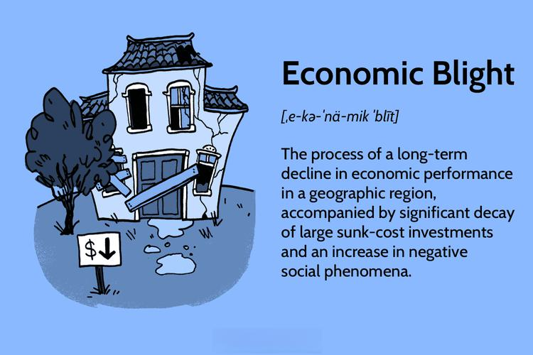

In recent years, the intertwining of economic blight, economic impact, and economic decline has profoundly affected various geographical regions. Economic blight, characterized by the visible decay of infrastructure and social fabric, often results from deindustrialization and population loss. This decline not only undermines local economies but also diminishes public revenue streams, influencing both social and economic structures.

Algorithmic trading (algo trading) introduces another layer of complexity within this context, significantly impacting financial markets during periods of economic disruption. Algo trading employs complex computer algorithms to execute trades at speeds and efficiencies unachievable by human traders, thus transforming the dynamics of trading in both stable and turbulent times. This mechanism has the potential to magnify trading volumes and market volatility, particularly during times of economic stress.



The interrelationship between economic decline and algo trading presents a multifaceted challenge for investors and policymakers. Understanding how these dynamics interact is crucial for devising strategies to mitigate adverse effects and harness potential opportunities. The following sections of this article will explore these relationships in depth, examining the nuances of economic blight and decline and investigating how algorithmic trading systems adapt and respond to such economic conditions.

## Table of Contents

## Understanding Economic Blight

Economic blight is characterized by the visible decay and decline of certain geographical regions, often linked to deindustrialization and population loss. These regions, once thriving industrial hubs, face significant economic challenges that manifest visibly in their infrastructure and community dynamics.

Deindustrialization refers to the reduction or cessation of industrial activity in a region, often leading to job losses and economic decline. This phenomenon is particularly prevalent in areas known as the Rust Belt in the United States, which spans parts of the Midwest and Northeast. Cities such as Detroit, Michigan, and Cleveland, Ohio, serve as prominent examples of regions affected by economic blight. The decline in manufacturing jobs in these areas led to large-scale unemployment and population loss, initiating a cycle of decay. 

Key characteristics of economic blight include deteriorating infrastructure and increased crime rates. When industries close or relocate, they leave behind vacated factories and unused infrastructure, which quickly fall into disrepair due to lack of maintenance and investment. The resulting urban decay can lead to decreased aesthetic appeal and lower property values, further deterring investment and new business growth.

Increased crime rates are another significant attribute of economically blighted areas. As economic opportunities diminish, communities may experience higher rates of poverty and social unrest, contributing to an environment where crime can proliferate. The correlation between economic distress and crime poses a challenge for local governments striving to maintain public safety with reduced financial resources.

Efforts to address economic blight often focus on revitalizing these regions by attracting new industries and improving infrastructure. For instance, urban renewal projects may aim to restore historic buildings, upgrade transportation systems, and enhance public spaces to attract businesses and residents back to the area. Despite these challenges, some regions have made strides in overcoming economic blight by embracing technological innovation and diversifying their economic bases.

## Economic Impact of Blight and Decline

Economic blight significantly impacts local economies, primarily through reduced tax revenue. As businesses close and property values decline, municipalities collect less in taxes, which undermines their ability to maintain public services such as education, transportation, and public safety. This decrease in revenue creates a vicious cycle, as deteriorating services further discourage investment and exacerbate population decline.

Additionally, local businesses suffer directly due to decreased consumer spending, often exacerbated by an aging population. Older populations typically possess lower spending power and are less likely to invest in new local enterprises. This reduced consumption further inhibits business growth and entrepreneurship, leading to fewer job opportunities and increased unemployment. Data often show a correlation between aging demographics and economic stagnation in blighted areas.

Efforts to reverse economic blight commonly focus on attracting new industries. This can be accomplished through tax incentives, grants, and other financial benefits to encourage companies to invest in these areas. Moreover, emphasis is placed on improving infrastructure, which can include revitalizing transportation networks, updating utilities, and enhancing digital connectivity. Such improvements are crucial for making regions more appealing to both businesses and residents. By modernizing infrastructure, these regions can become more competitive, offering the necessary tools and environment conducive for economic regrowth and diversification.

Governments and communities frequently collaborate to design comprehensive revitalization strategies that integrate economic development with social programs aimed at improving quality of life and restoring economic vitality. These strategies might involve public-private partnerships and community engagement to ensure sustainable development and inclusivity.

## Algorithmic Trading: A Modern Financial Tool

Algorithmic trading is a sophisticated method of buying and selling financial instruments using pre-programmed instructions, accounting for variables like timing, price, and [volume](/wiki/volume-trading-strategy). This technology-driven approach allows traders to execute orders with remarkable speed and efficiency, leveraging computational power to process complex algorithms and vast amounts of market data.

A primary benefit of [algorithmic trading](/wiki/algorithmic-trading) is its contribution to market [liquidity](/wiki/liquidity-risk-premium) and stability. Algorithmic systems can execute a high volume of trades simultaneously, narrowing bid-ask spreads and enhancing overall market fluidity. This increased liquidity is crucial for efficient market operations, as it allows for more seamless transactions and can reduce costs for traders.

These systems are particularly adept at responding to rapid market changes. During periods of economic decline, when market [volatility](/wiki/volatility-trading-strategies) may increase, algorithmic trading programs adjust their strategies in real-time. For instance, they might detect [arbitrage](/wiki/arbitrage) opportunities by identifying price discrepancies across different markets or financial products, thereby capitalizing on short-term price movements. This capability to quickly react and adapt to market shifts enables algorithmic trading to both exploit and mitigate the effects of economic fluctuations.

However, while algorithmic trading can bolster market stability, it also has the potential to exacerbate market stress under certain conditions. Rapid execution speeds can lead to increased market instability, particularly if multiple algorithms are programmed to sell or buy simultaneously in response to specific triggers. This was exemplified during events such as the Flash Crash of 2010, where algorithmic trading contributed to a sudden and significant market downturn.

Algorithmic trading systems are continually refined to respond more effectively to changing economic conditions. Developers and traders work together to improve algorithms, ensuring they incorporate the latest financial theories and data analytics techniques. This continual advancement enables algorithmic trading to remain at the forefront of financial market strategies, balancing its role between liquidity provider and potential volatility amplifier.

## Impact of Economic Conditions on Algo Trading

Market volatility during economic decline profoundly influences algorithmic trading, with both beneficial and destabilizing consequences. Trading algorithms are designed to capitalize on inefficiencies in financial markets, and economic downturns often exacerbate these inefficiencies. When volatility increases, the price differences across markets or within a single market’s securities can be more pronounced, allowing algorithmic traders to exploit arbitrage opportunities. This can be particularly advantageous in the currency and commodity markets, where price differentials and transaction speeds are critical.

For example, consider an arbitrage scenario where a price difference occurs between spot and futures markets. An algorithm could be programmed in Python to exploit this difference rapidly:

```python
def calculate_arbitrage_opportunity(spot_price, futures_price, transaction_cost):
    potential_profit = futures_price - spot_price - transaction_cost
    return potential_profit

spot_price = 100
futures_price = 103
transaction_cost = 2

profit = calculate_arbitrage_opportunity(spot_price, futures_price, transaction_cost)
if profit > 0:
    print(f"Arbitrage Opportunity: Profit = ${profit}")
else:
    print("No Arbitrage Opportunity")
```

In this example, the algorithm quickly calculates whether executing trades based on current prices will yield a profit after accounting for transaction costs, allowing traders to respond instantaneously to changing market conditions.

While algorithmic trading can take advantage of market inefficiencies, it can also contribute to market instability. During rapid economic downturns, the same mechanisms that allow algorithms to seize arbitrage opportunities may lead to increased volatility. The "flash crash" of 2010 serves as a historical example when high-frequency trading algorithms collectively executed a large volume of trades, leading to significant market fluctuations within minutes.

To mitigate such risks, algo trading systems are continually refined to incorporate sophisticated risk management strategies. This involves setting strict trading limits, using circuit breakers to pause trading when extreme volatility is detected, and employing [machine learning](/wiki/machine-learning) techniques to predict market movements more accurately. This adaptability ensures algorithms can better respond to economic variables, balancing the dual objectives of exploiting market opportunities and maintaining market stability.

In conclusion, the impact of economic conditions on algorithmic trading is significant, as these conditions shape both the opportunities for profit and the risks of increased market instability. The ongoing development and refinement of trading algorithms are critical to navigating the complexities introduced by economic dynamics and maintaining efficient and stable financial markets.

## Case Study: Algo Trading During Economic Decline

Analyzing past government shutdowns provides valuable insights into the behavior of algorithmic trading (algo trading) during economic declines. Government shutdowns lead to increased market uncertainty and volatility, presenting unique challenges and opportunities for algo trading systems.

During these periods, high-frequency trading ([HFT](/wiki/high-frequency-trading-strategies)), a subset of algo trading, often experiences significant spikes in activity. Increased volatility typically results in larger price swings, which are ideal conditions for HFT algorithms that exploit arbitrage opportunities. These algorithms capitalize on rapid fluctuations by executing trades at speeds unattainable by human traders, thereby potentially yielding higher profits. For instance, if the price of a stock in one market deviates slightly from its price in another, an arbitrage algorithm can buy low in one market and sell high in another almost instantaneously, realizing a profit from the price differential.

While these opportunities can be lucrative, the omnipresent risk of increased market instability during rapid economic downturns cannot be ignored. Algo trading systems must continuously adapt to the ever-changing market conditions caused by prolonged economic impacts and adjust their trading strategies accordingly. For example, many algorithms incorporate machine learning components to analyze historical data and current market trends to predict future price movements and identify optimal trading strategies.

Consider a simple Python code snippet that simulates a basic HFT strategy during a volatile market period:

```python
import numpy as np

# Simulate volatile market conditions with increased price swings
np.random.seed(42)
price_changes = np.random.normal(0, 2, 1000)  # Mean=0, Standard Deviation=2

# Starting price
price = 100

# List to store simulated prices
prices = [price]

# Simulate price changes
for change in price_changes:
    price += change
    prices.append(price)

# Determine buy/sell signals
threshold = 1.5  # Arbitrage opportunity threshold
buy_signals = [i for i, change in enumerate(price_changes) if change < -threshold]
sell_signals = [i for i, change in enumerate(price_changes) if change > threshold]

# Output results (for illustration purposes)
print("Number of buy signals:", len(buy_signals))
print("Number of sell signals:", len(sell_signals))
```

This simplified simulation demonstrates how an algorithm could identify buy and sell signals based on predefined thresholds during volatile market conditions.

In response to governmental actions that prolong economic uncertainty, adjustments to these algorithms are often necessary. Algo trading firms constantly refine their models to account for shifts in fiscal policy, changes in economic indicators, and potential disruptions in market liquidity.

Furthermore, understanding the scope and duration of economic impacts during shutdowns or similar events is crucial for these algorithms. For example, a short-term shutdown might lead to temporary market disruptions, while a prolonged shutdown can cause sustained volatility. As a result, algo trading systems must be flexible, continuously incorporating new data to adapt their responses in real time.

In conclusion, past government shutdowns illustrate how algo trading adjusts to economic decline. High-frequency trading thrives on volatility, yet it necessitates careful risk management and adaptive algorithms to navigate the inherent instability of such economic conditions effectively.

## Strategies for Investors and Policymakers

Investors and policymakers face significant challenges during periods of economic blight and decline, requiring proactive strategies to manage volatility and foster resilience. Developing robust risk management strategies is imperative for investors aiming to navigate uncertain financial landscapes. This involves diversifying investment portfolios to spread risk across various asset classes. Investors should consider employing hedging techniques, such as options and futures contracts, to protect against adverse market movements. Utilizing algorithmic trading systems with advanced data analytics can further enhance decision-making by identifying patterns and opportunities in real time, thus optimizing trade execution and risk mitigation.

Policymakers, on the other hand, play a crucial role in mitigating the effects of economic blight and decline by focusing on economic diversification. This strategy involves expanding the economic base to include a variety of industries, reducing dependency on a single sector. Efforts should be made to attract high-growth industries, such as technology and renewable energy, to distressed regions. Investment in infrastructure improvements can create a conducive environment for business operations, thereby attracting new investments and providing employment opportunities. Additionally, policies that support small and medium-sized enterprises (SMEs) through incentives and access to finance can stimulate local economies and promote innovation.

Collaboration between technology experts and economic planners is essential for optimizing responses to future challenges. By leveraging technological advancements, such as big data and [artificial intelligence](/wiki/ai-artificial-intelligence), policymakers can better understand economic trends and forecast potential disruptions. Initiatives that foster partnerships between public institutions and technology companies can facilitate the development of smart solutions aimed at revitalizing economically blighted areas. For example, implementing smart city technologies can improve the quality of life in urban areas while making them more attractive for investment.

Encouraging dialogue between investors, policymakers, and technology experts can lead to a nuanced understanding of each stakeholder's needs and strengths. By aligning their goals and strategies, it is possible to create a more resilient economic environment capable of withstanding and recovering from adverse conditions. This holistic approach ensures that responses to economic blight and decline are well-coordinated and effective, ultimately leading to sustainable economic growth and stability.

## Conclusion

Economic blight and decline persist as formidable challenges that intertwine with broader socio-economic landscapes, manifesting in various forms such as deteriorating infrastructures, diminished public services, and reduced consumer spending. These phenomena undermine the economic fabric of affected regions, necessitating multifaceted approaches to recovery. Algorithmic trading, characteristically defined by its rapid execution and efficiency, stands both as an advantageous tool and a potential disruptor within financial markets. 

As a tool, algorithmic trading enhances liquidity and can stabilize markets by efficiently processing high volumes of transactions and exploiting arbitrage opportunities. This capability is particularly vital during economic disturbances, when traditional trading methods might falter. For instance, algo trading can rapidly adapt to volatile conditions, providing a degree of resilience against economic shocks.

Conversely, the very speed and complexity of algo trading systems may also amplify market instability, particularly in scenarios of extreme economic decline. Sudden downturns can trigger aggressive trading strategies, leading to one-sided market movements and exacerbating existing volatilities rather than mitigating them. 

Effective navigation through the challenges of economic blight and decline, therefore, necessitates a comprehensive understanding of these dynamics. Investors and policymakers must engage in strategic planning, integrating robust risk management frameworks and fostering collaboration between technological and economic experts. By doing so, they can harness the strengths of algorithmic trading while mitigating its risks, facilitating more durable economic recovery and stability. In summation, while economic blight presents complex challenges, informed and adaptive strategies are crucial to overcoming these issues and leveraging financial technologies like algorithmic trading to their full potential.

## References & Further Reading

Investopedia offers comprehensive articles on economic blight and algorithmic trading, providing valuable insights into the causes and characteristics of economic blight, such as those seen in the Rust Belt cities of Detroit and Cleveland, and the intricacies of algorithmic trading systems. These resources are crucial for understanding the interplay between economic disruptions and modern trading techniques.

Case studies analyzing government shutdowns and trading responses provide empirical evidence on how algorithmic trading adapts during periods of economic upheaval. These studies often highlight spikes in high-frequency trading due to increased market volatility and offer a detailed examination of how trading algorithms are adjusted based on the predicted duration and intensity of economic impacts.

For insights into economic strategies and technological applications, it is beneficial to explore readings focused on economic diversification and risk management strategies tailored for times of economic blight and decline. These texts often discuss the critical role of collaboration between technology experts and economic planners in optimizing responses to economic challenges, emphasizing strategic planning and adaptive technology use in volatile market conditions.

