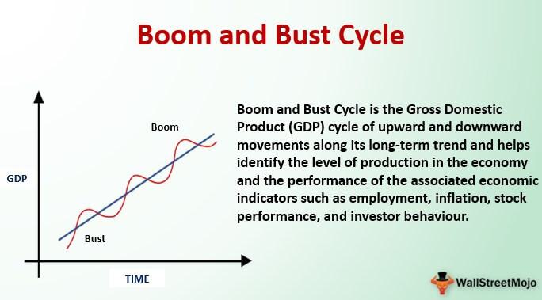

The economic cycle is an essential concept in understanding the fluctuations in economic activity over time, characterized by periods of expansion and contraction commonly referred to as boom and bust phases. During expansion, the economy experiences growth in GDP, low unemployment rates, and increased consumer confidence, while the contraction phase often brings about economic slowdown, rising unemployment, and adjustments in inflation.

Understanding these phases is crucial for economists, investors, and policymakers to formulate effective strategies and make informed decisions. The dynamics of these cycles influence various macroeconomic and microeconomic factors, setting a framework for evaluating economic health and forecasting future trends.



With technological advancements, particularly the rise of algorithmic trading, the analysis and prediction of economic cycles have become increasingly sophisticated. Automated systems in financial markets now leverage complex algorithms to identify patterns and predict economic cycle variations. This technological shift represents a significant evolution in how economic data is interpreted and utilized in real-time trading decisions.

This article examines the interconnectedness between economic cycles and algorithmic trading, emphasizing how historical trends provide valuable insights for modern strategic planning. It evaluates the traditional understanding of economic cycles alongside the role of advanced trading technologies in shaping contemporary finance—bridging historical economic analysis with cutting-edge computational finance to better comprehend the complexities of today's markets.

## Table of Contents

## The Economic Cycle: Boom and Bust Phases

The economic cycle is a fundamental concept in understanding the fluctuating nature of economies. At its core, it consists of periods of expansion and contraction, often referred to as boom and bust phases. These cycles are characterized by key indicators such as GDP growth, unemployment rates, and inflation.

The boom phase of an economic cycle is marked by several distinctive characteristics. During this period, there is a high level of economic output, which typically corresponds to increased productivity and industrial activity. Unemployment rates tend to be low as businesses expand and hire more workers to meet rising demand. Consumer confidence is also heightened during this phase, driving increased spending and investment. This optimism further fuels economic growth, creating a positive feedback loop that propels the economy forward.

Conversely, the bust phase is characterized by economic contraction. This downturn often results in rising unemployment as businesses scale back operations in response to decreased demand. Inflation levels can vary during this phase; in some instances, economies experience deflation as prices fall due to reduced spending. Alternatively, inflation might rise if supply chain disruptions cause shortages. Adjustments occur as the economy seeks to stabilize and return to a state of growth.

Historical examples provide context for understanding these phases. The Great Depression of the 1930s epitomized a severe bust, with widespread unemployment and deflation. In contrast, the economic boom of the Roaring Twenties preceding it was marked by rapid industrial growth and urbanization. The 2008 Financial Crisis is another relevant example, where a collapse in the housing market triggered a global recession, leading to significant government interventions and efforts to stabilize financial systems.

Government interventions and policy changes can significantly impact the phases of the economic cycle. During bust phases, governments often implement monetary and fiscal policies aimed at stimulating growth and mitigating unemployment. This can include lowering interest rates, increasing government spending, or providing financial bailouts to prevent systemic collapse. In contrast, during boom phases, policies may focus on preventing overheating and controlling inflation through measures such as raising interest rates or reducing public spending.

These cyclical phases are not just theoretical concepts but practical realities observed throughout history. They influence decision-making for economists, policymakers, and investors as they navigate the complexities of economic fluctuations and seek strategies to optimize outcomes during both boom and bust periods. Understanding these dynamics is crucial for anticipating economic shifts and crafting policies that foster sustainable growth and stability.

## Historical Perspectives on Economic Cycles

Throughout history, economic cycles have followed patterns of expansion and contraction, commonly referred to as boom and bust phases. These cycles have profoundly shaped economies worldwide, influencing various industries and driving societal changes. Notable historical economic cycles, such as the Great Depression in the 1930s and the 2008 Financial Crisis, exemplify the global impact of economic fluctuations. These events have necessitated government interventions, leading to policy reforms and regulatory shifts aimed at stabilizing markets and promoting recovery.

Industries respond differently to the ebb and flow of economic cycles. For instance, consumer goods and hospitality sectors often experience an upsurge during boom phases due to increased consumer spending and confidence. Conversely, industries such as manufacturing and construction are more susceptible to downturns during bust periods, as investments in infrastructure and large-scale projects tend to decline. The energy sector, too, is closely tied to economic cycles, with oil prices frequently reflecting broader economic conditions due to demand fluctuations.

Technological advancements have played a pivotal role in shaping or mitigating the effects of economic cycles. During the Industrial Revolution, mechanization and improved production methods spurred economic expansion. In more recent times, information technology advancements have revolutionized industries by enhancing efficiency and reducing operational costs, thereby influencing economic stability. Automation and the rise of e-commerce are modern examples of how technology can buffer certain industries against negative impacts during economic contractions.

Lessons from past boom and bust periods continue to be relevant today. The Great Depression, for instance, taught the importance of financial regulation and the perils of speculative bubbles, leading to the establishment of institutions such as the Securities and Exchange Commission (SEC) in the United States. The 2008 Financial Crisis underscored the vulnerabilities within the financial sector and prompted the introduction of stricter banking regulations and oversight intended to prevent future systemic collapses.

Economic cycles manifest differently across various economic contexts, from agricultural economies to modern industrial ones. In agrarian societies, cycles often revolved around seasonal harvests and climate conditions, whereas modern industrial economies are influenced by technological innovation, consumer demand, and global trade dynamics. Understanding these diverse contexts provides insight into how economic cycles have evolved over time and how contemporary economies can learn from historical patterns.

In summary, the examination of historical economic cycles highlights the complex interplay between industries, technological advancements, and macroeconomic policies. These insights offer valuable lessons for managing current and future economic challenges, emphasizing the need for adaptive strategies and continuous innovation.

## Algorithmic Trading: A Modern Approach

Algorithmic trading, often referred to as algo trading, represents a transformative approach in financial markets, leveraging computer programs and algorithms to execute trades systematically and methodically. Its increasing importance is underscored by its capacity to process large datasets and execute instructions at speeds beyond human capability, facilitating a level of efficiency and precision crucial for contemporary trading practices.

Algo trading systems are designed to predict and capitalize on economic cycle variations by employing quantitative models that analyze a myriad of financial indicators. These systems use historical data to identify patterns that suggest forthcoming economic trends, such as shifts from expansion to contraction phases in the economic cycle. By leveraging statistical models and [machine learning](/wiki/machine-learning) techniques, algo trading can anticipate market conditions, aligning trading strategies with predicted economic movements. This approach allows traders to maximize returns during boom phases and minimize losses during downturns. For instance, an algo might use indicators like GDP growth rates, unemployment trends, and inflation [statistics](/wiki/bayesian-statistics) to fine-tune trading parameters according to expected market conditions.

Mitigating risks during economic downturns is another critical application of [algorithmic trading](/wiki/algorithmic-trading). Algorithms can be programmed to adjust trading strategies automatically in response to predefined economic triggers, such as a significant drop in market indices or a spike in [volatility](/wiki/volatility-trading-strategies). Risk management algorithms often incorporate hedging strategies, such as diversifying investment portfolios or using options and futures contracts to offset potential losses. By doing so, algos aim to stabilize returns and protect against adverse economic impacts, ensuring a robust defense against the inherent uncertainties of financial markets.

Real-world examples of algorithmic trading success during various economic phases illustrate its effectiveness. High-frequency trading ([HFT](/wiki/high-frequency-trading-strategies)) firms have been notable beneficiaries, profiting from micro-movements in the market that occur in fractions of a second. During the 2008 Financial Crisis, some firms successfully utilized algo trading to identify and capitalize on anomalies in asset pricing, achieving profits while traditional markets struggled. Additionally, during periods of quantitative easing, algorithms helped traders adapt to the low-interest-rate environment by optimizing bond and currency trading strategies.

Despite its advantages, algorithmic trading is not without challenges and limitations, especially in rapidly changing economic environments. One primary concern is the reliance on historical data, which may not always accurately predict future outcomes, particularly in unprecedented economic situations. Moreover, the complexity of algorithms can lead to significant errors if not carefully monitored and validated. Market anomalies, such as the "flash crash" of 2010, highlight the potential for systemic risks when algorithmic trading systems interact in unpredictable ways. Additionally, the competitive nature of financial markets means that as more participants adopt similar algo strategies, the potential for diminishing returns increases, necessitating continuous innovation and adjustment.

In conclusion, while algorithmic trading offers substantial benefits in terms of speed, efficiency, and risk management, it also demands rigorous oversight and adaptability to ensure resilience against the dynamic landscape of economic cycles.

## Integrating Economic History with Algorithmic Trading Strategies

The integration of economic history with algorithmic trading strategies is a sophisticated process that leverages historical data to enhance the predictive capabilities of algorithmic models. This process begins with the careful collection and analysis of historical economic data, which includes metrics such as gross domestic product (GDP) trends, unemployment rates, inflation data, and major economic events. By utilizing this historical data, algorithms can discern patterns and trends that inform future economic projections.

To integrate historical cycles into trading strategies effectively, one must use various techniques. Machine learning algorithms, such as time series analysis, are particularly adept at detecting cyclical patterns. Python libraries like `pandas` and `statsmodels` are commonly used to analyze these datasets. For instance, one might use an Autoregressive Integrated Moving Average (ARIMA) model to forecast future economic patterns based on past cycles, capturing underlying trends and potential turning points.

```python
import pandas as pd
from statsmodels.tsa.arima.model import ARIMA

# Example: Load historical GDP data
data = pd.read_csv('historical_gdp.csv')
model = ARIMA(data['GDP'], order=(5, 1, 0))
model_fit = model.fit()

# Forecasting future GDP trends
forecast = model_fit.forecast(steps=12)
print(forecast)
```

The adaptation of algorithms to current market conditions and historical precedents is crucial for maintaining their relevance and accuracy. Markets are dynamic and subject to sudden changes, influenced by factors such as technological advancements, geopolitical events, and policy shifts. To account for these, algorithms often incorporate real-time data feeds and adaptive learning techniques, ensuring that they remain flexible and responsive to new information.

There are notable case studies showcasing the value of historical insight in improving algorithmic trading outcomes. For example, during periods of financial unrest, models that factored in historical responses to similar crises were better equipped to adjust trading strategies proactively. These algorithms were able to reduce risks and capitalize on market corrections more efficiently than those lacking a historical perspective.

The future of combining economic history with AI-driven trading systems is promising. As technology advances, the potential for more sophisticated, AI-integrated algorithms grows. These systems could automate the continuous integration of historical data with real-time analytics, creating highly adaptive and powerful trading tools. Furthermore, advancements in AI, such as [deep learning](/wiki/deep-learning) and enhanced natural language processing, can extract insights from vast and unstructured datasets, further enriching trading strategies.

In conclusion, the incorporation of economic history into algorithmic trading models enhances their predictive power and resilience. By leveraging past data and adapting to present conditions, these models provide valuable insights into economic trends and market movements, offering significant benefits for investors and economists alike.

## Conclusion

The study of economic cycles and algorithmic trading reveals significant insights into the interplay between historical economic patterns and emergent financial technologies. Economic cycles, characterized by alternating phases of growth and contraction, are critical in shaping market dynamics. By incorporating historical perspectives, algorithmic trading strategies can be enhanced to predict future economic trends with greater accuracy. Historical data provides a context that can refine algorithmic models, helping them anticipate shifts in the market and respond to economic cycles effectively.

The comprehension of economic cycles is continuously evolving, influenced by advancements in data processing and machine learning. This ongoing evolution has profound implications for future trading strategies, as it allows for the development of more adaptive and responsive algorithms. These advanced systems can model complex economic phenomena, potentially offering a competitive edge in navigating volatile markets.

Further research and innovation are encouraged in the integration of economic history with modern trading technologies. This fusion holds the promise of unlocking new levels of sophistication in predictive algorithms, better equipping them to handle the uncertainties of financial markets. By continuing to explore the connections between past economic patterns and present-[day trading](/wiki/day-trading-spy) strategies, we can foster more robust and informed decision-making processes.

Investors and economists stand to gain significantly from a deeper understanding of these interconnected areas. Improved algorithmic models not only offer the possibility of increased profitability but also contribute to more stable and resilient financial systems. The cross-pollination of historical economic insights with cutting-edge trading technologies represents a potential breakthrough in both theoretical and practical aspects of finance. As we advance, the collaboration between historical analysis and algorithmic innovation will likely play a crucial role in shaping the future of financial markets.

## References & Further Reading

[1]: ["Advances in Financial Machine Learning"](https://www.amazon.com/Advances-Financial-Machine-Learning-Marcos/dp/1119482089) by Marcos Lopez de Prado

[2]: ["Evidence-Based Technical Analysis: Applying the Scientific Method and Statistical Inference to Trading Signals"](https://www.amazon.com/Evidence-Based-Technical-Analysis-Scientific-Statistical/dp/0470008741) by David Aronson

[3]: ["Machine Learning for Algorithmic Trading"](https://github.com/stefan-jansen/machine-learning-for-trading) by Stefan Jansen

[4]: ["Quantitative Trading: How to Build Your Own Algorithmic Trading Business"](https://www.amazon.com/Quantitative-Trading-Build-Algorithmic-Business/dp/1119800064) by Ernest P. Chan

[5]: Mishkin, F. S. (2019). ["The Economics of Money, Banking, and Financial Markets."](https://www.pearsonhighered.com/assets/preface/0/1/3/4/0134855388.pdf) Pearson.

[6]: ["The Great Crash 1929"](https://en.wikipedia.org/wiki/Wall_Street_Crash_of_1929) by John Kenneth Galbraith