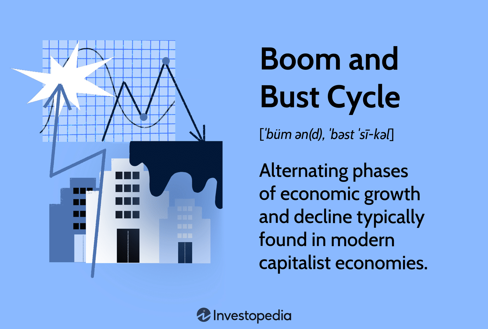

## Table of Contents

## What is an economic boom and bust cycle?

An economic boom and bust cycle is when the economy grows a lot and then shrinks. During the boom, people have more jobs and money. They buy more things, and businesses make more money. This growth can make people feel very happy and confident about the future. But sometimes, this growth can go too fast and become a bubble, where prices and values are too high and not based on reality.

Then comes the bust. The bubble bursts, and the economy starts to shrink. People lose their jobs, and they have less money to spend. Businesses make less money, and some might even close. This can make people feel worried and unsure about the future. The economy goes through these ups and downs over time, and it's a normal part of how economies work. Governments and central banks try to manage these cycles to make the booms last longer and the busts less painful.

## What are the main phases of a boom and bust cycle?

The first phase of a boom and bust cycle is the boom. This is when the economy is doing really well. People have jobs, and they are making more money. Because they feel confident, they spend more money on things they want and need. Businesses see this and start to grow, hiring more people and making more products. Everything seems to be going great, and people might even start to think the good times will never end. But sometimes, this growth can get out of control and create a bubble, where prices and values are much higher than they should be.

The second phase is the bust. This happens when the bubble bursts, and the economy starts to shrink. People start to lose their jobs, and they have less money to spend. This makes businesses sell fewer products, so they might have to cut jobs or even close down. People start to feel worried and less confident about the future. This phase can be tough, but it's a natural part of the economic cycle. After some time, the economy usually starts to recover, and the cycle begins again. Governments and central banks try to help manage these cycles to make the booms last longer and the busts less painful.

## What causes an economic boom?

An economic boom happens when the economy starts to grow a lot. It usually begins with something that makes people feel more confident about the future, like new technology or a big discovery. When people feel good, they spend more money on things they want and need. This spending helps businesses grow because they sell more products. As businesses grow, they hire more people, which means more people have jobs and money to spend. This cycle of spending and growing can keep going and make the economy boom.

Sometimes, other things can help cause a boom too. For example, if the government decides to spend more money on things like roads or schools, it can create jobs and help the economy grow. Also, if the central bank decides to lower interest rates, it can make it cheaper for people and businesses to borrow money. When borrowing is cheaper, people might buy houses or cars, and businesses might invest in new projects. All of these things can add up and help start an economic boom.

## What are the signs of an economic bust?

The first sign of an economic bust is when people start to lose their jobs. When businesses are not selling as many products as before, they might have to let some workers go. This means that fewer people have money to spend, and they start to buy less. When people buy less, businesses sell even fewer products, and the cycle keeps going. Another sign is that the prices of things like houses or stocks start to go down a lot. If a lot of people are trying to sell their houses or stocks at the same time, the prices can fall quickly.

Another sign of an economic bust is when businesses start to close. When they can't sell enough products to make money, they might have to shut down. This can make even more people lose their jobs and have less money to spend. People also start to feel less confident about the future. They might stop spending money on things they want and only buy what they need. This can make the economy shrink even more. Governments and central banks watch for these signs so they can try to help the economy recover faster.

## How do interest rates affect the boom and bust cycle?

Interest rates play a big role in the boom and bust cycle. When the central bank lowers interest rates, it makes borrowing money cheaper. This can help start a boom because people and businesses are more likely to borrow money to buy things like houses or start new projects. When people spend more money, businesses sell more products, and they might hire more people. This can make the economy grow a lot and lead to a boom. But if interest rates stay low for too long, it can create a bubble where prices get too high and don't match reality.

On the other hand, when the central bank raises interest rates, borrowing money becomes more expensive. This can slow down the economy and help prevent a boom from turning into a bubble. When borrowing is more expensive, people might buy fewer things, and businesses might not start as many new projects. This can help keep the economy from growing too fast. But if interest rates are raised too quickly or too high, it can cause a bust. People might have to pay more to borrow money, and they might have to spend less. This can make the economy shrink and lead to a bust. So, the central bank has to be careful about how it changes interest rates to help manage the boom and bust cycle.

## What role does consumer confidence play in the cycle?

Consumer confidence is a big part of the boom and bust cycle. When people feel good about the future, they are more likely to spend money on things they want and need. This spending helps businesses grow because they sell more products. As businesses grow, they hire more people, which means more people have jobs and money to spend. This can start a boom because the economy grows a lot. But if consumer confidence gets too high, people might spend too much money and create a bubble where prices are much higher than they should be.

On the other hand, when people start to feel worried about the future, they might stop spending money on things they want and only buy what they need. This can make businesses sell fewer products, and they might have to let some workers go. When people lose their jobs, they have less money to spend, which can make the economy shrink and lead to a bust. So, consumer confidence can help start a boom or a bust, and it's important for the economy. Governments and central banks watch consumer confidence to help manage the boom and bust cycle.

## How can government policies influence boom and bust cycles?

Government policies can have a big impact on the boom and bust cycle. One way they do this is by spending money on things like roads, schools, and other projects. When the government spends more money, it can create jobs and help the economy grow. This can help start a boom. But if the government spends too much money, it might create a bubble where prices get too high. So, the government has to be careful about how much it spends to help manage the cycle.

Another way the government can influence the cycle is through taxes. If the government lowers taxes, people and businesses have more money to spend. This can help the economy grow and start a boom. But if taxes are too low for too long, it might lead to a bubble. On the other hand, if the government raises taxes, people and businesses might have less money to spend. This can slow down the economy and help prevent a boom from turning into a bubble. But if taxes are raised too much, it might cause a bust. So, the government has to find a balance with its policies to help manage the boom and bust cycle.

## What are the long-term effects of boom and bust cycles on an economy?

Boom and bust cycles can have big effects on an economy over a long time. When the economy goes through a lot of booms and busts, it can make people feel unsure about the future. They might save more money instead of spending it, which can slow down the economy. Also, businesses might be scared to start new projects because they don't know if the economy will boom or bust next. This can make it harder for the economy to grow over time. But if the government and central bank manage the cycles well, they can help make the booms last longer and the busts less painful. This can help the economy grow more steadily over the long term.

Another long-term effect is that boom and bust cycles can change how people think about money and jobs. After a big bust, people might be more careful with their money and look for jobs that are more stable. This can make the economy more balanced and less likely to have big booms and busts in the future. But if the cycles are too extreme, they can hurt people's trust in the economy. This can make it harder for the economy to recover from a bust and start a new boom. So, managing boom and bust cycles well is important for the long-term health of the economy.

## Can boom and bust cycles be predicted, and if so, how?

People try to predict boom and bust cycles, but it's really hard to do it perfectly. Economists use a lot of information to make guesses about what might happen next. They look at things like how many people have jobs, how much people are spending, and what the government is doing. They also use math models to see patterns in the past and try to guess the future. But even with all this information, it's still hard to predict exactly when a boom will turn into a bust or when a bust will start to get better.

One way to try to predict these cycles is by watching certain signs. For example, if people are spending a lot more money than usual, it might mean a boom is happening. But if prices are going up too fast, it could be a sign that a bust is coming. Also, if a lot of people are losing their jobs, it might mean a bust is already happening. Governments and central banks use these signs to try to manage the economy and make the cycles less extreme. But even with all these efforts, predicting boom and bust cycles is still more like a guess than a sure thing.

## What strategies can businesses use to mitigate the risks of a bust?

Businesses can protect themselves from a bust by being careful with their money. They can save some of their profits instead of spending it all on new things. This way, if a bust happens and they make less money, they still have some savings to help them keep going. Another way is to not rely too much on borrowing money. If interest rates go up during a bust, it can be harder to pay back loans. So, businesses should try to use their own money for new projects instead of borrowing too much.

Another strategy is to have a diverse set of products or services. If a business only sells one thing and that thing becomes less popular during a bust, they might lose a lot of money. But if they sell different things, they can still make money from other products even if one isn't doing well. Also, businesses can keep an eye on what's happening in the economy and be ready to change their plans if they see a bust coming. By being flexible and ready to adapt, businesses can better handle the ups and downs of a boom and bust cycle.

## How do global economic factors contribute to national boom and bust cycles?

Global economic factors can have a big impact on what happens in a country's economy. When other countries are doing well, they might buy more things from your country, which can help start a boom. For example, if a lot of countries want to buy cars from your country, the car factories might hire more people and make more money. But if other countries start to have a bust, they might buy fewer things from your country. This can make your country's economy slow down and maybe even go into a bust. So, what happens in the rest of the world can make a big difference in your country's boom and bust cycles.

Another way global factors can affect national boom and bust cycles is through things like interest rates and currency values. If a big country like the United States changes its interest rates, it can affect how much money people want to borrow in other countries. If interest rates go up in the U.S., people might want to borrow less money everywhere, which can slow down economies around the world. Also, if a country's currency gets weaker compared to other countries, it might make things from that country cheaper for others to buy. This can help start a boom, but if the currency gets too weak, it can cause problems later. So, global economic factors are really important for understanding and managing boom and bust cycles in any country.

## What are some historical examples of boom and bust cycles and their impacts?

One famous example of a boom and bust cycle is the Roaring Twenties and the Great Depression in the United States. During the 1920s, the economy was booming. People had jobs, and they were spending a lot of money on things like cars and radios. Businesses were growing, and the stock market was going up and up. But then, in 1929, the stock market crashed, and the boom turned into a bust. This led to the Great Depression, which lasted for over a decade. Millions of people lost their jobs, and many businesses had to close. It was a very hard time for a lot of people, and it took a long time for the economy to recover.

Another example is the Dot-com Bubble in the late 1990s and early 2000s. During this time, a lot of people were excited about new internet companies. They thought these companies would make a lot of money, so they invested a lot in them. This created a boom in the technology sector. But many of these companies were not making any money, and their stock prices were too high. In 2000, the bubble burst, and the stock prices crashed. A lot of people lost money, and many internet companies went out of business. It took a few years for the economy to recover from this bust.

A more recent example is the 2008 Financial Crisis, which started with a boom in the housing market. Banks were giving out a lot of loans for people to buy houses, and house prices were going up and up. People thought the prices would keep going up, so they kept buying more houses. But then, in 2008, the housing bubble burst. House prices started to fall, and a lot of people couldn't pay back their loans. This led to a bust that affected the whole world. Many people lost their jobs, and a lot of businesses had to close. It took a long time for the economy to get better, and governments had to work hard to help it recover.

## References & Further Reading

[1]: ["Advances in Financial Machine Learning"](https://www.amazon.com/Advances-Financial-Machine-Learning-Marcos/dp/1119482089) by Marcos Lopez de Prado

[2]: ["Evidence-Based Technical Analysis: Applying the Scientific Method and Statistical Inference to Trading Signals"](https://www.amazon.com/Evidence-Based-Technical-Analysis-Scientific-Statistical/dp/0470008741) by David Aronson

[3]: ["Machine Learning for Algorithmic Trading"](https://github.com/stefan-jansen/machine-learning-for-trading) by Stefan Jansen

[4]: ["Quantitative Trading: How to Build Your Own Algorithmic Trading Business"](https://www.amazon.com/Quantitative-Trading-Build-Algorithmic-Business/dp/1119800064) by Ernest P. Chan

[5]: Mishkin, F. S. (2019). ["The Economics of Money, Banking, and Financial Markets."](https://www.pearsonhighered.com/assets/preface/0/1/3/4/0134855388.pdf) Pearson.

[6]: ["The Great Crash 1929"](https://en.wikipedia.org/wiki/Wall_Street_Crash_of_1929) by John Kenneth Galbraith