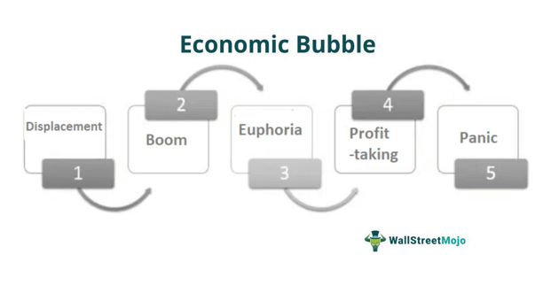

Economic and market bubbles have long captivated the attention of investors, economists, and policymakers. These phenomena occur when the prices of assets rise significantly over their intrinsic values and are unsustainable in the long run. The resultant bubbles can lead to extreme volatility in market values, and their eventual burst often precipitates major economic disruptions. Understanding the nature and causes of these bubbles is essential for mitigating risks and making informed investment decisions.

Bubbles typically begin with a surge in asset prices fueled by a mix of speculation, exuberance, and sometimes groundbreaking innovation. They evolve as more investors, buoyed by the rising market, ignore traditional valuation metrics in pursuit of lofty returns. Eventually, the disparity between asset prices and their fundamental values becomes apparent, leading to panic selling and a precipitous decline in value. Factors such as herd behavior, overconfidence, and market manipulation contribute significantly to the formation of these bubbles.



This article outlines the key concepts of economic bubbles, building a foundation by examining notable historical examples. Episodes such as Tulip Mania in the 1600s, the Dot-Com Bubble of the late 1990s, and the U.S. Housing Bubble of the mid-2000s provide critical insights into how bubbles form and burst. Moreover, the article explores the contemporary implications of bubbles, particularly in the context of technological advancements such as algorithmic trading. This modern trading mechanism, which incorporates complex mathematical models and automated systems, plays an increasingly pivotal role in the dynamics of financial markets. Understanding its influence is crucial for anticipating and managing the risks associated with market bubbles.

By thoroughly exploring these elements, the article aims to elucidate the complex phenomena of economic bubbles, offering valuable insights into their prevention and management in today’s technology-driven markets.

## Table of Contents

## Understanding Economic and Market Bubbles

An economic bubble is characterized by a rapid escalation in the market value of assets, followed by a sudden contraction or crash, leading to a significant loss of wealth. The core feature of a bubble is the disjunction between the intrinsic value of assets and their market prices, sustained by investor behavior fueled more by speculation than fundamental economic indicators.

### Formation, Evolution, and Burst

Economic bubbles typically progress through distinct phases:

1. **Displacement:** The initial phase starts with a significant event or a new technology that captures investors' attention, leading to increased market activity.

2. **Boom:** As more investors become interested, prices begin to rise rapidly. Media coverage amplifies the attraction, and the fear of missing out (FOMO) can drive even more participants into the market.

3. **Euphoria:** In this phase, caution is often thrown to the wind. Valuations reach levels detached from historical norms. New investors continue to enter the market, expecting prices to keep increasing.

4. **Profit-Taking:** Astute investors begin to recognize the overvaluation and start selling to lock in profits, which can lead to increased volatility.

5. **Panic:** A significant event or merely the unsustainable nature of prices eventually triggers a bust. A rush to sell follows as investors attempt to liquidate their positions, leading to a dramatic collapse in asset values.

### Psychological and Behavioral Factors

Several psychological and behavioral factors contribute to the formation of bubbles: 

- **Herd Behavior:** Investors tend to follow the crowd, buying when others are buying and selling when others sell, often irrespective of fundamental valuations.
- **Overconfidence:** The belief that one's judgement or forecast is more accurate than it actually is can drive reckless investment decisions.
- **Greater Fool Theory:** Some investors buy overvalued assets in expectation that someone else (a "greater fool") will pay a higher price.
- **Recency Bias:** Investors may give undue weight to recent data and trends, leading them to ignore longer-term fundamentals.

### Types of Bubbles

Economic bubbles can be categorized primarily into four types:

- **Asset Bubbles:** These occur in any market where asset prices inflate above their intrinsic value. The housing market often serves as a quintessential example.

- **Stock Market Bubbles:** These involve rapidly increasing stock prices, driven by investor enthusiasm rather than underlying fundamentals. The Dot-Com Bubble of the late 1990s is a notable example.

- **Credit Bubbles:** Occurring when there's an unsustainable expansion of credit, leading to a rise in debt levels relative to income. The credit bubbles often precede financial crises, as seen during the 2008 financial crisis.

- **Commodity Bubbles:** These involve sharp increases in the prices of commodities, typically spurred by speculation. An example would be the sharp rise in oil prices at various times.

By comprehensively understanding the dynamics and characteristics of economic and market bubbles, stakeholders can better anticipate and potentially mitigate the adverse effects these phenomena can have on global and national economies.

## Historical Examples of Bubbles

Economic and market bubbles have been a recurring phenomenon throughout history, often resulting in significant economic repercussions. Notable examples highlight how speculative excesses can lead to dramatic rises and falls in asset prices. 

The Tulip Mania of the 1600s serves as one of the earliest recorded speculative bubbles. Occurring in the Dutch Republic (now the Netherlands) from 1636 to 1637, this bubble centered around the trading of tulip bulbs. Tulips, initially a luxury item, became highly sought-after symbols of wealth and status, driving prices to unprecedented levels. At the peak of the mania, a single tulip bulb could fetch as much as the cost of a house. Eventually, the market collapsed, causing severe financial fallout for many investors. Though some historical accounts suggest the extent of the mania was exaggerated, Tulip Mania remains an illustrative example of speculative excess.

The Dot-Com Bubble in the late 1990s represents a more modern example, linked to the rapid expansion of internet-based companies. As the internet became more accessible, investors heavily speculated on the prospects of dot-com companies, leading to inflated stock prices. From 1995 to 2000, the NASDAQ Composite index, heavily weighted with technology stocks, saw an increase of nearly 400%. The bubble burst in March 2000 when investor confidence waned, leading to a steep market decline. Many companies went bankrupt, erasing trillions of dollars in market value and significantly impacting the technology sector.

The U.S. Housing Bubble in the mid-2000s is another prominent case. Easier access to credit and financial innovation, such as the introduction of mortgage-backed securities and collateralized debt obligations, spurred an unprecedented increase in housing prices. Lenders issued subprime mortgages to borrowers with low creditworthiness, assuming continuous property appreciation. However, when housing prices peaked in 2006 and began to decline, many homeowners defaulted on their loans. The cascading defaults led to the 2008 financial crisis, as major financial institutions faced insolvency, causing extensive economic turmoil.

Each of these historical bubbles highlights the interplay between investor behavior, financial innovation, and market dynamics, emphasizing the need for vigilance and regulation in financial markets.

## The Role of Algorithmic Trading in Modern Financial Markets

Algorithmic trading, often abbreviated as "algo trading," refers to the use of computer algorithms to automate trading decisions and processes in financial markets. These algorithms, based on complex mathematical models and pre-defined criteria, enable trading at speeds and volumes that far exceed the capabilities of human traders. The significance of [algorithmic trading](/wiki/algorithmic-trading) has grown tremendously, with estimates suggesting it accounts for a substantial portion of total trading [volume](/wiki/volume-trading-strategy) in many of the world's largest stock exchanges.

One of the key benefits of algorithmic trading is its ability to process vast amounts of market data rapidly, identify profitable trading opportunities, and execute trades with precision. This capability allows for more efficient price discovery and enhances market [liquidity](/wiki/liquidity-risk-premium). However, algo trading also poses certain risks, particularly concerning market bubbles. 

Algorithmic trading can inadvertently contribute to market bubbles by amplifying price trends through mechanisms like [momentum](/wiki/momentum) trading. Algorithms designed to follow price trends may accelerate price movements when a particular stock or asset starts rising, thereby contributing to inflated valuations and potential bubble formation. Additionally, when multiple algorithms respond to the same market signals, they can create feedback loops that exacerbate price swings. 

High-frequency trading ([HFT](/wiki/high-frequency-trading-strategies)) is a subset of algorithmic trading characterized by executing a large number of orders at extremely fast speeds, often within microseconds. HFT strategies can influence market dynamics, sometimes leading to flash crashes or extreme [volatility](/wiki/volatility-trading-strategies). For instance, the flash crash of May 6, 2010, is often cited as an example where HFT contributed to a rapid market decline and subsequent recovery, highlighting the potential of such trading to cause instability.

While algorithmic trading can exacerbate market bubbles, it also holds potential for mitigating them. Algorithms can be designed to incorporate risk management protocols and trigger stop-loss orders that limit potential losses during a downturn. Moreover, algorithms that incorporate sentiment analysis or other advanced data analytics may identify early signs of bubble formation and [exit](/wiki/exit-strategy) positions accordingly.

In conclusion, algorithmic trading plays a significant role in modern financial markets, offering benefits such as improved liquidity and efficient trade execution. However, it also presents challenges, including the potential to contribute to or mitigate market bubbles. Balancing these dynamics requires continuous monitoring and evolution of the algorithms to align with market conditions, alongside regulatory oversight to ensure market stability.

## Case Studies of Market Bubbles in the Age of Algorithms

Algorithmic trading has reshaped financial markets, facilitating faster and more efficient trading. However, its influence in creating or exacerbating bubble-like phenomena cannot be understated. This section highlights case studies where algorithm-driven trading strategies have played a significant role in rapid price increases of specific stocks or asset classes.

### Flash Crash of 2010

One of the most notable incidents where algorithmic trading was implicated in destabilizing financial markets was the "Flash Crash" on May 6, 2010. On that day, the Dow Jones Industrial Average plunged about 1,000 points within minutes, only to recover a significant percentage shortly after. While a single trader's actions significantly contributed to the crash, algorithmic trading exacerbated the magnitude and speed of the decline. High-Frequency Trading (HFT) firms withdrew from the market, leading to a lack of liquidity and further volatility. The event showcased how algorithms can create a positive feedback loop, magnifying price movements.

### 2015 Chinese Stock Market Bubble

In 2015, the Chinese stock market experienced a significant bubble, characterized by dramatic rises in stock prices. Algorithmic trading, particularly momentum-based strategies that targeted short-term price movements, exacerbated rapid increases. The role of margin trading and regulatory relaxations contributed to the frenzy, but algorithmic systems amplified the upward momentum before the eventual crash. This bubble showcased how algorithms could contribute to unsustainable price increases by rapidly executing trades that capitalize on short-term trends without regard for underlying value.

### Cryptocurrency Booms 

Cryptocurrency markets have frequently experienced bubble-like conditions, often intensified by algorithmic trading systems. In late 2017, the price of Bitcoin surged, driven partly by automated trading strategies seeking to profit from volatility. Algorithms in [cryptocurrency](/wiki/cryptocurrency) exchanges exploited price differences across platforms, sometimes leading to sudden spikes in value. Unlike traditional markets, the lack of regulation and high volatility in cryptocurrencies made them particularly susceptible to algorithm-induced bubbles.

### Meme Stocks and the 2021 GameStop Phenomenon

In early 2021, shares of GameStop saw an unprecedented surge in price driven by retail investors coordinating on platforms like Reddit. Several algorithmic trading firms, operating on momentum strategies, contributed to this rapid escalation. Once the stock garnered significant attention, algorithms detecting unusual trading volume jumped in to exploit potential gains, amplifying volatility. The incident illustrated how quickly algorithms can respond to trading signals, influencing price dynamics in unforeseen ways.

In conclusion, while algorithmic trading offers efficiencies in executing trades, its role in creating or exacerbating bubble-like phenomena is evident across various financial markets. Understanding these dynamics is crucial both for market participants employing these strategies and for regulators aiming to mitigate systemic risk.

## Strategies to Predict and Protect Against Bubbles

Identifying potential economic and market bubbles requires a combination of quantitative analysis, qualitative assessment, and an understanding of behavioral finance. Investors often look for key indicators such as rapid price escalations, a high level of trading volume, and increased prominence of speculative market behavior. Technical analysis tools like the Relative Strength Index (RSI) or moving averages can provide early warning signs of overvaluation. For example, an RSI above 70 typically suggests that an asset is overbought, indicating a potential bubble.

Risk management strategies are essential to shield portfolios from the adverse effects of bubbles. Diversification remains a cornerstone technique, spreading investments across different asset classes to minimize the impact of a bubble burst in any single market sector. Options and futures contracts can be strategically used to hedge against potential losses. For instance, buying put options on overvalued stocks provides insurance against an impending downturn.

Algorithmic trading also offers sophisticated risk management capabilities. Algorithms can be programmed to trigger specific actions when certain market conditions are met, such as reallocating assets or instituting stop-loss orders to minimize exposure to falling prices. Python, a popular programming language for financial analysis, can be employed to model these strategies. Below is a simple Python snippet that uses a moving average to identify bubble conditions:

```python
import pandas as pd

# Assuming df is a DataFrame containing historical price data with 'Close' prices
df['Moving_Average'] = df['Close'].rolling(window=20).mean()

# Identifying potential bubble when closing price is significantly higher than the moving average
bubble_condition = df['Close'] > (df['Moving_Average'] * 1.2)
print(df[bubble_condition])
```

On the regulatory front, authorities play a crucial role in preventing bubble formation through measures such as imposing higher margin requirements and enhancing transparency in trading practices. Regulatory bodies can also monitor and limit excessive leverage in financial markets, which has historically been a contributor to bubble dynamics. The implementation of stress tests on financial institutions helps ensure stability and resilience, reducing systemic risk.

Overall, a combination of vigilant monitoring, strategic diversification, and prudent use of financial instruments and technologies can fortify investments against the impacts of bubbles. Regulatory interventions offer an additional layer of protection by curbing excessive risk-taking and promoting fairness and transparency in financial markets.

## Conclusion

Economic and market bubbles represent significant phenomena that have repeatedly influenced global financial landscapes. Recognizing the importance of these occurrences, especially against the backdrop of rapid technological advancements like algorithmic trading, is crucial for both market participants and regulators.

Economic bubbles, typified by unsustainable price increases followed by sharp declines, pose substantial risks. The integration of algorithmic trading technologies adds further complexity, as these systems can exacerbate both the growth and burst phases of bubbles due to their speed and reliance on patterns which may amplify irrational market behaviors. This relationship underscores the need for a nuanced understanding of how modern trading technologies interact with market dynamics.

Furthermore, the historical prevalence of economic bubbles highlights the importance of vigilance and sophisticated risk management practices. Investors are encouraged to adopt a multi-faceted approach to identify potential bubbles early, leveraging quantitative models, market indicators, and behavioral insights. Additionally, portfolio diversification and hedging strategies remain vital in protecting against potential downturns.

Regulatory bodies play a crucial role in moderating the impacts of economic bubbles. By developing adaptive frameworks that address the challenges posed by high-frequency and algorithmic trading, regulators can help mitigate systemic risks.

Ultimately, ongoing research and vigilance are imperative. By fostering a deeper understanding of both traditional and modern factors that contribute to bubble formation and dynamics, stakeholders can better prepare for and potentially prevent the severe repercussions associated with economic and market bubbles. Continued discourse among investors, economists, and policymakers will thus remain a cornerstone in safeguarding financial market stability.

## References & Further Reading

[1]: Kindleberger, C. P., & Aliber, R. Z. (2005). ["Manias, Panics, and Crashes: A History of Financial Crises."](https://link.springer.com/book/10.1057/9780230628045) Palgrave Macmillan.

[2]: Shiller, R. J. (2000). ["Irrational Exuberance."](https://press.princeton.edu/books/paperback/9780691173122/irrational-exuberance) Princeton University Press.

[3]: Garber, P. M. (1990). ["Famous First Bubbles."](https://www.jstor.org/stable/1942889) Journal of Economic Perspectives, 4(2), 35-54.

[4]: Malkiel, B. G. (2016). ["A Random Walk Down Wall Street: The Time-Tested Strategy for Successful Investing."](https://yourknowledgedigest.org/wp-content/uploads/2020/04/a-random-walk-down-wall-street.pdf) W. W. Norton & Company.

[5]: Lowenstein, R. (2004). ["Origins of the Crash: The Great Bubble and Its Undoing."](https://archive.org/details/originsofcrashgr00roge) Penguin Press.

[6]: Easley, D., & Yang, L. (2015). ["High Frequency Trading and the Execution Costs Puzzle."](https://www.econbiz.de/Record/high-frequency-trading-new-realities-for-traders-markets-and-regulators-easley-david/10011783880) Journal of Financial Economics, 116(2), 282-292.

[7]: DeLong, J. B., & Magin, K. (2006). ["A Short Note on the Size of the Dot-Com Bubble."](https://www.nber.org/papers/w12011) Journal of Economics Perspectives, 20(2), 211-218.

[8]: Parsons, S. D. (2013). ["The Financial Crisis of 2008: The Role of Derivatives in Alan Greenspan's Response."](http://fcic-static.law.stanford.edu/cdn_media/fcic-testimony/2010-0630-Greenberger.pdf) The Financial Review, 48(4), 569-686.