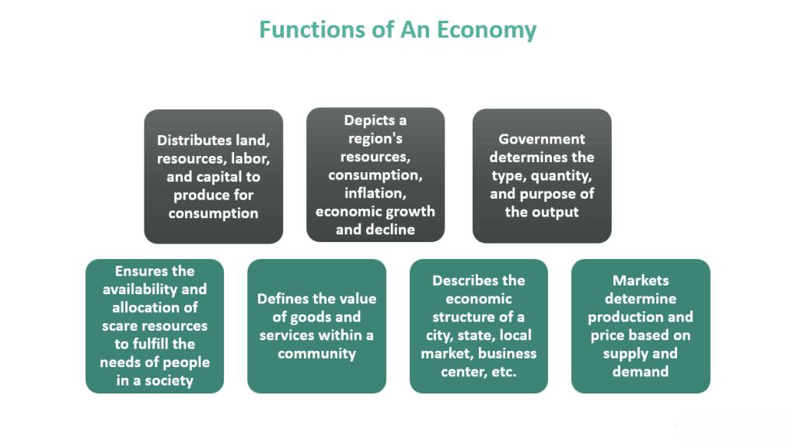

## Table of Contents

## What is an economic calendar?

An economic calendar is a tool that lists important dates and events that can affect the economy. It shows when things like government reports, central bank meetings, and other economic news will happen. People who invest money or trade in the stock market use it to plan their actions based on what might happen in the economy.

Using an economic calendar helps people stay informed about what is going on in the world of finance. For example, if a big report on jobs is coming out, traders might prepare for changes in the stock market. By knowing these dates, people can make better decisions about buying or selling investments.

## Why is an economic calendar important for traders and investors?

An economic calendar is very important for traders and investors because it helps them know when big economic events are going to happen. These events can change the value of stocks, currencies, and other things they might be investing in. By knowing the dates of these events, traders can plan their moves better. For example, if a report on how many people have jobs is coming out, they might decide to buy or sell stocks based on what they think the report will say.

Also, an economic calendar helps traders and investors stay ahead of the market. If they know when important news is coming, they can get ready for it. This means they can make smart choices about their money before everyone else does. It's like having a map that shows where the big changes might happen, so they can navigate the ups and downs of the market more easily.

## How does an economic calendar help in planning financial strategies?

An economic calendar helps traders and investors plan their financial strategies by showing them when important economic events will happen. These events, like reports on jobs or meetings of central banks, can make big changes in the market. By knowing when these events are, people can prepare their investments. For example, if a report is expected to show good news, someone might decide to buy more stocks before the report comes out, hoping the price will go up.

Using an economic calendar also helps people to be ready for surprises. The market can move a lot when big news comes out, and if you know when that news is coming, you can plan your moves to take advantage of it. This means you can decide whether to buy, sell, or hold onto your investments based on what you think will happen. By staying informed and planning ahead, traders and investors can make better choices and hopefully make more money.

## What types of events are typically included in an economic calendar?

An economic calendar usually includes events like government reports on jobs, inflation, and economic growth. These reports come out at specific times and can tell us how well the economy is doing. For example, a jobs report shows how many people are working, which can affect how people feel about the economy. Another important event is when central banks, like the Federal Reserve, meet to talk about interest rates. Changes in interest rates can make borrowing money more or less expensive, which impacts businesses and people.

There are also events like announcements about trade, like new tariffs or trade agreements, which can change how countries buy and sell things. Economic calendars might also show when big companies report their earnings. If a company does better or worse than expected, it can change its stock price. Other events could include speeches by important people in finance or government, because what they say can influence what people think about the economy.

All these events are important because they can move the market. Traders and investors watch these events closely to make decisions about buying or selling stocks, currencies, and other investments. Knowing when these events will happen helps them plan and be ready for changes in the market.

## How can one read and interpret the data on an economic calendar?

Reading an economic calendar involves looking at the dates and times of upcoming economic events. Each event is listed with its name, the date and time it will happen, and sometimes a brief description of what it is about. For example, you might see an entry for "U.S. Non-Farm Payrolls" on a certain date and time. This tells you when the report on how many people are working in the U.S. will come out. It's important to check the time zone because economic calendars often use a specific time zone, like GMT or EST.

Interpreting the data on an economic calendar means understanding what each event might mean for the market. For instance, if the Non-Farm Payrolls report shows more people are working than expected, it could mean the economy is doing well, which might make stock prices go up. If a central bank decides to raise interest rates, borrowing money could become more expensive, which might slow down the economy. Traders and investors look at these events and think about how they might affect what they are investing in. They use this information to decide whether to buy, sell, or hold onto their investments.

## What are the key economic indicators to watch on an economic calendar?

Some of the key economic indicators to watch on an economic calendar are reports on jobs, inflation, and economic growth. The jobs report, like the U.S. Non-Farm Payrolls, tells us how many people are working. If more people have jobs, it usually means the economy is doing well, and this can make stock prices go up. Inflation reports, like the Consumer Price Index (CPI), show how prices are changing. If prices are going up a lot, it might mean inflation is high, which can affect what the central bank does with interest rates.

Another important indicator is Gross Domestic Product (GDP), which measures the total value of all goods and services produced in a country. A high GDP growth rate can mean the economy is strong, which is good for investments. Also, keep an eye on central bank meetings, like those of the Federal Reserve, because they decide on interest rates. If interest rates go up, borrowing money becomes more expensive, which can slow down the economy. By watching these indicators, traders and investors can make better decisions about their money.

## How frequently is an economic calendar updated, and why is this important?

An economic calendar is updated every day. This is important because new events or changes to existing events can happen all the time. For example, a government might decide to release a report a day earlier than planned, or a central bank might schedule a surprise meeting. If traders and investors don't know about these changes, they might miss important news that could affect their investments.

Keeping the economic calendar up to date helps people stay on top of what's happening in the economy. By checking it regularly, they can plan their financial moves based on the latest information. This means they can be ready for big changes in the market and make smarter decisions about buying or selling stocks, currencies, and other investments.

## Can you explain the impact levels of events on an economic calendar?

Economic calendars often show the impact level of events to help traders and investors understand how much an event might move the market. These impact levels are usually marked as low, medium, or high. A low impact event might not change the market much, like a small report on business activity. A medium impact event could move the market a bit more, like a report on housing starts. A high impact event is one that can really shake things up, like a big jobs report or a central bank's decision on interest rates.

Knowing the impact level helps people plan their financial moves better. If a high impact event is coming up, traders might get ready for big changes in the market. They might decide to buy or sell their investments before the event happens, hoping to make money from the expected changes. On the other hand, if an event has a low impact, they might not need to do much because the market won't change much. By understanding these impact levels, traders and investors can focus on the events that matter most to their financial strategies.

## How can an economic calendar be used to predict market volatility?

An economic calendar can help predict market volatility by showing when big economic events are going to happen. These events, like jobs reports or central bank meetings, can make the market move a lot. If a report is expected to be good or bad, traders might start buying or selling before it comes out, which can make the market go up and down a lot. By looking at the economic calendar, people can see when these high impact events are coming and get ready for the market to be more volatile.

For example, if a big jobs report is coming out, traders might expect the market to be more volatile that day. They can plan to buy or sell their investments before the report comes out, hoping to make money from the expected changes. By knowing when these events will happen, traders and investors can be ready for big swings in the market and make better decisions about their money.

## What tools or software are available to access and analyze an economic calendar?

There are many tools and software options available for accessing and analyzing an economic calendar. Some popular websites like Investing.com and Forex Factory offer free economic calendars that show upcoming events, their impact levels, and even historical data. These websites are easy to use and can be accessed from any device with an internet connection. They often let you customize the calendar to focus on the countries or types of events that matter most to you.

For more advanced analysis, software like MetaTrader 4 and MetaTrader 5 can be very helpful. These platforms not only show economic calendars but also let you trade directly from the same interface. They have tools that can help you understand how past events have affected the market, which can be useful for planning future trades. You can also set up alerts to notify you when important events are about to happen, so you don't miss out on any big news.

## How do professional traders use an economic calendar differently from beginners?

Professional traders use an economic calendar in a more detailed and strategic way than beginners. They look at the calendar to plan their trades around high impact events, like big jobs reports or central bank meetings. They know that these events can cause big changes in the market, so they might adjust their positions before these events happen. Professionals also use historical data from the calendar to see how past events affected the market. This helps them predict what might happen next and make better decisions. They might even set up automated systems to trade based on these events, making their strategy more precise and efficient.

Beginners, on the other hand, might just use the economic calendar to keep track of when important events are happening. They might not know as much about how these events can affect the market, so they might just watch the news and see what happens. Beginners might not use the calendar to plan their trades as carefully as professionals do. They might react to the news after it comes out, rather than planning ahead. Over time, as they learn more, they can start using the calendar in more advanced ways, just like the professionals do.

## What are the advanced strategies for maximizing the use of an economic calendar in trading?

Professional traders use advanced strategies to make the most out of an economic calendar. They look at high impact events like jobs reports or central bank meetings and plan their trades around them. They might adjust their investments before these events happen, hoping to profit from the expected market changes. Professionals also study historical data from the calendar to see how past events have affected the market. This helps them predict what might happen next and make better decisions. They might set up automated trading systems that react to these events, making their strategy more precise and efficient.

Another strategy professionals use is to combine the economic calendar with other tools like technical analysis. They might look at charts and indicators to see where the market is likely to go after an event. This helps them find the best times to buy or sell. Professionals also pay attention to the market's reaction to events. If the market moves a lot after an event, they might look for more trading opportunities. By using the economic calendar in these advanced ways, professional traders can stay ahead of the market and make smarter trades.

## What is the current Market Analysis?

Market analysis is a critical component of successful investment and trading strategies, involving the thorough examination of financial markets to discern patterns and trends. These analyses aid in guiding investment decisions by providing insights into potential market behavior. Two of the most prevalent tools in market analysis are [fundamental analysis](/wiki/fundamental-analysis) and technical analysis, each offering unique perspectives and methodologies.

Fundamental analysis focuses on evaluating financial statements, economic indicators, industry conditions, and other macroeconomic factors. By assessing a company's intrinsic value, investors can determine whether a security is overvalued or undervalued. Key indicators include revenues, earnings, future growth, return on equity, and profit margins. A fundamental analyst might calculate the P/E ratio (Price/Earnings), which provides insight into a company's valuation in relation to its earnings:

$$
\text{P/E Ratio} = \frac{\text{Market Value per Share}}{\text{Earnings per Share (EPS)}}
$$

Technical analysis, on the other hand, involves studying price movements and trading volumes through charts and other tools to forecast future price movements. This analysis often employs indicators like moving averages, relative strength index (RSI), and MACD (Moving Average Convergence Divergence) to identify trends and potential buy or sell signals. For instance, a simple moving average (SMA) can be calculated using the following formula, where $P_i$ is the price at time $i$ and $n$ is the number of time periods:

$$
\text{SMA} = \frac{P_1 + P_2 + \ldots + P_n}{n}
$$

Understanding market conditions through these analyses enables investors to seize opportunities and manage risks effectively. By identifying when markets are likely to rise or fall, traders can make informed decisions about entering or exiting positions, thus optimizing their portfolio management strategies.

Risk mitigation is another crucial aspect of market analysis. By anticipating potential market downturns or identifying volatile conditions, investors can employ hedging strategies, diversify their portfolios, or adjust their asset allocations to protect their investments.

Incorporating both fundamental and technical analysis into trading strategies provides a comprehensive view of the market, allowing traders to validate decision-making through multiple lenses. Through this synthesis of data, traders can construct robust strategies that account for various market scenarios, enhancing the potential for achieving desired financial outcomes.

Ultimately, market analysis forms the backbone of prudent trading strategies and effective portfolio management. By leveraging a combination of analytical tools and methodologies, investors are better equipped to navigate the complexities of financial markets, capitalizing on opportunities while minimizing unnecessary risks.

## What is Financial Planning in Trading?

Effective financial planning is a cornerstone of successful trading, as it facilitates the management of investment portfolios and the achievement of long-term financial goals. This comprehensive process begins with the establishment of clear financial objectives. These objectives serve as a roadmap, guiding investment choices and strategies. Whether the aim is capital preservation, income generation, or growth, defining these objectives provides direction and purpose to a trader's activities.

A crucial component of financial planning is assessing risk tolerance, which refers to an individual's ability and willingness to endure market variability and potential losses. This assessment helps in matching investment strategies with the trader’s comfort level, ensuring that market fluctuations do not lead to hasty, emotionally-driven decisions. For instance, a risk-averse individual might focus on a portfolio that includes bonds and dividend-paying stocks, while a risk-seeking investor may allocate more towards equities and [growth stocks](/wiki/growth-stocks).

Developing a coherent strategy that aligns with the established objectives and risk tolerance is essential. This strategy should encompass portfolio diversification, which mitigates risk by spreading investments across various asset classes. Diversification can be quantitatively assessed using the standard deviation of a portfolio's returns as a measure of risk. The formula for portfolio variance, which reflects diversification, is:

$$
\sigma^2_p = \sum_{i=1}^{n} \sum_{j=1}^{n} w_i w_j \sigma_i \sigma_j \rho_{ij}
$$

Where:
- $\sigma^2_p$ is the portfolio variance
- $w_i$ and $w_j$ are the weights of assets $i$ and $j$ in the portfolio
- $\sigma_i$ and $\sigma_j$ are the standard deviations of the assets
- $\rho_{ij}$ is the correlation coefficient between the returns on assets $i$ and $j$.

Financial planning also involves continuous monitoring and rebalancing of the investment portfolio to ensure alignment with changing market conditions and personal circumstances. This discipline is crucial in volatile markets, where maintaining a strategic focus can prevent emotional reactions that might disrupt long-term plans. The implementation of regular reviews and adjustments ensures that the investor's strategy remains on track to achieve both short-term needs and long-term financial objectives.

In conclusion, robust financial planning provides the structure and discipline necessary for successful trading. By setting clear objectives, assessing risk tolerance, and crafting a coherent investment strategy, traders can navigate financial markets more effectively. This approach not only steadies the [course](/wiki/best-algorithmic-trading-courses) in turbulent times but also lays the foundation for achieving sustainable long-term financial success.

## References & Further Reading

[1]: Bergstra, J., Bardenet, R., Bengio, Y., & Kégl, B. (2011). ["Algorithms for Hyper-Parameter Optimization."](https://proceedings.neurips.cc/paper/2011/file/86e8f7ab32cfd12577bc2619bc635690-Paper.pdf) Advances in Neural Information Processing Systems 24.

[2]: ["Advances in Financial Machine Learning"](https://www.amazon.com/Advances-Financial-Machine-Learning-Marcos/dp/1119482089) by Marcos Lopez de Prado

[3]: ["Evidence-Based Technical Analysis: Applying the Scientific Method and Statistical Inference to Trading Signals"](https://www.amazon.com/Evidence-Based-Technical-Analysis-Scientific-Statistical/dp/0470008741) by David Aronson

[4]: ["Machine Learning for Algorithmic Trading"](https://github.com/stefan-jansen/machine-learning-for-trading) by Stefan Jansen

[5]: ["Quantitative Trading: How to Build Your Own Algorithmic Trading Business"](https://github.com/LucindaYa/quant-resources/blob/master/Quantitative%20Trading%20How%20to%20Build%20Your%20Own%20Algorithmic%20Trading%20Business.pdf) by Ernest P. Chan