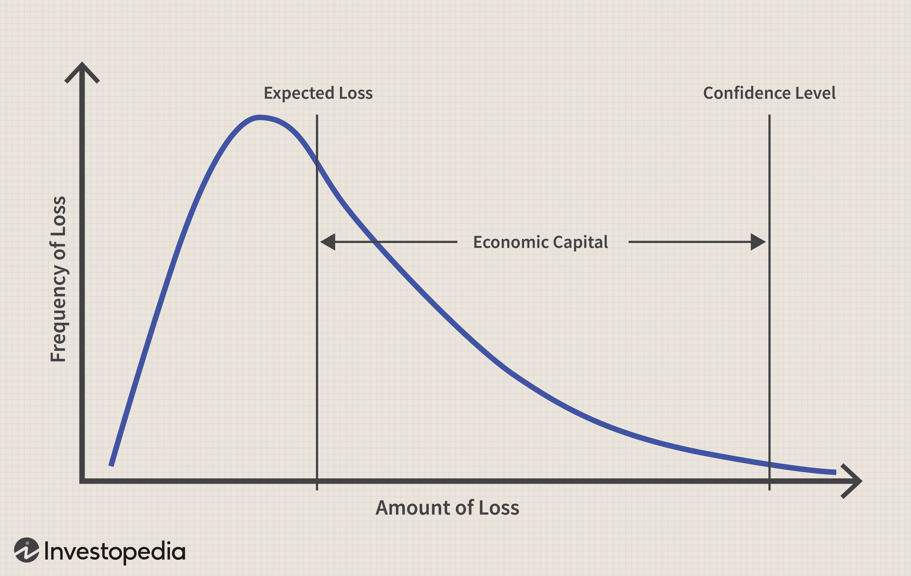

Algorithmic trading has fundamentally transformed financial markets by employing sophisticated computer algorithms to execute trades with unmatched precision and speed. These algorithms can analyze large datasets almost instantaneously, identifying and capitalizing on market opportunities while minimizing human error and emotional decision-making. This approach not only enhances the efficiency of trading operations but also enables the execution of complex trading strategies that would be impractical manually. 

On the other hand, economic capital plays a critical role in financial risk management. It is a measure of the capital a firm needs to sustain solvency, considering its risk profile. Unlike regulatory capital, which is mandated by financial authorities to meet statutory requirements, economic capital is derived internally, often through proprietary models. It reflects a firm's actual risk exposure, helping to evaluate potential losses under various scenarios. 



This article focuses on how economic capital calculations are integrated with algorithmic trading systems. Understanding this integration is essential for creating a robust framework that enhances risk management and improves investment strategies for traders and financial institutions. By evaluating both technical efficiency and financial stability through economic capital, firms can better navigate the complexities of modern financial markets. The interplay between algorithmic prowess and prudent risk management can empower trading activities and strategic decision-making in a dynamic and often unpredictable market environment.

## Table of Contents

## What is Economic Capital?

Economic capital refers to the level of capital that a company needs to maintain to ensure its ability to meet its financial obligations, thus securing its solvency. This measure is particularly rooted in the firm's risk profile, encompassing the various risks that the business might face over a specific period. It is calculated internally by financial institutions and businesses using proprietary models, enabling a more tailored and realistic assessment of the firm's capability to withstand potential losses compared to generic regulatory requirements.

The calculation of economic capital is tailored to actual risk exposure rather than the minimum thresholds set by regulatory authorities. This distinction is significant because regulatory capital is primarily concerned with compliance and maintaining standards set by financial regulators, which may or may not align with the actual risk profile and financial health of the specific institution.

In the context of trading, particularly algorithmic trading, understanding economic capital is crucial as it assists in identifying the level of risk that an algorithmic strategy can safely undertake. This involves considering various risk factors that might affect the positions traded, including market risk, credit risk, and operational risk. By ensuring that the capital set aside reflects the true risk exposure, firms can optimize their trading strategies, balancing potential returns with the level of risk they are prepared to manage.

The proprietary models used for calculating economic capital often integrate sophisticated risk assessment techniques such as value-at-risk (VaR) analysis, stress testing, and scenario analysis. These models allow firms to simulate a range of possible loss scenarios, equipping them with a detailed understanding of the potential capital requirements needed under different market conditions. Consequently, economic capital serves as a robust tool for risk management, aligning financial strategies with a firm's capacity to absorb risk, ultimately safeguarding the firm's financial stability.

## Calculating Economic Capital

Calculating economic capital is a critical task for financial institutions, balancing the need for robustness against the constraints of capital adequacy. This process primarily involves assessing market, credit, and operational risks that a firm might encounter. Internal models, tailored to the firm’s specific risk profile, often use value-at-risk (VaR) calculations, stress testing, and scenario analysis to determine the required capital buffer.

Value-at-risk is a statistical method that estimates the potential loss in value of a portfolio under normal market conditions over a set time period, given a specified confidence interval. For instance, a VaR calculation at a 99% confidence level predicts that, 99 times out of 100, the portfolio will not experience a loss greater than the calculated VaR value.

Stress testing complements VaR by evaluating potential losses under extreme market conditions that might fall outside the normal distribution expected in VaR calculations. Scenario analysis extends this by applying hypothetical scenarios to assess their impact on the firm’s financial health.

The economic capital calculation must also reflect the firm's financial strength, involving expected loss and a confidence level to maintain solvency. Expected loss represents the average loss a firm anticipates over a specific period, accounting for its risk exposure.

For example, consider a bank calculating its economic capital requirements to hold sufficient capital for unforeseen losses while maintaining its solvency with a high level of confidence, such as 99.96%. If the bank determines it needs $1 billion to cover potential losses at this confidence interval, it implies the bank is highly prepared to withstand adverse financial conditions up to this threshold. This robust capital estimation process supports a resilient financial position and helps ensure the bank’s ongoing stability and capacity to meet obligations.

## Algorithmic Trading and Risk Management

Algorithmic trading utilizes automated systems to execute trades based on pre-defined criteria, achieving high-speed, cost-effective transactions. This mechanized trading approach relies on sophisticated algorithms that process vast amounts of financial data to make split-second trading decisions, often exploiting minute price discrepancies across markets.

Integrating economic capital assessments in [algorithmic trading](/wiki/algorithmic-trading) is crucial for determining the risk budget available for various trading strategies. Economic capital, as an internally calculated measure, provides insight into how much risk a firm can safely assume without jeopardizing its financial stability. By considering these assessments, traders can align their strategies with the firm’s risk appetite and financial strength, ensuring that each trade aligns with risk management goals.

Utilizing economic capital metrics, traders have the opportunity to optimize the balance between risk and reward. This balance is essential for maintaining the stability and profitability of trading operations. By quantifying risk exposure through economic capital, traders can make informed decisions about trade sizes, timing, and asset allocation. This quantification allows them to avoid excessive risk-taking that could endanger the firm’s capital structure.

For example, consider an algorithm that adjusts its trading [volume](/wiki/volume-trading-strategy) based on calculated economic capital. In this scenario, the algorithm might increase trade volumes when the economic capital indicates a higher risk tolerance and decrease volumes when risk tolerance is lower. This adaptability ensures that trading activities remain within acceptable risk limits, even as market conditions fluctuate. Here's a simplified Python example illustrating how such an algorithm might dynamically adjust trade volume:

```python
def adjust_trade_volume(current_volume, economic_capital, market_conditions):
    """
    Adjusts trading volume based on economic capital and market conditions.

    Parameters:
    current_volume (float): The current volume of trades.
    economic_capital (float): The available economic capital.
    market_conditions (float): Indicator of current market volatility (e.g., a multiplier from 0.5 to 2).

    Returns:
    float: The adjusted volume of trades.
    """
    risk_factor = economic_capital / 1000000  # Normalize capital into a manageable factor
    adjusted_volume = current_volume * risk_factor * market_conditions
    return adjusted_volume

# Example usage
current_volume = 1000  # Initial trade volume
economic_capital = 5000000  # Available economic capital
market_conditions = 1.2  # Current market condition indicator

adjusted_volume = adjust_trade_volume(current_volume, economic_capital, market_conditions)
print(f"Adjusted Trade Volume: {adjusted_volume}")
```

This synergy between algorithmic trading and economic capital ensures that trading strategies are continually reassessed and recalibrated to reflect current economic realities, protecting firms from potential losses while maximizing their exposure to profitable opportunities.

## Example Calculation: Economic Capital in Algorithmic Trading

Consider a scenario where a financial firm applies economic capital metrics to an algorithm for trading equities. This section outlines the practical steps involved in this integration, focusing on quantifying and managing risk within pre-defined capital limits.

### Step 1: Determine the Baseline Risk Profile

The first step involves assessing the baseline risk profile by analyzing historical market data. This requires examining market [volatility](/wiki/volatility-trading-strategies) and identifying potential losses from past trading activities. By using statistical models to analyze historical data, the firm can determine the variability and distribution of returns.

A common approach is to calculate the historical volatility and potential downside risk using statistical measures such as standard deviation and beta. These metrics provide insights into the equities' sensitivity to market movements and help estimate potential loss scenarios.

### Step 2: Calculate Economic Capital Using VaR Models

Once the baseline risk profile is established, the next step is to calculate the economic capital requirement using Value-at-Risk (VaR) models. VaR is a widely accepted risk management tool that estimates the potential loss in value of a portfolio under normal market conditions over a set time period, given a specific confidence interval.

For example, consider a daily VaR calculation with a 99% confidence level. This means there is a 1% chance that the firm could encounter losses exceeding the VaR estimate on any given day.

```python
import numpy as np

# Sample portfolio returns
returns = np.random.normal(0.001, 0.02, 1000)  # 1000 days of simulated daily returns

# Calculate VaR at 99% confidence level
confidence_level = 0.99
VaR = np.percentile(returns, (1-confidence_level)*100)
print(f'Value-at-Risk (VaR) at 99% confidence: {VaR}')
```

Moreover, the firm should incorporate stress scenarios to simulate adverse market conditions that are not covered by traditional VaR models. Stress testing involves constructing hypothetical scenarios based on historical events or expert judgment to evaluate the portfolio's performance under extreme conditions.

### Step 3: Align Trading Algorithm Parameters with Capital Constraints

In the final step, the firm aligns its trading algorithm parameters with the calculated economic capital to ensure compliance with risk limits. This involves adjusting the algorithm's trading volume and leverage to fit within the prescribed risk budget. The objective is to optimize risk-adjusted returns while adhering to the calculated economic capital constraints.

For instance, the trading algorithm might cap the maximum position size or adjust its trading frequency based on the prevailing market volatility and VaR estimates. This dynamic calibration ensures that trades remain within the safe bounds of the firm's capital structure.

By following these steps, trading activities become more sustainable and less likely to expose the firm to excessive risk. This prudent integration of economic capital metrics into algorithmic trading not only enhances risk management but also optimizes the profitability of trading strategies in variable market conditions.

## Challenges and Future Directions

Integrating economic capital assessments with algorithmic trading presents several challenges, particularly in achieving precise risk assessments that closely align with ever-changing market dynamics. One primary challenge is the accurate estimation of risk exposure in real-time, which is crucial for maintaining the solvency of a firm and ensuring that trading algorithms operate within safe parameters. The dynamic nature of financial markets, coupled with external factors influencing market volatility, necessitates robust models that can swiftly adapt to new conditions and provide reliable risk assessments.

Technological advancements, notably in [machine learning](/wiki/machine-learning), have shown significant promise in refining the accuracy of economic capital estimates. Machine learning algorithms can process vast datasets efficiently, uncovering patterns and correlations that may not be immediately apparent through traditional models. By leveraging machine learning, financial institutions can enhance the predictive capability of their risk models, facilitating more accurate and timely economic capital calculations. For example, neural networks can be trained to recognize complex market patterns, allowing for improved risk forecasts that inform the capital reserves required for specific trading strategies.

The future of economic capital integration in algorithmic trading is likely to focus on developing adaptive algorithms capable of real-time adjustments to reflect changes in market conditions. Such adaptive systems would utilize continuous data inputs and advanced processing techniques to alter trading parameters and ensure that activities remain within acceptable risk thresholds. These algorithms could employ [reinforcement learning](/wiki/reinforcement-learning), where they iteratively learn and optimize their strategies based on market feedback, dynamically aligning with economic capital constraints.

Furthermore, continuous monitoring and updates to risk models are essential to enhance the effectiveness and resilience of algorithmic trading strategies. Regular recalibration of models ensures that they remain relevant and reliable amidst evolving market conditions. This involves not only updating the underlying data but also refining the model structures and parameters to reflect the latest insights and trends in financial markets. By maintaining up-to-date risk assessments, firms can better navigate market uncertainties, optimizing their risk-reward balances while safeguarding their capital base.

In conclusion, while challenges exist in integrating economic capital assessments with algorithmic trading, technological advancements and continuous model refinement offer pathways to surmount these challenges. The development of adaptive, real-time risk assessment tools will be instrumental in advancing the efficacy of algorithmic trading in managing financial risks effectively.

## Conclusion

The integration of economic capital calculations within algorithmic trading frameworks provides a sophisticated approach to managing financial risks. By systematically evaluating risk exposure and aligning trading strategies with capital constraints, financial institutions can improve their market engagements. This alignment ensures that trading strategies are not only optimized for profit but are also sustainable in terms of risk management. This methodological approach enables firms to efficiently deploy their capital, thus enhancing their ability to withstand market volatility and unexpected financial shocks.

Algorithmic trading, by itself, offers speed and precision, but when complemented with economic capital constraints, it can achieve a balance between aggressive trading strategies and prudent risk management. This balanced approach helps in safeguarding financial stability by preventing over-leverage situations that could jeopardize a firm's solvency.

Moreover, this synergy between economic capital calculations and algorithmic trading empowers traders and institutions to navigate the financial landscape more effectively. By continuously monitoring and updating their risk models, firms can dynamically adjust their trading strategies to align with real-time market conditions. This capability allows institutions to balance opportunities and risks adeptly, ensuring resilience in a dynamic market environment while simultaneously pursuing avenues for growth and profitability. In summary, the integration serves as a pivotal mechanism for fortifying financial health and strategic trading efficacy.

## References & Further Reading

[1]: Hull, J. C. (2015). ["Risk Management and Financial Institutions."](https://www.amazon.com/Management-Financial-Institutions-Wiley-Finance/dp/1119932483) Wiley Finance.

[2]: Lopez de Prado, M. (2018). ["Advances in Financial Machine Learning."](https://www.amazon.com/Advances-Financial-Machine-Learning-Marcos/dp/1119482089) Wiley.

[3]: Jorion, P. (2007). ["Value at Risk: The New Benchmark for Managing Financial Risk."](https://link.springer.com/article/10.1007/s11408-007-0057-3) McGraw-Hill.

[4]: Chan, E. (2008). ["Quantitative Trading: How to Build Your Own Algorithmic Trading Business."](https://github.com/ftvision/quant_trading_echan_book) Wiley Trading.

[5]: Aronson, D. R. (2007). ["Evidence-Based Technical Analysis: Applying the Scientific Method and Statistical Inference to Trading Signals."](https://onlinelibrary.wiley.com/doi/book/10.1002/9781118268315) Wiley.

[6]: Jansen, S. (2020). ["Machine Learning for Algorithmic Trading: Predictive Models to Extract Signals from Market and Alternative Data for Systematic Trading Strategies."](https://www.amazon.com/Machine-Learning-Algorithmic-Trading-alternative/dp/1839217715) Packt Publishing.