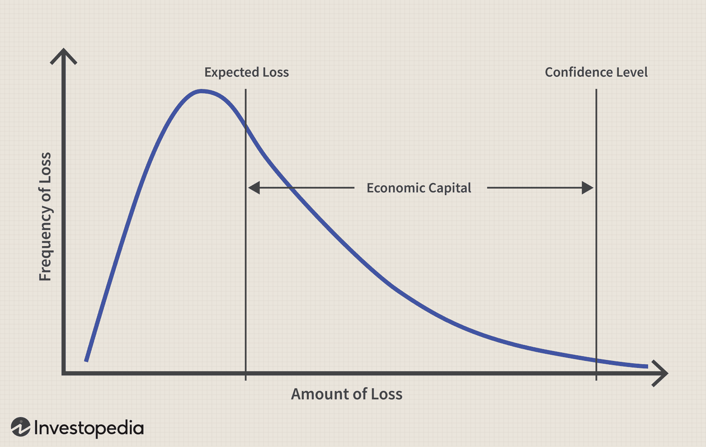

## Table of Contents

## What is economic capital?

Economic capital is the money that a company sets aside to cover potential losses or risks. It acts like a safety net, helping the company to stay stable and continue operating even if something unexpected happens. Think of it as a financial cushion that businesses use to protect themselves from things like market changes, bad debts, or natural disasters.

This concept is important for banks and insurance companies, but other businesses use it too. By having economic capital, a company can make sure it has enough money to handle tough times without going bankrupt. Regulators often require financial institutions to hold a certain amount of economic capital to ensure they can meet their obligations to customers and maintain trust in the financial system.

## How is economic capital different from regulatory capital?

Economic capital and regulatory capital both help banks and other financial companies stay safe, but they are used in different ways. Economic capital is the money a company decides it needs to cover risks that it might face. This amount is based on the company's own calculations and understanding of its risks. It's like a personal safety net that the company sets up to make sure it can handle any unexpected problems.

Regulatory capital, on the other hand, is the amount of money that the government or financial regulators say a company must have. This is to make sure that the company can pay its debts and keep the financial system stable. The rules for regulatory capital are the same for all companies in a certain category, so it's not based on each company's individual risks. While economic capital is about a company's own risk management, regulatory capital is about meeting external standards set by authorities.

## What are the main components of economic capital?

Economic capital is made up of different parts that help a company manage risks. One important part is credit risk, which is the risk that someone who owes the company money might not pay it back. Another part is market risk, which comes from changes in things like interest rates, stock prices, or currency values. Operational risk is also a big piece of economic capital, covering losses from things like fraud, system failures, or mistakes by employees.

Another key component is liquidity risk, which is the risk that a company might not be able to get cash quickly enough to meet its needs. Companies also consider business risk, which includes things like changes in the economy or competition that might hurt their profits. All these parts together help a company figure out how much money it needs to set aside to stay safe from unexpected problems.

## Why is economic capital important for financial institutions?

Economic capital is very important for financial institutions like banks and insurance companies because it helps them stay safe and strong. It's like a safety net that these companies use to cover losses if something bad happens, like if a lot of people can't pay back their loans or if there's a big change in the market. By having enough economic capital, these institutions can keep running smoothly even when things go wrong, which is really important for keeping their customers' trust and for the overall health of the financial system.

Another reason economic capital is important is that it helps financial institutions manage their risks better. When a bank or insurance company knows how much money it needs to set aside for different kinds of risks, it can make smarter decisions about what loans to give out or what investments to make. This careful planning helps them avoid big problems and makes sure they can keep serving their customers well, no matter what surprises come their way.

## What is risk assessment in the context of economic capital?

Risk assessment is a way for companies to figure out how much money they need to keep safe from bad things that might happen. It's like making a list of all the things that could go wrong, like people not paying back loans or big changes in the market, and then deciding how likely those things are to happen and how bad they would be if they did. This helps the company know how much money, or economic capital, they need to set aside to cover these risks.

By doing a good risk assessment, a company can make sure it has enough money to handle tough times without going broke. It's important because it helps the company plan ahead and make smart choices about what risks to take. For example, a bank might decide to give out fewer risky loans if it sees that it doesn't have enough economic capital to cover the chance of those loans not being paid back.

## What are the common methods used to assess risk in economic capital?

One common way to assess risk in economic capital is by using statistical models. These models look at past data to guess how likely bad things are to happen and how much they might cost. For example, a bank might use past loan data to figure out the chance of people not paying back their loans. These models help the bank decide how much money to set aside for these risks. Another method is stress testing, where companies imagine really bad situations, like a big economic crash, and see how they would do. This helps them understand if they have enough economic capital to survive tough times.

Another method is scenario analysis, which is a bit like stress testing but focuses on specific events. Companies think about different situations that could happen, like a sudden drop in the stock market or a natural disaster, and then figure out how these events would affect their business. By doing this, they can plan how much economic capital they need to stay safe. Lastly, companies often use expert judgment, where people who know a lot about the business and its risks make educated guesses about what might happen. This method is useful because it can catch risks that numbers and models might miss.

## How do financial institutions calculate their economic capital?

Financial institutions calculate their economic capital by first figuring out all the risks they might face. They look at things like the chance of people not paying back loans, changes in the market that could hurt their investments, and even the possibility of mistakes or fraud inside the company. To do this, they often use special math models that look at past data to guess how likely these bad things are to happen and how much they might cost. They also run tests where they imagine really tough situations, like a big economic crash, to see how well they would handle it.

After figuring out their risks, financial institutions decide how much money they need to set aside to cover these risks. They add up all the money they might lose from different kinds of risks and make sure they have enough economic capital to handle it. Sometimes, they also talk to experts who know a lot about the business to make sure they haven't missed any important risks. By doing all this, they can make sure they have enough of a safety net to keep going strong, even if something unexpected happens.

## What role does stress testing play in economic capital and risk assessment?

Stress testing is like a practice run for really bad situations that could happen to a financial institution. It helps them see if they have enough money, or economic capital, to handle tough times. For example, a bank might imagine what would happen if a lot of people suddenly couldn't pay back their loans or if the stock market crashed. By running these tests, the bank can figure out if they have enough money saved up to cover the losses and keep running smoothly.

These tests are important because they help banks and other companies be ready for unexpected problems. If a stress test shows that a bank doesn't have enough economic capital, they can plan to save more money or change how they do business to lower their risks. This way, they can make sure they stay strong and can keep helping their customers, no matter what surprises come their way.

## How can economic capital be optimized to improve risk management?

To make the best use of economic capital for better risk management, a company needs to keep a close eye on all the risks it faces. This means regularly checking and updating their risk models to make sure they're using the most recent data and understanding of what might go wrong. By doing this, a company can figure out exactly how much money they need to set aside for different kinds of risks, like people not paying back loans or big changes in the market. This helps them use their money wisely and not keep more economic capital than they need, which can free up funds for other important things like growing the business or making new investments.

Another way to optimize economic capital is by using smart risk management strategies. For example, a company might decide to spread out its risks by not putting all its money into one type of investment or loan. They can also use tools like insurance or financial agreements to protect themselves from big losses. By doing this, they can lower the amount of economic capital they need to hold because they're less likely to face huge problems. Regular stress testing and scenario analysis also help because they let the company practice for tough times and adjust their economic capital to make sure they're always ready for whatever might happen.

## What are the challenges faced in measuring and managing economic capital?

Measuring and managing economic capital can be really tricky because it involves guessing what might go wrong in the future. Companies have to use a lot of math and past data to make these guesses, but the future is always uncertain. This means their calculations might not be perfect. Also, different risks like people not paying back loans, big changes in the market, or even mistakes inside the company can be hard to predict and measure. If a company gets these numbers wrong, they might not set aside enough money to cover losses, or they might keep too much money that could be used for other things.

Another challenge is that rules and the way the economy works can change over time. This means companies have to keep updating their risk models and how they manage their economic capital. It can be hard to keep up with all these changes and make sure they're always doing things the right way. Plus, different parts of the company might see risks differently, so getting everyone to agree on how much economic capital they need can be tough. It's like trying to solve a puzzle that keeps changing shape, and everyone needs to work together to get it right.

## How do regulatory frameworks influence economic capital and risk assessment practices?

Regulatory frameworks set rules that financial institutions must follow, and these rules have a big impact on how they manage their economic capital and assess risks. For example, regulators might require banks to keep a certain amount of money, called regulatory capital, to make sure they can handle losses and stay stable. This means that banks have to set aside at least this much money, even if their own calculations say they need less. So, the rules can make banks hold more money than they might want to, which affects how they plan their economic capital and manage risks.

On top of setting minimum requirements, regulatory frameworks also guide how banks do their risk assessments. Regulators often tell banks what kinds of risks to look at and how to measure them. This can help make sure that all banks are looking at risks in a similar way, which is good for the overall stability of the financial system. But it can also mean that banks have less freedom to use their own methods or focus on the risks they think are most important to them. So, while regulatory frameworks help keep things safe and fair, they can also make it harder for banks to manage their economic capital in the way they think is best.

## What advanced models and technologies are being used to enhance economic capital and risk assessment?

Advanced models and technologies are helping financial institutions better understand and manage their economic capital and risks. One big tool is [machine learning](/wiki/machine-learning), which is like a super smart computer that can learn from lots of data. Banks use machine learning to look at past information and make better guesses about what might happen in the future, like if people will pay back their loans or how the market might change. This helps them figure out exactly how much money they need to set aside to cover these risks. Another tool is big data analytics, which lets banks look at huge amounts of information from different places to spot patterns and risks that they might miss otherwise.

Another important technology is cloud computing, which gives banks the power to handle and store a lot of data without needing big, expensive computers. This makes it easier and cheaper for them to run complicated risk models and do stress tests to see how they would handle tough times. Also, [artificial intelligence](/wiki/ai-artificial-intelligence) (AI) is being used to make risk assessment faster and more accurate. AI can help banks find hidden risks and make quick decisions about how much economic capital they need. By using these advanced models and technologies, financial institutions can manage their risks better and make sure they have the right amount of economic capital to stay strong and safe.

## What is the importance of understanding risk assessment and risk management?

Risk assessment is a crucial preliminary phase in the risk management process, involving the identification and evaluation of potential threats that could negatively impact investment outcomes. This process systematically examines various types of risks, which can be classified into market risk, credit risk, operational risk, and [liquidity](/wiki/liquidity-risk-premium) risk, among others. Each type of risk carries unique characteristics and potential impacts on financial activities. For instance, market risk arises from changes in market variables such as interest rates, foreign exchange rates, and stock prices, while credit risk is concerned with counterparties' inability to fulfill contractual obligations.

To effectively assess these risks, quantitative tools and methodologies are often employed. Statistical models, historical data analysis, and scenario analysis are commonly used techniques. For example, Value at Risk (VaR) is a widely utilized statistical technique that estimates the potential loss in the value of a portfolio over a defined period for a given confidence interval. The formula used in a simple VaR calculation based on historical data can be expressed as:

$$
\text{VaR} = \text{Portfolio Value} \times \text{Z-score} \times \text{Standard Deviation of Returns}
$$

Risk management follows assessment by focusing on identifying, analyzing, and mitigating the outlined risks. It is a dynamic process that aims to minimize potential financial losses, preserve capital, and ensure the long-term sustainability of trading endeavors. The risk management framework typically involves several key components: risk identification, risk measurement and assessment, risk control and mitigation, and continuous risk monitoring.

A fundamental principle of risk management is diversification, which involves spreading investments across different asset classes, sectors, or geographies to reduce exposure to any single source of risk. Another core strategy is the application of stop-loss orders, which are designed to limit an investor's loss on a security position by triggering an automatic sale if the security's price falls to a predetermined level.

Advanced risk management techniques may also incorporate dynamic risk adjustment, where trading positions are continuously adjusted based on market conditions and risk exposure levels. This approach often employs automated systems and algorithms to ensure rapid response to market changes, enhancing the robustness of trading strategies.

By leveraging a combination of traditional and advanced techniques, financial institutions can build effective risk management frameworks that not only address current risks but also adapt to the evolving financial landscape. These frameworks are crucial for maintaining financial stability and achieving sustainable trading success.

## What is the Role of Economic Capital in Risk Management?

Economic capital plays a pivotal role in risk management within financial institutions by serving as an internal gauge for risk-adjusted performance evaluation and strategic decision-making. It acts as a buffer against unexpected losses, providing a metric for understanding and managing financial risks across various business segments.

Economic capital helps in measuring and comparing risk-adjusted returns (RAR). This metric is fundamental in assessing the profitability of investments relative to the risk undertaken. The RAR is calculated as:

$$
\text{RAR} = \frac{\text{Net Return}}{\text{Economic Capital Allocated}}
$$

where the net return is the profit from an investment, and the economic capital allocated represents the capital set aside to cover potential losses from the investment.

Real-world applications of economic capital can be seen in diversified banking operations, where it guides resource allocation across different trading and investment activities. For example, a bank might use economic capital to allocate resources between high-risk trading activities and more stable loan portfolios. The capital allocation is adjusted based on the expected loss distribution across these activities, providing insights into the bank's risk profile and ensuring sufficient capital buffers.

One illustrative example is how global banks use economic capital to manage credit risk. By estimating the potential losses from credit defaults and setting aside corresponding economic capital, these institutions ensure they can absorb unexpected credit events without jeopardizing overall solvency. This approach aligns capital allocation with the institution’s risk appetite and regulatory requirements, optimizing their risk-return profile.

Through the application of economic capital, financial institutions can consistently evaluate and compare performance across different units within the organization. By balancing risks and rewards, banks are better positioned to enhance shareholder value while maintaining financial stability.

In conclusion, economic capital facilitates better risk management by providing a comprehensive framework to measure risk-adjusted returns. Its strategic deployment is crucial for maintaining resilience against potential market disruptions, aiding institutions in navigating the complexities of modern financial landscapes.

## What is Monte Carlo Analysis in Algo Trading?

Monte Carlo simulations serve as a powerful statistical tool that allows traders to assess uncertainty and manage risks associated with [algorithmic trading](/wiki/algorithmic-trading) strategies. By generating a large number of potential future states of a market or asset price, Monte Carlo analysis can help traders understand the range and probability of possible outcomes under varying risk scenarios. This predictive capability is crucial for determining the robustness of a trading strategy.

Implementation of Monte Carlo Analysis in algorithmic trading begins with defining the model that represents the market or asset behavior. This model could involve various stochastic processes such as the Geometric Brownian Motion (GBM) often used to model stock prices. The next step involves generating a large number of simulations based on random inputs derived from probability distributions that mirror real-world market conditions. For asset price simulation using GBM, the formula generally used is:

$$
S_t = S_0 \times \exp \left( \left( \mu - \frac{\sigma^2}{2} \right) t + \sigma \times W_t \right)
$$

where $S_t$ is the simulated price at time $t$, $S_0$ is the initial price, $\mu$ is the expected return, $\sigma$ is the volatility, and $W_t$ is a Wiener process.

Using Python, traders can implement a Monte Carlo simulation for a stock price as follows:

```python
import numpy as np

# Parameters for simulation
S0 = 100  # Initial stock price
mu = 0.05  # Expected return
sigma = 0.2  # Volatility
T = 1  # Time to maturity
simulations = 10000  # Number of simulations

# Time increment
dt_t = 1 / 252  # Assume daily intervals

# Generate simulation paths
simulated_paths = np.exp((mu - 0.5 * sigma**2) * T +
                         sigma * np.sqrt(T) * np.random.standard_normal(simulations))

# Simulated end stock prices
simulated_prices = S0 * simulated_paths

# Output a few results
print(simulated_prices[:10])
```

Monte Carlo simulations provide a distribution of possible outcomes rather than a single deterministic forecast. This allows traders to evaluate the likelihood of reaching specific financial goals, identify unfavorable conditions, and optimize strategies to mitigate potential losses. Traders often use metrics such as Value at Risk (VaR) and Conditional Value at Risk (CVaR) derived from these simulations to assess downside risk and improve capital allocation.

Practical application of Monte Carlo simulations is apparent in stress testing and scenario analysis. For example, a trader may simulate the effect of unexpected market shocks on their portfolio to evaluate how well their current strategies withstand extreme market conditions. By identifying scenarios where strategies fail, traders can adapt their algorithms and hedge positions more effectively.

In conclusion, the ability of Monte Carlo simulations to model complex, nonlinear systems and accommodate arbitrary distributions of returns makes them indispensable for algorithmic traders aiming to enhance the robustness of their strategies amid uncertain and volatile market environments.

## How can one implement effective risk management techniques?

Effective risk management techniques are critical for traders seeking to navigate and optimize their strategies amid uncertain market conditions. Implementing robust methodologies ensures not only the preservation of capital but also enhances the potential for achieving superior returns. This section explores several methods, including stop-loss orders, portfolio diversification, and dynamic position sizing, supported by real-world applications and case studies.

### Stop-Loss Orders

Stop-loss orders are a quintessential tool in risk management, designed to limit an investor's loss on a position by automatically triggering a sale when the asset reaches a specific price point. This mechanism mitigates emotional decision-making and allows traders to cap potential losses in volatile markets. For example, consider a scenario where a trader sets a stop-loss order at 5% below the purchase price of a stock. If the stock's price declines to this level, the order is executed immediately, thus securing the trader from further downside. Stop-loss orders are particularly effective in markets with high [volatility](/wiki/volatility-trading-strategies), where swift price movements can occur.

### Portfolio Diversification

Portfolio diversification involves spreading investments across various asset classes to reduce exposure to any single asset or risk. The fundamental principle of diversification is that a well-balanced portfolio can yield more stable returns than one concentrated in a single investment type. Mathematically, diversification is often linked with the concept of risk reduction. By using the formula for portfolio variance:

$$
\sigma_p^2 = \sum_{i=1}^{n} (w_i \cdot \sigma_i)^2 + \sum_{i=1}^{n}\sum_{j=1}^{n} w_i \cdot w_j \cdot \text{Cov}(r_i, r_j)
$$

where $w_i$ and $w_j$ represent the weights of assets $i$ and $j$ in the portfolio, $\sigma_i$ is the standard deviation of returns for asset $i$, and $\text{Cov}(r_i, r_j)$ is the covariance between returns of assets $i$ and $j$. By diversifying, traders aim to minimize $\sigma_p^2$, the overall risk of the portfolio. Historical data showcases that diversified portfolios tend to deliver more consistent returns over time, despite fluctuations in individual asset performance.

### Dynamic Position Sizing

Dynamic position sizing refers to adjusting the size of positions based on changing market conditions and volatility levels. This technique optimizes the trade size dynamically to either exploit favorable conditions or minimize exposure during unfavorable ones. Techniques such as the Kelly Criterion can be used to determine optimal sizing:

$$
f^* = \frac{bp - q}{b}
$$

where $f^*$ is the fraction of the capital to bet, $b$ is the odds received on the wager, $p$ is the probability of winning, and $q$ is the probability of losing (i.e., $1 - p$).

### Real-World Applications and Case Studies

Numerous case studies illustrate the successful application of these risk management techniques. For instance, traders at prominent hedge funds have leveraged stop-loss orders and dynamic position-sizing strategies to protect portfolios during market downturns, thereby maintaining competitive returns. Additionally, portfolio diversification can be seen in action with diversified index funds, which mitigate specific industry risks and provide exposure to a broader market spectrum.

In conclusion, employing these effective risk management tools can greatly enhance the robustness of trading strategies. As market landscapes continue to evolve, these methodologies remain crucial for achieving financial stability and success.

## References & Further Reading

[1]: Hull, J. C. (2018). ["Risk Management and Financial Institutions,"](https://books.google.com/books/about/Risk_Management_and_Financial_Institutio.html?id=1J1QDwAAQBAJ) 5th Edition, Wiley.

[2]: [Bessis, J. (2015).](https://www.wiley.com/en-us/Risk+Management+in+Banking%2C+4th+Edition-p-9781118660218) "Risk Management in Banking," 4th Edition, Wiley.

[3]: Cont, R. (2001). ["Empirical properties of asset returns: Stylized facts and statistical issues."](http://rama.cont.perso.math.cnrs.fr/pdf/empirical.pdf) Quantitative Finance, 1(2), 223-236.

[4]: Alexander, C. (2008). ["Market Risk Analysis Volume II: Practical Financial Econometrics,"](https://openlibrary.org/books/OL29026447M/Market_Risk_Analysis_Practical_Financial_Econometrics_Vol._2) 1st Edition, Wiley.

[5]: ["Algorithmic Trading: Winning Strategies and Their Rationale"](https://www.amazon.com/Algorithmic-Trading-Winning-Strategies-Rationale-ebook/dp/B00CY5HC0U) by Ernest P. Chan.

[6]: Jorion, P. (2007). ["Value at Risk: The New Benchmark for Managing Financial Risk,"](https://link.springer.com/article/10.1007/s11408-007-0057-3) 3rd Edition, McGraw-Hill.

[7]: [Peters, E., & Panayiotou, S. (2021).](https://pubmed.ncbi.nlm.nih.gov/34350400/) "The Risks and Rewards of Algorithmic Trading."

[8]: Glasserman, P. (2003). ["Monte Carlo Methods in Financial Engineering"](https://link.springer.com/book/10.1007/978-0-387-21617-1) (Stochastic Modelling and Applied Probability), Springer.