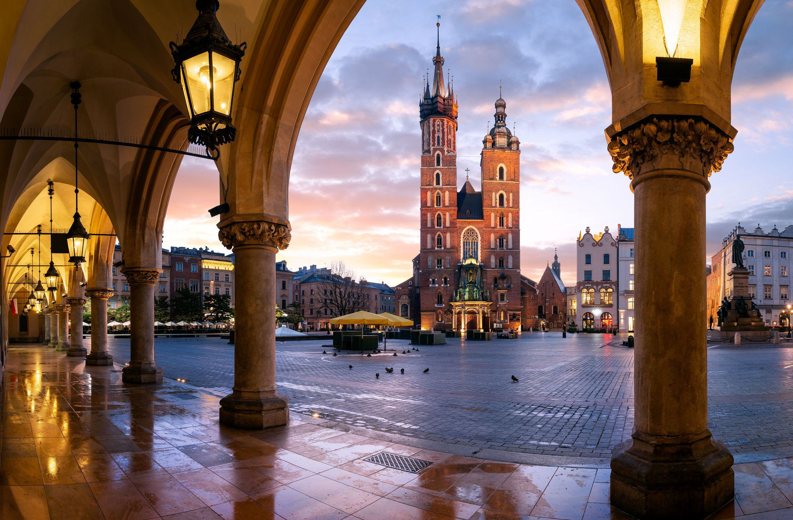

The Polish economy faced numerous challenges in 2020, primarily due to the disruptions caused by the COVID-19 pandemic. Prior to this period, Poland's economy was on a path of significant growth, having demonstrated resilience and robust performance from 2009 to 2019. This momentum, however, was abruptly interrupted as global economic conditions shifted dramatically with the onset of the pandemic.

The economic growth that Poland enjoyed before 2020 was characterized by increased productivity, a well-established institutional framework, and substantial investment in human capital. Rising wages and domestic consumption particularly bolstered GDP growth in 2019. Yet, as the pandemic unfolded, these foundations were put under severe strain. The implementation of lockdowns caused widespread closures of schools, factories, and non-essential businesses, effectively stalling economic activity and reducing growth to a mere 0.4% in 2020.

This article examines the primary economic challenges that Poland faced during this turbulent year. Among the major issues were an aging society impacting labor market dynamics, the pressing need for technological investment to maintain competitiveness, rising economic inequality between regions, and sustainability concerns centered around pollution and coal dependency.

Furthermore, the financial sector experienced notable shifts. Algorithmic trading, a modern approach to investment employing automated systems for financial market transactions, gained prominence during the crisis. This technological development influenced market dynamics, potentially offering pathways to recovery and growth.

In essence, understanding the economic hurdles and the role of algorithmic trading in 2020 is crucial for Poland's future strategies. These insights highlight the importance of adaptability and alignment with global technological trends to achieve long-term economic stability and growth.

## Table of Contents

## Poland's Economic Performance Pre-2020

Poland's economic performance from 2009 to 2019 was characterized by a period of steady growth, which positioned the nation as one of the European Union's more dynamic economies. This era of expansion can be attributed to several pivotal factors, including increased productivity, strong institutional frameworks, and significant investments in human capital.

The enhancement of productivity in Poland during this decade can be largely credited to the integration of advanced technologies and the modernization of various industrial sectors. The adoption of digital solutions and automation in manufacturing and services sectors played a crucial role in improving efficiency and output rates. Additionally, the establishment of strong institutions that promoted regulatory frameworks conducive to business growth, protected property rights, and maintained operational transparency, also fortified economic stability and growth.

Investment in human capital was another major driver of Poland's economic success. The country invested significantly in education and skill development, ensuring a workforce that was better equipped to meet the demands of a rapidly evolving global economy. This focus on education led to a more competitive labor market, with higher productivity levels sustained by a pool of skilled workers.

The GDP growth witnessed in 2019 was significantly fueled by rising wages and robust domestic consumption. As wages increased, consumer spending power expanded, leading to a substantial rise in domestic demand for goods and services. This, in turn, stimulated growth across various sectors of the economy, including retail, housing, and services. The combination of these factors not only drove GDP growth but also enhanced Poland's economic resilience and adaptability in the face of external economic pressures.

Overall, Poland's economic landscape from 2009 to 2019 exemplified the positive outcomes of strategic investments in productivity, institutions, and human capital, setting a solid foundation for future growth.

## COVID-19 Pandemic Impact

The COVID-19 pandemic in 2020 had a profound impact on Poland's economic growth, sharply reducing it to a meager 0.4% compared to previous years. The stringent lockdown measures introduced to curb the spread of the virus included widespread closures of schools, factories, and non-essential businesses, severely affecting various sectors of the economy.

The immediate effects of the pandemic were most pronounced in sectors such as hospitality, retail, and transportation. These industries faced substantial losses due to travel restrictions and a significant decline in consumer spending. Hotels and restaurants, constituting a significant part of Poland's service sector, saw dramatic drops in revenue as tourism came to a virtual standstill. Retail businesses, particularly brick-and-mortar stores, experienced decreased footfall, prompting many to accelerate their transition to online platforms or face potential closure.

The industrial sector was not spared, as factory shutdowns and supply chain disruptions led to decreases in production outputs. The automotive industry, a crucial component of Poland's manufacturing landscape, was particularly hard-hit due to halted production lines and a downturn in global demand for vehicles. Small and medium-sized enterprises (SMEs), which form the backbone of the Polish economy, struggled to stay afloat amid restricted operations and limited access to financial relief.

Employment was significantly impacted as well, with many companies resorting to layoffs or reduced working hours to manage costs. The unemployment rate initially rose, although government interventions, such as financial aid packages and job protection schemes, provided some relief.

Agriculture, while less affected, still faced challenges such as labor shortages due to travel restrictions on seasonal workers, and logistical hurdles in exporting goods. This sector, however, demonstrated resilience thanks to its essential nature and continued domestic demand.

Overall, the COVID-19 pandemic brought unprecedented disruption to Poland's economy, significantly halting economic [momentum](/wiki/momentum) and highlighting vulnerabilities within various sectors. The effects underscored the need for strategic shifts in economic policy and accelerated adoption of digital technologies to better withstand such crises in the future.

## Four Key Economic Challenges in 2020

### Four Key Economic Challenges in 2020

In 2020, Poland faced a series of interconnected economic challenges that threatened to hinder its progress. Four major issues emerged as particularly significant: an aging society, technological investment deficits, economic inequality, and sustainability concerns.

**An Aging Society**

Poland’s demographic trends in 2020 indicated a shift towards an aging population, which posed severe implications for the labor market. This demographic transition was characterized by a rising number of retirees compared to the working-age population. The resultant shrinking workforce threatens economic growth, as a smaller labor force leads to decreased productivity and increased pressure on social welfare systems. Addressing this challenge necessitates policy interventions to encourage higher birth rates, later retirements, and potentially more liberal immigration policies to bolster the labor supply.

**Technological Investment**

Investment in technology is crucial for maintaining competitiveness in a rapidly evolving global economy. Poland, despite its previous growth trajectory, recorded deficits in technological investment that could impede future growth. The gap in technology spending can result in lagging innovation, reduced productivity, and weakened capacity to compete internationally. Therefore, enhancing technology infrastructure and fostering a conducive environment for research and development are imperative for Poland to maintain its economic momentum. Policies that incentivize private sector investment in technology, alongside governmental support for digital infrastructure, are essential strategies.

**Economic Inequality**

Economic inequality in Poland manifested distinctively across different regions, with some areas benefiting disproportionately from economic advancements while others lagged behind. This disparity was exacerbated by the COVID-19 pandemic, which hit less developed regions harder, widening existing gaps. Unequal regional development can lead to social discontent and inefficiencies in the national economy. Addressing these disparities involves targeted regional investment, improved access to education and training, and policies that support entrepreneurship outside the main economic hubs.

**Sustainability and Natural Resources**

Poland's heavy reliance on coal presents considerable challenges to its environmental sustainability goals. Coal accounts for a significant portion of Poland’s energy production, contributing to pollution and hindering efforts to transition to cleaner energy sources. As global pressures increase to adopt more sustainable practices, Poland faces the challenging task of balancing energy needs with environmental commitments. This necessitates a strategic shift towards renewable energy investments, improving energy efficiency, and gradually phasing out coal dependency to align with both EU regulations and global sustainability standards.

In conclusion, these four economic challenges highlight the complexity of Poland's economic landscape in 2020 and underscore the need for comprehensive strategies that address immediate concerns while setting the stage for sustainable long-term growth.

## The Role of Algorithmic Trading

Algorithmic trading refers to the use of computer algorithms to manage trading decisions. This approach leverages mathematical models and market data to optimize the execution of trades, often executing at speeds unparallel to human capabilities. Its significance in modern finance is underscored by its ability to enhance trading efficiency, minimize manual errors, and reduce transaction costs. 

In the context of the Polish financial market during the economic downturn of 2020, [algorithmic trading](/wiki/algorithmic-trading) played a notable role. As Poland faced economic challenges due to the COVID-19 pandemic, financial markets experienced increased [volatility](/wiki/volatility-trading-strategies). Algorithmic trading systems, designed to operate swiftly and adapt to volatile market conditions, offered [liquidity](/wiki/liquidity-risk-premium) and price stability in an otherwise turbulent environment. These systems analyzed large volumes of data to predict market trends, balancing the supply and demand of equities and other financial instruments even as human traders grappled with the uncertainty.

Algorithmic trading's impact during the downturn was not merely about sustaining market operations but also highlighted its potential for recovery and growth. Automated trading strategies, powered by algorithms, enabled market participants to quickly adjust their positions in response to changing market dynamics, mitigating potential losses. With advancements in [machine learning](/wiki/machine-learning) and big data analytics, algorithmic trading systems are becoming increasingly sophisticated, capable of executing complex trading strategies that were previously infeasible.

For Poland, embracing algorithmic trading presents an opportunity to strengthen its financial sector amidst global uncertainties. As these systems become more pervasive, they promise enhanced market efficiency, transparency, and competitiveness. Poland's financial institutions could benefit by focusing on technological innovations in algorithmic trading, thereby aligning their operations with global economic advancements. This technological alignment is essential for ensuring resilience in Poland's financial markets, mitigating future economic shocks, and fostering steady economic growth.

## Future Outlook and Recovery

In the aftermath of 2020, the World Bank projected a gradual recovery for Poland's economy. According to the organization's forecasts, Poland's GDP was expected to bounce back with a growth rate of approximately 3.3% in 2021 and sustain an upward trajectory in the following years[^1^]. This optimistic outlook was contingent upon effective management of the COVID-19 pandemic, the reinstatement of consumer confidence, and a global economic rebound.

To address long-term challenges post-2020, Poland needed to implement a multi-pronged strategy. Firstly, revitalizing sectors heavily impacted by the pandemic, such as tourism and hospitality, required targeted financial support and reforms. Secondly, enhancing digital infrastructure was paramount to support remote work and learning, which had become prevalent during the pandemic. Investment in high-speed internet and digital literacy were essential components to ensure Poland remained competitive in a rapidly digitalizing world.

Moreover, advancing technological capabilities was crucial to Poland's recovery strategy. Embracing innovations in [artificial intelligence](/wiki/ai-artificial-intelligence), machine learning, and data analytics could dramatically improve productivity and efficiency across various industries. By integrating cutting-edge technologies, Poland could not only recover from the pandemic-induced slowdown but also position itself as a leader in the fourth industrial revolution.

Poland also faced the urgent need to align its economic strategies with global technological advancements. This involved leveraging technology to foster sustainable growth and tackle environmental challenges. For instance, transitioning from coal-based energy sources to renewable alternatives would help Poland meet international climate commitments and enhance its energy security.

In summary, Poland's future economic growth relied heavily on revitalizing affected sectors, investing in digital and technological infrastructure, and adopting sustainable practices. The World Bank's projections underscored the potential for a robust recovery, provided Poland effectively navigated these strategic imperatives.

[^1^]: World Bank Group. (2021). "Poland Economic Update: Emerging Stronger from the Pandemic." Retrieved from [World Bank](https://www.worldbank.org/en/country/poland).

## Conclusion

In 2020, Poland faced substantial economic challenges primarily due to the COVID-19 pandemic. The nation's GDP growth plummeted to a mere 0.4%, disrupting the steady growth trajectory experienced in the previous decade. The pandemic-induced lockdowns forced the closure of various sectors, significantly affecting domestic consumption and industrial productivity. Critical challenges, including an aging population, technological investment needs, economic inequality, and environmental sustainability, further complicated the economic landscape.

Algorithmic trading emerged as a key component in the financial sector's response to the economic downturn. As a form of automated trading using pre-set algorithms based on market trends, it provided liquidity and stability in financial markets during times of volatility. The implementation of algorithmic trading helped mitigate some negative impacts by enabling more efficient and faster transactions, which could enhance market resilience and potentially aid the recovery process.

In the long-term, Poland must devise solutions for sustained economic stability and growth. Addressing demographic challenges requires policies promoting workforce participation and integrating advanced technologies to boost productivity. Investments in technology and infrastructure should be prioritized to foster innovation and maintain competitive advantages in global markets. Additionally, tackling economic disparities and promoting regional development will be essential for balanced economic progress.

Poland's ability to adapt to changing global economic conditions is crucial. Embracing digital transformation and aligning with global technological advancements can drive future growth. Policies encouraging sustainable practices and reducing reliance on coal can also support environmental goals while meeting energy needs. The nation's strategic focus should be on creating a resilient economic environment capable of withstanding future disruptions and leveraging emerging opportunities for growth and development.

## References & Further Reading

[1]: Götz, G., & Jankowska, K. (2021). ["Successes and Challenges of Poland's Economy in the COVID-19 Era."](https://pmc.ncbi.nlm.nih.gov/articles/PMC8504766/) International Journal of Management and Economics, 53(4).

[2]: World Bank Group. (2021). ["Poland Economic Update: Emerging Stronger from the Pandemic."](https://www.worldbank.org/en/news/press-release/2021/03/31/polish-economy-returns-to-growth-amidst-pandemic-related-setbacks)

[3]: Leven, S., & Sögner, L. (2021). ["The Impact of Algorithmic Trading on Stock Market Resilience."](https://www.researchgate.net/publication/378287610_Machine_learning_in_financial_markets_A_critical_review_of_algorithmic_trading_and_risk_management) Decisions in Economics and Finance, 44(1).

[4]: OECD. (2021). ["OECD Economic Surveys: Poland 2020."](https://www.oecd.org/en/topics/economic-surveys.html)

[5]: Robson, A. (2020). ["Economic Inequality in Poland: Regional Disparities and Policy Responses."](https://www.regional-disparities.de/) In Economic Inequality and Neoliberalism. Edward Elgar Publishing.